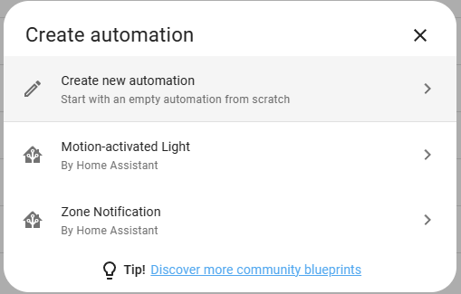
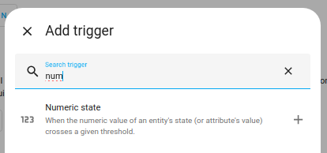
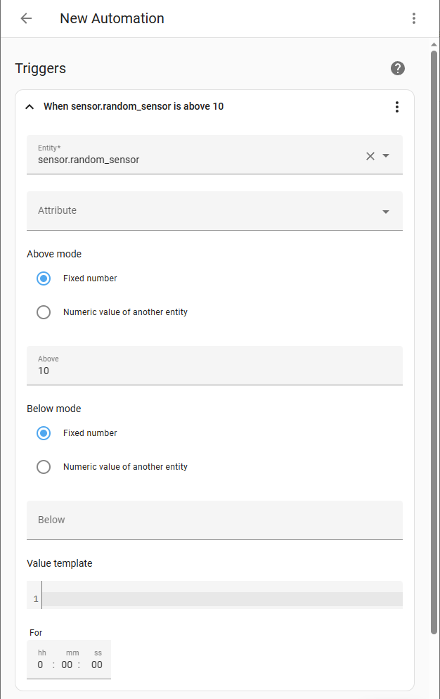
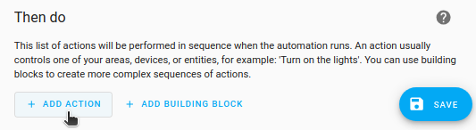
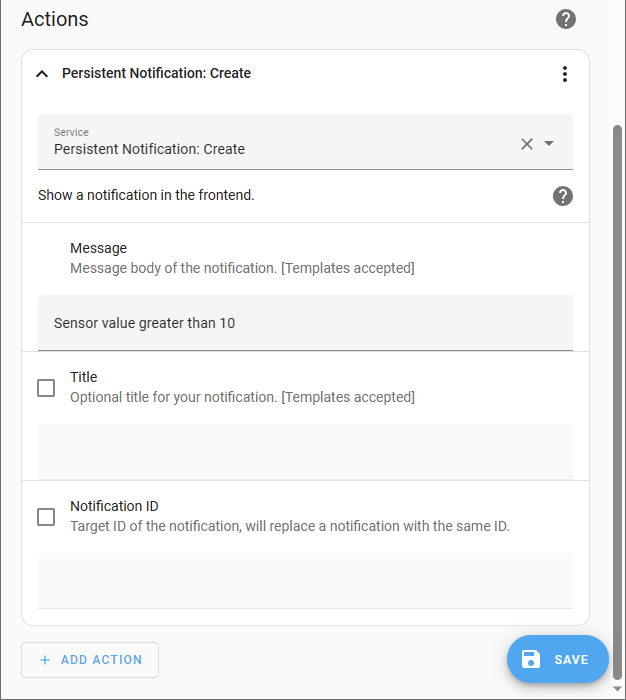
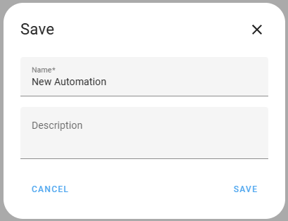

# 自动化编辑器（editor）

<p className="text-xl font-semibold"> 自动化编辑器是一种通过用户界面轻松创建和编辑自动化的方法。</p>

本教程使用[随机传感器](https://www.home-assistant.io/integrations/random#sensor)，因为它会生成数据（默认情况下，值在0到20之间）。这使我们能够完成示例，即使您尚未连接任何实际的传感器。您可以使用任何输出数值的其他传感器。

1. 转到[设置 > 自动化与场景](https://my.home-assistant.io/redirect/automations)，在右下角，选择**创建自动化**按钮。

2. 选择**创建新自动化**。
    

3. 选择**添加触发器**，在**搜索触发器**字段中，输入"num"。
    - 选择**数值状态**。
        

4. 输入触发条件：
    - 定义传感器：在**实体**下，输入"sensor.random_sensor"。
    - 如果传感器值高于10，我们希望自动化触发。
        - 在**高于**字段中，输入"10"。
            

5. 定义应该发生的动作：

    - 在**然后执行**部分，选择**添加动作**。
        

6. 我们想创建一个持久通知。

    - 输入"No"，然后选择**通知：发送持久通知**。
        

7. 作为消息，我们希望显示作为通知一部分的简单文本。
```
message: 传感器值大于10
```

8. 选择**保存**，给自动化一个有意义的名称，然后再次**保存**。

    - **结果**：通过用户界面创建或编辑的自动化在保存后立即激活。
    - 要了解有关自动化的更多信息，请阅读[Home Assistant自动化](https://www.home-assistant.io/getting-started/automation/)的文档。

## 故障排除：缺失的自动化

当您使用GUI创建自动化，但它们没有出现在UI中时，请确保您将默认配置中的`automation: !include automations.yaml`添加回您的`configuration.yaml`中。

## 相关主题
    - [Home Assistant自动化](https://www.home-assistant.io/getting-started/automation/)


