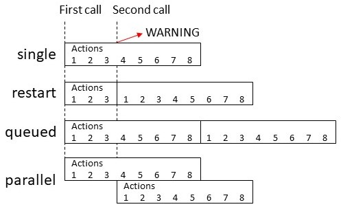

# 自动化模式（modes）

<p className="text-xl font-semibold">自动化可能在其已经运行时被触发。</p>

自动化的`mode`配置选项控制当自动化在来自先前触发的动作仍在运行时被触发会发生什么。

| 模式 | 描述 |
| --- | --- |
|`single`|	（默认）不启动新的运行。发出警告。
|`restart`|	在停止先前运行后启动新的运行。自动化仅在满足条件时重新启动。
|`queued`|	在所有先前运行完成后启动新的运行。运行保证按照它们排队的顺序执行。请注意，后续排队的自动化只有在触发时满足其可能具有的任何条件时才会加入队列。
|`parallel`|	与先前运行并行启动新的独立运行。



对于`queued`和`parallel`模式，配置选项`max`控制同时可以执行和/或排队的最大运行数量。默认值为10。

当超过`max`（对于`single`模式实际上是1）时，会发出日志消息来指示这种情况已经发生。配置选项`max_exceeded`控制该日志消息的严重级别。将其设置为`silent`以忽略警告，或设置为某个`日志级别`。默认值为`warning`。

## 示例：限流自动化 

有些自动化您可能只希望每5分钟运行一次。这可以通过使用`single`模式并在自动化运行时被触发时静默警告来实现。

```yaml
automation:
  - mode: single
    max_exceeded: silent
    triggers:
      - ...
    actions:
      - ...
      - delay: 300  # 秒（=5分钟）
```

## 示例：队列 

有时，一个自动化正在对不支持多个同时操作的设备执行操作。在这种情况下，可以使用队列。在这种情况下，自动化将在其当前调用和队列完成后执行。

```yaml
automation:
  - mode: queued
    max: 25
    triggers:
      - ...
    actions:
      - ...
```


