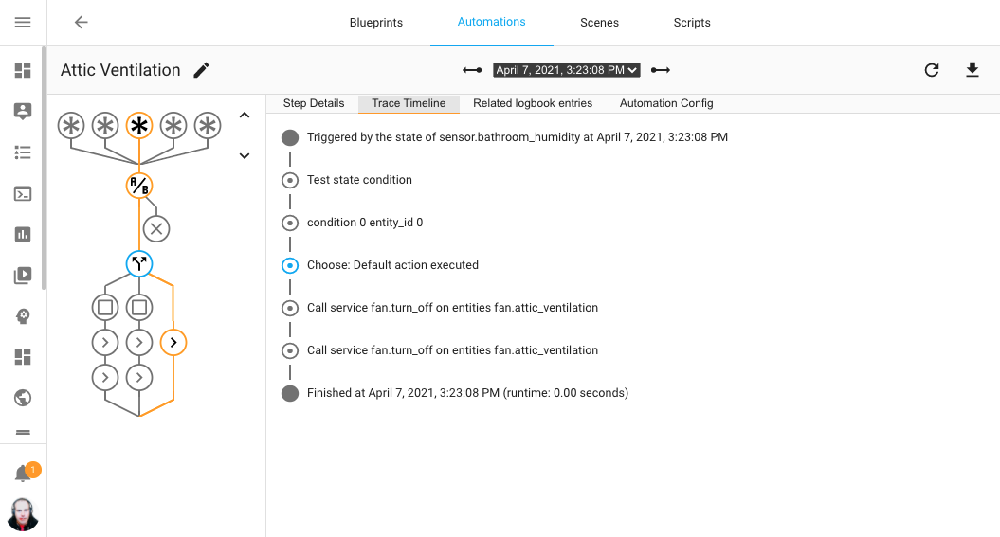

import { EllipsisVertical } from 'lucide-react'


# 自动化故障排除

<p className="font-semibold text-xl">自动化和脚本可以通过几种不同的方式进行调试。您可以[测试运行](https://www.home-assistant.io/docs/automation/troubleshooting/#testing-your-automation)整个动作序列，或单独测试每个条件和动作。[追踪](https://www.home-assistant.io/docs/automation/troubleshooting/#traces)让您在自动化运行后查看每一步的详细信息。对于带有模板的复杂自动化，请参阅[测试模板](https://www.home-assistant.io/docs/automation/troubleshooting/#testing-templates)部分。</p>

## 测试您的自动化

许多自动化可以直接在自动化编辑器UI中进行测试。

### 运行整个自动化

在自动化列表或自动化编辑器UI的三点菜单中，选择**运行**按钮。这将执行所有动作，同时跳过所有触发器和条件。这让您可以测试完整的动作序列，就像自动化被触发且所有条件都为真一样。请注意，当您以这种方式测试时，触发器中使用的任何[触发器ID](https://www.home-assistant.io/docs/automation/trigger/#trigger-id)将不会激活。无法直接通过这种方式测试条件或动作中`trigger`数据传递的触发器ID或任何数据。

您也可以手动触发自动化。这可以测试条件，就像自动化被事件触发一样。导航到[开发者工具 > 动作](https://my.home-assistant.io/redirect/developer_services)。在**动作**下拉菜单中，选择**自动化: 触发**，然后**选择实体**以选择您正在测试的自动化。切换是否跳过条件，然后**执行动作**。如果需要，可以在YAML视图中添加额外的`trigger`或其他数据进行测试。[`trigger`](https://www.home-assistant.io/docs/automation/trigger/)页面有更多关于触发器内数据的信息。

测试复杂的触发器、条件和变量可能很困难。请注意，使用**运行**按钮将跳过所有触发器和条件，而**开发者工具**可以选择是否检查条件。

### 运行单个动作或条件

在自动化编辑器UI中，每个条件和动作都可以单独测试。选择三点 <EllipsisVertical className='align-middle' size={18} /> 菜单，然后选择**测试**按钮。
    - 测试条件将高亮显示它，以显示条件在测试时是否通过。如果所有条件都通过，则自动化在触发时将运行。测试像**and**条件这样的构建块将报告整个块是注册为真还是假，或者您可以测试构建块内的单个条件。
    - 测试动作块将立即运行该块。

请注意，依赖于先前块的复杂自动化，例如触发器ID、模板中的变量或返回数据以在后续块中使用的动作调用，无法通过这种方式进行测试。

如果您正在用YAML编写自动化，去[开发者工具 > YAML](https://my.home-assistant.io/redirect/server_controls)并在配置验证部分选择**检查配置**按钮也很有用。这是为了确保在重启Home Assistant之前没有语法错误。要使**检查配置**可见，您必须在[您的用户配置](https://my.home-assistant.io/redirect/profile)中启用**高级模式**。


## 追踪

当自动化运行时，所有步骤都会被记录并生成追踪。从UI中，打开位于侧边栏的**设置**，然后选择**自动化与场景**进入自动化编辑器，或直接点击此按钮：「button」

从自动化编辑器UI或自动化列表中的三点菜单，选择**追踪**。或者，选择日志中显示的自动化条目。



上面的截图显示了自动化的上一次运行。自动化使用交互式图表显示，突出显示自动化采取的路径。可以点击图表中的每个节点，查看自动化在该特定步骤中发生的详细信息。它追踪自动化的完整运行过程。

追踪屏幕的右侧有带有更多信息的标签：


- **步骤详情**显示当前高亮步骤的数据和结果。
- **自动化配置**显示运行自动化时的完整YAML配置。
- **追踪时间线**，如上图所示，列出执行的步骤及其时间。
- **相关日志条目**，显示与特定追踪相关的所有条目的日志。
- **蓝图配置**，仅当自动化是从蓝图创建时才会显示。

顶部栏显示自动化触发的日期和时间。使用左右箭头查看自动化的先前运行。

在YAML中创建的自动化必须分配一个[`id`](https://www.home-assistant.io/docs/automation/yaml/#migrating-your-yaml-automations-to-automationsyaml)才能存储调试追踪。

### 追踪配置

所有自动化都会记录最后5次追踪。可以通过向自动化添加以下代码来更改此设置。

```yaml
trace:
  stored_traces: 20
```

## 测试模板

如果您的自动化在任何部分使用了[模板](https://www.home-assistant.io/docs/configuration/templating/)，您可以执行以下操作以确保它按预期工作：

1. 转到[开发者工具 > 模板](https://my.home-assistant.io/redirect/developer_template)标签。
2. 按照本段末尾的描述创建模板所需的所有变量（源）。
3. 复制您的模板代码并将其粘贴到模板编辑器中，紧跟在您的变量之后。
4. 如有必要，更改源的值并检查模板是否按您的期望工作且不生成任何错误。


