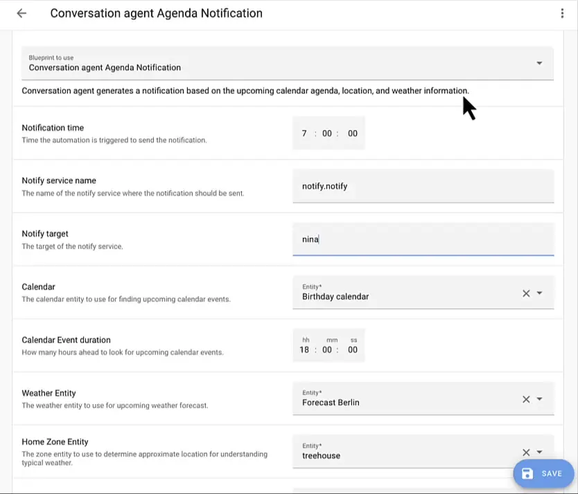

import { EllipsisVertical } from 'lucide-react'


# 使用自动化蓝图（blueprints）

<p className="text-xl">自动化蓝图是预先制作好的自动化方案，您可以轻松地将其添加到 Home Assistant 实例中。每个蓝图都可以根据需要添加多次。</p> 

快速链接：
- [Home Assistant 论坛中的蓝图](https://www.home-assistant.io/get-blueprints)

## 基于蓝图的自动化

基于蓝图的自动化需要进行配置。需要配置的内容因蓝图而异。

1. 要创建基于蓝图的第一个自动化，请转到[设置 > 自动化和场景 > 蓝图（blueprints）](https://my.home-assistant.io/redirect/blueprints)。

2. 找到您想要使用的蓝图并选择**创建自动化**。
    - 这将打开自动化编辑器，并已选择相应的蓝图。
3. 为其命名并配置蓝图。

4. 选择右下角的蓝色**保存自动化**按钮。

完成！如果您想重新查看配置值，请转到[设置 > 自动化和场景 > 蓝图（blueprints）](https://my.home-assistant.io/redirect/blueprints)。

## 导入蓝图

Home Assistant 可以从 Home Assistant 论坛、GitHub 和 GitHub gists 导入蓝图。

1. 要导入蓝图，首先[找到您想要导入的蓝图](https://www.home-assistant.io/get-blueprints)。
    - 如果您只是想练习导入，可以使用以下 URL：
    ```
    https://github.com/home-assistant/core/blob/dev/homeassistant/components/automation/blueprints/motion_light.yaml
    ```

2. 转到[设置 > 自动化和场景 > 蓝图（blueprints）](https://my.home-assistant.io/redirect/blueprints)。

3. 选择右下角的蓝色[导入蓝图](https://my.home-assistant.io/redirect/blueprint_import)按钮。
    - 将弹出一个新对话框，要求您输入 URL。

4. 输入 URL 并选择**预览**。
    - 这将加载蓝图并在导入对话框中显示预览。
    - 您可以更改名称并完成导入。

现在可以使用该蓝图来创建自动化了。

## 编辑导入的蓝图

您可以通过"接管"蓝图来调整导入的蓝图。Home Assistant 然后将蓝图自动化转换为常规自动化，允许您进行任何调整，而不必完全重新发明轮子。

要编辑导入的蓝图，请按照以下步骤操作：

1. 转到[设置 > 自动化和场景 > 蓝图（blueprints）](https://my.home-assistant.io/redirect/blueprints)。

2. 从列表中选择蓝图。

3. 选择 <EllipsisVertical className="align-middle" size={18} /> 并选择**接管**。

4. 显示自动化的预览。
    - **信息**：通过接管，蓝图将转换为自动化。您将无法将其转换回蓝图。
    - 要将其转换为自动化并接管，请选择**是**。
    - 如果您改变主意并想保留蓝图，请选择**否**。
        

## 重新导入蓝图

社区创建的蓝图可能会经历多次修订。有时用户创建蓝图，社区提供反馈，添加新功能。

获取这些更改的最快方法是重新导入蓝图。这将覆盖您当前拥有的蓝图。

:::danger 注意
**在您执行此操作之前**：如果重新导入的蓝图不兼容，可能会破坏您的自动化。
    - 在这种情况下，您需要手动调整您的自动化。
:::

### 重新导入蓝图

1. 转到[设置 > 自动化和场景 > 蓝图](https://my.home-assistant.io/redirect/blueprints)。

2. 在您想要重新导入的蓝图上，选择三点菜单，然后选择**重新导入蓝图**。

## 在 YAML 中更新导入的蓝图

社区创建的蓝图可能会经历多次修订。有时用户创建蓝图，社区提供反馈，添加新功能。

如果您出于某种原因不想[重新导入蓝图](https://www.home-assistant.io/docs/automation/using_blueprints/#re-importing-a-blueprint)，您可以手动编辑其 YAML 内容以保持最新：

1. 导航到蓝图目录（`blueprints/automation/`）。此目录的位置取决于安装方法。类似于如何找到 `configuration.yaml`。

2. 接下来，您必须找到要更新的蓝图。蓝图的路径名称由以下部分组成：
    - 创建它的用户的用户名。名称取决于蓝图的来源：论坛或 GitHub。
    - YAML 文件的名称。对于论坛，它是 URL 中主题的标题，对于 GitHub，它是 YAML 文件的名称。

3. 使用编辑器打开 YAML 文件并更新其内容。
4. 重新加载自动化以使更改生效。

新更改也会出现在您现有的自动化中。

## 查找新蓝图

Home Assistant 社区论坛有一个特定的蓝图标签。此标签用于收集所有蓝图。

[访问 Home Assistant 论坛](https://www.home-assistant.io/get-blueprints)

## 创建新蓝图

使用蓝图很好且容易，但如果您能创建我们社区绝对需要的那个缺失的蓝图呢？

通过[阅读我们的蓝图创建教程](https://www.home-assistant.io/docs/blueprint/tutorial/)了解更多关于蓝图的信息。

## 故障排除缺失的自动化

当您使用蓝图创建自动化但它们没有出现在 UI 中时，请确保您已将默认配置中的 `automation: !include automations.yaml` 添加回您的 `configuration.yaml`。


