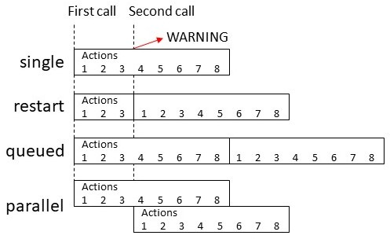

import { Separator } from "../../../src/components/ui/separator"


# 自动化 YAML

<p className="text-xl font-semibold">在 Home Assistant 中，自动化是通过UI（用户界面）创建的，但以 YAML 格式存储。如果您想编辑自动化的 YAML，选择自动化，点击右上角的菜单按钮，然后点击**在 YAML 中编辑**。</p>

UI会将您的自动化写入 `automations.yaml`。此文件由UI管理，不应手动编辑。

也可以直接在 `configuration.yaml` 或其他 YAML 文件中编写自动化。您可以通过向 `configuration.yaml` 添加标记为 `automation` 的块来实现：


```yaml
# UI工作所需的配置
automation: !include automations.yaml

# 标记的自动化块
automation kitchen:
  - triggers:
      - trigger: ...
```

您可以添加任意数量的标记为 `automation` 的块。

<div className="bg-white p-6 rounded-2xl border border-[rgba(0,0,0,0.12)] mb-4">
### 配置变量 
<p className="m-0 pb-2" style={{margin:'0'}}>alias <span className="text-xs text-gray-400">string (Optional)</span></p>
<p className="text-sm text-gray-400 m-0" style={{margin:'0'}}>自动化的友好名称。</p>
<Separator className="my-4" />

<p className="m-0 pb-2" style={{margin:'0'}}>id <span className="text-xs text-gray-400">string (Optional)</span></p>
<p className="text-sm text-gray-400 m-0" style={{margin:'0'}}>自动化的唯一ID，允许您在UI中更改名称和entity_id，并启用调试追踪。</p>
<Separator className="my-4" />

<p className="m-0 pb-2" style={{margin:'0'}}>description <span className="text-xs text-gray-400">string (Optional)</span></p>
<p className="text-sm text-gray-400 m-0" style={{margin:'0'}}>自动化的描述。</p>
<Separator className="my-4" />

<p className="m-0 pb-2" style={{margin:'0'}}>initial_state <span className="text-xs text-gray-400">boolean (Optional, default: Restored from last run)</span></p>
<p className="text-sm text-gray-400 m-0" style={{margin:'0'}}>用于定义自动化在启动时的状态。未设置时，状态将从上次运行中恢复。查看[自动化初始状态](https://www.home-assistant.io/docs/automation/yaml/#automation-initial-state)。</p>
<Separator className="my-4" />

<p className="m-0 pb-2" style={{margin:'0'}}>trace <span className="text-xs text-gray-400">map (Optional, default: {})</span></p>
<p className="text-sm text-gray-400 m-0" style={{margin:'0', marginBottom:"1rem"}}>存储的追踪配置值，目前只能配置`stored_traces`。</p>

<p className="m-0 pb-2 pl-10" style={{margin:'0'}}>stored_traces <span className="text-xs text-gray-400">integer (Optional, default: 5)</span></p>
<p className="text-sm text-gray-400 m-0 pl-10" style={{margin:'0'}}>将存储的追踪数量。查看[存储的调试追踪数量](https://www.home-assistant.io/docs/automation/yaml/#number-of-debug-traces-stored)。</p>
<Separator className="my-4" />

<p className="m-0 pb-2" style={{margin:'0'}}>variables <span className="text-xs text-gray-400">map (Optional, default: {})</span></p>
<p className="text-sm text-gray-400 m-0" style={{margin:'0', marginBottom:"1rem"}}>可在模板中使用的变量，包括在`conditions`和`actions`中。</p>
<p className="m-0 pb-2 pl-10" style={{margin:'0'}}>PARAMETER_NAME <span className="text-xs text-gray-400">any</span></p>
<p className="text-sm text-gray-400 m-0 pl-10" style={{margin:'0'}}>变量的值。任何YAML都是有效的。模板也可用于传递值给变量。</p>
<Separator className="my-4" />

<p className="m-0 pb-2" style={{margin:'0'}}>trigger_variables <span className="text-xs text-gray-400">map (Optional, default: {})</span></p>
<p className="text-sm text-gray-400 m-0" style={{margin:'0',marginBottom:"1rem"}}>可在[模板触发器](https://www.home-assistant.io/docs/automation/trigger/#template-trigger)中使用的变量。</p>
<p className="m-0 pb-2 pl-10" style={{margin:'0'}}>PARAMETER_NAME <span className="text-xs text-gray-400">any</span></p>
<p className="text-sm text-gray-400 m-0 pl-10" style={{margin:'0'}}>变量的值。任何YAML都是有效的。只能使用[有限模板](https://www.home-assistant.io/docs/configuration/templating/#limited-templates)。</p>
<Separator className="my-4" />

<p className="m-0 pb-2" style={{margin:'0'}}>mode <span className="text-xs text-gray-400">string (Optional, default: single)</span></p>
<p className="text-sm text-gray-400 m-0" style={{margin:'0'}}>控制当自动化被调用时，而它仍在运行之前的一个或多个调用时会发生什么。查看[自动化模式](https://www.home-assistant.io/docs/automation/yaml/#automation-modes)。</p>
<Separator className="my-4" />

<p className="m-0 pb-2" style={{margin:'0'}}>max <span className="text-xs text-gray-400">integer (Optional, default: 10)</span></p>
<p className="text-sm text-gray-400 m-0" style={{margin:'0'}}>控制一次执行和/或排队运行的最大数量。仅对`queued`和`parallel`模式有效。</p>
<Separator className="my-4" />

<p className="m-0 pb-2" style={{margin:'0'}}>max_exceeded <span className="text-xs text-gray-400">string (Optional, default: warning)</span></p>
<p className="text-sm text-gray-400 m-0" style={{margin:'0'}}>当超过`max`（对于`single`模式实际上是1）时，会发出日志消息来指示这种情况。此选项控制该日志消息的严重级别。查看[日志级别](https://www.home-assistant.io/integrations/logger/#log-levels)获取有效选项列表。或者可以指定`silent`来不发出消息。</p>
<Separator className="my-4" />

<p className="m-0 pb-2" style={{margin:'0'}}>triggers <span className="text-xs text-red-400">list Required</span></p>
<p className="text-sm text-gray-400 m-0" style={{margin:'0',marginBottom:'1rem'}}>启动自动化的触发器。可以添加多个触发器，任何一个触发器触发时自动化都会启动。</p>
<div className="pl-10">
<p className="m-0 pb-2" style={{margin:'0'}}>id <span className="text-xs text-gray-400">string (Optional)</span></p>
<p className="text-sm text-gray-400 m-0" style={{margin:'0'}}>可在自动化中使用的ID，用于确定是哪个触发器导致自动化开始。</p>
<Separator className="my-4" />

<p className="m-0 pb-2" style={{margin:'0'}}>variables <span className="text-xs text-gray-400">map (Optional, default: {})</span></p>
<p className="text-sm text-gray-400" style={{margin:'0',marginBottom:'1rem'}}>在条件和动作序列中可用的变量。</p>
<p className="m-0 pb-2 pl-10" style={{margin:'0'}}>PARAMETER_NAME <span className="text-xs text-gray-400">any</span></p>
<p className="text-sm text-gray-400 m-0 pl-10" style={{margin:'0'}}>变量的值。任何YAML都是有效的。模板也可用于传递值给变量。</p>
</div>
<Separator className="my-4" />

<p className="m-0 pb-2" style={{margin:'0'}}>conditions <span className="text-xs text-gray-400">list (Optional)</span></p>
<p className="text-sm text-gray-400 m-0" style={{margin:'0'}}>启动自动化必须为`true`的条件。默认情况下，列出的所有条件必须为`true`，您可以使用[逻辑条件](https://www.home-assistant.io/docs/scripts/conditions/#logical-conditions)来更改此默认行为。</p>
<Separator className="my-4" />

<p className="m-0 pb-2" style={{margin:'0'}}>actions <span className="text-xs text-red-400">list Required</span></p>
<p className="text-sm text-gray-400 m-0" style={{margin:'0'}}>在脚本中执行的动作序列。</p>
</div>


### 自动化模式 

|模式|描述|
|---|---|
|`single`|不启动新运行。发出警告。|
|`restart`|在停止之前的运行后启动新运行。|
|`queued`|在所有之前的运行完成后启动新运行。运行保证按照它们排队的顺序执行。|
|`parallel`|与之前的运行并行启动新的独立运行。|



## YAML 示例 

可以添加到 `configuration.yaml` 的基于YAML的自动化示例。

```yaml
# configuration.yaml中的条目示例
automation my_lights:
  # 如果人们在家，日落前1小时打开灯
  # 如果人们在16:00-23:00之间回家
  - alias: "规则1 傍晚开灯"
    triggers:
      # 用'-'前缀每个触发器配置的第一行
      # 以输入多个
      - trigger: sun
        event: sunset
        offset: "-01:00:00"
      - trigger: state
        entity_id: all
        to: "home"
    conditions:
      # 用'-'前缀每个条件配置的第一行
      # 以输入多个
      - condition: state
        entity_id: all
        state: "home"
      - condition: time
        after: "16:00:00"
        before: "23:00:00"
    actions:
      # 对于单个动作条目，我们不需要在动作前加'-'，尽管您想要也可以
      - action: homeassistant.turn_on
        target:
          entity_id: group.living_room

  # 当所有人离开家时关闭灯
  - alias: "规则2 - 离家模式"
    triggers:
      - trigger: state
        entity_id: all
        to: "not_home"
    actions:
      - action: light.turn_off
        target:
          entity_id: all

  # 当Paulus晚上离开家时通知
  - alias: "离家通知"
    triggers:
      - trigger: zone
        event: leave
        zone: zone.home
        entity_id: device_tracker.paulus
    conditions:
      - condition: time
        after: "20:00"
    actions:
      - action: notify.notify
        data:
          message: "Paulus离开了家"

  # 通过Pushover发送Xiaomi魔方事件的通知。来自Xiaomi集成的自定义事件。
  - alias: "Xiaomi魔方动作"
    initial_state: false
    triggers:
      - trigger: event
        event_type: cube_action
        event_data:
          entity_id: binary_sensor.cube_158d000103a3de
    actions:
      - action: notify.pushover
        data:
          title: "检测到魔方事件"
          message: "魔方触发了此事件：{{ trigger.event }}"
```

## 额外选项 

直接在 YAML 中编写自动化时，您将可以使用用户界面中不可用的高级选项。

### 自动化初始状态 

默认情况下，自动化在启动时会恢复 Home Assistant 运行时的最后状态。这可以通过 `initial_state` 选项控制。将其设置为 `false` 或 `true` 以强制初始状态为关闭或开启。

```yaml
automation:
  - alias: "自动化名称"
    initial_state: false
    triggers:
      - trigger: ...
```
### 存储的调试追踪数量 

使用 YAML 时，您可以配置为自动化存储的调试追踪数量。这通过 `trace` 下的 `stored_traces` 选项控制。将 `stored_traces` 设置为您希望为特定自动化存储的追踪数量。如果未指定，将使用默认值5。

```yaml
automation:
  - alias: "自动化名称"
    trace:
      stored_traces: 10
    triggers:
      - trigger: ...
```

## 将YAML自动化迁移到 automations.yaml 

如果您想将手动创建的自动化迁移到使用编辑器，您必须将它们复制到 `automations.yaml`。确保 `automations.yaml` 保持为列表！对于您复制的每个自动化，您必须添加一个 `id`。只要它是唯一的，这可以是任何字符串。

```yaml
# automations.yaml条目示例。注意，automations.yaml始终是一个列表！
- id: my_unique_id  # <-- 编辑器工作所需，对于使用编辑器创建的自动化，id将自动生成。
  alias: "Hello world"
  triggers:
    - trigger: state
      entity_id: sun.sun
      from: below_horizon
      to: above_horizon
  conditions:
    - condition: numeric_state
      entity_id: sensor.temperature
      above: 17
      below: 25
      value_template: "{{ float(state.state) + 2 }}"
  actions:
    - action: light.turn_on
```

### 删除自动化 

当自动化在 Home Assistant 仪表板中仍然可见，即使在 YAML 是一种人类可读的数据序列化语言。它用于以结构化格式存储和传输数据。在 Home Assistant 中，YAML 用于配置，例如在 `configuration.yaml` 或 `automations.yaml` 文件中。[了解更多] 文件中删除后，您必须在UI中删除它们。

要完全删除它们，请转到 UI[设置 > 设备与服务 > 实体](https://my.home-assistant.io/redirect/entities)，在搜索字段中查找自动化或向下滚动。

勾选您希望删除的自动化旁边的方框，然后从屏幕右上角选择"删除所选"。

