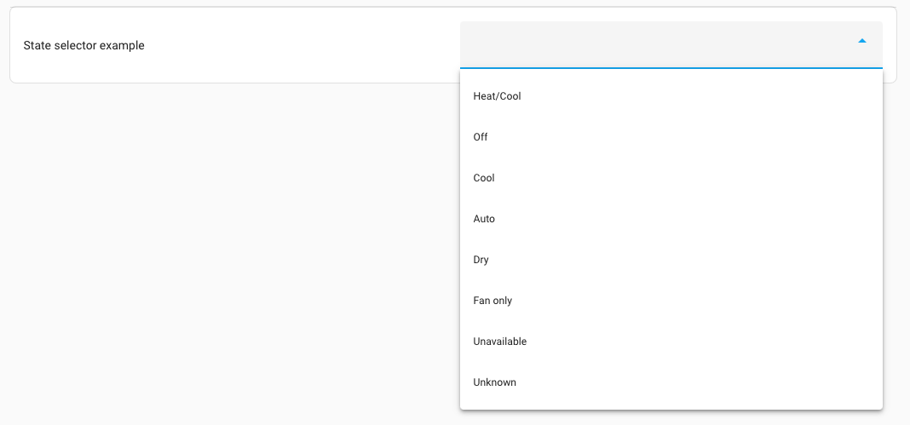

import { Separator } from "../../../src/components/ui/separator"


# Selectors

<p className="font-semibold text-xl">Selectors can be used to specify what values are accepted for a blueprint input. The selector also defines how the input is shown in the user interface.</p>

Some selectors can, for example, show a toggle button to turn something on or off, while another select can filter a list of devices to show only devices that have motion-sensing capabilities.

Having good selectors set on your blueprint automation inputs makes a blueprint easier to use from the UI.

The following selectors are currently available:

- Action selector
- Add-on selector
- Area selector
- Attribute selector
- Assist pipeline selector
- Backup location selector
- Boolean selector
- Color temperature selector
- Condition selector
- Config entry selector
- Constant selector
- Conversation agent selector
- Country selector
- Date selector
- Date & time selector
- Device selector
- Duration selector
- Entity selector
- Floor selector
- Icon selector
- Label selector
- Language selector
- Location selector
- Media selector
- Number selector
- Object selector
- QR code selector
- RGB color selector
- Select selector
- State selector
- Target selector
- Template selector
- Text selector
- Theme selector
- Time selector
- Trigger selector

Interactive demos of each of these selectors can be found on the [Home Assistant Design portal](https://design.home-assistant.io/#components/ha-selector).

If no selector is defined, a text input for a single line will be shown.

## Action selector 

The action selector allows the user to input one or more sequences of actions. On the user interface, the action part of the automation editor will be shown. The value of the input will contain a list of actions to perform.


This selector does not have any other options; therefore, it only has its key.

```yaml
action:
```

The output of this selector is a list of actions. For example:

```yaml
# Example action selector output result
- action: scene.turn_on
  target:
    entity_id: scene.watching_movies
  metadata: {}
```
## Add-on selector 

This can only be used on an installation with a Supervisor. For installations that do not have that, an error will be displayed.

The add-on selector allows the user to input an add-on slug. On the user interface, it will list all installed add-ons and use the slug of the selected add-on.


This selector does not have any other options; therefore, it only has its key.

```yaml
# Example add-on selector
addon:
```
The output of this selector is the slug of the selected add-on. For example: `core_ssh`.

## Area selector 

The area selector shows an area finder that can pick a single or multiple areas based on the selector configuration. The value of the input will be the area ID, or a list of area IDs, based on if `multiple` is set to `true`.

An area selector can filter the list of areas, based on properties of the devices and entities that are assigned to those areas. For example, the areas list could be limited to areas with entities provided by the [ZHA](https://www.home-assistant.io/integrations/zha) integration.

In its most basic form, this selector doesn’t require any options, which will show all areas.

```yaml
area:
```


<div className="bg-white p-6 rounded-2xl border border-[rgba(0,0,0,0.12)] mb-4">
#### Configuration Variables  
<p className="m-0 pb-2" style={{margin:'0'}}>device <span className="text-xs text-gray-400">list (Optional)</span></p>
<p className="text-sm text-gray-400 m-0" style={{margin:'0'}}>When device options are provided, the list of areas is filtered by areas that at least provide one device that matches the given conditions. Can be either a object or a list of object.</p>

<div className="pl-10">
    <p className="m-0 pb-2" style={{margin:'0'}}>integration <span className="text-xs text-gray-400">string (Optional)</span></p>
    <p className="text-sm text-gray-400 m-0" style={{margin:'0'}}>Can be set to an integration domain. Limits the list of areas that provide devices by the set integration domain, for example, [`zha`](https://www.home-assistant.io/integrations/zha).</p>
    <Separator className="my-4" />

    <p className="m-0 pb-2" style={{margin:'0'}}>manufacturer <span className="text-xs text-gray-400">string (Optional)</span></p>
    <p className="text-sm text-gray-400 m-0" style={{margin:'0'}}>When set, it limits the list of areas that provide devices by the set manufacturer name.</p>
    <Separator className="my-4" />

    <p className="m-0 pb-2" style={{margin:'0'}}>model <span className="text-xs text-gray-400">string (Optional)</span></p>
    <p className="text-sm text-gray-400 m-0" style={{margin:'0'}}>When set, it limits the list of areas that provide devices that have the set model.</p>
    <Separator className="my-4" />

    <p className="m-0 pb-2" style={{margin:'0'}}>model_id <span className="text-xs text-gray-400">string (Optional)</span></p>
    <p className="text-sm text-gray-400 m-0" style={{margin:'0'}}>When set, the list of areas is limited to areas with devices that have the set model ID.</p>
</div>
<Separator className="my-4" />


<p className="m-0 pb-2" style={{margin:'0'}}>entity <span className="text-xs text-gray-400">list (Optional)</span></p>
<p className="text-sm text-gray-400 m-0" style={{margin:'0'}}>When entity options are provided, the list of areas is filtered by areas that at least provide one entity that matches the given conditions. Can be either a object or a list of object.</p>
<div className="pl-10">
    <p className="m-0 pb-2" style={{margin:'0'}}>integration <span className="text-xs text-gray-400">string (Optional)</span></p>
    <p className="text-sm text-gray-400 m-0" style={{margin:'0'}}>Can be set to an integration domain. Limits the list of areas that provide devices by the set integration domain, for example, [`zha`](https://www.home-assistant.io/integrations/zha).</p>
    <Separator className="my-4" />

    <p className="m-0 pb-2" style={{margin:'0'}}>domain <span className="text-xs text-gray-400">string | list (Optional)</span></p>
    <p className="text-sm text-gray-400 m-0" style={{margin:'0'}}>Limits the list of areas that provide entities of a certain [domain(s)](https://www.home-assistant.io/docs/configuration/entities_domains/#domains), for example, [`light`](https://www.home-assistant.io/integrations/light) or [`binary_sensor`](https://www.home-assistant.io/integrations/binary_sensor). Can be either a string with a single domain, or a list of string domains to limit the selection to.</p>
    <Separator className="my-4" />

    <p className="m-0 pb-2" style={{margin:'0'}}>device_class <span className="text-xs text-gray-400"> [device_class](https://www.home-assistant.io/integrations/homeassistant/#device-class) | list (Optional)</span></p>
    <p className="text-sm text-gray-400 m-0" style={{margin:'0'}}>Limits the list of areas to areas that have entities with a certain device class(es), for example, `motion` or `window`. Can be either a string with a single device_class, or a list of string device_class to limit the selection to.</p>
    <Separator className="my-4" />

    <p className="m-0 pb-2" style={{margin:'0'}}> supported_features <span className="text-xs text-gray-400">list (Optional)</span></p>
    <p className="text-sm text-gray-400 m-0" style={{margin:'0'}}>Limits the list of areas to areas that have entities with a certain supported feature, for example, `light.LightEntityFeature.TRANSITION` or `climate.ClimateEntityFeature.TARGET_TEMPERATURE`. Should be a list of features.</p>
</div>
<Separator className="my-4" />

<p className="m-0 pb-2" style={{margin:'0'}}>multiple <span className="text-xs text-gray-400">boolean (Optional, default: false)</span></p>
<p className="text-sm text-gray-400 m-0" style={{margin:'0'}}>Allows selecting multiple areas. If set to `true`, the resulting value of this selector will be a list instead of a single string value.</p>
<Separator className="my-4" />

</div>

The output of this selector is the area ID, or (in case `multiple` is set to `true`) a list of area IDs.

```yaml
# Example area selector output result, when multiple is set to false
living_room

# Example area selector output result, when multiple is set to true
- living_room
- kitchen
```

### Example area selectors 

An example area selector only shows areas that provide one or more lights or switches provided by the [ZHA](https://www.home-assistant.io/integrations/zha) integration.

```yaml
area:
  entity:
    integration: zha
    domain:
      - light
      - switch
```

Another example uses the area selector, which only shows areas that provide one or more remote controls provided by the [deCONZ](https://www.home-assistant.io/integrations/deconz) integration. Multiple areas can be selected.

```yaml
area:
  multiple: true
  device:
    - integration: deconz
      manufacturer: IKEA of Sweden
      model: TRADFRI remote control
```

## Attribute selector 
The attributes selector shows a list of state attributes from a provided entity of which one can be selected.

This allows for selecting, e.g., the “Effect” attribute from a light entity, or the “Next dawn” attribute from the `sun` entity.


<div className="bg-white p-6 rounded-2xl border border-[rgba(0,0,0,0.12)] mb-4">
#### Configuration Variables  
<p className="m-0 pb-2" style={{margin:'0'}}>entity_id <span className="text-xs text-red-400">list (Required)</span></p>
<p className="text-sm text-gray-400 m-0" style={{margin:'0'}}>The entity ID of which an state attribute can be selected from.</p>
<Separator className="my-4" />
</div>

The output of this selector is the selected attribute key (not the translated or prettified name shown in the frontend). For example: `next_dawn`.

## Assist pipeline selector 

The assist pipeline selector shows all available assist pipelines (assistants) of which one can be selected.


This selector does not have any other options; therefore, it only has its key.

```yaml
assist_pipeline:
```

## Backup location selector 

This can only be used on an installation with a Supervisor (Operating System or Supervised). For installations of type Home Assistant Core or Home Assistant Container, an error will be displayed.

The backup location selector shows a list of places a backup could go, depending on what you have configured in [storage](https://my.home-assistant.io/redirect/storage/).


The output of this selector is the name of the selected network storage. It may also be the value `/backup`, if the user chooses to use the local data disk option instead of one of the configured network storage locations.

```yaml
backup_location:
```

## Boolean selector 

The boolean selector shows a toggle that allows the user to turn on or off the selected option.


The boolean selector is suitable for adding feature switches to, for example, blueprints.

This selector does not have any other options; therefore, it only has its key.

```YAML
boolean:
```
The output of this selector is `true` when the toggle is on, `false` otherwise.

## Color temperature selector 

The color temperature selector allows you to select a color temperature from a gradient using a slider.


```yaml
color_temp:
```

<div className="bg-white p-6 rounded-2xl border border-[rgba(0,0,0,0.12)] mb-4">
#### Configuration Variables  
<div>
    <p className="m-0 pb-2" style={{margin:'0'}}>unit <span className="text-xs text-gray-400">string (Optional, default: mired)</span></p>
    <p className="text-sm text-gray-400 m-0" style={{margin:'0'}}>The chosen unit for the color temperature. This can be either kelvin or mired. mired is the default for historical reasons.</p>
    <Separator className="my-4" />
</div>

<div>
    <p className="m-0 pb-2" style={{margin:'0'}}>min <span className="text-xs text-gray-400">integer (Optional)</span></p>
    <p className="text-sm text-gray-400 m-0" style={{margin:'0'}}>The minimum color temperature in the chosen unit.</p>
    <p className="text-sm text-gray-400 m-0" style={{margin:'0'}}>Default: 2700 for kelvin 153 for mired</p>
    <Separator className="my-4" />
</div>
<div>
    <p className="m-0 pb-2" style={{margin:'0'}}>max <span className="text-xs text-gray-400">integer (Optional)</span></p>
    <p className="text-sm text-gray-400 m-0" style={{margin:'0'}}>The maximum color temperature in the chosen unit.</p>
    <p className="text-sm text-gray-400 m-0" style={{margin:'0'}}>Default: 6500 for kelvin 500 for mired</p>
    <Separator className="my-4" />
</div>
</div>

The output of this selector is the number representing the chosen color temperature for the unit used.

## Condition selector 

The condition selector allows the user to input one or more conditions. On the user interface, the condition part of the automation editor will be shown. The value of the input will contain a list of conditions.


This selector does not have any other options; therefore, it only has its key.
```yaml
condition:
```
The output of this selector is a list of conditions. For example:

```yaml
# Example condition selector output result
- condition: numeric_state
  entity_id: "sensor.outside_temperature"
  below: 20
```
## Config entry selector 

The config entry selector allows the user to select an integration configuration entry. The selector returns the entry ID of the selected integration configuration entry.


```yaml
config_entry:
```

<div className="bg-white p-6 rounded-2xl border border-[rgba(0,0,0,0.12)] mb-4">
#### Configuration Variables  
<div>
    <p className="m-0 pb-2" style={{margin:'0'}}>integration <span className="text-xs text-gray-400">string (Optional)</span></p>
    <p className="text-sm text-gray-400 m-0" style={{margin:'0'}}>Limits the list of selectable configuration entries to a single integration domain.</p>
    <Separator className="my-4" />
</div>
</div>

The output of this selector is the entry ID of the config entry, for example, `6b68b250388cbe0d620c92dd3acc93ec`.

## Constant selector 

The constant selector shows a toggle that allows the user to enable the selected option. This is similar to the boolean selector, the difference is that the constant selector has no value when it’s not enabled.


The selector’s value must be configured, and optionally, a label.

```yaml
constant:
  value: true
  label: Enabled
```

The output of this selector is the configured value when the toggle is on, it has no output otherwise.

## Conversation agent selector 

The conversation agent selector allows picking a conversation agent.


The selector has 1 option, `language`. This filters the conversation agents shown, depending on the language.

```yaml
conversation_agent:
  language: en
```

<div className="bg-white p-6 rounded-2xl border border-[rgba(0,0,0,0.12)] mb-4">
#### Configuration Variables  
    <div>
        <p className="m-0 pb-2" style={{margin:'0'}}>language <span className="text-xs text-gray-400">string (Optional)</span></p>
        <p className="text-sm text-gray-400 m-0" style={{margin:'0'}}>Limits the list of conversation agents to those supporting the specified language.</p>
        <Separator className="my-4" />
    </div>
</div>

The output of this selector is the ID of the conversation agent.

## Country selector 

The country selector allows a user to pick a country from a list of countries.


```yaml
country:
```

<div className="bg-white p-6 rounded-2xl border border-[rgba(0,0,0,0.12)] mb-4">
#### Configuration Variables  
    <div>
        <p className="m-0 pb-2" style={{margin:'0'}}>countries <span className="text-xs text-gray-400">list (Optional)</span></p>
        <p className="text-sm text-gray-400 m-0" style={{margin:'0'}}>A list of countries to pick from, this should be ISO 3166 country codes.</p>
        <p className="text-sm text-gray-400 m-0" style={{margin:'0'}}>Default: The available countries in the Home Assistant frontend</p>
        <Separator className="my-4" />
    </div>
    <div>
        <p className="m-0 pb-2" style={{margin:'0'}}>no_sort <span className="text-xs text-gray-400">boolean (Optional, default: false)</span></p>
        <p className="text-sm text-gray-400 m-0" style={{margin:'0'}}>Should the options be sorted by name, if set to true, the order of the provided countries is kept.</p>
        <Separator className="my-4" />
    </div>
</div>

The output of this selector is an ISO 3166 country code.

## Date selector

The date selector shows a date input that allows the user to specify a date.


This selector does not have any other options; therefore, it only has its key.

```yaml
date:
```

The output of this selector will contain the date in Year-Month-Day (`YYYY-MM-DD`) format, for example, `2022-02-22`.

## Date & time selector 

The date selector shows a date and time input that allows the user to specify a date with a specific time.


This selector does not have any other options; therefore, it only has its key.

```yaml
datetime:
```

The output of this selector will contain the date in Year-Month-Day (`YYYY-MM-DD`) format and the time in 24-hour format, for example: `2022-02-22 13:30:00`.


## Device selector 

The device selector shows a device finder that can pick a single or multiple devices based on the selector configuration. The value of the input will contain the device ID or a list of device IDs, based on if `multiple` is set to `true`.

A device selector can filter the list of devices, based on things like the manufacturer, model, or model ID of the device, the entities the device provides or based on the domain that provided the device.


In its most basic form, this selector doesn’t require any options, which will show all devices.

```yaml
device:
```

<div className="bg-white p-6 rounded-2xl border border-[rgba(0,0,0,0.12)] mb-4">
#### Configuration Variables  
    <div>
        <p className="m-0 pb-2" style={{margin:'0'}}>entity <span className="text-xs text-gray-400">list (Optional)</span></p>
        <p className="text-sm text-gray-400 m-0" style={{margin:'0'}}>When entity options are provided, the list of devices is filtered by devices that at least provide one entity that matches the given conditions. Can be either a object or a list of object.</p>
        
        <div className="pl-10">
            <p className="m-0 pb-2" style={{margin:'0'}}>integration <span className="text-xs text-gray-400">string (Optional)</span></p>
            <p className="text-sm text-gray-400 m-0" style={{margin:'0'}}>Can be set to an integration domain. Limits the list of devices that provide entities by the set integration domain, for example, [`zha`](https://www.home-assistant.io/integrations/zha).</p>
            <Separator className="my-4" />
        </div>

        <div className="pl-10">
            <p className="m-0 pb-2" style={{margin:'0'}}>domain <span className="text-xs text-gray-400">string (Optional)</span></p>
            <p className="text-sm text-gray-400 m-0" style={{margin:'0'}}>Limits the list of areas that provide entities of a certain [domain(s)](https://www.home-assistant.io/docs/configuration/entities_domains/#domains), for example, [`light`](https://www.home-assistant.io/integrations/light) or [`binary_sensor`](https://www.home-assistant.io/integrations/binary_sensor). Can be either a string with a single domain, or a list of string domains to limit the selection to.</p>
            <Separator className="my-4" />
        </div>
        <div className="pl-10">
            <p className="m-0 pb-2" style={{margin:'0'}}>device_class <span className="text-xs text-gray-400"> [device_class](https://www.home-assistant.io/integrations/homeassistant/#device-class) | list (Optional)</span></p>
            <p className="text-sm text-gray-400 m-0" style={{margin:'0'}}>Limits the list of areas to areas that have entities with a certain device class(es), for example, `motion` or `window`. Can be either a string with a single device_class, or a list of string device_class to limit the selection to.</p>
            <Separator className="my-4" />
        </div>

        <p className="m-0 pb-2" style={{margin:'0'}}> supported_features <span className="text-xs text-gray-400">list (Optional)</span></p>
        <p className="text-sm text-gray-400 m-0" style={{margin:'0'}}>Limits the list of areas to areas that have entities with a certain supported feature, for example, `light.LightEntityFeature.TRANSITION` or `climate.ClimateEntityFeature.TARGET_TEMPERATURE`. Should be a list of features.</p>
    </div>
    <Separator className="my-4" />

    <div>
        <p className="m-0 pb-2" style={{margin:'0'}}>filter <span className="text-xs text-gray-400">list (Optional)</span></p>
        <p className="text-sm text-gray-400 m-0" style={{margin:'0'}}>When filter options are provided, the list of devices is filtered by devices that at least provide one entity that matches the given conditions. Can be either a object or a list of object.</p>

        <div className="pl-10">
            <p className="m-0 pb-2" style={{margin:'0'}}>integration <span className="text-xs text-gray-400">string (Optional)</span></p>
            <p className="text-sm text-gray-400 m-0" style={{margin:'0'}}>Can be set to an integration domain. Limits the list of devices to devices provided by the set integration domain.</p>
            <Separator className="my-4" />
        </div>
        <div className="pl-10">
            <p className="m-0 pb-2" style={{margin:'0'}}>manufacturer <span className="text-xs text-gray-400">string (Optional)</span></p>
            <p className="text-sm text-gray-400 m-0" style={{margin:'0'}}>When set, it limits the list of areas that provide devices by the set manufacturer name.</p>
            <Separator className="my-4" />
        </div>
        

        <div className="pl-10">
            <p className="m-0 pb-2" style={{margin:'0'}}>model <span className="text-xs text-gray-400">string (Optional)</span></p>
            <p className="text-sm text-gray-400 m-0" style={{margin:'0'}}>When set, it limits the list of areas that provide devices that have the set model.</p>
            <Separator className="my-4" />
        </div>
        

        <p className="m-0 pb-2" style={{margin:'0'}}>model_id <span className="text-xs text-gray-400">string (Optional)</span></p>
        <p className="text-sm text-gray-400 m-0" style={{margin:'0'}}>When set, the list of areas is limited to areas with devices that have the set model ID.</p>
    </div>
</div>

The output of this selector is the device ID, or (in case `multiple` is set to `true`) a list of devices IDs.

```yaml
# Example device selector output result, when multiple is set to false
faadde5365842003e8ca55267fe9d1f4

# Example device selector output result, when multiple is set to true
- faadde5365842003e8ca55267fe9d1f4
- 3da77cb054352848b9544d40e19de562
```

### Example device selector 

An example entity selector that, will only show devices that are:

- Provided by the [deCONZ](https://www.home-assistant.io/integrations/deconz) integration.
- Are a Philips Hue Remote of Model RWL021.
- Provide a battery [sensor](https://www.home-assistant.io/integrations/sensor).

And this is what is looks like in YAML:

```yaml
device:
  filter:
    - integration: deconz
      manufacturer: Philips
      model: RWL021
  entity:
    - domain: sensor
      device_class: battery
```

## Duration selector 

The duration select allow the user to select a time duration. This can be helpful for, e.g., delays or offsets.


```yaml
duration:
```

<div className="bg-white p-6 rounded-2xl border border-[rgba(0,0,0,0.12)] mb-4">
#### Configuration Variables  
    <div>
        <p className="m-0 pb-2" style={{margin:'0'}}>enable_day <span className="text-xs text-gray-400">boolean (Optional, default: false)</span></p>
        <p className="text-sm text-gray-400 m-0" style={{margin:'0'}}>When `true`, the duration selector will allow selecting days.</p>
        <Separator className="my-4" />
    </div>
    <div>
        <p className="m-0 pb-2" style={{margin:'0'}}>enable_millisecond <span className="text-xs text-gray-400">boolean (Optional, default: false)</span></p>
        <p className="text-sm text-gray-400 m-0" style={{margin:'0'}}>When `true`, the duration selector will allow selecting milliseconds.</p>
        <Separator className="my-4" />
    </div>
</div>

The output of this selector is a mapping of the time values the user selected. For example:

```yaml
days: 1 # Only when enable_day was set to true
hours: 12
minutes: 30
seconds: 15
milliseconds: 500 # Only when enable_millisecond was set to true
```

## Entity selector 

The entity selector shows an entity finder that can pick a single entity or a list of entities based on the selector configuration. The value of the input will contain the entity ID, or list of entity IDs, based on if `multiple` is set to `true`.

An entity selector can filter the list of entities, based on things like the class of the device, the domain of the entity or the domain that provided the entity.


In its most basic form, this selector doesn’t require any options, which will show all entities.

```yaml
entity:
```

<div className="bg-white p-6 rounded-2xl border border-[rgba(0,0,0,0.12)] mb-4">
#### Configuration Variables  
    <div>
        <p className="m-0 pb-2" style={{margin:'0'}}>exclude_entities <span className="text-xs text-gray-400">list (Optional)</span></p>
        <p className="text-sm text-gray-400 m-0" style={{margin:'0'}}>List of entity IDs to exclude from the selectable list.</p>
        <Separator className="my-4" />
    </div>
    <div>
        <p className="m-0 pb-2" style={{margin:'0'}}>include_entities <span className="text-xs text-gray-400">list (Optional)</span></p>
        <p className="text-sm text-gray-400 m-0" style={{margin:'0'}}>List of entity IDs to limit the selectable list to.</p>
        <Separator className="my-4" />
    </div>


<p className="m-0 pb-2" style={{margin:'0'}}>filter <span className="text-xs text-gray-400">list (Optional)</span></p>
<p className="text-sm text-gray-400 m-0" style={{margin:'0'}}>When filter options are provided, the entities are limited by entities that at least match the given conditions. Can be either an object or a list of objects.</p>
<div className="pl-10">
    <p className="m-0 pb-2" style={{margin:'0'}}>integration <span className="text-xs text-gray-400">string (Optional)</span></p>
    <p className="text-sm text-gray-400 m-0" style={{margin:'0'}}>Can be set to an integration domain. Limits the list of areas that provide devices by the set integration domain, for example, [`zha`](https://www.home-assistant.io/integrations/zha).</p>
    <Separator className="my-4" />

    <p className="m-0 pb-2" style={{margin:'0'}}>domain <span className="text-xs text-gray-400">string | list (Optional)</span></p>
    <p className="text-sm text-gray-400 m-0" style={{margin:'0'}}>Limits the list of areas that provide entities of a certain [domain(s)](https://www.home-assistant.io/docs/configuration/entities_domains/#domains), for example, [`light`](https://www.home-assistant.io/integrations/light) or [`binary_sensor`](https://www.home-assistant.io/integrations/binary_sensor). Can be either a string with a single domain, or a list of string domains to limit the selection to.</p>
    <Separator className="my-4" />

    <p className="m-0 pb-2" style={{margin:'0'}}>device_class <span className="text-xs text-gray-400"> [device_class](https://www.home-assistant.io/integrations/homeassistant/#device-class) | list (Optional)</span></p>
    <p className="text-sm text-gray-400 m-0" style={{margin:'0'}}>Limits the list of areas to areas that have entities with a certain device class(es), for example, `motion` or `window`. Can be either a string with a single device_class, or a list of string device_class to limit the selection to.</p>
    <Separator className="my-4" />

    <p className="m-0 pb-2" style={{margin:'0'}}> supported_features <span className="text-xs text-gray-400">list (Optional)</span></p>
    <p className="text-sm text-gray-400 m-0" style={{margin:'0'}}>Limits the list of areas to areas that have entities with a certain supported feature, for example, `light.LightEntityFeature.TRANSITION` or `climate.ClimateEntityFeature.TARGET_TEMPERATURE`. Should be a list of features.</p>
</div>
<Separator className="my-4" />

<p className="m-0 pb-2" style={{margin:'0'}}>multiple <span className="text-xs text-gray-400">boolean (Optional, default: false)</span></p>
<p className="text-sm text-gray-400 m-0" style={{margin:'0'}}>Allows selecting multiple areas. If set to `true`, the resulting value of this selector will be a list instead of a single string value.</p>
<Separator className="my-4" />
</div>

The output of this selector is the entity ID, or (in case `multiple` is set to `true`) a list of entity IDs.

```yaml
# Example entity selector output result, when multiple is set to false
light.living_room

# Example entity selector output result, when multiple is set to true
- light.living_room
- light.kitchen
```

### Example entity selector 

An example entity selector that, will only show entities that are:

- Provided by the [ZHA](https://www.home-assistant.io/integrations/zha) integration.
- From the [Binary sensor](https://www.home-assistant.io/integrations/binary_sensor) domain.
- Have presented themselves as devices of a motion device class.
- Allows selecting one or more entities.

And this is what it looks like in YAML:

```yaml
entity:
  multiple: true
  filter:
    - integration: zha
      domain: binary_sensor
      device_class: motion
```

## Floor selector 

The floor selector shows a floor finder that can pick floors based on the selector configuration. The value of the input will be the floor ID. If `multiple` is set to `true`, the value is a list of floor IDs.

A floor selector can filter the list of floors based on the properties of the devices and entities assigned to the areas on those floors. For example, the floor list could be limited to floors with entities provided by the [ZHA](https://www.home-assistant.io/integrations/zha) integration, based on the areas they are in.

In its most basic form, this selector doesn’t require any options. It will show all floors.


```yaml
floor:
```

<div className="bg-white p-6 rounded-2xl border border-[rgba(0,0,0,0.12)] mb-4">
#### Configuration Variables  
<p className="m-0 pb-2" style={{margin:'0'}}>device <span className="text-xs text-gray-400">list (Optional)</span></p>
<p className="text-sm text-gray-400 m-0" style={{margin:'0'}}>When device options are provided, the list of floors is filtered by floors that have at least one device matching the given conditions. Can be either an object or a list of objects.</p>

<div className="pl-10">
    <p className="m-0 pb-2" style={{margin:'0'}}>integration <span className="text-xs text-gray-400">string (Optional)</span></p>
    <p className="text-sm text-gray-400 m-0" style={{margin:'0'}}>Can be set to an integration domain. Limits the list of floors that have devices by this integration domain. For example, [`zha`](https://www.home-assistant.io/integrations/zha).</p>
    <Separator className="my-4" />

    <p className="m-0 pb-2" style={{margin:'0'}}>manufacturer <span className="text-xs text-gray-400">string (Optional)</span></p>
    <p className="text-sm text-gray-400 m-0" style={{margin:'0'}}>When set, the list only includes floors that have devices by the set manufacturer name..</p>
    <Separator className="my-4" />

    <p className="m-0 pb-2" style={{margin:'0'}}>model <span className="text-xs text-gray-400">string (Optional)</span></p>
    <p className="text-sm text-gray-400 m-0" style={{margin:'0'}}>When set, the list only includes floors that have devices which have the set model.</p>
    <Separator className="my-4" />

    <p className="m-0 pb-2" style={{margin:'0'}}>model_id <span className="text-xs text-gray-400">string (Optional)</span></p>
    <p className="text-sm text-gray-400 m-0" style={{margin:'0'}}>When set, the list only includes floors with devices that have the set model ID.</p>
</div>
<Separator className="my-4" />


<p className="m-0 pb-2" style={{margin:'0'}}>entity <span className="text-xs text-gray-400">list (Optional)</span></p>
<p className="text-sm text-gray-400 m-0" style={{margin:'0'}}>When entity options are provided, the list only includes floors that at least have one entity that matches the given conditions. Can be either an object or a list of objects.</p>
<div className="pl-10">
    <p className="m-0 pb-2" style={{margin:'0'}}>integration <span className="text-xs text-gray-400">string (Optional)</span></p>
    <p className="text-sm text-gray-400 m-0" style={{margin:'0'}}>Can be set to an integration domain. Limits the list of floors that have entities by the set integration domain. For example,[`zha`](https://www.home-assistant.io/integrations/zha).</p>
    <Separator className="my-4" />

    <p className="m-0 pb-2" style={{margin:'0'}}>domain <span className="text-xs text-gray-400">string | list (Optional)</span></p>
    <p className="text-sm text-gray-400 m-0" style={{margin:'0'}}>When set, the list only includes floors that have entities of certain [domains](https://www.home-assistant.io/docs/configuration/entities_domains/#domains), for example, `light` or `binary_sensor`. Can be either a string with a single domain, or a list of string domains to limit the selection to.</p>
    <Separator className="my-4" />

    <p className="m-0 pb-2" style={{margin:'0'}}>device_class <span className="text-xs text-gray-400"> [device_class](https://www.home-assistant.io/integrations/homeassistant/#device-class) | list (Optional)</span></p>
    <p className="text-sm text-gray-400 m-0" style={{margin:'0'}}>When set, the list only includes floors that have entities with a certain device class, for example, `motion` or `window`. Can be either a string with a single device_class, or a list of string device_class to limit the selection.</p>
    <Separator className="my-4" />

    <p className="m-0 pb-2" style={{margin:'0'}}> supported_features <span className="text-xs text-gray-400">list (Optional)</span></p>
    <p className="text-sm text-gray-400 m-0" style={{margin:'0'}}>When set, the list only includes floors that have entities with a certain supported feature, for example, `light.LightEntityFeature.TRANSITION` or `climate.ClimateEntityFeature.TARGET_TEMPERATURE`. Should be a list of features.</p>
</div>
<Separator className="my-4" />

<p className="m-0 pb-2" style={{margin:'0'}}>multiple <span className="text-xs text-gray-400">boolean (Optional, default: false)</span></p>
<p className="text-sm text-gray-400 m-0" style={{margin:'0'}}>Allows selecting multiple floors. If set to `true`, the resulting value of this selector will be a list instead of a single string value.</p>
<Separator className="my-4" />

</div>


The output of this selector is the floor ID, or (in case `multiple` is set to `true`) a list of floor IDs.

```yaml
# Example floor selector output result, when multiple is set to false
first_floor

# Example floor selector output result, when multiple is set to true
- first_floor
- second_floor
```

### Example floor selectors 

An example floor selector only shows floors that have one or more lights or switches provided by the [ZHA](https://www.home-assistant.io/integrations/zha) integration.

```yaml
floor:
  entity:
    integration: zha
    domain:
      - light
      - switch
```

Another example using the floor selector, which only shows floors that have one or more remote controls provided by the [deCONZ](https://www.home-assistant.io/integrations/deconz) integration. Multiple floors can be selected.

```yaml
floor:
  multiple: true
  device:
    - integration: deconz
      manufacturer: IKEA of Sweden
      model: TRADFRI remote control
```
## Icon selector 

The icon selector shows an icon picker that allows the user to select an icon.

```yaml
icon:
```
<div className="bg-white p-6 rounded-2xl border border-[rgba(0,0,0,0.12)] mb-4">
#### Configuration Variables  
    <p className="m-0 pb-2" style={{margin:'0'}}>placeholder <span className="text-xs text-gray-400">string (Optional)</span></p>
    <p className="text-sm text-gray-400 m-0" style={{margin:'0'}}>Placeholder icon to show, when no icon is selected.</p>
    <Separator className="my-4" />
</div>

The output of this selector is a string containing the selected icon, for example: `mdi:bell`.

## Label selector 

The label selector shows a label finder that can pick labels. The value of the input is the label ID. If `multiple` is set to `true`, the value is a list of label IDs.


In its most basic form, this selector doesn’t require any options. It will show all labels.

```yaml
label:
```
<div className="bg-white p-6 rounded-2xl border border-[rgba(0,0,0,0.12)] mb-4">
#### Configuration Variables  
    <p className="m-0 pb-2" style={{margin:'0'}}>multiple <span className="text-xs text-gray-400">boolean (Optional, default: false)</span></p>
    <p className="text-sm text-gray-400 m-0" style={{margin:'0'}}>Allows selecting multiple labels. If set to `true`, the resulting value of this selector will be a list instead of a single string value.</p>
    <Separator className="my-4" />
</div>

The output of this selector is the label ID, or (in case `multiple` is set to `true`) a list of label IDs.

```yaml
# Example label selector output result, when multiple is set to false
energy_saving

# Example label selector output result, when multiple is set to true
- energy_saving
- christmas_decorations
```

## Language selector 

The language selector allows a user to pick a language from a list of languages.


```yaml
language:
```
<div className="bg-white p-6 rounded-2xl border border-[rgba(0,0,0,0.12)] mb-4">
#### Configuration Variables  
    <div>
        <p className="m-0 pb-2" style={{margin:'0'}}>languages <span className="text-xs text-gray-400">list (Optional)</span></p>
        <p className="text-sm text-gray-400 m-0" style={{margin:'0'}}>A list of languages to pick from, this should be RFC 5646 languages codes.</p>
        <p className="text-sm text-gray-400 m-0" style={{margin:'0'}}>Default: The available languages in the Home Assistant frontend</p>

        <Separator className="my-4" />
    </div>
    <div>
        <p className="m-0 pb-2" style={{margin:'0'}}>native_name <span className="text-xs text-gray-400">boolean (Optional, default: false)</span></p>
        <p className="text-sm text-gray-400 m-0" style={{margin:'0'}}>Should the name of the languages be shown in the language of the user, or in the language itself.</p>
        <Separator className="my-4" />
    </div>
    <div>
        <p className="m-0 pb-2" style={{margin:'0'}}>no_sort <span className="text-xs text-gray-400">boolean (Optional, default: false)</span></p>
        <p className="text-sm text-gray-400 m-0" style={{margin:'0'}}>Should the options be sorted by name, if set to true, the order of the provided languages is kept.</p>
        <Separator className="my-4" />
    </div>
</div>

The output of this selector is a RFC 5646 language code.

## Location selector 

The location selector allow a user to pick a location from a map and returns the matching longitude and latitude coordinators. Optionally it supports selecting the radius of the location.


```yaml
location:
```

<div className="bg-white p-6 rounded-2xl border border-[rgba(0,0,0,0.12)] mb-4">
#### Configuration Variables  
    <div>
        <p className="m-0 pb-2" style={{margin:'0'}}>icon <span className="text-xs text-gray-400">string (Optional)</span></p>
        <p className="text-sm text-gray-400 m-0" style={{margin:'0'}}>An optional icon to show on the map.</p>

        <Separator className="my-4" />
    </div>
    <div>
        <p className="m-0 pb-2" style={{margin:'0'}}>radius <span className="text-xs text-gray-400">boolean (Optional, default: false)</span></p>
        <p className="text-sm text-gray-400 m-0" style={{margin:'0'}}>Allow selecting the radius of the location. If enabled, the radius will be returned in meters.</p>
        <Separator className="my-4" />
    </div>
</div>

The output of this selector is a mapping containing the latitude and longitude of the selected location, and, if enabled, the radius. For example:

```yaml
latitude: 50.935
longitude: 6.95
radius: 500 # Only provided when radius was set to true.
```

## Media selector 

The media selector is a powerful selector that allows a user to easily select media to play on a media device. Media can be a lot of things, for example, cameras, local media, text-to-speech, Home Assistant Dashboards, and many more.

The user selects the device to play media on, and automatically limits the selectable media suitable for the selected device.


```yaml
media:
```
The output of the media selector, is an mapping with information about the selected media device and the selected media to play. There is also metadata, which is used by the frontend and should not be used in the backend.

Example output:

```yaml
entity_id: media_player.living_room
media_content_id: media-source://tts/cloud?message=TTS+Message&language=en-US&gender=female
media_content_type: provider
metadata:
  title: TTS Message
  thumbnail: https://brands.home-assistant.io/_/cloud/logo.png
  media_class: app
  children_media_class: null
  navigateIds:
    - {}
    - media_content_type: app
      media_content_id: media-source://tts
    - media_content_type: provider
      media_content_id: >-
        media-source://tts/cloud?message=TTS+Message&language=en-US&gender=female
```

## Number selector

The number selector shows either a number input or a slider input, that allows the user to specify a numeric value. The value of the input will contain the select value.


On the user interface, the input can either be in a slider or number mode. Both modes limit the user input by a minimum and maximum value, and can have a unit of measurement to go with it.

In its most basic form, this selector requires a minimum and maximum value:

```yaml
number:
  min: 0
  max: 100
```

<div className="bg-white p-6 rounded-2xl border border-[rgba(0,0,0,0.12)] mb-4">
#### Configuration Variables  
    <div>
        <p className="m-0 pb-2" style={{margin:'0'}}>min <span className="text-xs text-red-400">integer | float Required</span></p>
        <p className="text-sm text-gray-400 m-0" style={{margin:'0'}}>The minimum user-settable number value.</p>

        <Separator className="my-4" />
    </div>
    <div>
        <p className="m-0 pb-2" style={{margin:'0'}}>max <span className="text-xs text-red-400">integer | float Required</span></p>
        <p className="text-sm text-gray-400 m-0" style={{margin:'0'}}>The maximum user-settable number value.</p>

        <Separator className="my-4" />
    </div>

    <div>
        <p className="m-0 pb-2" style={{margin:'0'}}>step <span className="text-xs text-gray-400"> integer | float | any (Optional, default: 1)</span></p>
        <p className="text-sm text-gray-400 m-0" style={{margin:'0'}}>The step size of the number value. Set to `"any"` to allow any number.</p>

        <Separator className="my-4" />
    </div>

    <div>
        <p className="m-0 pb-2" style={{margin:'0'}}>unit_of_measurement <span className="text-xs text-red-400">string (Optional)</span></p>
        <p className="text-sm text-gray-400 m-0" style={{margin:'0'}}>Unit of measurement in which the number value is expressed in.</p>

        <Separator className="my-4" />
    </div>

    <div>
        <p className="m-0 pb-2" style={{margin:'0'}}> mode <span className="text-xs text-red-400">string (Optional, default: slider)</span></p>
        <p className="text-sm text-gray-400 m-0" style={{margin:'0'}}>This can be either `box` or `slider` mode.</p>

        <Separator className="my-4" />
    </div>
</div>

The output of this selector is a number, for example: `42`

### Example number selectors 

An example number selector that allows a user a percentage, directly in a regular number input box.

```yaml
number:
  min: 0
  max: 100
  unit_of_measurement: "%"
```

A more visual variant of this example could be achieved using a slider. This can be helpful for things like allowing the user to select a brightness level of lights. Additionally, this example changes the brightness in incremental steps of 10%.

```yaml
number:
  min: 0
  max: 100
  step: 10
  unit_of_measurement: "%"
  mode: slider
```

## Object selector 

The object selector can be used to input arbitrary data in YAML form. This is useful for e.g. lists and dictionaries containing data for actions. The value of the input will contain the provided data.


This selector does not have any other options; therefore, it only has its key.

```yaml
object:
```

The output of this selector is a YAML object.

## QR code selector 

The QR code selector shows a QR code. It has no return value.


The QR code’s data must be configured, and optionally, the scale, and error correction level can be set. The scale makes the QR code bigger or smaller.

<div className="bg-white p-6 rounded-2xl border border-[rgba(0,0,0,0.12)] mb-4">
#### Configuration Variables  
    <div>
        <p className="m-0 pb-2" style={{margin:'0'}}>data <span className="text-xs text-red-400">any Required</span></p>
        <p className="text-sm text-gray-400 m-0" style={{margin:'0'}}>The data that should be represented in the QR code.</p>

        <Separator className="my-4" />
    </div>
    <div>
        <p className="m-0 pb-2" style={{margin:'0'}}>scale <span className="text-xs text-gray-400">integer (Optional, default: 4)</span></p>
        <p className="text-sm text-gray-400 m-0" style={{margin:'0'}}>The scale factor to use, this will make the QR code bigger or smaller.</p>

        <Separator className="my-4" />
    </div>

    <div>
        <p className="m-0 pb-2" style={{margin:'0'}}>error_correction_level <span className="text-xs text-gray-400"> string (Optional, default: medium) </span></p>
        <p className="text-sm text-gray-400 m-0" style={{margin:'0'}}>The error correction level of the QR code, with a higher error correction level the QR code can be scanned even when some pieces are missing. Can be “low”, “medium”, “quartile” or “high”.</p>

        <Separator className="my-4" />
    </div>
</div>

```yaml
qr_code:
  data: "https://home-assistant.io"
  scale: 5
  error_correction_level: quartile
```

## RGB color selector 

The RGB color selector allows the user to select an color from a color picker from the user interface, and returns the RGB color value.


```yaml
color_rgb:
```

This selector does not have any other options; therefore, it only has its key.

The output of this selector is a list with the three (RGB) color value, for example: `[255, 0, 0]`.

## Select selector 

The select selector shows a list of available options from which the user can choose. The value of the input contains the value of the selected option. Only a single option can be selected at a time.


The selector requires a list of options that the user can choose from.

```yaml
select:
  options:
    - Red
    - Green
    - Blue
```

<div className="bg-white p-6 rounded-2xl border border-[rgba(0,0,0,0.12)] mb-4">
#### Configuration Variables  
    <div>
        <p className="m-0 pb-2" style={{margin:'0'}}>options <span className="text-xs text-red-400">list Required</span></p>
        <p className="text-sm text-gray-400 m-0" style={{margin:'0'}}>List of options that the user can choose from. Small lists (5 items or less), are displayed as radio buttons. When more items are added, a dropdown list is used.</p>

        <Separator className="my-4" />
    </div>
    <div>
        <p className="m-0 pb-2" style={{margin:'0'}}>multiple <span className="text-xs text-gray-400">boolean (Optional, default: false)</span></p>
        <p className="text-sm text-gray-400 m-0" style={{margin:'0'}}>Allows selecting multiple options. If set to `true`, the resulting value of this selector will be a list instead of a single string value.</p>

        <Separator className="my-4" />
    </div>

    <div>
        <p className="m-0 pb-2" style={{margin:'0'}}> custom_value <span className="text-xs text-gray-400"> boolean (Optional, default: false) </span></p>
        <p className="text-sm text-gray-400 m-0" style={{margin:'0'}}>Allows the user to enter and select a custom value (or multiple custom values in addition to the listed options if `multiple` is set to `true`).</p>

        <Separator className="my-4" />
    </div>


    <div>
        <p className="m-0 pb-2" style={{margin:'0'}}>mode <span className="text-xs text-gray-400">string (Optional)</span></p>
        <p className="text-sm text-gray-400 m-0" style={{margin:'0'}}>This can be either `list` (radio buttons) or `dropdown` (combobox) mode. When not specified, small lists (5 items or less), are displayed as radio buttons. When more items are added, a dropdown list is used. If `custom_value` is `true`, this setting will be ignored and the frontend will use a `dropdown` input.</p>

        <Separator className="my-4" />
    </div>
    <div>
        <p className="m-0 pb-2" style={{margin:'0'}}>translation_key <span className="text-xs text-gray-400">string (Optional)</span></p>
        <p className="text-sm text-gray-400 m-0" style={{margin:'0'}}>Allows translations provided by an integration where `translation_key` is the translation key that is providing the selector option strings translation. See the documentation on [Backend Localization](https://developers.home-assistant.io/docs/internationalization/core/#selectors) for more information.</p>

        <Separator className="my-4" />
    </div>

    <div>
        <p className="m-0 pb-2" style={{margin:'0'}}> sort <span className="text-xs text-gray-400"> boolean (Optional, default: false) </span></p>
        <p className="text-sm text-gray-400 m-0" style={{margin:'0'}}>Display options in alphabetical order.</p>

        <Separator className="my-4" />
    </div>
</div>

Alternatively, a mapping can be used for the options. When you want to return a different value compared to how it is displayed to the user.

```yaml
select:
  options:
    - label: Red
      value: r
    - label: Green
      value: g
    - label: Blue
      value: b
```

<div className="bg-white p-6 rounded-2xl border border-[rgba(0,0,0,0.12)] mb-4">
#### Configuration Variables  
    <div>
        <p className="m-0 pb-2" style={{margin:'0'}}>options <span className="text-xs text-red-400">map Required</span></p>
        <p className="text-sm text-gray-400 m-0" style={{margin:'0'}}>List of options that the user can choose from. Small lists (5 items or less), are displayed as radio buttons. When more items are added, a dropdown list is used.</p>
    </div>
    <div className="pl-10">
        <div>
            <p className="m-0 pb-2" style={{margin:'0'}}>label <span className="text-xs text-red-400">string Required</span></p>
            <p className="text-sm text-gray-400 m-0" style={{margin:'0'}}>The description to show in the UI for this item.</p>

            <Separator className="my-4" />
        </div>

        <div>
            <p className="m-0 pb-2" style={{margin:'0'}}>value <span className="text-xs text-red-400"> string Required </span></p>
            <p className="text-sm text-gray-400 m-0" style={{margin:'0'}}>The value to return when this label is selected.</p>
        </div>
    </div>
</div>

When `multiple` is `false`, the output of this selector is the string of the selected option value. When selecting Green in the last example, it returns: `g`, in the first example it would return `Green`.

When `multiple` is `true`, the output of this selector is the list of selected option values. In this case, if `Green` was selected, in the first example it would return [“Green”] and in the last example it returns [“g”].

## State selector 

The state selector shows a list of states for a provided entity of which one can be selected.



<div className="bg-white p-6 rounded-2xl border border-[rgba(0,0,0,0.12)] mb-4">
#### Configuration Variables  
    <div>
        <p className="m-0 pb-2" style={{margin:'0'}}>entity_id <span className="text-xs text-red-400">map Required</span></p>
        <p className="text-sm text-gray-400 m-0" style={{margin:'0'}}>The entity ID of which an state can be selected from.</p>
        <Separator className="my-4" />
    </div>
</div>

The output of this selector is the select state (not the translated or prettified name shown in the frontend).

For example: `heat_cool`.

## Target selector 

The target selector is a rather special selector, allowing the user to select targeted entities, devices, or areas for actions. The value of the input will contain a special target format, that is accepted by actions.

The selectable targets can be filtered, based on entity or device properties. Areas are only selectable as a target, if some entities or devices match those properties in those areas.


In its most basic form, this selector does not require any options, which will allow the user to target any entity, device or area available in the system.

```yaml
target:
```

<div className="bg-white p-6 rounded-2xl border border-[rgba(0,0,0,0.12)] mb-4">
#### Configuration Variables  
    <div>
        <p className="m-0 pb-2" style={{margin:'0'}}>device <span className="text-xs text-gray-400"> list </span></p>
        <p className="text-sm text-gray-400 m-0" style={{margin:'0'}}>When device options are provided, the targets are limited by devices that at least match the given conditions. Can be either a object or a list of object.</p>
    </div>
    <div className="pl-10">
        <div>
            <p className="m-0 pb-2" style={{margin:'0'}}>integration <span className="text-xs text-gray-400"> string (Optional) </span></p>
            <p className="text-sm text-gray-400 m-0" style={{margin:'0'}}>Can be set to an integration domain. Limits the device targets that are provided devices by the set integration domain, for example, [zha](https://www.home-assistant.io/integrations/zha).</p>
            <Separator className="my-4" />
        </div>
        <div>
            <p className="m-0 pb-2" style={{margin:'0'}}>manufacturer <span className="text-xs text-gray-400"> string (Optional) </span></p>
            <p className="text-sm text-gray-400 m-0" style={{margin:'0'}}>When set, it limits the targets to devices provided by the set manufacturer name.</p>
            <Separator className="my-4" />
        </div>

        <div>
            <p className="m-0 pb-2" style={{margin:'0'}}>model <span className="text-xs text-gray-400"> string (Optional) </span></p>
            <p className="text-sm text-gray-400 m-0" style={{margin:'0'}}>When set, it limits the targets to devices by the set model.</p>
            <Separator className="my-4" />
        </div>

        <div>
            <p className="m-0 pb-2" style={{margin:'0'}}>model_id <span className="text-xs text-gray-400"> string (Optional) </span></p>
            <p className="text-sm text-gray-400 m-0" style={{margin:'0'}}>When set, the targets are limited to devices that have the set model ID.</p>
        </div>
        <Separator className="my-4" />
    </div>

    <div>
        <p className="m-0 pb-2" style={{margin:'0'}}>entity <span className="text-xs text-gray-400"> list (Optional) </span></p>
        <p className="text-sm text-gray-400 m-0" style={{margin:'0'}}>When entity options are provided, the targets are limited by entities that at least match the given conditions. Can be either a object or a list of object.</p>
    </div>
    <div className="pl-10">
        <div>
            <p className="m-0 pb-2" style={{margin:'0'}}>integration <span className="text-xs text-gray-400"> string (Optional) </span></p>
            <p className="text-sm text-gray-400 m-0" style={{margin:'0'}}>Can be set to an integration domain. Limits targets to entities provided by the set integration domain, for example, [zha](https://www.home-assistant.io/integrations/zha).</p>
            <Separator className="my-4" />
        </div>
        <div>
            <p className="m-0 pb-2" style={{margin:'0'}}>domain <span className="text-xs text-gray-400"> string | list (Optional) </span></p>
            <p className="text-sm text-gray-400 m-0" style={{margin:'0'}}>Limits the targets to entities of a certain [domain(s)](https://www.home-assistant.io/docs/configuration/entities_domains/#domains), for example, `light` or `binary_sensor`. Can be either a with a single domain, or a list of string domains to limit the selection to.</p>
            <Separator className="my-4" />
        </div>

        <div>
            <p className="m-0 pb-2" style={{margin:'0'}}>device_class <span className="text-xs text-gray-400"> [device_class](https://www.home-assistant.io/integrations/homeassistant/#device-class) | list (Optional)</span></p>
            <p className="text-sm text-gray-400 m-0" style={{margin:'0'}}>Limits the list of areas to areas that have entities with a certain device class(es), for example, `motion` or `window`. Can be either a string with a single device_class, or a list of string device_class to limit the selection to.</p>
        </div>
    </div>
</div>

:::waring 重要
Targets are meant to be used with the `target` property of an action in a script sequence. For example:

```yaml
actions:
  - action: light.turn_on
    target: !input lights
```
:::

### Example target selectors 

An example target selector that only shows targets that at least provide one or more lights, provided by the [ZHA](https://www.home-assistant.io/integrations/zha) integration.

```yaml
target:
  entity:
    - integration: zha
      domain: light
```
Another example using the target selector, which only shows targets that provide one or more remote controls, provided by the [deCONZ](https://www.home-assistant.io/integrations/deconz) integration.

```yaml
target:
  device:
    - integration: deconz
      manufacturer: IKEA of Sweden
      model: TRADFRI remote control
```

## Template selector 

The template selector can be used to input a Jinja2 template. This is useful for allowing more advanced user-input that use Jinja2 templates.


This selector does not have any other options; therefore, it only has its key.

```yaml
template:
```

The output of this selector is a template string.

## Text selector 

The text selector can be used to enter a text string. It can also be used to enter a list of text strings; if `multiple` is set to `true`. The value of the input will contain the selected text. This can be used in shopping lists, for example.

;

Unless `multiline` is set to `true`, this selector behaves exactly like if no selector at all was specified, and will display a single line text input box on the user interface.

```yaml
text:
```

<div className="bg-white p-6 rounded-2xl border border-[rgba(0,0,0,0.12)] mb-4">
#### Configuration Variables  
    <div>
        <p className="m-0 pb-2" style={{margin:'0'}}>multiline <span className="text-xs text-gray-400">boolean (Optional, default: false)</span></p>
        <p className="text-sm text-gray-400 m-0" style={{margin:'0'}}>Set to true to display the input as a multi-line text box on the user interface.</p>
        <Separator className="my-4" />
    </div>

    <div>
        <p className="m-0 pb-2" style={{margin:'0'}}>prefix <span className="text-xs text-gray-400">string (Optional)</span></p>
        <p className="text-sm text-gray-400 m-0" style={{margin:'0'}}>An optional prefix to show before the text input box.</p>
        <Separator className="my-4" />
    </div>

    <div>
        <p className="m-0 pb-2" style={{margin:'0'}}>suffix <span className="text-xs text-gray-400">string (Optional)</span></p>
        <p className="text-sm text-gray-400 m-0" style={{margin:'0'}}>An optional suffix to show after the text input box.</p>
        <Separator className="my-4" />
    </div>

    <div>
        <p className="m-0 pb-2" style={{margin:'0'}}>type <span className="text-xs text-gray-400">string (Optional, default: text)</span></p>
        <p className="text-sm text-gray-400 m-0" style={{margin:'0'}}>The type of input. This supplies the [HTML `type` attribute](https://developer.mozilla.org/en-US/docs/Web/HTML/Element/input#input_types), which controls how the browser displays and validates the field. A subset of types available to the attribute are supported, since some are handled by other selectors. Possible types are: `color`, `date`, `datetime-local`, `email`, `month`, `number`, `password`, `search`, `tel`, `text`, `time`, `url`, `week`.</p>
        <Separator className="my-4" />
    </div>

    <div>
        <p className="m-0 pb-2" style={{margin:'0'}}>autocomplete <span className="text-xs text-gray-400">string (Optional)</span></p>
        <p className="text-sm text-gray-400 m-0" style={{margin:'0'}}>Guides the browser on the type of information which should automatically fill the field. This supplies the [HTML `autocomplete` attribute](https://developer.mozilla.org/en-US/docs/Web/HTML/Attributes/autocomplete).</p>
        <Separator className="my-4" />
    </div>

    <div>
        <p className="m-0 pb-2" style={{margin:'0'}}>multiple <span className="text-xs text-gray-400">boolean (Optional, default: false)</span></p>
        <p className="text-sm text-gray-400 m-0" style={{margin:'0'}}>Allows adding list of text strings. If set to `true`, the resulting value of this selector will be a list instead of a single string value.</p>
    </div>

</div>

The output of this selector is a single string value.

## Theme selector 

The theme selector allows for selecting a theme from the available themes installed in Home Assistant.


```yaml
theme:
```
<div className="bg-white p-6 rounded-2xl border border-[rgba(0,0,0,0.12)] mb-4">
#### Configuration Variables  
    <div>
        <p className="m-0 pb-2" style={{margin:'0'}}>include_default <span className="text-xs text-red-400">boolean (Optional, default: false)</span></p>
        <p className="text-sm text-gray-400 m-0" style={{margin:'0'}}>Includes Home Assistant default theme in the list.</p>
        <Separator className="my-4" />
    </div>
</div>

The output of this selector will contain the selected theme, for example: `waves_dark`.

## Time selector 

The time selector shows a time input that allows the user to specify a time of the day.


This selector does not have any other options; therefore, it only has its key.

```yaml
time:
```

The output of this selector will contain the time in 24-hour format, for example, `23:59:59`.


## Trigger selector 

The triggers selector allows the user to input one or more triggers. On the user interface, the trigger part of the automation editor is shown. The value of the input contains a list of triggers.


This selector does not have any other options; therefore, it only has its key.

```yaml
trigger:
```
The output of this selector is a list of triggers. For example:

```yaml
# Example trigger selector output result
- trigger: numeric_state
  entity_id: "sensor.outside_temperature"
  below: 20
```

### Example - Merging with existing triggers 

If the trigger(s) should exist within a blueprint that already has some default triggers defined, and an additional customizable trigger should be merged, you need to use the - `triggers` syntax in the blueprint.

```yaml
# Example trigger selector
input:
  my_trigger_input:
    selector:
      trigger:
triggers:
  - triggers: !input my_trigger_input
  - platform: numeric_state
  [...]
```

