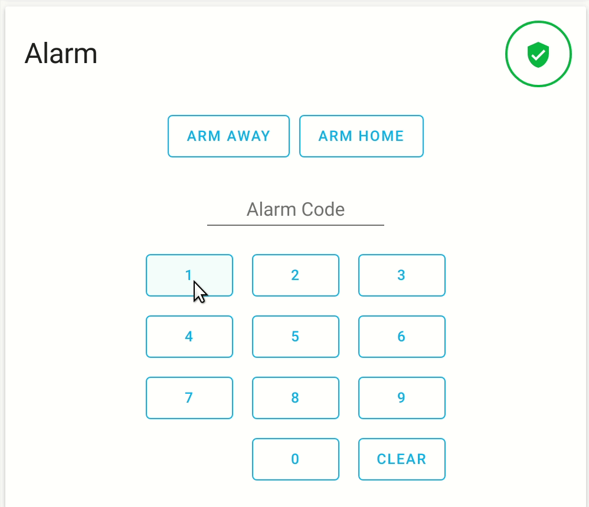
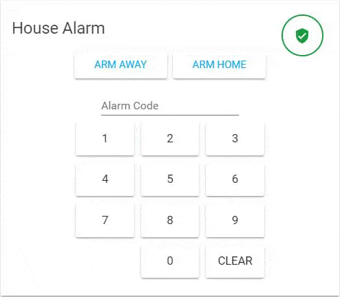

import { Pencil } from 'lucide-react'
import { Separator } from "../../../src/components/ui/separator"

# Alarm panel card

<p className="font-semibold text-xl">
The alarm panel card allows you to arm and disarm your [alarm control panel](https://www.home-assistant.io/integrations/#alarm) integrations.
</p>


<p className="text-center font-extralight">Screenshot of the alarm panel card.</p>

To add the alarm panel card to your user interface:

1. In the top right of the screen, select the edit <Pencil className='align-middle inline ' size={18}  />  button.
    - If this is your first time editing a dashboard, the **Edit dashboard** dialog appears.
        - By editing the dashboard, you are taking over control of this dashboard.
        - This means that it is no longer automatically updated when new dashboard elements become available.
        - Once you’ve taken control, you can’t get this specific dashboard back to update automatically. However, you can create a new default dashboard.
        - To continue, in the dialog, select the three dots  menu, then select **Take control**.

2. [Add a card and customize actions and features](https://www.home-assistant.io/dashboards/cards/#adding-cards-to-your-dashboard) to your dashboard.

All options for this card can be configured via the user interface.

## YAML configuration 

The following YAML options are available when you use YAML mode or just prefer to use YAML in the code editor in the UI.

<div className="bg-white p-6 rounded-2xl border border-[rgba(0,0,0,0.12)] mb-4">
#### Configuration Variables  
    <div>
        <p className="m-0 pb-2" style={{margin:'0'}}>type <span className="text-xs text-red-400">string Required</span></p>
        <p className="text-sm text-gray-400 m-0" style={{margin:'0'}}>`alarm-panel`</p>
        <Separator className="my-4" />
    </div>

    <div>
        <p className="m-0 pb-2" style={{margin:'0'}}>entity <span className="text-xs text-red-400">string Required</span></p>
        <p className="text-sm text-gray-400 m-0" style={{margin:'0'}}>Entity ID of `alarm_control_panel` domain.</p>
        <Separator className="my-4" />
    </div>

    <div>
        <p className="m-0 pb-2" style={{margin:'0'}}>name <span className="text-xs text-gray-400">string (Optional)</span></p>
        <p className="text-sm text-gray-400 m-0" style={{margin:'0'}}>Overwrites friendly name.</p>
        <p className="text-sm text-gray-400 m-0" style={{margin:'0'}}>Default: Current state of the alarm entity</p>

        <Separator className="my-4" />
    </div>

    <div>
        <p className="m-0 pb-2" style={{margin:'0'}}>states <span className="text-xs text-gray-400">list (Optional)</span></p>
        <p className="text-sm text-gray-400 m-0" style={{margin:'0'}}>Controls which states to have available.</p>
        <p className="text-sm text-gray-400 m-0" style={{margin:'0'}}>Default: `arm_home`, `arm_away`</p>

        <div className='pl-10'>
            <p className="m-0 pb-2" style={{margin:'0'}}>arm_home </p>
            <p className="text-sm text-gray-400 m-0" style={{margin:'0'}}>arm_home</p>
            <Separator className="my-4" />
        </div>
        
        <div className='pl-10'>
            <p className="m-0 pb-2" style={{margin:'0'}}>arm_away </p>
            <p className="text-sm text-gray-400 m-0" style={{margin:'0'}}>arm_away</p>
            <Separator className="my-4" />
        </div>

        <div className='pl-10'>
            <p className="m-0 pb-2" style={{margin:'0'}}>arm_night </p>
            <p className="text-sm text-gray-400 m-0" style={{margin:'0'}}>arm_home</p>
            <Separator className="my-4" />
        </div>

        <div className='pl-10'>
            <p className="m-0 pb-2" style={{margin:'0'}}>arm_custom_bypass </p>
            <p className="text-sm text-gray-400 m-0" style={{margin:'0'}}>arm_custom_bypass</p>
            
        </div>
        <Separator className="my-4" />
    </div>
        <div>
        <p className="m-0 pb-2" style={{margin:'0'}}>theme <span className="text-xs text-gray-400">string (Optional)</span></p>
        <p className="text-sm text-gray-400 m-0" style={{margin:'0'}}>Override the used theme for this card with any loaded theme. For more information about themes, see the [frontend documentation](https://www.home-assistant.io/integrations/frontend/).</p>
    </div>
</div>

### Examples 

Title example:

```yaml
type: alarm-panel
name: House Alarm
entity: alarm_control_panel.alarm
```


<p className="text-center font-extralight">Screenshot of the alarm panel card.</p>

Define the state list:

```yaml
type: alarm-panel
name: House Alarm
entity: alarm_control_panel.alarm
states:
  - arm_home
  - arm_away
  - arm_night
  - armed_custom_bypass
```

## Related topics
- [Themes](https://www.home-assistant.io/integrations/frontend/)
- [Dashboard cards](https://www.home-assistant.io/dashboards/cards/)