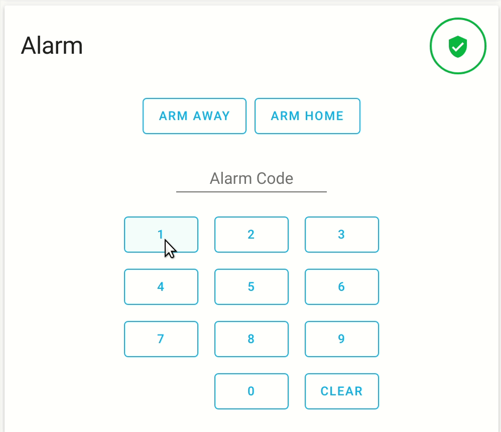
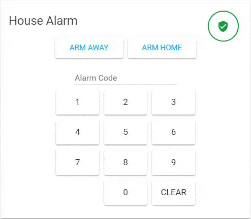

import { Pencil, EllipsisVertical } from 'lucide-react'
import { Separator } from "../../../src/components/ui/separator"

# 警报面板卡片

<p className="font-semibold text-xl">
警报面板卡片允许你对[警报控制面板](https://www.home-assistant.io/integrations/#alarm)集成进行布防和撤防操作。
</p>


<p className="text-center font-extralight">警报面板卡片的截图。</p>

要将警报面板卡片添加到你的用户界面：

1. 在屏幕的右上角，选择编辑 <Pencil className='align-middle inline ' size={18}  /> 按钮。
    - 如果这是你第一次编辑仪表板，将出现**编辑仪表板**对话框。
        - 通过编辑仪表板，你将接管此仪表板的控制权。
        - 这意味着当新的仪表板元素可用时，它不再自动更新。
        - 一旦你接管控制权，你就无法让这个特定的仪表板恢复自动更新。但是，你可以创建一个新的默认仪表板。
        - 要继续，在对话框中，选择三点菜单 <EllipsisVertical className='align-middle inline' size={18} />，然后选择**接管控制**。

2. [添加卡片并自定义动作和功能](https://www.home-assistant.io/dashboards/cards/#adding-cards-to-your-dashboard)到你的仪表板。

此卡片的所有选项都可以通过用户界面进行配置。

## YAML配置

当你使用YAML模式或只是更喜欢在UI的代码编辑器中使用YAML时，以下YAML选项可用。

<div className="bg-white p-6 rounded-2xl border border-[rgba(0,0,0,0.12)] mb-4">
#### 配置变量  
    <div>
        <p className="m-0 pb-2" style={{margin:'0'}}>type <span className="text-xs text-red-400">字符串 必需</span></p>
        <p className="text-sm text-gray-400 m-0" style={{margin:'0'}}>`alarm-panel`</p>
        <Separator className="my-4" />
    </div>

    <div>
        <p className="m-0 pb-2" style={{margin:'0'}}>entity <span className="text-xs text-red-400">字符串 必需</span></p>
        <p className="text-sm text-gray-400 m-0" style={{margin:'0'}}>`alarm_control_panel`域的实体ID。</p>
        <Separator className="my-4" />
    </div>

    <div>
        <p className="m-0 pb-2" style={{margin:'0'}}>name <span className="text-xs text-gray-400">字符串 (可选)</span></p>
        <p className="text-sm text-gray-400 m-0" style={{margin:'0'}}>覆盖友好名称。</p>
        <p className="text-sm text-gray-400 m-0" style={{margin:'0'}}>默认值：警报实体的当前状态</p>

        <Separator className="my-4" />
    </div>

    <div>
        <p className="m-0 pb-2" style={{margin:'0'}}>states <span className="text-xs text-gray-400">列表 (可选)</span></p>
        <p className="text-sm text-gray-400 m-0" style={{margin:'0'}}>控制哪些状态可用。</p>
        <p className="text-sm text-gray-400 m-0" style={{margin:'0'}}>默认值：`arm_home`, `arm_away`</p>

        <div className='pl-10'>
            <p className="m-0 pb-2" style={{margin:'0'}}>arm_home </p>
            <p className="text-sm text-gray-400 m-0" style={{margin:'0'}}>arm_home</p>
            <Separator className="my-4" />
        </div>
        
        <div className='pl-10'>
            <p className="m-0 pb-2" style={{margin:'0'}}>arm_away </p>
            <p className="text-sm text-gray-400 m-0" style={{margin:'0'}}>arm_away</p>
            <Separator className="my-4" />
        </div>

        <div className='pl-10'>
            <p className="m-0 pb-2" style={{margin:'0'}}>arm_night </p>
            <p className="text-sm text-gray-400 m-0" style={{margin:'0'}}>arm_home</p>
            <Separator className="my-4" />
        </div>

        <div className='pl-10'>
            <p className="m-0 pb-2" style={{margin:'0'}}>arm_custom_bypass </p>
            <p className="text-sm text-gray-400 m-0" style={{margin:'0'}}>arm_custom_bypass</p>
            
        </div>
        <Separator className="my-4" />
    </div>
    <div>
        <p className="m-0 pb-2" style={{margin:'0'}}>theme <span className="text-xs text-gray-400">字符串 (可选)</span></p>
        <p className="text-sm text-gray-400 m-0" style={{margin:'0'}}>使用任何已加载的主题覆盖此卡片使用的主题。有关主题的更多信息，请参阅[前端文档](https://www.home-assistant.io/integrations/frontend/)。</p>
    </div>
</div>

### 示例

标题示例：

```yaml
type: alarm-panel
name: House Alarm
entity: alarm_control_panel.alarm
```


<p className="text-center font-extralight">警报面板卡片的截图。</p>

定义状态列表：

```yaml
type: alarm-panel
name: House Alarm
entity: alarm_control_panel.alarm
states:
  - arm_home
  - arm_away
  - arm_night
  - armed_custom_bypass
```

## 相关主题
- [主题](https://www.home-assistant.io/integrations/frontend/)
- [仪表板卡片](https://www.home-assistant.io/dashboards/cards/)