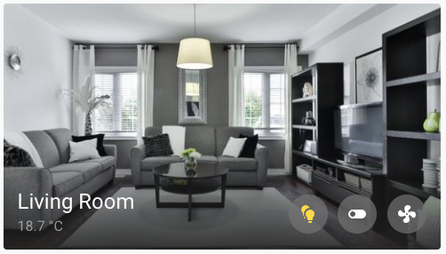

import { Pencil, EllipsisVertical } from 'lucide-react'
import { Separator } from "../../../src/components/ui/separator"

# Area card

<p className="text-xl font-semibold">
The area card lets you control and monitor an individual area.
</p>


<p className="text-center font-extralight">Screenshot of the area card</p>

To add the area card to your user interface:

1. In the top right of the screen, select the edit <Pencil className='align-middle inline ' size={18}  />  button.
    - If this is your first time editing a dashboard, the **Edit dashboard** dialog appears.
        - By editing the dashboard, you are taking over control of this dashboard.
        - This means that it is no longer automatically updated when new dashboard elements become available.
        - Once you’ve taken control, you can’t get this specific dashboard back to update automatically. However, you can create a new default dashboard.
        - To continue, in the dialog, select the three dots <EllipsisVertical className='align-middle inline' size={18} />  menu, then select **Take control**.

2. [Add a card and customize actions and features](https://www.home-assistant.io/dashboards/cards/#adding-cards-to-your-dashboard) to your dashboard.

All options for this card can be configured via the user interface.

Buttons will appear on the card for the entities in the area including fan, light, and switch. A motion sensor icon will appear in the top left if a motion sensor is in the area and if motion is detected by the motion sensor.

If a camera is added to the area you can show the camera feed instead of the area picture.

## YAML configuration 

The following YAML options are available when you use YAML mode or just prefer to use YAML in the code editor in the UI.


<div className="bg-white p-6 rounded-2xl border border-[rgba(0,0,0,0.12)] mb-4">
#### Configuration Variables  
    <div>
        <p className="m-0 pb-2" style={{margin:'0'}}> type <span className="text-xs text-red-400">string Required</span></p>
        <p className="text-sm text-gray-400 m-0" style={{margin:'0'}}>`area`</p>
        <Separator className="my-4" />
    </div>

    <div>
        <p className="m-0 pb-2" style={{margin:'0'}}> area <span className="text-xs text-red-400">string Required</span></p>
        <p className="text-sm text-gray-400 m-0" style={{margin:'0'}}>ID of the `area`.</p>
        <Separator className="my-4" />
    </div>

    <div>
        <p className="m-0 pb-2" style={{margin:'0'}}> show_camera <span className="text-xs text-gray-400">boolean (Optional, default: false)</span></p>
        <p className="text-sm text-gray-400 m-0" style={{margin:'0'}}>Changes the area picture to a live feed of the camera set for the area.</p>
        <Separator className="my-4" />
    </div>

    <div>
        <p className="m-0 pb-2" style={{margin:'0'}}> camera_view <span className="text-xs text-gray-400">string (Optional, default: auto)</span></p>
        <p className="text-sm text-gray-400 m-0" style={{margin:'0'}}>If showing a camera, “live” will show the live view if `stream` is enabled.</p>
        <Separator className="my-4" />
    </div>

    <div>
        <p className="m-0 pb-2" style={{margin:'0'}}> aspect_ratio <span className="text-xs text-gray-400">string (Optional, default: 16:9)</span></p>
        <p className="text-sm text-gray-400 m-0" style={{margin:'0'}}>Forces the height of the image to be a ratio of the width. Valid formats: Height percentage value (`23%`) or ratio expressed with colon or “x” separator (`16:9` or `16x9`). For a ratio, the second element can be omitted and will default to “1” (`1.78` equals `1.78:1`).</p>
        <Separator className="my-4" />
    </div>

    <div>
        <p className="m-0 pb-2" style={{margin:'0'}}> navigation_path <span className="text-xs text-gray-400">string (Optional)</span></p>
        <p className="text-sm text-gray-400 m-0" style={{margin:'0'}}>link to view. For more information about views, see the [view documentation](https://www.home-assistant.io/dashboards/views/)</p>
        <Separator className="my-4" />
    </div>

    <div>
        <p className="m-0 pb-2" style={{margin:'0'}}> theme <span className="text-xs text-gray-400">string (Optional)</span></p>
        <p className="text-sm text-gray-400 m-0" style={{margin:'0'}}>Override the used theme for this card with any loaded theme. For more information about themes, see the [frontend documentation](https://www.home-assistant.io/integrations/frontend/).</p>
        <Separator className="my-4" />
    </div>

    <div>
        <p className="m-0 pb-2" style={{margin:'0'}}> alert_classes <span className="text-xs text-gray-400">list (Optional, default: moisture, motion)</span></p>
        <p className="text-sm text-gray-400 m-0" style={{margin:'0'}}>A list of binary sensor device classes which will populate alert icons in the card when the state is on.</p>
        <Separator className="my-4" />
    </div>

    <div>
        <p className="m-0 pb-2" style={{margin:'0'}}> sensor_classes <span className="text-xs text-gray-400"> list (Optional, default: temperature, humidity) </span></p>
        <p className="text-sm text-gray-400 m-0" style={{margin:'0'}}>A list of sensor device classes which will display their averaged sensor readings for the area.</p>
    </div>
</div>

### Example

Basic example:

```yaml
type: area
area: bedroom
```
Complex example

```yaml
type: area
area: bedroom
navigation_path: my_bedroom
show_camera: true
theme: green
```

## Related topics

- [Themes](https://www.home-assistant.io/integrations/frontend/)

- [Dashboard cards](https://www.home-assistant.io/dashboards/cards/)