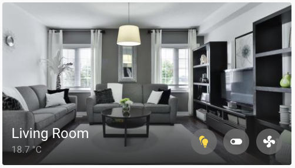

import { Pencil, EllipsisVertical } from 'lucide-react'
import { Separator } from "../../../src/components/ui/separator"

# 区域卡片

<p className="text-xl font-semibold">
区域卡片让你可以控制和监控单个区域。
</p>


<p className="text-center font-extralight">区域卡片的截图</p>

要将区域卡片添加到你的用户界面：

1. 在屏幕右上角，选择编辑 <Pencil className='align-middle inline ' size={18}  /> 按钮。
    - 如果这是你第一次编辑仪表板，会出现**编辑仪表板**对话框。
        - 通过编辑仪表板，你将接管这个仪表板的控制权。
        - 这意味着当新的仪表板元素可用时，它将不再自动更新。
        - 一旦你接管控制权，你将无法使这个特定的仪表板恢复为自动更新。但是，你可以创建一个新的默认仪表板。
        - 要继续，在对话框中，选择三点菜单 <EllipsisVertical className='align-middle inline' size={18} />，然后选择**接管控制**。

2. [添加卡片并自定义操作和功能](https://www.home-assistant.io/dashboards/cards/#adding-cards-to-your-dashboard) 到你的仪表板。

这个卡片的所有选项都可以通过用户界面进行配置。

卡片上将显示区域内实体的按钮，包括风扇、灯光和开关。如果区域内有动作传感器且检测到动作，动作传感器图标将出现在左上角。

如果向区域添加了摄像头，你可以显示摄像头画面而不是区域图片。

## YAML 配置

当你使用 YAML 模式或只是更喜欢在 UI 中的代码编辑器中使用 YAML 时，以下 YAML 选项可用。


<div className="bg-white p-6 rounded-2xl border border-[rgba(0,0,0,0.12)] mb-4">
#### 配置变量  
    <div>
        <p className="m-0 pb-2" style={{margin:'0'}}> type <span className="text-xs text-red-400">字符串 必填</span></p>
        <p className="text-sm text-gray-400 m-0" style={{margin:'0'}}>`area`</p>
        <Separator className="my-4" />
    </div>

    <div>
        <p className="m-0 pb-2" style={{margin:'0'}}> area <span className="text-xs text-red-400">字符串 必填</span></p>
        <p className="text-sm text-gray-400 m-0" style={{margin:'0'}}>`area` 的 ID。</p>
        <Separator className="my-4" />
    </div>

    <div>
        <p className="m-0 pb-2" style={{margin:'0'}}> show_camera <span className="text-xs text-gray-400">布尔值 (可选，默认值：false)</span></p>
        <p className="text-sm text-gray-400 m-0" style={{margin:'0'}}>将区域图片更改为该区域设置的摄像头的实时画面。</p>
        <Separator className="my-4" />
    </div>

    <div>
        <p className="m-0 pb-2" style={{margin:'0'}}> camera_view <span className="text-xs text-gray-400">字符串 (可选，默认值：auto)</span></p>
        <p className="text-sm text-gray-400 m-0" style={{margin:'0'}}>如果显示摄像头，当启用 `stream` 时，"live" 将显示实时视图。</p>
        <Separator className="my-4" />
    </div>

    <div>
        <p className="m-0 pb-2" style={{margin:'0'}}> aspect_ratio <span className="text-xs text-gray-400">字符串 (可选，默认值：16:9)</span></p>
        <p className="text-sm text-gray-400 m-0" style={{margin:'0'}}>强制图像高度与宽度成比例。有效格式：高度百分比值 (`23%`) 或使用冒号或 "x" 分隔符表示的比例 (`16:9` 或 `16x9`)。对于比例，第二个元素可以省略，默认为 "1" (`1.78` 等同于 `1.78:1`)。</p>
        <Separator className="my-4" />
    </div>

    <div>
        <p className="m-0 pb-2" style={{margin:'0'}}> navigation_path <span className="text-xs text-gray-400">字符串 (可选)</span></p>
        <p className="text-sm text-gray-400 m-0" style={{margin:'0'}}>链接到视图。有关视图的更多信息，请参阅 [视图文档](/docs/documentation/dashboards/views)</p>
        <Separator className="my-4" />
    </div>

    <div>
        <p className="m-0 pb-2" style={{margin:'0'}}> theme <span className="text-xs text-gray-400">字符串 (可选)</span></p>
        <p className="text-sm text-gray-400 m-0" style={{margin:'0'}}>使用任何已加载的主题覆盖此卡片使用的主题。有关主题的更多信息，请参阅 [前端文档](https://www.home-assistant.io/integrations/frontend/)。</p>
        <Separator className="my-4" />
    </div>

    <div>
        <p className="m-0 pb-2" style={{margin:'0'}}> alert_classes <span className="text-xs text-gray-400">列表 (可选，默认值：moisture, motion)</span></p>
        <p className="text-sm text-gray-400 m-0" style={{margin:'0'}}>二进制传感器设备类的列表，当状态为开启时，将在卡片中显示警报图标。</p>
        <Separator className="my-4" />
    </div>

    <div>
        <p className="m-0 pb-2" style={{margin:'0'}}> sensor_classes <span className="text-xs text-gray-400"> 列表 (可选，默认值：temperature, humidity) </span></p>
        <p className="text-sm text-gray-400 m-0" style={{margin:'0'}}>传感器设备类的列表，将显示该区域的平均传感器读数。</p>
    </div>
</div>

### 示例

基本示例：

```yaml
type: area
area: bedroom
```
复杂示例：

```yaml
type: area
area: bedroom
navigation_path: my_bedroom
show_camera: true
theme: green
```

## 相关主题

- [主题](https://www.home-assistant.io/integrations/frontend/)

- [仪表板卡片](https://www.home-assistant.io/dashboards/cards/)