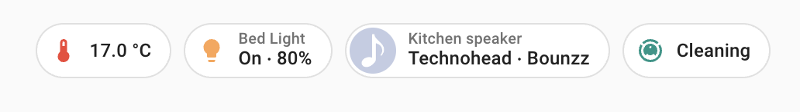
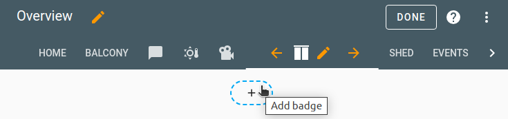
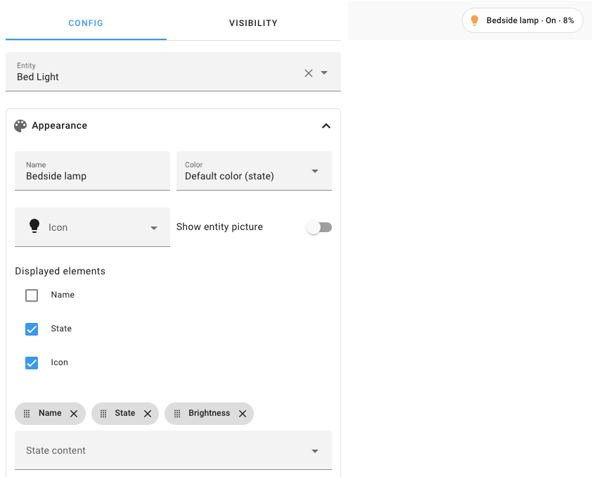

# Badges

import { Pencil, Plus } from 'lucide-react'
import { Separator } from "../../../src/components/ui/separator"


<p className="text-xl font-semibold">
Badges are widgets that sit at the top of a panel, above all the cards.
</p>


<p className="text-center font-extralight">Badges at the top of a panel.</p>

## Adding a badge to your dashboard 

1. Go to [Settings > Dashboards](https://my.home-assistant.io/redirect/lovelace_dashboards).

2. If you have multiple [views](https://www.home-assistant.io/dashboards/views/), open the view to which you want to add a badge.

3. In the top right of the screen, select the edit <Pencil className='align-middle inline ' size={18}  />  button.

4. To add a badge, select the plus <Plus className='align-middle inline ' size={18}  /> button.


5. Select the entity for which you want to display a badge.

6. Configure your badge.

- The available options depend on the entity.
- Add the states you want to see.
- If you want, add a **Name**.


7. Under **Interactions**, you can define the tap behavior.

8. If you want this badge to be visible only to specific users or under a certain condition, open the **Visibility** tab to [define those conditions](https://www.home-assistant.io/dashboards/cards/#showing-or-hiding-a-card-or-badge-conditionally).
    - The [available conditions](https://www.home-assistant.io/dashboards/conditional/#conditions-options) are the same as the ones for the conditional card.
9. Select **Save**.

<p className="text-center font-extralight">screencast showing how to add a badge to a dashboard</p>

## Entity badge 

The Entity badge allows you to display the state of an entity on a badge. This badge supports actions.

```yaml
type: entity
entity: light.living_room
```

<div className="bg-white p-6 rounded-2xl border border-[rgba(0,0,0,0.12)] mb-4">
#### Configuration Variables  
    <div>
        <p className="m-0 pb-2" style={{margin:'0'}}>type <span className="text-xs text-red-400">string Required</span></p>
        <p className="text-sm text-gray-400 m-0" style={{margin:'0'}}>`entity`</p>
        <Separator className="my-4" />
    </div>

    <div>
        <p className="m-0 pb-2" style={{margin:'0'}}>entity <span className="text-xs text-red-400">string Required</span></p>
        <p className="text-sm text-gray-400 m-0" style={{margin:'0'}}>Entity ID.</p>
        <Separator className="my-4" />
    </div>

    <div>
        <p className="m-0 pb-2" style={{margin:'0'}}>name <span className="text-xs text-gray-400">string (Optional)</span></p>
        <p className="text-sm text-gray-400 m-0" style={{margin:'0'}}>Overwrites the entity name.</p>
        <Separator className="my-4" />
    </div>

    <div>
        <p className="m-0 pb-2" style={{margin:'0'}}>icon <span className="text-xs text-gray-400">string (Optional)</span></p>
        <p className="text-sm text-gray-400 m-0" style={{margin:'0'}}>Overwrites the entity icon.</p>
        <Separator className="my-4" />
    </div>

    <div>
        <p className="m-0 pb-2" style={{margin:'0'}}>color <span className="text-xs text-gray-400">string (Optional, default: state)</span></p>
        <p className="text-sm text-gray-400 m-0" style={{margin:'0'}}>Set the color when the entity is active. By default, the color is based on `state`, `domain`, and `device_class` of your entity. It accepts [color token](https://www.home-assistant.io/dashboards/tile/#available-colors) or hex color code.</p>
        <Separator className="my-4" />
    </div>

    <div>
        <p className="m-0 pb-2" style={{margin:'0'}}>show_entity_picture <span className="text-xs text-gray-400">boolean (Optional, default: false)</span></p>
        <p className="text-sm text-gray-400 m-0" style={{margin:'0'}}>If your entity has a picture, it will replace the icon.</p>
        <Separator className="my-4" />
    </div>

    <div>
        <p className="m-0 pb-2" style={{margin:'0'}}>show_name <span className="text-xs text-gray-400">boolean (Optional, default: false)</span></p>
        <p className="text-sm text-gray-400 m-0" style={{margin:'0'}}>Show the name</p>
        <Separator className="my-4" />
    </div>

    <div>
        <p className="m-0 pb-2" style={{margin:'0'}}>show_icon <span className="text-xs text-gray-400">boolean (Optional, default: true)</span></p>
        <p className="text-sm text-gray-400 m-0" style={{margin:'0'}}>Show the icon</p>
        <Separator className="my-4" />
    </div>

    <div>
        <p className="m-0 pb-2" style={{margin:'0'}}>show_state <span className="text-xs text-gray-400">boolean (Optional, default: true)</span></p>
        <p className="text-sm text-gray-400 m-0" style={{margin:'0'}}>Show the state</p>
        <Separator className="my-4" />
    </div>

    <div>
        <p className="m-0 pb-2" style={{margin:'0'}}>state_content <span className="text-xs text-gray-400">string | list  (Optional)</span></p>
        <p className="text-sm text-gray-400 m-0" style={{margin:'0'}}>Content to display for the state. Can be `state`, `last_changed`, `last_updated`, or any attribute of the entity. Can be either a string with a single item, or a list of string items. Default depends on the entity domain.</p>
        <Separator className="my-4" />
    </div>


    <div>
        <p className="m-0 pb-2" style={{margin:'0'}}>tap_action <span className="text-xs text-gray-400">map (Optional)</span></p>
        <p className="text-sm text-gray-400 m-0" style={{margin:'0'}}>Action taken on card tap. See [action documentation](https://www.home-assistant.io/dashboards/actions/#tap-action). By default, it will show the “more-info” dialog.</p>
        <Separator className="my-4" />
    </div>

    <div>
        <p className="m-0 pb-2" style={{margin:'0'}}>hold_action <span className="text-xs text-gray-400">map  (Optional)</span></p>
        <p className="text-sm text-gray-400 m-0" style={{margin:'0'}}>Action taken on tap-and-hold. See [action documentation](https://www.home-assistant.io/dashboards/actions/#hold-action).</p>
        <Separator className="my-4" />
    </div>

    <div>
        <p className="m-0 pb-2" style={{margin:'0'}}>double_tap_action <span className="text-xs text-gray-400">map  (Optional)</span></p>
        <p className="text-sm text-gray-400 m-0" style={{margin:'0'}}>Action taken on double tap. See [action documentation](https://www.home-assistant.io/dashboards/actions/#hold-action).</p>
    </div>
</div>

## Entity Filter Badge 

This badge allows you to define a list of entities that you want to track only when in a certain state. Very useful for showing lights that you forgot to turn off or show a list of people only when they’re at home.


<div className="bg-white p-6 rounded-2xl border border-[rgba(0,0,0,0.12)] mb-4">
#### Configuration Variables  
    <div>
        <p className="m-0 pb-2" style={{margin:'0'}}>type <span className="text-xs text-red-400">string Required</span></p>
        <p className="text-sm text-gray-400 m-0" style={{margin:'0'}}>`entity-filter`</p>
        <Separator className="my-4" />
    </div>

    <div>
        <p className="m-0 pb-2" style={{margin:'0'}}>entities <span className="text-xs text-red-400">list Required</span></p>
        <p className="text-sm text-gray-400 m-0" style={{margin:'0'}}>A list of entity IDs or `entity` objects, see below.</p>
        <Separator className="my-4" />
    </div>

    <div>
        <p className="m-0 pb-2" style={{margin:'0'}}>conditions <span className="text-xs text-gray-400">list (Optional)</span></p>
        <p className="text-sm text-gray-400 m-0" style={{margin:'0'}}>List of conditions to check. See [available conditions](https://www.home-assistant.io/dashboards/badges/#conditions-options).*</p>
        <Separator className="my-4" />
    </div>

    <div>
        <p className="m-0 pb-2" style={{margin:'0'}}>state_filter <span className="text-xs text-gray-400">list (Optional)</span></p>
        <p className="text-sm text-gray-400 m-0" style={{margin:'0'}}>(legacy) List of strings representing states or filters to check. See [available legacy filters](https://www.home-assistant.io/dashboards/badges/#legacy-state-filters).*</p>
    </div>
</div>

*one is required (`conditions` or `state_filter`)


### Options for entities 

If you define entities as objects instead of strings (by adding `entity:` before entity ID), you can add more customization and configurations:

<div className="bg-white p-6 rounded-2xl border border-[rgba(0,0,0,0.12)] mb-4">
#### Configuration Variables  
    <div>
        <p className="m-0 pb-2" style={{margin:'0'}}>type <span className="text-xs text-gray-400">string (Optional)</span></p>
        <p className="text-sm text-gray-400 m-0" style={{margin:'0'}}>Sets a custom badge type: `custom:my-custom-badge`</p>
        <Separator className="my-4" />
    </div>

    <div>
        <p className="m-0 pb-2" style={{margin:'0'}}>entity <span className="text-xs text-red-400">string Required</span></p>
        <p className="text-sm text-gray-400 m-0" style={{margin:'0'}}>Entity ID.</p>
        <Separator className="my-4" />
    </div>

    <div>
        <p className="m-0 pb-2" style={{margin:'0'}}>name <span className="text-xs text-gray-400">string (Optional)</span></p>
        <p className="text-sm text-gray-400 m-0" style={{margin:'0'}}>Overwrites friendly name.</p>
        <Separator className="my-4" />
    </div>

    <div>
        <p className="m-0 pb-2" style={{margin:'0'}}>icon <span className="text-xs text-gray-400">string (Optional)</span></p>
        <p className="text-sm text-gray-400 m-0" style={{margin:'0'}}>Overwrites icon or entity picture. You can use any icon from [Material Design Icons](https://pictogrammers.com/library/mdi/).Prefix the icon name with `mdi:`, ie `mdi:home`.</p>
        <Separator className="my-4" />
    </div>

    <div>
        <p className="m-0 pb-2" style={{margin:'0'}}> conditions <span className="text-xs text-gray-400">list (Optional)</span></p>
        <p className="text-sm text-gray-400 m-0" style={{margin:'0'}}>List of conditions to check. See [available conditions](https://www.home-assistant.io/dashboards/badges/#conditions-options).*</p>
        <Separator className="my-4" />
    </div>

    <div>
        <p className="m-0 pb-2" style={{margin:'0'}}>state_filter <span className="text-xs text-gray-400">list (Optional)</span></p>
        <p className="text-sm text-gray-400 m-0" style={{margin:'0'}}>(legacy) List of strings representing states or filters to check. See [available legacy filters](https://www.home-assistant.io/dashboards/badges/#legacy-state-filters).*</p>
    </div>
</div>

*only one filter will be applied: `conditions` or `state_filter` if `conditions` is not present


You may also add any additional configuration options to an entity which are supported by the chosen badge type (`Entity` badge type if no type is chosen).

## Conditions options 

You can specify multiple `conditions`, in which case the entity will be displayed if it matches all conditions.

### State

Tests if an entity has a specified state.

```yaml
type: entity-filter
entities:
  - climate.thermostat_living_room
  - climate.thermostat_bed_room
conditions:
  - condition: state
    state: heat
```

```yaml
type: entity-filter
entities:
  - climate.thermostat_living_room
  - climate.thermostat_bed_room
conditions:
  - condition: state
    state_not: "off"
```

```yaml
type: entity-filter
entities:
  - sensor.gas_station_1
  - sensor.gas_station_2
  - sensor.gas_station_3
conditions:
  - condition: state
    state: sensor.gas_station_lowest_price
```

<div className="bg-white p-6 rounded-2xl border border-[rgba(0,0,0,0.12)] mb-4">
#### Configuration Variables  
    <div>
        <p className="m-0 pb-2" style={{margin:'0'}}>condition <span className="text-xs text-red-400">string Required</span></p>
        <p className="text-sm text-gray-400 m-0" style={{margin:'0'}}>`state`</p>
        <Separator className="my-4" />
    </div>

    <div>
        <p className="m-0 pb-2" style={{margin:'0'}}>state <span className="text-xs text-gray-400">list | string (Optional)</span></p>
        <p className="text-sm text-gray-400 m-0" style={{margin:'0'}}>Entity state or ID to be equal to this value. Can contain an array of states.*</p>
        <Separator className="my-4" />
    </div>

    <div>
        <p className="m-0 pb-2" style={{margin:'0'}}>state not <span className="text-xs text-gray-400">list | string (Optional)</span></p>
        <p className="text-sm text-gray-400 m-0" style={{margin:'0'}}>Entity state or ID to not be equal to this value. Can contain an array of states.*</p>
    </div>
</div>

*one is required (`state` or `state_not`)


### Numeric state 

Tests if an entity state matches the thresholds.

```yaml
type: entity-filter
entities:
  - sensor.outside_temperature
  - sensor.living_room_temperature
  - sensor.bed_room_temperature
conditions:
  - condition: numeric_state
    above: 10
    below: 20
```

<div className="bg-white p-6 rounded-2xl border border-[rgba(0,0,0,0.12)] mb-4">
#### Configuration Variables  
    <div>
        <p className="m-0 pb-2" style={{margin:'0'}}>condition <span className="text-xs text-red-400">string Required</span></p>
        <p className="text-sm text-gray-400 m-0" style={{margin:'0'}}>`numeric_state`</p>
        <Separator className="my-4" />
    </div>

    <div>
        <p className="m-0 pb-2" style={{margin:'0'}}>above <span className="text-xs text-gray-400"> string (Optional)</span></p>
        <p className="text-sm text-gray-400 m-0" style={{margin:'0'}}>Entity state or ID to be above this value.*</p>
        <Separator className="my-4" />
    </div>

    <div>
        <p className="m-0 pb-2" style={{margin:'0'}}>below <span className="text-xs text-gray-400">string (Optional)</span></p>
        <p className="text-sm text-gray-400 m-0" style={{margin:'0'}}>Entity state or ID to be below this value.*</p>
    </div>
</div>

*at least one is required (`above` or `below`), both are also possible for values between.

### Screen 

Specify the visibility of the entity per screen size. Some screen size presets are available in the UI but you can use any CSS media query you want in YAML.

```yaml
type: entity-filter
entities:
  - sensor.outside_temperature
  - sensor.living_room_temperature
  - sensor.bed_room_temperature
conditions:
  - condition: screen
    media_query: "(min-width: 1280px)"
```
<div className="bg-white p-6 rounded-2xl border border-[rgba(0,0,0,0.12)] mb-4">
#### Configuration Variables  
    <div>
        <p className="m-0 pb-2" style={{margin:'0'}}>condition <span className="text-xs text-red-400">string Required</span></p>
        <p className="text-sm text-gray-400 m-0" style={{margin:'0'}}>`screen`</p>
        <Separator className="my-4" />
    </div>

    <div>
        <p className="m-0 pb-2" style={{margin:'0'}}>media_query <span className="text-xs text-red-400"> string Required</span></p>
        <p className="text-sm text-gray-400 m-0" style={{margin:'0'}}>Media query to check which screen size are allowed to display the entity.</p>
    </div>
</div>

### User

Specify the visibility of the entity per user.

```yaml
type: entity-filter
entities:
  - sensor.outside_temperature
  - sensor.living_room_temperature
  - sensor.bed_room_temperature
conditions:
  - condition: user
    users:
      - 581fca7fdc014b8b894519cc531f9a04
```

<div className="bg-white p-6 rounded-2xl border border-[rgba(0,0,0,0.12)] mb-4">
#### Configuration Variables  
    <div>
        <p className="m-0 pb-2" style={{margin:'0'}}>condition <span className="text-xs text-red-400">string Required</span></p>
        <p className="text-sm text-gray-400 m-0" style={{margin:'0'}}>`user`</p>
        <Separator className="my-4" />
    </div>

    <div>
        <p className="m-0 pb-2" style={{margin:'0'}}>media_query <span className="text-xs text-red-400"> list Required</span></p>
        <p className="text-sm text-gray-400 m-0" style={{margin:'0'}}>User ID that can see the entity (unique hex value found on the Users configuration page).</p>
    </div>
</div>

### And 

Specify that both conditions must be met.

```yaml
type: entity-filter
entities:
  - sensor.outside_temperature
  - sensor.living_room_temperature
  - sensor.bed_room_temperature
conditions:
  - condition: and
    conditions:
      - condition: numeric_state
        above: 0
      - condition: user
        users:
          - 581fca7fdc014b8b894519cc531f9a04
```

<div className="bg-white p-6 rounded-2xl border border-[rgba(0,0,0,0.12)] mb-4">
#### Configuration Variables  
    <div>
        <p className="m-0 pb-2" style={{margin:'0'}}>condition <span className="text-xs text-red-400">string Required</span></p>
        <p className="text-sm text-gray-400 m-0" style={{margin:'0'}}>`and`</p>
        <Separator className="my-4" />
    </div>

    <div>
        <p className="m-0 pb-2" style={{margin:'0'}}>conditions <span className="text-xs text-red-400"> list (Optional)</span></p>
        <p className="text-sm text-gray-400 m-0" style={{margin:'0'}}>List of conditions to check. See [available conditions](https://www.home-assistant.io/dashboards/badges/#conditions-options).</p>
    </div>
</div>

### Or 

Specify that at least one of the conditions must be met.

```yaml
type: entity-filter
entities:
  - sensor.outside_temperature
  - sensor.living_room_temperature
  - sensor.bed_room_temperature
conditions:
  - condition: or
    conditions:
      - condition: numeric_state
        above: 0
      - condition: user
        users:
          - 581fca7fdc014b8b894519cc531f9a04
```

<div className="bg-white p-6 rounded-2xl border border-[rgba(0,0,0,0.12)] mb-4">
#### Configuration Variables  
    <div>
        <p className="m-0 pb-2" style={{margin:'0'}}>condition <span className="text-xs text-red-400">string Required</span></p>
        <p className="text-sm text-gray-400 m-0" style={{margin:'0'}}>`or`</p>
        <Separator className="my-4" />
    </div>

    <div>
        <p className="m-0 pb-2" style={{margin:'0'}}>conditions <span className="text-xs text-red-400"> list (Optional)</span></p>
        <p className="text-sm text-gray-400 m-0" style={{margin:'0'}}>List of conditions to check. See [available conditions](https://www.home-assistant.io/dashboards/badges/#conditions-options).</p>
    </div>
</div>

## Legacy state filters 

### String filter 
Show only active switches or lights in the house.

```yaml
type: entity-filter
entities:
  - entity: light.bed_light
    name: Bed
  - light.kitchen_lights
  - light.ceiling_lights
state_filter:
  - "on"
```

You can also specify multiple `state_filter` conditions, in which case the entity will be displayed if it matches any condition.

If you define `state_filter` as objects instead of strings, you can add more customization to your filter, as described below.

### Operator filter 

Tests if an entity state correspond to the applied `operator`.

<div className="bg-white p-6 rounded-2xl border border-[rgba(0,0,0,0.12)] mb-4">
#### Configuration Variables  
    <div>
        <p className="m-0 pb-2" style={{margin:'0'}}>value <span className="text-xs text-red-400">string Required</span></p>
        <p className="text-sm text-gray-400 m-0" style={{margin:'0'}}>String representing the state.</p>
        <Separator className="my-4" />
    </div>

    <div>
        <p className="m-0 pb-2" style={{margin:'0'}}>operator <span className="text-xs text-red-400">string Required</span></p>
        <p className="text-sm text-gray-400 m-0" style={{margin:'0'}}>Operator to use in the comparison. Can be `==`,` <=`, `<`, `>=`, `>`, `!=`, `i`n, `not in`, or `regex`.`</p>
        <Separator className="my-4" />
    </div>

    <div>
        <p className="m-0 pb-2" style={{margin:'0'}}>attribute <span className="text-xs text-red-400">string (Optional)</span></p>
        <p className="text-sm text-gray-400 m-0" style={{margin:'0'}}>Attribute of the entity to use instead of the state.</p>
    </div>
</div>

### Examples 

Displays everyone who is at home or at work.

```yaml
type: entity-filter
entities:
  - device_tracker.demo_paulus
  - device_tracker.demo_anne_therese
  - device_tracker.demo_home_boy
state_filter:
  - operator: "=="
    value: home
  - operator: "=="
    value: work
```

Specify filter for a single entity.

```yaml
type: entity-filter
state_filter:
  - "on"
  - operator: ">"
    value: 90
entities:
  - sensor.water_leak
  - sensor.outside_temp
  - entity: sensor.humidity_and_temp
    state_filter:
      - operator: ">"
        value: 50
        attribute: humidity
```

Use a regex filter against entity attributes. This regex filter below looks for expressions that are 1 digit in length and where the number is between 0-7 (so show holidays today or in the next 7 days) and displays those holidays as entities in the Entity Filter badge.

```yaml
type: entity-filter
state_filter:
  - operator: regex
    value: "^([0-7]{1})$"
    attribute: eta
entities:
  - entity: sensor.upcoming_ical_holidays_0
  - entity: sensor.upcoming_ical_holidays_1
  - entity: sensor.upcoming_ical_holidays_2
  - entity: sensor.upcoming_ical_holidays_3
  - entity: sensor.upcoming_ical_holidays_4
show_empty: false
```