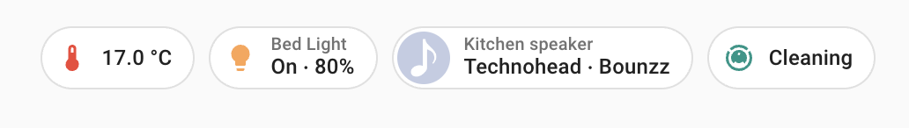
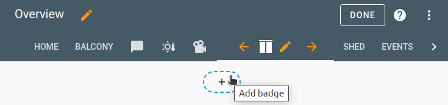
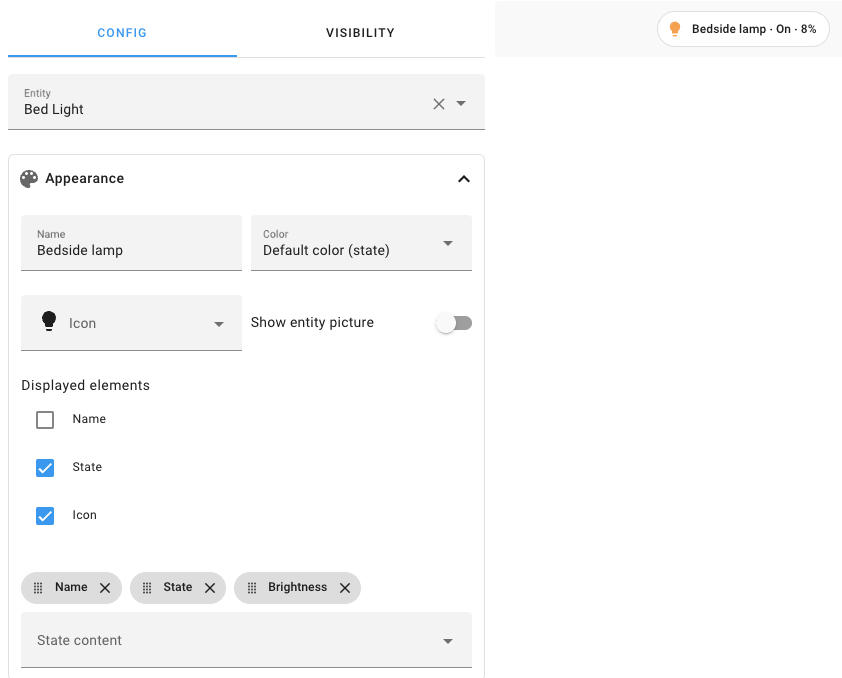
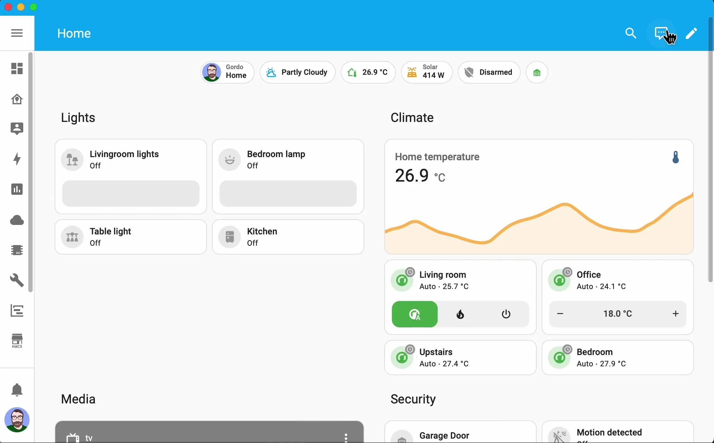

# 徽章

import { Pencil, Plus } from 'lucide-react'
import { Separator } from "../../../src/components/ui/separator"


<p className="text-xl font-semibold">
徽章是位于面板顶部、所有卡片上方的小部件。
</p>


<p className="text-center font-extralight">面板顶部的徽章。</p>

## 将徽章添加到你的仪表板 

1. 前往 [设置 > 仪表板](https://my.home-assistant.io/redirect/lovelace_dashboards)。

2. 如果你有多个[视图](/docs/documentation/dashboards/views)，请打开你想要添加徽章的视图。

3. 在屏幕右上角，选择编辑 <Pencil className='align-middle inline ' size={18}  /> 按钮。

4. 要添加徽章，选择加号 <Plus className='align-middle inline ' size={18}  /> 按钮。


5. 选择你想要显示徽章的实体。

6. 配置你的徽章。

- 可用选项取决于实体。
- 添加你想要看到的状态。
- 如果你想，添加一个**名称**。


7. 在**交互**下，你可以定义点击行为。

8. 如果你只想让特定用户看到此徽章或在特定条件下显示，打开**可见性**选项卡来[定义这些条件](/docs/documentation/dashboards/cards#有条件地显示或隐藏卡片或徽章)。
    - [可用条件](/docs/documentation/dashboards/conditional#条件选项)与条件卡片的条件相同。
9. 选择**保存**。

<p className="text-center font-extralight">显示如何将徽章添加到仪表板的屏幕录像</p>

## 实体徽章 

实体徽章允许你在徽章上显示实体的状态。此徽章支持操作。

```yaml
type: entity
entity: light.living_room
```

<div className="bg-white p-6 rounded-2xl border border-[rgba(0,0,0,0.12)] mb-4">
#### 配置变量  
    <div>
        <p className="m-0 pb-2" style={{margin:'0'}}>type <span className="text-xs text-red-400">字符串 必填</span></p>
        <p className="text-sm text-gray-400 m-0" style={{margin:'0'}}>`entity`</p>
        <Separator className="my-4" />
    </div>

    <div>
        <p className="m-0 pb-2" style={{margin:'0'}}>entity <span className="text-xs text-red-400">字符串 必填</span></p>
        <p className="text-sm text-gray-400 m-0" style={{margin:'0'}}>实体 ID。</p>
        <Separator className="my-4" />
    </div>

    <div>
        <p className="m-0 pb-2" style={{margin:'0'}}>name <span className="text-xs text-gray-400">字符串 (可选)</span></p>
        <p className="text-sm text-gray-400 m-0" style={{margin:'0'}}>覆盖实体名称。</p>
        <Separator className="my-4" />
    </div>

    <div>
        <p className="m-0 pb-2" style={{margin:'0'}}>icon <span className="text-xs text-gray-400">字符串 (可选)</span></p>
        <p className="text-sm text-gray-400 m-0" style={{margin:'0'}}>覆盖实体图标。</p>
        <Separator className="my-4" />
    </div>

    <div>
        <p className="m-0 pb-2" style={{margin:'0'}}>color <span className="text-xs text-gray-400">字符串 (可选，默认值: state)</span></p>
        <p className="text-sm text-gray-400 m-0" style={{margin:'0'}}>设置实体激活时的颜色。默认情况下，颜色基于你实体的 `state`、`domain` 和 `device_class`。它接受[颜色令牌](https://www.home-assistant.io/dashboards/tile/#available-colors)或十六进制颜色代码。</p>
        <Separator className="my-4" />
    </div>

    <div>
        <p className="m-0 pb-2" style={{margin:'0'}}>show_entity_picture <span className="text-xs text-gray-400">布尔值 (可选，默认值: false)</span></p>
        <p className="text-sm text-gray-400 m-0" style={{margin:'0'}}>如果你的实体有图片，它将替换图标。</p>
        <Separator className="my-4" />
    </div>

    <div>
        <p className="m-0 pb-2" style={{margin:'0'}}>show_name <span className="text-xs text-gray-400">布尔值 (可选，默认值: false)</span></p>
        <p className="text-sm text-gray-400 m-0" style={{margin:'0'}}>显示名称</p>
        <Separator className="my-4" />
    </div>

    <div>
        <p className="m-0 pb-2" style={{margin:'0'}}>show_icon <span className="text-xs text-gray-400">布尔值 (可选，默认值: true)</span></p>
        <p className="text-sm text-gray-400 m-0" style={{margin:'0'}}>显示图标</p>
        <Separator className="my-4" />
    </div>

    <div>
        <p className="m-0 pb-2" style={{margin:'0'}}>show_state <span className="text-xs text-gray-400">布尔值 (可选，默认值: true)</span></p>
        <p className="text-sm text-gray-400 m-0" style={{margin:'0'}}>显示状态</p>
        <Separator className="my-4" />
    </div>

    <div>
        <p className="m-0 pb-2" style={{margin:'0'}}>state_content <span className="text-xs text-gray-400">字符串 | 列表  (可选)</span></p>
        <p className="text-sm text-gray-400 m-0" style={{margin:'0'}}>显示状态的内容。可以是 `state`、`last_changed`、`last_updated` 或实体的任何属性。可以是包含单个项目的字符串，也可以是字符串项目列表。默认值取决于实体域。</p>
        <Separator className="my-4" />
    </div>


    <div>
        <p className="m-0 pb-2" style={{margin:'0'}}>tap_action <span className="text-xs text-gray-400">映射 (可选)</span></p>
        <p className="text-sm text-gray-400 m-0" style={{margin:'0'}}>点击卡片时执行的操作。查看[操作文档](https://www.home-assistant.io/dashboards/actions/#tap-action)。默认情况下，它将显示"更多信息"对话框。</p>
        <Separator className="my-4" />
    </div>

    <div>
        <p className="m-0 pb-2" style={{margin:'0'}}>hold_action <span className="text-xs text-gray-400">映射  (可选)</span></p>
        <p className="text-sm text-gray-400 m-0" style={{margin:'0'}}>点击并按住时执行的操作。查看[操作文档](https://www.home-assistant.io/dashboards/actions/#hold-action)。</p>
        <Separator className="my-4" />
    </div>

    <div>
        <p className="m-0 pb-2" style={{margin:'0'}}>double_tap_action <span className="text-xs text-gray-400">映射  (可选)</span></p>
        <p className="text-sm text-gray-400 m-0" style={{margin:'0'}}>双击时执行的操作。查看[操作文档](https://www.home-assistant.io/dashboards/actions/#hold-action)。</p>
    </div>
</div>

## 实体过滤器徽章 

此徽章允许你定义一个实体列表，当这些实体处于特定状态时才进行跟踪。非常适合显示你忘记关闭的灯光或者仅当人在家时显示人员列表。


<div className="bg-white p-6 rounded-2xl border border-[rgba(0,0,0,0.12)] mb-4">
#### 配置变量  
    <div>
        <p className="m-0 pb-2" style={{margin:'0'}}>type <span className="text-xs text-red-400">字符串 必填</span></p>
        <p className="text-sm text-gray-400 m-0" style={{margin:'0'}}>`entity-filter`</p>
        <Separator className="my-4" />
    </div>

    <div>
        <p className="m-0 pb-2" style={{margin:'0'}}>entities <span className="text-xs text-red-400">列表 必填</span></p>
        <p className="text-sm text-gray-400 m-0" style={{margin:'0'}}>实体 ID 列表或 `entity` 对象，见下文。</p>
        <Separator className="my-4" />
    </div>

    <div>
        <p className="m-0 pb-2" style={{margin:'0'}}>conditions <span className="text-xs text-gray-400">列表 (可选)</span></p>
        <p className="text-sm text-gray-400 m-0" style={{margin:'0'}}>要检查的条件列表。查看[可用条件](https://www.home-assistant.io/dashboards/badges/#conditions-options)。*</p>
        <Separator className="my-4" />
    </div>

    <div>
        <p className="m-0 pb-2" style={{margin:'0'}}>state_filter <span className="text-xs text-gray-400">列表 (可选)</span></p>
        <p className="text-sm text-gray-400 m-0" style={{margin:'0'}}>(遗留) 表示要检查的状态或过滤器的字符串列表。查看[可用的遗留过滤器](https://www.home-assistant.io/dashboards/badges/#legacy-state-filters)。*</p>
    </div>
</div>

*必须选择一个（`conditions` 或 `state_filter`）


### 实体选项 

如果你将实体定义为对象而不是字符串（通过在实体 ID 前添加 `entity:`），你可以添加更多自定义和配置：

<div className="bg-white p-6 rounded-2xl border border-[rgba(0,0,0,0.12)] mb-4">
#### 配置变量  
    <div>
        <p className="m-0 pb-2" style={{margin:'0'}}>type <span className="text-xs text-gray-400">字符串 (可选)</span></p>
        <p className="text-sm text-gray-400 m-0" style={{margin:'0'}}>设置自定义徽章类型：`custom:my-custom-badge`</p>
        <Separator className="my-4" />
    </div>

    <div>
        <p className="m-0 pb-2" style={{margin:'0'}}>entity <span className="text-xs text-red-400">字符串 必填</span></p>
        <p className="text-sm text-gray-400 m-0" style={{margin:'0'}}>实体 ID。</p>
        <Separator className="my-4" />
    </div>

    <div>
        <p className="m-0 pb-2" style={{margin:'0'}}>name <span className="text-xs text-gray-400">字符串 (可选)</span></p>
        <p className="text-sm text-gray-400 m-0" style={{margin:'0'}}>覆盖友好名称。</p>
        <Separator className="my-4" />
    </div>

    <div>
        <p className="m-0 pb-2" style={{margin:'0'}}>icon <span className="text-xs text-gray-400">字符串 (可选)</span></p>
        <p className="text-sm text-gray-400 m-0" style={{margin:'0'}}>覆盖图标或实体图片。你可以使用[Material Design Icons](https://pictogrammers.com/library/mdi/)中的任何图标。图标名称前加上 `mdi:`，例如 `mdi:home`。</p>
        <Separator className="my-4" />
    </div>

    <div>
        <p className="m-0 pb-2" style={{margin:'0'}}> conditions <span className="text-xs text-gray-400">列表 (可选)</span></p>
        <p className="text-sm text-gray-400 m-0" style={{margin:'0'}}>要检查的条件列表。查看[可用条件](https://www.home-assistant.io/dashboards/badges/#conditions-options)。*</p>
        <Separator className="my-4" />
    </div>

    <div>
        <p className="m-0 pb-2" style={{margin:'0'}}>state_filter <span className="text-xs text-gray-400">列表 (可选)</span></p>
        <p className="text-sm text-gray-400 m-0" style={{margin:'0'}}>(遗留) 表示要检查的状态或过滤器的字符串列表。查看[可用的遗留过滤器](https://www.home-assistant.io/dashboards/badges/#legacy-state-filters)。*</p>
    </div>
</div>

*只会应用一个过滤器：如果没有 `conditions`，则使用 `state_filter`


你还可以向实体添加所选徽章类型支持的任何其他配置选项（如果未选择类型，则为 `Entity` 徽章类型）。

## 条件选项 

你可以指定多个 `conditions`，在这种情况下，如果实体满足所有条件，它将被显示。

### 状态

测试实体是否具有指定状态。

```yaml
type: entity-filter
entities:
  - climate.thermostat_living_room
  - climate.thermostat_bed_room
conditions:
  - condition: state
    state: heat
```

```yaml
type: entity-filter
entities:
  - climate.thermostat_living_room
  - climate.thermostat_bed_room
conditions:
  - condition: state
    state_not: "off"
```

```yaml
type: entity-filter
entities:
  - sensor.gas_station_1
  - sensor.gas_station_2
  - sensor.gas_station_3
conditions:
  - condition: state
    state: sensor.gas_station_lowest_price
```

<div className="bg-white p-6 rounded-2xl border border-[rgba(0,0,0,0.12)] mb-4">
#### 配置变量  
    <div>
        <p className="m-0 pb-2" style={{margin:'0'}}>condition <span className="text-xs text-red-400">字符串 必填</span></p>
        <p className="text-sm text-gray-400 m-0" style={{margin:'0'}}>`state`</p>
        <Separator className="my-4" />
    </div>

    <div>
        <p className="m-0 pb-2" style={{margin:'0'}}>state <span className="text-xs text-gray-400">列表 | 字符串 (可选)</span></p>
        <p className="text-sm text-gray-400 m-0" style={{margin:'0'}}>实体状态或 ID 等于此值。可以包含状态数组。*</p>
        <Separator className="my-4" />
    </div>

    <div>
        <p className="m-0 pb-2" style={{margin:'0'}}>state not <span className="text-xs text-gray-400">列表 | 字符串 (可选)</span></p>
        <p className="text-sm text-gray-400 m-0" style={{margin:'0'}}>实体状态或 ID 不等于此值。可以包含状态数组。*</p>
    </div>
</div>

*必须选择一个（`state` 或 `state_not`）


### 数值状态 

测试实体状态是否符合阈值。

```yaml
type: entity-filter
entities:
  - sensor.outside_temperature
  - sensor.living_room_temperature
  - sensor.bed_room_temperature
conditions:
  - condition: numeric_state
    above: 10
    below: 20
```

<div className="bg-white p-6 rounded-2xl border border-[rgba(0,0,0,0.12)] mb-4">
#### 配置变量  
    <div>
        <p className="m-0 pb-2" style={{margin:'0'}}>condition <span className="text-xs text-red-400">字符串 必填</span></p>
        <p className="text-sm text-gray-400 m-0" style={{margin:'0'}}>`numeric_state`</p>
        <Separator className="my-4" />
    </div>

    <div>
        <p className="m-0 pb-2" style={{margin:'0'}}>above <span className="text-xs text-gray-400"> 字符串 (可选)</span></p>
        <p className="text-sm text-gray-400 m-0" style={{margin:'0'}}>实体状态或 ID 高于此值。*</p>
        <Separator className="my-4" />
    </div>

    <div>
        <p className="m-0 pb-2" style={{margin:'0'}}>below <span className="text-xs text-gray-400">字符串 (可选)</span></p>
        <p className="text-sm text-gray-400 m-0" style={{margin:'0'}}>实体状态或 ID 低于此值。*</p>
    </div>
</div>

*至少需要一个（`above` 或 `below`），两者也可用于表示介于两个值之间。

### 屏幕 

指定每个屏幕尺寸的实体可见性。UI 中提供了一些屏幕尺寸预设，但你可以在 YAML 中使用任何 CSS 媒体查询。

```yaml
type: entity-filter
entities:
  - sensor.outside_temperature
  - sensor.living_room_temperature
  - sensor.bed_room_temperature
conditions:
  - condition: screen
    media_query: "(min-width: 1280px)"
```
<div className="bg-white p-6 rounded-2xl border border-[rgba(0,0,0,0.12)] mb-4">
#### 配置变量  
    <div>
        <p className="m-0 pb-2" style={{margin:'0'}}>condition <span className="text-xs text-red-400">字符串 必填</span></p>
        <p className="text-sm text-gray-400 m-0" style={{margin:'0'}}>`screen`</p>
        <Separator className="my-4" />
    </div>

    <div>
        <p className="m-0 pb-2" style={{margin:'0'}}>media_query <span className="text-xs text-red-400"> 字符串 必填</span></p>
        <p className="text-sm text-gray-400 m-0" style={{margin:'0'}}>媒体查询，用于检查允许显示实体的屏幕尺寸。</p>
    </div>
</div>

### 用户

指定每个用户的实体可见性。

```yaml
type: entity-filter
entities:
  - sensor.outside_temperature
  - sensor.living_room_temperature
  - sensor.bed_room_temperature
conditions:
  - condition: user
    users:
      - 581fca7fdc014b8b894519cc531f9a04
```

<div className="bg-white p-6 rounded-2xl border border-[rgba(0,0,0,0.12)] mb-4">
#### 配置变量  
    <div>
        <p className="m-0 pb-2" style={{margin:'0'}}>condition <span className="text-xs text-red-400">字符串 必填</span></p>
        <p className="text-sm text-gray-400 m-0" style={{margin:'0'}}>`user`</p>
        <Separator className="my-4" />
    </div>

    <div>
        <p className="m-0 pb-2" style={{margin:'0'}}>users <span className="text-xs text-red-400"> 列表 必填</span></p>
        <p className="text-sm text-gray-400 m-0" style={{margin:'0'}}>可以看到实体的用户 ID（在用户配置页面上找到的唯一十六进制值）。</p>
    </div>
</div>

### And 

指定必须满足两个条件。

```yaml
type: entity-filter
entities:
  - sensor.outside_temperature
  - sensor.living_room_temperature
  - sensor.bed_room_temperature
conditions:
  - condition: and
    conditions:
      - condition: numeric_state
        above: 0
      - condition: user
        users:
          - 581fca7fdc014b8b894519cc531f9a04
```

<div className="bg-white p-6 rounded-2xl border border-[rgba(0,0,0,0.12)] mb-4">
#### 配置变量  
    <div>
        <p className="m-0 pb-2" style={{margin:'0'}}>condition <span className="text-xs text-red-400">字符串 必填</span></p>
        <p className="text-sm text-gray-400 m-0" style={{margin:'0'}}>`and`</p>
        <Separator className="my-4" />
    </div>

    <div>
        <p className="m-0 pb-2" style={{margin:'0'}}>conditions <span className="text-xs text-red-400"> 列表 (可选)</span></p>
        <p className="text-sm text-gray-400 m-0" style={{margin:'0'}}>要检查的条件列表。查看[可用条件](https://www.home-assistant.io/dashboards/badges/#conditions-options)。</p>
    </div>
</div>

### Or 

指定必须满足至少一个条件。

```yaml
type: entity-filter
entities:
  - sensor.outside_temperature
  - sensor.living_room_temperature
  - sensor.bed_room_temperature
conditions:
  - condition: or
    conditions:
      - condition: numeric_state
        above: 0
      - condition: user
        users:
          - 581fca7fdc014b8b894519cc531f9a04
```

<div className="bg-white p-6 rounded-2xl border border-[rgba(0,0,0,0.12)] mb-4">
#### 配置变量  
    <div>
        <p className="m-0 pb-2" style={{margin:'0'}}>condition <span className="text-xs text-red-400">字符串 必填</span></p>
        <p className="text-sm text-gray-400 m-0" style={{margin:'0'}}>`or`</p>
        <Separator className="my-4" />
    </div>

    <div>
        <p className="m-0 pb-2" style={{margin:'0'}}>conditions <span className="text-xs text-red-400"> 列表 (可选)</span></p>
        <p className="text-sm text-gray-400 m-0" style={{margin:'0'}}>要检查的条件列表。查看[可用条件](https://www.home-assistant.io/dashboards/badges/#conditions-options)。</p>
    </div>
</div>

## 遗留状态过滤器 

### 字符串过滤器 
只显示房子里处于活动状态的开关或灯光。

```yaml
type: entity-filter
entities:
  - entity: light.bed_light
    name: Bed
  - light.kitchen_lights
  - light.ceiling_lights
state_filter:
  - "on"
```

你还可以指定多个 `state_filter` 条件，在这种情况下，如果实体满足任何条件，它将被显示。

如果你将 `state_filter` 定义为对象而不是字符串，你可以向过滤器添加更多自定义，如下所述。

### 运算符过滤器 

测试实体状态是否符合应用的 `operator`。

<div className="bg-white p-6 rounded-2xl border border-[rgba(0,0,0,0.12)] mb-4">
#### 配置变量  
    <div>
        <p className="m-0 pb-2" style={{margin:'0'}}>value <span className="text-xs text-red-400">字符串 必填</span></p>
        <p className="text-sm text-gray-400 m-0" style={{margin:'0'}}>表示状态的字符串。</p>
        <Separator className="my-4" />
    </div>

    <div>
        <p className="m-0 pb-2" style={{margin:'0'}}>operator <span className="text-xs text-red-400">字符串 必填</span></p>
        <p className="text-sm text-gray-400 m-0" style={{margin:'0'}}>用于比较的运算符。可以是 `==`、`<=`、`<`、`>=`、`>`、`!=`、`in`、`not in` 或 `regex`。</p>
        <Separator className="my-4" />
    </div>

    <div>
        <p className="m-0 pb-2" style={{margin:'0'}}>attribute <span className="text-xs text-red-400">字符串 (可选)</span></p>
        <p className="text-sm text-gray-400 m-0" style={{margin:'0'}}>代替状态使用的实体属性。</p>
    </div>
</div>

### 示例 

显示所有在家或在工作的人。

```yaml
type: entity-filter
entities:
  - device_tracker.demo_paulus
  - device_tracker.demo_anne_therese
  - device_tracker.demo_home_boy
state_filter:
  - operator: "=="
    value: home
  - operator: "=="
    value: work
```

为单个实体指定过滤器。

```yaml
type: entity-filter
state_filter:
  - "on"
  - operator: ">"
    value: 90
entities:
  - sensor.water_leak
  - sensor.outside_temp
  - entity: sensor.humidity_and_temp
    state_filter:
      - operator: ">"
        value: 50
        attribute: humidity
```

对实体属性使用正则表达式过滤器。以下正则表达式过滤器查找长度为 1 位且数字在 0-7 之间的表达式（显示今天或未来 7 天内的假期），并将这些假期作为实体显示在实体过滤器徽章中。

```yaml
type: entity-filter
state_filter:
  - operator: regex
    value: "^([0-7]{1})$"
    attribute: eta
entities:
  - entity: sensor.upcoming_ical_holidays_0
  - entity: sensor.upcoming_ical_holidays_1
  - entity: sensor.upcoming_ical_holidays_2
  - entity: sensor.upcoming_ical_holidays_3
  - entity: sensor.upcoming_ical_holidays_4
show_empty: false
```