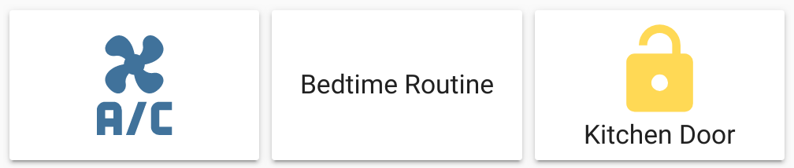
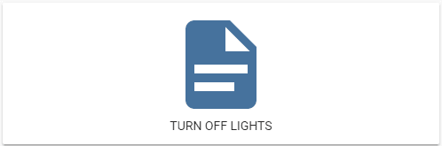
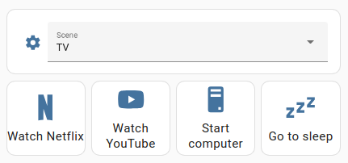

import { Pencil, EllipsisVertical } from 'lucide-react'
import { Separator } from "../../../src/components/ui/separator"

# Button card


<p className="text-xl font-semibold">
The button card allows you to add buttons to perform tasks.
</p>


<p className="text-center font-extralight">Screenshot of three button cards</p>


To add the button card to your user interface:

1. In the top right of the screen, select the edit <Pencil className='align-middle inline ' size={18}  />  button.
    - If this is your first time editing a dashboard, the **Edit dashboard** dialog appears.
        - By editing the dashboard, you are taking over control of this dashboard.
        - This means that it is no longer automatically updated when new dashboard elements become available.
        - Once you’ve taken control, you can’t get this specific dashboard back to update automatically. However, you can create a new default dashboard.
        - To continue, in the dialog, select the three dots <EllipsisVertical className='align-middle inline' size={18} />  menu, then select **Take control**.

2. [Add a card and customize actions and features](https://www.home-assistant.io/dashboards/cards/#adding-cards-to-your-dashboard) to your dashboard.

All options for this card can be configured via the user interface.

## Card settings 


<div className="bg-white p-6 rounded-2xl border border-[rgba(0,0,0,0.12)] mb-4"> 
    <div>
        <p className="m-0 pb-2" style={{margin:'0'}}> Entity </p>
        {/* <span className="text-xs text-red-400">string Required</span> */}
        <p className="text-sm text-gray-400 m-0" style={{margin:'0'}}>The entity ID the card interacts with, for example, `light.living_room`.</p>
        <Separator className="my-4" />
    </div>

    <div>
        <p className="m-0 pb-2" style={{margin:'0'}}> Name </p>
        {/* <span className="text-xs text-red-400">string Required</span> */}
        <p className="text-sm text-gray-400 m-0" style={{margin:'0'}}>The button name that is displayed on the card. If this field is left blank and the card interacts with an entity, the button name defaults to the entity name. Otherwise, no name is displayed.</p>
        <Separator className="my-4" />
    </div>

    <div>
        <p className="m-0 pb-2" style={{margin:'0'}}> Icon </p>
        {/* <span className="text-xs text-red-400">string Required</span> */}
        <p className="text-sm text-gray-400 m-0" style={{margin:'0'}}>The icon that is displayed on the card. If this field is left blank and the card interacts with an entity, the icon defaults to the entity domain icon. Otherwise, no icon is displayed.</p>
        <Separator className="my-4" />
    </div>

    <div>
        <p className="m-0 pb-2" style={{margin:'0'}}> Show Name </p>
        {/* <span className="text-xs text-red-400">string Required</span> */}
        <p className="text-sm text-gray-400 m-0" style={{margin:'0'}}>A toggle to show or hide the button name.</p>
        <Separator className="my-4" />
    </div>

    <div>
        <p className="m-0 pb-2" style={{margin:'0'}}> Show Icon </p>
        {/* <span className="text-xs text-red-400">string Required</span> */}
        <p className="text-sm text-gray-400 m-0" style={{margin:'0'}}>A toggle to show or hide the icon.</p>
        <Separator className="my-4" />
    </div>

    <div>
        <p className="m-0 pb-2" style={{margin:'0'}}> Icon Height </p>
        {/* <span className="text-xs text-red-400">string Required</span> */}
        <p className="text-sm text-gray-400 m-0" style={{margin:'0'}}>The height of the icon, in pixels.</p>
        <Separator className="my-4" />
    </div>

    <div>
        <p className="m-0 pb-2" style={{margin:'0'}}> Theme </p>
        {/* <span className="text-xs text-red-400">string Required</span> */}
        <p className="text-sm text-gray-400 m-0" style={{margin:'0'}}>Name of any loaded theme to be used for this card. For more information about themes, see the [frontend documentation](https://www.home-assistant.io/integrations/frontend/).</p>
        <Separator className="my-4" />
    </div>

    <div>
        <p className="m-0 pb-2" style={{margin:'0'}}> Tap Action </p>
        {/* <span className="text-xs text-red-400">string Required</span> */}
        <p className="text-sm text-gray-400 m-0" style={{margin:'0'}}>The action taken on card tap. For more information, see the [action documentation](https://www.home-assistant.io/dashboards/actions/#tap-action).</p>
        <Separator className="my-4" />
    </div>

    <div>
        <p className="m-0 pb-2" style={{margin:'0'}}> Hold Action </p>
        {/* <span className="text-xs text-red-400">string Required</span> */}
        <p className="text-sm text-gray-400 m-0" style={{margin:'0'}}>The action taken on card tap and hold. For more information, see the [action documentation](https://www.home-assistant.io/dashboards/actions/#hold-action).</p>
    </div>
</div>

## YAML configuration 

The following YAML options are available when you use YAML mode or just prefer to use YAML in the code editor in the UI.


<div className="bg-white p-6 rounded-2xl border border-[rgba(0,0,0,0.12)] mb-4">
#### Configuration Variables  
    <div>
        <p className="m-0 pb-2" style={{margin:'0'}}> type <span className="text-xs text-red-400">string Required</span></p>
        <p className="text-sm text-gray-400 m-0" style={{margin:'0'}}>`button`</p>
        <Separator className="my-4" />
    </div>

    <div>
        <p className="m-0 pb-2" style={{margin:'0'}}> entity <span className="text-xs text-gray-400">string (Optional)</span></p>
        <p className="text-sm text-gray-400 m-0" style={{margin:'0'}}>The entity ID the card interacts with, for example, `light.living_room`.</p>
        <Separator className="my-4" />
    </div>

    <div>
        <p className="m-0 pb-2" style={{margin:'0'}}> name <span className="text-xs text-gray-400">string (Optional, default: Entity name)</span></p>
        <p className="text-sm text-gray-400 m-0" style={{margin:'0'}}>The button name that is displayed on the card. It defaults to the entity name only if the card interacts with an entity. Otherwise, if not configured, no name is displayed.</p>
        <Separator className="my-4" />
    </div>

    <div>
        <p className="m-0 pb-2" style={{margin:'0'}}> icon <span className="text-xs text-gray-400">string (Optional, default: Entity domain icon)</span></p>
        <p className="text-sm text-gray-400 m-0" style={{margin:'0'}}>The icon that is displayed on the card. It defaults to the entity domain icon only if the card interacts with an entity. Otherwise, if not configured, no icon is displayed.</p>
        <Separator className="my-4" />
    </div>

    <div>
        <p className="m-0 pb-2" style={{margin:'0'}}> show_name <span className="text-xs text-gray-400">boolean (Optional, default: true)</span></p>
        <p className="text-sm text-gray-400 m-0" style={{margin:'0'}}>If false, the button name is not shown on the card.</p>
        <Separator className="my-4" />
    </div>

    <div>
        <p className="m-0 pb-2" style={{margin:'0'}}> show_icon <span className="text-xs text-gray-400">boolean (Optional, default: true)</span></p>
        <p className="text-sm text-gray-400 m-0" style={{margin:'0'}}>If false, the icon is not shown on the card.</p>
        <Separator className="my-4" />
    </div>

    <div>
        <p className="m-0 pb-2" style={{margin:'0'}}> show_state <span className="text-xs text-gray-400">boolean (Optional, default: false)</span></p>
        <p className="text-sm text-gray-400 m-0" style={{margin:'0'}}>Show state.</p>
        <Separator className="my-4" />
    </div>

    <div>
        <p className="m-0 pb-2" style={{margin:'0'}}> icon_height <span className="text-xs text-gray-400">string (Optional, default: auto)</span></p>
        <p className="text-sm text-gray-400 m-0" style={{margin:'0'}}>The height of the icon. Any CSS value may be used.</p>
        <Separator className="my-4" />
    </div>

    <div>
        <p className="m-0 pb-2" style={{margin:'0'}}> state_color <span className="text-xs text-gray-400">boolean (Optional, default: true)</span></p>
        <p className="text-sm text-gray-400 m-0" style={{margin:'0'}}>If false, the icon does not change color when the entity is active.</p>
        <Separator className="my-4" />
    </div>

    <div>
        <p className="m-0 pb-2" style={{margin:'0'}}> tap_action <span className="text-xs text-gray-400">map (Optional)</span></p>
        <p className="text-sm text-gray-400 m-0" style={{margin:'0'}}>The action taken on card tap. For more information, see the [action documentation](https://www.home-assistant.io/dashboards/actions/#tap-action).</p>
        <Separator className="my-4" />
    </div>

    <div>
        <p className="m-0 pb-2" style={{margin:'0'}}> hold_action <span className="text-xs text-gray-400">map (Optional)</span></p>
        <p className="text-sm text-gray-400 m-0" style={{margin:'0'}}>The action taken on card tap and hold. For more information, see the [action documentation](https://www.home-assistant.io/dashboards/actions/#tap-action).</p>
        <Separator className="my-4" />
    </div>

    <div>
        <p className="m-0 pb-2" style={{margin:'0'}}> double_tap_action <span className="text-xs text-gray-400">map (Optional)</span></p>
        <p className="text-sm text-gray-400 m-0" style={{margin:'0'}}>The action taken on card double-tap. For more information, see the [action documentation](https://www.home-assistant.io/dashboards/actions/#tap-action).</p>
        <Separator className="my-4" />
    </div>

    <div>
        <p className="m-0 pb-2" style={{margin:'0'}}> theme <span className="text-xs text-gray-400">string (Optional)</span></p>
        <p className="text-sm text-gray-400 m-0" style={{margin:'0'}}>Override the used theme for this card with any loaded theme. For more information about themes, see the [frontend documentation](https://www.home-assistant.io/integrations/frontend/).</p>
        <Separator className="my-4" />
    </div>

    <div>
        <p className="m-0 pb-2" style={{margin:'0'}}> action_name <span className="text-xs text-gray-400">string (Optional, default: Run)</span></p>
        <p className="text-sm text-gray-400 m-0" style={{margin:'0'}}>Override the default action name for a button row.</p>
    </div>
</div>

### Examples

Basic example:

```yaml
type: button
entity: light.living_room
```

Button card with a button name and a [script](https://www.home-assistant.io/docs/scripts/) that runs when card is tapped:


<p className="text-center font-extralight">Screenshot of the button card with script action</p>

```yaml
type: button
name: Turn Off Lights
show_state: false
tap_action:
  action: perform-action
  perform_action: script.turn_on
  data:
    entity_id: script.turn_off_lights
```

Example of 4 buttons on a vertical stack card:


<p className="text-center font-extralight">Screenshot of a vertical stack card with 4 buttons and an entity selector</p>

The image shows a vertical stack card with 4 buttons arranged in a horizontal stack card and an entity selector. The buttons use the toggle action to run a script, for example, the Netflix script, which starts up the TV and opens Netflix. To learn how to create scripts, refer to [scripts](https://www.home-assistant.io/docs/scripts/).

```yaml
type: vertical-stack
cards:
  - entities:
      - entity: input_select.living_room_scene
        name: Scene
    show_header_toggle: false
    type: entities
  - type: horizontal-stack
    cards:
      - name: Watch Netflix
        entity: script.netflix
        type: button
        tap_action:
          action: toggle
        hold_action:
          action: more-info
        show_name: true
        show_icon: true
      - name: Watch YouTube
        entity: script.youtube
        type: button
        tap_action:
          action: toggle
        hold_action:
          action: more-info
        show_name: true
        show_icon: true
      - name: Wake PC
        entity: script.wake_on_lan
        type: button
        tap_action:
          action: toggle
        icon: mdi:desktop-tower
        show_name: true
        show_icon: true
        show_state: false
      - name: Go to sleep
        entity: script.sleep
        type: button
        tap_action:
          action: toggle
        icon: mdi:sleep
        hold_action:
          action: more-info
        show_name: true
        show_icon: true
```

## Related topics
- [Card actions](https://www.home-assistant.io/dashboards/actions/)
- [Scripts](https://www.home-assistant.io/docs/scripts/)
- [Themes](https://www.home-assistant.io/integrations/frontend/)
- [Dashboard cards](https://www.home-assistant.io/dashboards/cards/)
