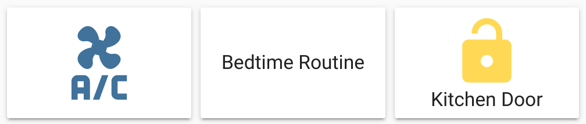
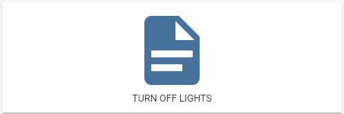
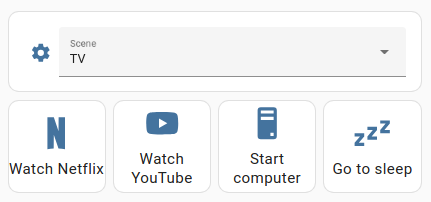

import { Pencil, EllipsisVertical } from 'lucide-react'
import { Separator } from "../../../src/components/ui/separator"

# 按钮卡片


<p className="text-xl font-semibold">
按钮卡片允许你添加按钮来执行任务。
</p>


<p className="text-center font-extralight">三个按钮卡片的截图</p>


要将按钮卡片添加到你的用户界面：

1. 在屏幕右上角，选择编辑 <Pencil className='align-middle inline ' size={18}  /> 按钮。
    - 如果这是你第一次编辑仪表板，会出现**编辑仪表板**对话框。
        - 通过编辑仪表板，你将接管这个仪表板的控制权。
        - 这意味着当新的仪表板元素可用时，它将不再自动更新。
        - 一旦你接管控制权，你将无法使这个特定的仪表板恢复为自动更新。但是，你可以创建一个新的默认仪表板。
        - 要继续，在对话框中，选择三点菜单 <EllipsisVertical className='align-middle inline' size={18} />，然后选择**接管控制**。

2. [添加卡片并自定义操作和功能](https://www.home-assistant.io/dashboards/cards/#adding-cards-to-your-dashboard) 到你的仪表板。

这个卡片的所有选项都可以通过用户界面进行配置。

## 卡片设置 


<div className="bg-white p-6 rounded-2xl border border-[rgba(0,0,0,0.12)] mb-4"> 
    <div>
        <p className="m-0 pb-2" style={{margin:'0'}}> 实体 </p>
        {/* <span className="text-xs text-red-400">string Required</span> */}
        <p className="text-sm text-gray-400 m-0" style={{margin:'0'}}>卡片交互的实体 ID，例如，`light.living_room`。</p>
        <Separator className="my-4" />
    </div>

    <div>
        <p className="m-0 pb-2" style={{margin:'0'}}> 名称 </p>
        {/* <span className="text-xs text-red-400">string Required</span> */}
        <p className="text-sm text-gray-400 m-0" style={{margin:'0'}}>显示在卡片上的按钮名称。如果此字段留空且卡片与实体交互，按钮名称默认为实体名称。否则，不显示名称。</p>
        <Separator className="my-4" />
    </div>

    <div>
        <p className="m-0 pb-2" style={{margin:'0'}}> 图标 </p>
        {/* <span className="text-xs text-red-400">string Required</span> */}
        <p className="text-sm text-gray-400 m-0" style={{margin:'0'}}>显示在卡片上的图标。如果此字段留空且卡片与实体交互，图标默认为实体域图标。否则，不显示图标。</p>
        <Separator className="my-4" />
    </div>

    <div>
        <p className="m-0 pb-2" style={{margin:'0'}}> 显示名称 </p>
        {/* <span className="text-xs text-red-400">string Required</span> */}
        <p className="text-sm text-gray-400 m-0" style={{margin:'0'}}>显示或隐藏按钮名称的开关。</p>
        <Separator className="my-4" />
    </div>

    <div>
        <p className="m-0 pb-2" style={{margin:'0'}}> 显示图标 </p>
        {/* <span className="text-xs text-red-400">string Required</span> */}
        <p className="text-sm text-gray-400 m-0" style={{margin:'0'}}>显示或隐藏图标的开关。</p>
        <Separator className="my-4" />
    </div>

    <div>
        <p className="m-0 pb-2" style={{margin:'0'}}> 图标高度 </p>
        {/* <span className="text-xs text-red-400">string Required</span> */}
        <p className="text-sm text-gray-400 m-0" style={{margin:'0'}}>图标的高度，以像素为单位。</p>
        <Separator className="my-4" />
    </div>

    <div>
        <p className="m-0 pb-2" style={{margin:'0'}}> 主题 </p>
        {/* <span className="text-xs text-red-400">string Required</span> */}
        <p className="text-sm text-gray-400 m-0" style={{margin:'0'}}>用于此卡片的任何已加载主题的名称。有关主题的更多信息，请参阅[前端文档](https://www.home-assistant.io/integrations/frontend/)。</p>
        <Separator className="my-4" />
    </div>

    <div>
        <p className="m-0 pb-2" style={{margin:'0'}}> 点击操作 </p>
        {/* <span className="text-xs text-red-400">string Required</span> */}
        <p className="text-sm text-gray-400 m-0" style={{margin:'0'}}>点击卡片时执行的操作。有关更多信息，请参阅[操作文档](https://www.home-assistant.io/dashboards/actions/#tap-action)。</p>
        <Separator className="my-4" />
    </div>

    <div>
        <p className="m-0 pb-2" style={{margin:'0'}}> 长按操作 </p>
        {/* <span className="text-xs text-red-400">string Required</span> */}
        <p className="text-sm text-gray-400 m-0" style={{margin:'0'}}>点击并按住卡片时执行的操作。有关更多信息，请参阅[操作文档](https://www.home-assistant.io/dashboards/actions/#hold-action)。</p>
    </div>
</div>

## YAML 配置 

当你使用 YAML 模式或只是更喜欢在 UI 中的代码编辑器中使用 YAML 时，以下 YAML 选项可用。


<div className="bg-white p-6 rounded-2xl border border-[rgba(0,0,0,0.12)] mb-4">
#### 配置变量  
    <div>
        <p className="m-0 pb-2" style={{margin:'0'}}> type <span className="text-xs text-red-400">字符串 必填</span></p>
        <p className="text-sm text-gray-400 m-0" style={{margin:'0'}}>`button`</p>
        <Separator className="my-4" />
    </div>

    <div>
        <p className="m-0 pb-2" style={{margin:'0'}}> entity <span className="text-xs text-gray-400">字符串 (可选)</span></p>
        <p className="text-sm text-gray-400 m-0" style={{margin:'0'}}>卡片交互的实体 ID，例如，`light.living_room`。</p>
        <Separator className="my-4" />
    </div>

    <div>
        <p className="m-0 pb-2" style={{margin:'0'}}> name <span className="text-xs text-gray-400">字符串 (可选，默认值: 实体名称)</span></p>
        <p className="text-sm text-gray-400 m-0" style={{margin:'0'}}>显示在卡片上的按钮名称。仅当卡片与实体交互时，它才默认为实体名称。否则，如果未配置，则不显示名称。</p>
        <Separator className="my-4" />
    </div>

    <div>
        <p className="m-0 pb-2" style={{margin:'0'}}> icon <span className="text-xs text-gray-400">字符串 (可选，默认值: 实体域图标)</span></p>
        <p className="text-sm text-gray-400 m-0" style={{margin:'0'}}>显示在卡片上的图标。仅当卡片与实体交互时，它才默认为实体域图标。否则，如果未配置，则不显示图标。</p>
        <Separator className="my-4" />
    </div>

    <div>
        <p className="m-0 pb-2" style={{margin:'0'}}> show_name <span className="text-xs text-gray-400">布尔值 (可选，默认值: true)</span></p>
        <p className="text-sm text-gray-400 m-0" style={{margin:'0'}}>如果为 false，则不在卡片上显示按钮名称。</p>
        <Separator className="my-4" />
    </div>

    <div>
        <p className="m-0 pb-2" style={{margin:'0'}}> show_icon <span className="text-xs text-gray-400">布尔值 (可选，默认值: true)</span></p>
        <p className="text-sm text-gray-400 m-0" style={{margin:'0'}}>如果为 false，则不在卡片上显示图标。</p>
        <Separator className="my-4" />
    </div>

    <div>
        <p className="m-0 pb-2" style={{margin:'0'}}> show_state <span className="text-xs text-gray-400">布尔值 (可选，默认值: false)</span></p>
        <p className="text-sm text-gray-400 m-0" style={{margin:'0'}}>显示状态。</p>
        <Separator className="my-4" />
    </div>

    <div>
        <p className="m-0 pb-2" style={{margin:'0'}}> icon_height <span className="text-xs text-gray-400">字符串 (可选，默认值: auto)</span></p>
        <p className="text-sm text-gray-400 m-0" style={{margin:'0'}}>图标的高度。可以使用任何 CSS 值。</p>
        <Separator className="my-4" />
    </div>

    <div>
        <p className="m-0 pb-2" style={{margin:'0'}}> state_color <span className="text-xs text-gray-400">布尔值 (可选，默认值: true)</span></p>
        <p className="text-sm text-gray-400 m-0" style={{margin:'0'}}>如果为 false，则当实体激活时图标不会改变颜色。</p>
        <Separator className="my-4" />
    </div>

    <div>
        <p className="m-0 pb-2" style={{margin:'0'}}> tap_action <span className="text-xs text-gray-400">映射 (可选)</span></p>
        <p className="text-sm text-gray-400 m-0" style={{margin:'0'}}>点击卡片时执行的操作。有关更多信息，请参阅[操作文档](https://www.home-assistant.io/dashboards/actions/#tap-action)。</p>
        <Separator className="my-4" />
    </div>

    <div>
        <p className="m-0 pb-2" style={{margin:'0'}}> hold_action <span className="text-xs text-gray-400">映射 (可选)</span></p>
        <p className="text-sm text-gray-400 m-0" style={{margin:'0'}}>点击并按住卡片时执行的操作。有关更多信息，请参阅[操作文档](https://www.home-assistant.io/dashboards/actions/#tap-action)。</p>
        <Separator className="my-4" />
    </div>

    <div>
        <p className="m-0 pb-2" style={{margin:'0'}}> double_tap_action <span className="text-xs text-gray-400">映射 (可选)</span></p>
        <p className="text-sm text-gray-400 m-0" style={{margin:'0'}}>双击卡片时执行的操作。有关更多信息，请参阅[操作文档](https://www.home-assistant.io/dashboards/actions/#tap-action)。</p>
        <Separator className="my-4" />
    </div>

    <div>
        <p className="m-0 pb-2" style={{margin:'0'}}> theme <span className="text-xs text-gray-400">字符串 (可选)</span></p>
        <p className="text-sm text-gray-400 m-0" style={{margin:'0'}}>使用任何已加载的主题覆盖此卡片使用的主题。有关主题的更多信息，请参阅[前端文档](https://www.home-assistant.io/integrations/frontend/)。</p>
        <Separator className="my-4" />
    </div>

    <div>
        <p className="m-0 pb-2" style={{margin:'0'}}> action_name <span className="text-xs text-gray-400">字符串 (可选，默认值: Run)</span></p>
        <p className="text-sm text-gray-400 m-0" style={{margin:'0'}}>覆盖按钮行的默认操作名称。</p>
    </div>
</div>

### 示例

基本示例：

```yaml
type: button
entity: light.living_room
```

带有按钮名称和点击卡片时运行的[脚本](https://www.home-assistant.io/docs/scripts/)的按钮卡片：


<p className="text-center font-extralight">带有脚本操作的按钮卡片截图</p>

```yaml
type: button
name: Turn Off Lights
show_state: false
tap_action:
  action: perform-action
  perform_action: script.turn_on
  data:
    entity_id: script.turn_off_lights
```

垂直堆叠卡片上 4 个按钮的示例：


<p className="text-center font-extralight">带有 4 个按钮和实体选择器的垂直堆叠卡片截图</p>

图片显示了一个垂直堆叠卡片，其中包含排列在水平堆叠卡片中的 4 个按钮和一个实体选择器。这些按钮使用切换操作来运行脚本，例如 Netflix 脚本，它会启动电视并打开 Netflix。要了解如何创建脚本，请参阅[脚本](https://www.home-assistant.io/docs/scripts/)。

```yaml
type: vertical-stack
cards:
  - entities:
      - entity: input_select.living_room_scene
        name: Scene
    show_header_toggle: false
    type: entities
  - type: horizontal-stack
    cards:
      - name: Watch Netflix
        entity: script.netflix
        type: button
        tap_action:
          action: toggle
        hold_action:
          action: more-info
        show_name: true
        show_icon: true
      - name: Watch YouTube
        entity: script.youtube
        type: button
        tap_action:
          action: toggle
        hold_action:
          action: more-info
        show_name: true
        show_icon: true
      - name: Wake PC
        entity: script.wake_on_lan
        type: button
        tap_action:
          action: toggle
        icon: mdi:desktop-tower
        show_name: true
        show_icon: true
        show_state: false
      - name: Go to sleep
        entity: script.sleep
        type: button
        tap_action:
          action: toggle
        icon: mdi:sleep
        hold_action:
          action: more-info
        show_name: true
        show_icon: true
```

## 相关主题
- [卡片操作](/docs/documentation/dashboards/actions)
- [脚本](https://www.home-assistant.io/docs/scripts/)
- [主题](https://www.home-assistant.io/integrations/frontend/)
- [仪表板卡片](https://www.home-assistant.io/dashboards/cards/)
