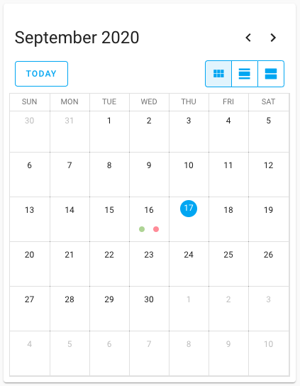

# Calendar card

import { Pencil, EllipsisVertical } from 'lucide-react'
import { Separator } from "../../../src/components/ui/separator"


<p className="text-xl font-semibold">
The calendar card displays your [calendar](https://www.home-assistant.io/integrations/#calendar) entities in a month, day, and list view (7 days).
</p>


<p className="text-center font-extralight">Screenshot of the calendar card.</p>

To add the calendar card to your user interface:

1. In the top right of the screen, select the edit <Pencil className='align-middle inline ' size={18}  />  button.
    - If this is your first time editing a dashboard, the **Edit dashboard** dialog appears.
        - By editing the dashboard, you are taking over control of this dashboard.
        - This means that it is no longer automatically updated when new dashboard elements become available.
        - Once you’ve taken control, you can’t get this specific dashboard back to update automatically. However, you can create a new default dashboard.
        - To continue, in the dialog, select the three dots <EllipsisVertical className='align-middle inline' size={18} />  menu, then select **Take control**.

2. [Add a card and customize actions and features](https://www.home-assistant.io/dashboards/cards/#adding-cards-to-your-dashboard) to your dashboard.

All options for this card can be configured via the user interface.

## YAML configuration 

The following YAML options are available when you use YAML mode or just prefer to use YAML in the code editor in the UI.


<div className="bg-white p-6 rounded-2xl border border-[rgba(0,0,0,0.12)] mb-4">
#### Configuration Variables  
    <div>
        <p className="m-0 pb-2" style={{margin:'0'}}> type <span className="text-xs text-red-400">string Required</span></p>
        <p className="text-sm text-gray-400 m-0" style={{margin:'0'}}>`calendar`</p>
        <Separator className="my-4" />
    </div>

    <div>
        <p className="m-0 pb-2" style={{margin:'0'}}> title <span className="text-xs text-gray-400">string (Optional)</span></p>
        <p className="text-sm text-gray-400 m-0" style={{margin:'0'}}>The title of the card.</p>
        <Separator className="my-4" />
    </div>

    <div>
        <p className="m-0 pb-2" style={{margin:'0'}}> initial_view <span className="text-xs text-gray-400">string (Optional)</span></p>
        <p className="text-sm text-gray-400 m-0" style={{margin:'0'}}>The view that will show first when the card is loaded onto the page. Options are `dayGridMonth`, `dayGridDay`, and `listWeek`. Note that `listWeek` does show the next 7 days, not a calendar week.</p>
        <Separator className="my-4" />
    </div>

    <div>
        <p className="m-0 pb-2" style={{margin:'0'}}> entities <span className="text-xs text-red-400">list Required</span></p>
        <p className="text-sm text-gray-400 m-0" style={{margin:'0'}}>A list of calendar entities that will be displayed in the card.</p>
        <Separator className="my-4" />
    </div>

        <div>
        <p className="m-0 pb-2" style={{margin:'0'}}> theme <span className="text-xs text-gray-400">string (Optional)</span></p>
        <p className="text-sm text-gray-400 m-0" style={{margin:'0'}}>Override the used theme for this card with any loaded theme. For more information about themes, see the [frontend documentation](https://www.home-assistant.io/integrations/frontend/).</p>
    </div>
</div>

### Examples

```yaml
type: calendar
entities:
  - calendar.calendar_1
  - calendar.calendar_2
```

## Related topics
- [Themes](https://www.home-assistant.io/integrations/frontend/)
- [Dashboard cards](https://www.home-assistant.io/dashboards/cards/)