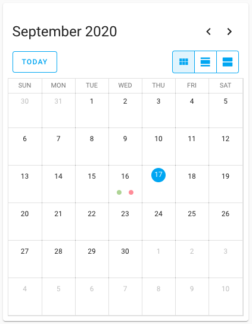

# 日历卡片

import { Pencil, EllipsisVertical } from 'lucide-react'
import { Separator } from "../../../src/components/ui/separator"


<p className="text-xl font-semibold">
日历卡片以月视图、日视图和列表视图（7天）显示你的 [日历](https://www.home-assistant.io/integrations/#calendar) 实体。
</p>


<p className="text-center font-extralight">日历卡片的截图。</p>

要将日历卡片添加到你的用户界面：

1. 在屏幕右上角，选择编辑 <Pencil className='align-middle inline ' size={18}  /> 按钮。
    - 如果这是你第一次编辑仪表板，会出现**编辑仪表板**对话框。
        - 通过编辑仪表板，你将接管这个仪表板的控制权。
        - 这意味着当新的仪表板元素可用时，它将不再自动更新。
        - 一旦你接管控制权，你将无法使这个特定的仪表板恢复为自动更新。但是，你可以创建一个新的默认仪表板。
        - 要继续，在对话框中，选择三点菜单 <EllipsisVertical className='align-middle inline' size={18} />，然后选择**接管控制**。

2. [添加卡片并自定义操作和功能](https://www.home-assistant.io/dashboards/cards/#adding-cards-to-your-dashboard) 到你的仪表板。

这个卡片的所有选项都可以通过用户界面进行配置。

## YAML 配置 

当你使用 YAML 模式或只是更喜欢在 UI 中的代码编辑器中使用 YAML 时，以下 YAML 选项可用。


<div className="bg-white p-6 rounded-2xl border border-[rgba(0,0,0,0.12)] mb-4">
#### 配置变量  
    <div>
        <p className="m-0 pb-2" style={{margin:'0'}}> type <span className="text-xs text-red-400">字符串 必填</span></p>
        <p className="text-sm text-gray-400 m-0" style={{margin:'0'}}>`calendar`</p>
        <Separator className="my-4" />
    </div>

    <div>
        <p className="m-0 pb-2" style={{margin:'0'}}> title <span className="text-xs text-gray-400">字符串 (可选)</span></p>
        <p className="text-sm text-gray-400 m-0" style={{margin:'0'}}>卡片的标题。</p>
        <Separator className="my-4" />
    </div>

    <div>
        <p className="m-0 pb-2" style={{margin:'0'}}> initial_view <span className="text-xs text-gray-400">字符串 (可选)</span></p>
        <p className="text-sm text-gray-400 m-0" style={{margin:'0'}}>卡片加载到页面上时首先显示的视图。选项有 `dayGridMonth`、`dayGridDay` 和 `listWeek`。注意，`listWeek` 显示的是接下来的 7 天，而不是日历周。</p>
        <Separator className="my-4" />
    </div>

    <div>
        <p className="m-0 pb-2" style={{margin:'0'}}> entities <span className="text-xs text-red-400">列表 必填</span></p>
        <p className="text-sm text-gray-400 m-0" style={{margin:'0'}}>将在卡片中显示的日历实体列表。</p>
        <Separator className="my-4" />
    </div>

        <div>
        <p className="m-0 pb-2" style={{margin:'0'}}> theme <span className="text-xs text-gray-400">字符串 (可选)</span></p>
        <p className="text-sm text-gray-400 m-0" style={{margin:'0'}}>使用任何已加载的主题覆盖此卡片使用的主题。有关主题的更多信息，请参阅 [前端文档](https://www.home-assistant.io/integrations/frontend/)。</p>
    </div>
</div>

### 示例

```yaml
type: calendar
entities:
  - calendar.calendar_1
  - calendar.calendar_2
```

## 相关主题
- [主题](https://www.home-assistant.io/integrations/frontend/)
- [仪表板卡片](https://www.home-assistant.io/dashboards/cards/)