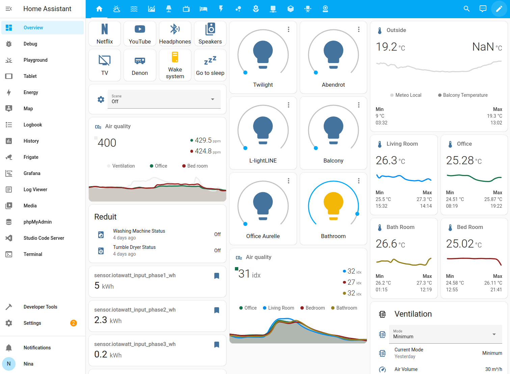
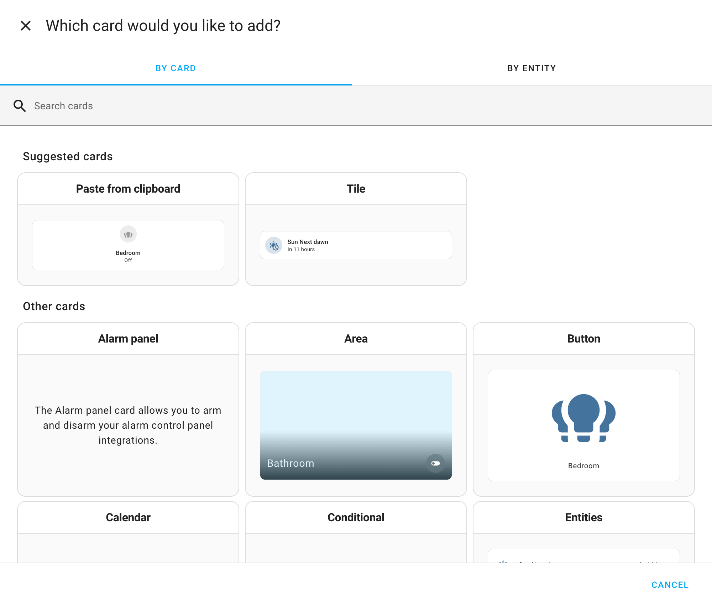
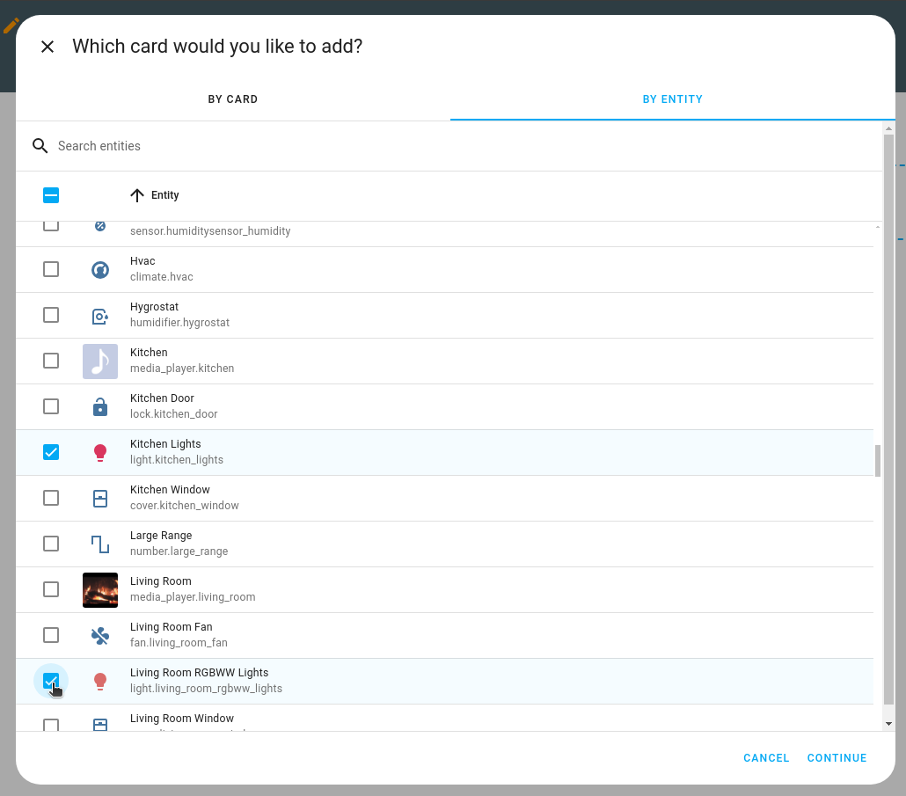
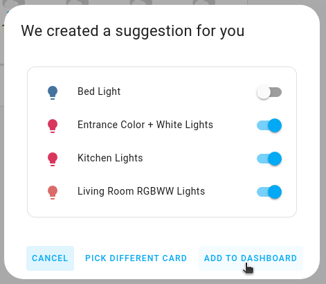
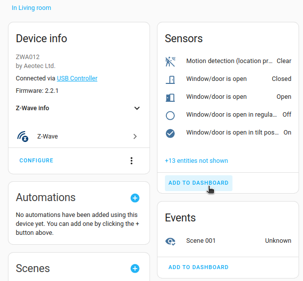
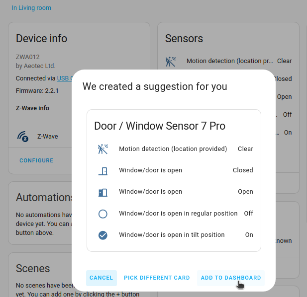
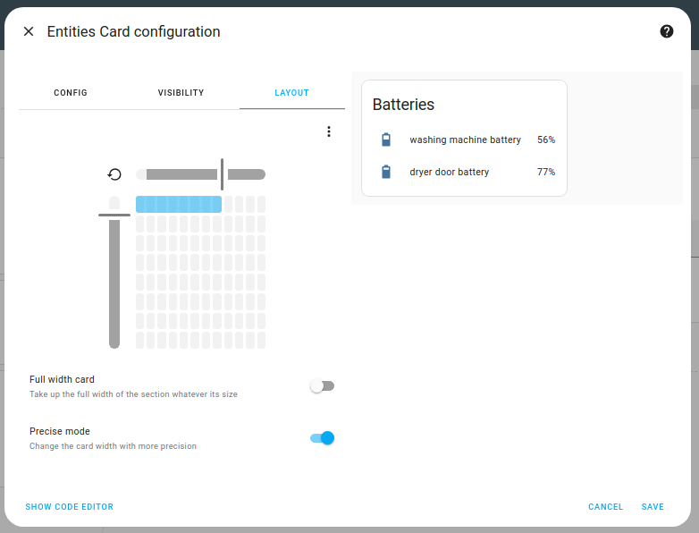
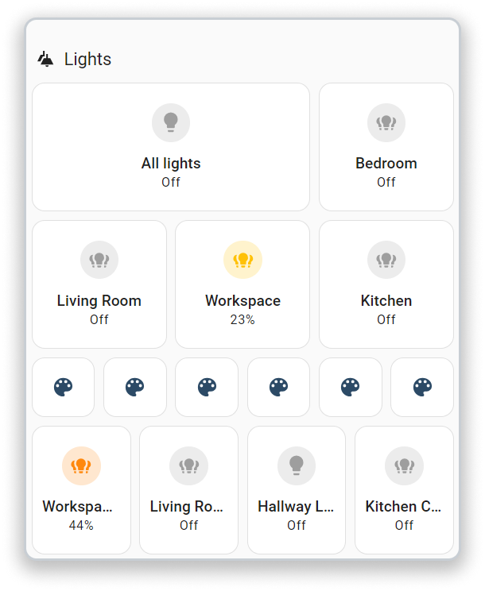
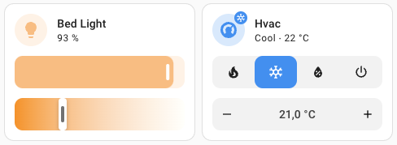
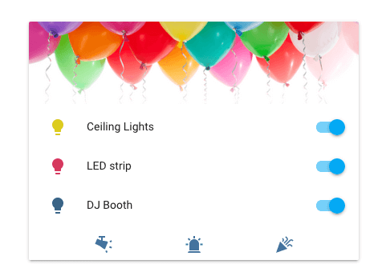

# Cards
import { RotateCcw } from 'lucide-react'

Each dashboard is made up of cards.

Screenshot of the masonry view with different types of cards.

## Card categories 

There are several different card types, each with their own configuration options. They can be categorized in terms of their function:

- **Specific to a device type or service**: alarm, light, humidifier, thermostat, plant status, media control, weather forecast, to-do list, map, logbook, calendar
- **Grouping other cards**: vertical stack, horizontal stack, grid
- **Logic function**: conditional, entity filter
- **Display generic data**: sensor, history graph, statistic, statistics graph, energy, gauge, webpage
- **Control devices and entities**: button, entity
- **Display data and control entities**: area, picture elements, picture glance

## Adding cards to your dashboard 

A card can be added to a dashboard directly [from the view](https://www.home-assistant.io/dashboards/cards/#to-add-a-card-from-a-view) where you want to add it, or from the [device page](https://www.home-assistant.io/dashboards/cards/#to-add-a-card-from-the-device-page).

### To add a card from a view 

1. In the bottom right of the view, select **Add card**.

2. There are two methods to add a card:
    - If you have an idea of what card type you want to use for an entity, add `By card` type:
        - Browse the list of available cards.
        - If you are using the `Sections` view, try the `Tile` card in the `Suggested cards` section. 
            
    - If you want to add cards for multiple entities at once, select **By entity**.
        - Select the entities from the list.
        - Then, select **Continue**. 
            

3. If you want this card to be visible only to specific users or under a certain condition, you can [define those conditions](https://www.home-assistant.io/dashboards/cards/#showing-or-hiding-a-card-or-badge-conditionally).

4. If you are adding this card to a [sections view](https://www.home-assistant.io/dashboards/sections/), on the **Layout** tab, you can [resize the card](https://www.home-assistant.io/dashboards/cards/#resizing-a-card).

5. Customize your card:
    - [define card actions](https://www.home-assistant.io/dashboards/actions/).
    - [define header and footer](https://www.home-assistant.io/dashboards/header-footer/)
    - [customize features](https://www.home-assistant.io/dashboards/features/#customizing-features).
    - Not all cards support these elements. Refer to the documentation of the specific card type.

6. Select **Add to dashboard**.
    

### To add a card from the device page 

This method is useful if you are on the **Device** page and want to create a card directly from there.

1. Go to [Settings > Devices & services](https://my.home-assistant.io/redirect/integrations).

2. On the integration card of interest, select `Devices`.
    - If there are multiple devices, select the device from the list.
3. Add the card:
    - Find the area of interest, for example **Sensors**, or **Events** and **select Add to Dashboard**. 
        
4. In the dialog, select the target dashboard and if you have multiple views, select the view.
    - Select **Next**.
    - If you like the card proposal, select **Add to dashboard**.
    - If you want to change the card, **Pick different card** and choose your card type.
    - **Result**: The card is added to the selected view. 
        

5. To edit the card configuration, open the view to which you added the card.
    - Select **Edit card**.

6. If you want this card to be visible only to specific users or under a certain condition, you can [define those conditions](https://www.home-assistant.io/dashboards/cards/#showing-or-hiding-a-card-or-badge-conditionally).

7. If you are adding this card to a [sections view](https://www.home-assistant.io/dashboards/sections/), on the **Layout** tab, you can [resize the card](https://www.home-assistant.io/dashboards/cards/#resizing-a-card).

8. Customize your card:

    - [define card actions or header and footer widgets](https://www.home-assistant.io/dashboards/cards/#card-actions-features-header-and-footer-widgets).
    - [define header and footer](https://www.home-assistant.io/dashboards/header-footer/)
    - [customize features](https://www.home-assistant.io/dashboards/features/#customizing-features).
    - Not all cards support these elements. Refer to the documentation of the specific card type.

## Showing or hiding a card or badge conditionally 

You can choose to show or hide certain cards or [badges](https://www.home-assistant.io/dashboards/badges/) based on different conditions. The [available conditions](https://www.home-assistant.io/dashboards/conditional/#card-conditions) are the same as the ones for the conditional card.

1. On the **Visibility** tab, select **Add condition**./dashboards/conditional/#conditions-options
    - **Troubleshooting**: Don’t see a **Visibility** tab?
        - It is not available inside nested cards: vertical stack, horizontal stack, and grid card

2. Select the type of condition, and enter the parameters.
    - The [available conditions](https://www.home-assistant.io/dashboards/conditional/#conditions-options) are the same as the ones for the conditional card.
    - If you define multiple conditions, the section is only shown when all conditions are met.
    - If you did not define any conditions, the section is always shown, to all users.

3. Select **Save**.

## Resizing a card 

In [sections view](https://www.home-assistant.io/dashboards/sections/), you can resize cards. Follow these steps:

1. On the **Layout** tab, move the sliders to adjust the card size. 
    
    - **Troubleshooting**: Don’t see a **Layout** tab?
        - It is not available inside nested cards: vertical stack, horizontal stack, and grid card
        - It is not available on the picture elements card.

2. **Precise mode** gives you a finer grid to size your card. The last row was done using precise mode. 
    

3. Select **Save**.

## Revert resizing of a card 

If you previously [resized](https://www.home-assistant.io/dashboards/cards/#resizing-a-card) a card in the [sections view](https://www.home-assistant.io/dashboards/sections/), and you don’t like the new size, you can revert back to the card’s default size. Follow these steps:

1. On the **Layout** tab, select the <RotateCcw className='align-middle inline' size={18} />  icon.
    

2. Select **Save**.

## Card actions, features, header and footer widgets 

Some cards have support for [tap actions](https://www.home-assistant.io/dashboards/actions/). These actions define what will happen when you tap or hold on an object within a card.

Some cards have support for [features](https://www.home-assistant.io/dashboards/features/). These widgets add quick controls to the card. Supported features depend on the card and entity capabilities. Multiple features can be added to a single card.

Screenshot of tile cards with features.

Some cards have support for [header and footer widgets](https://www.home-assistant.io/dashboards/header-footer/). These widgets fill up the entire available space in a card.

Screenshot of an entities card with a picture header and buttons footer.

## Related topics
- [Card tap actions](https://www.home-assistant.io/dashboards/actions/)
- [Card features](https://www.home-assistant.io/dashboards/features/)
- [Card header and footer widgets](https://www.home-assistant.io/dashboards/header-footer/)
- [Views](https://www.home-assistant.io/dashboards/views/)
- [Introduction to dashboards](https://www.home-assistant.io/dashboards/)
- [Take control of the default dashboard](https://www.home-assistant.io/dashboards/#get-started-with-your-own-dashboard/)

