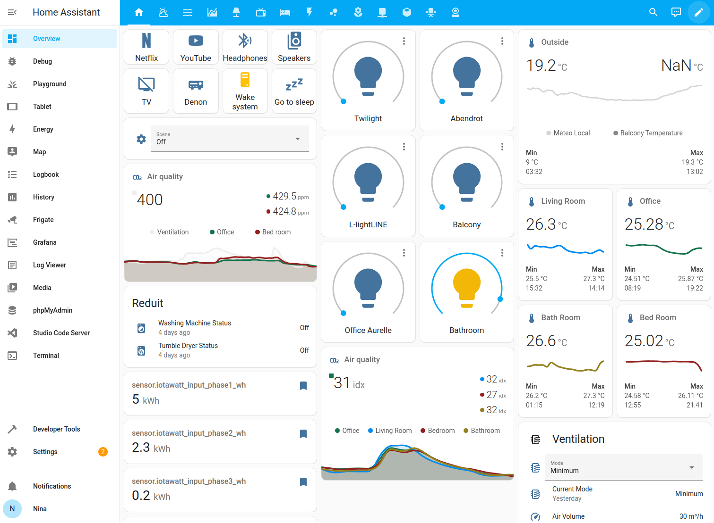
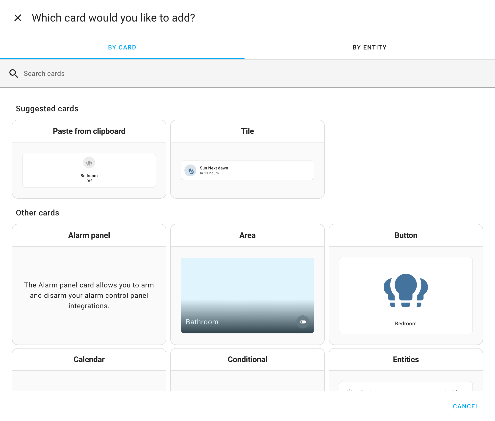
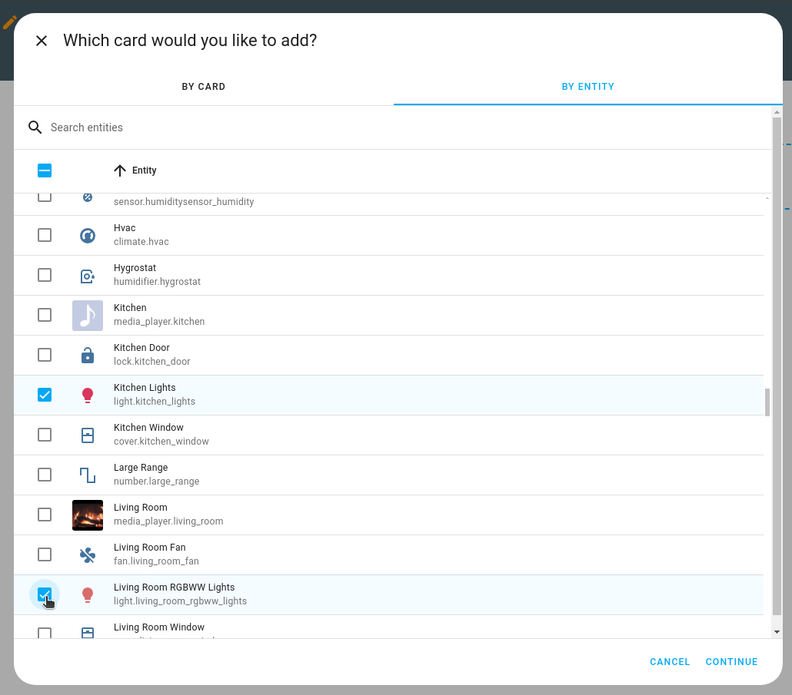
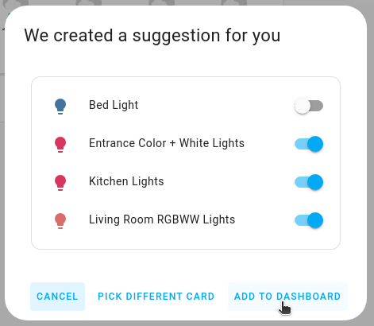
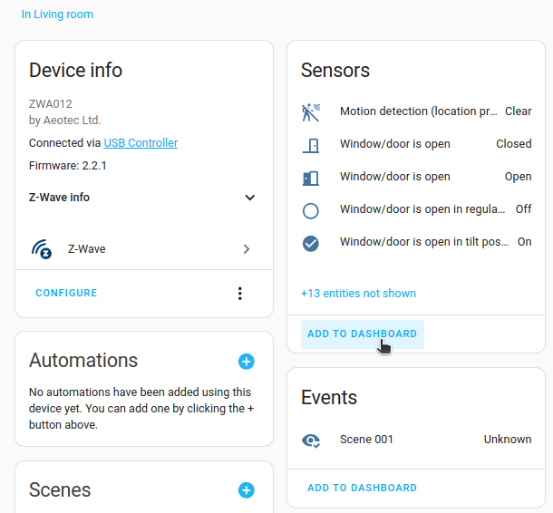
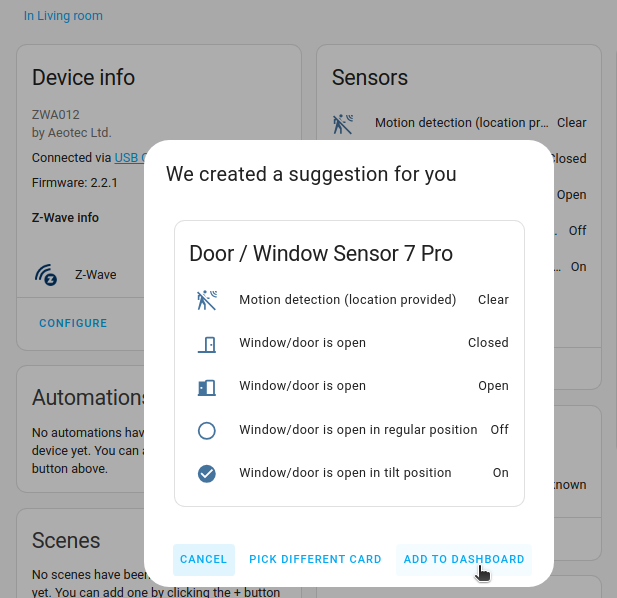
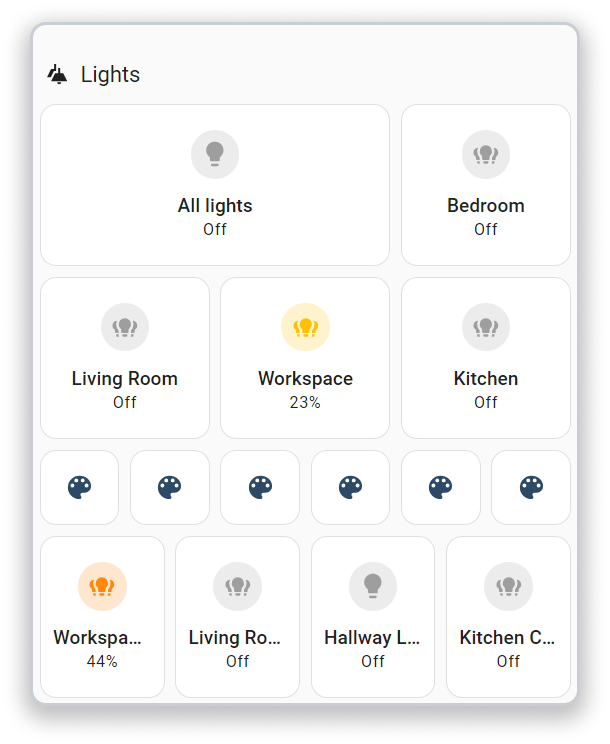
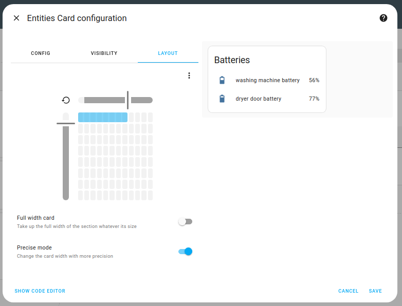
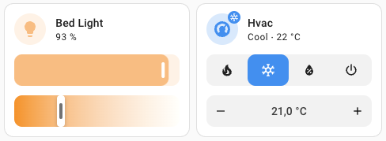
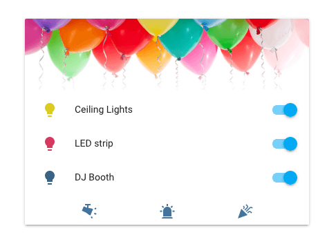

# 卡片
import { RotateCcw } from 'lucide-react'

每个仪表板都由卡片组成。

不同类型卡片的砌体视图截图。

## 卡片分类 

有几种不同的卡片类型，每种都有自己的配置选项。它们可以按照功能进行分类：

- **特定于设备类型或服务**：警报、灯光、加湿器、恒温器、植物状态、媒体控制、天气预报、待办事项列表、地图、日志、日历
- **组合其他卡片**：垂直堆叠、水平堆叠、网格
- **逻辑功能**：条件、实体过滤器
- **显示通用数据**：传感器、历史图表、统计、统计图表、能源、仪表、网页
- **控制设备和实体**：按钮、实体
- **显示数据和控制实体**：区域、图片元素、图片概览

## 添加卡片到你的仪表板 

卡片可以直接从你想要添加它的[视图](https://www.home-assistant.io/dashboards/cards/#to-add-a-card-from-a-view)添加到仪表板，或者从[设备页面](https://www.home-assistant.io/dashboards/cards/#to-add-a-card-from-the-device-page)添加。

### 从视图添加卡片 

1. 在视图的右下角，选择**添加卡片**。

2. 有两种方法可以添加卡片：
    - 如果你知道想要为实体使用什么卡片类型，通过 `按卡片` 类型添加：
        - 浏览可用卡片列表。
        - 如果你使用的是 `分区` 视图，请尝试 `建议卡片` 部分中的 `磁贴` 卡片。 
            
    - 如果你想一次为多个实体添加卡片，选择**按实体**。
        - 从列表中选择实体。
        - 然后，选择**继续**。 
            

3. 如果你希望此卡片仅对特定用户可见或在特定条件下可见，你可以[定义这些条件](/docs/documentation/dashboards/cards#有条件地显示或隐藏卡片或徽章)。

4. 如果你将此卡片添加到[分区视图](/docs/documentation/dashboards/sections)，在**布局**选项卡上，你可以[调整卡片大小](/docs/documentation/dashboards/cards#调整卡片大小)。

5. 自定义你的卡片：
    - [定义卡片操作](/docs/documentation/dashboards/actions)。
    - [定义页眉和页脚](/docs/documentation/dashboards/header-footer)
    - [自定义功能](/docs/documentation/dashboards/features)。
    - 并非所有卡片都支持这些元素。请参阅特定卡片类型的文档。

6. 选择**添加到仪表板**。
    

### 从设备页面添加卡片 

如果你在**设备**页面上并且想直接从那里创建卡片，这种方法很有用。

1. 前往[设置 > 设备和服务](https://my.home-assistant.io/redirect/integrations)。

2. 在感兴趣的集成卡片上，选择 `设备`。
    - 如果有多个设备，从列表中选择设备。
3. 添加卡片：
    - 找到感兴趣的区域，例如**传感器**或**事件**，然后**选择添加到仪表板**。 
        
4. 在对话框中，选择目标仪表板，如果你有多个视图，选择视图。
    - 选择**下一步**。
    - 如果你喜欢卡片建议，选择**添加到仪表板**。
    - 如果你想更改卡片，**选择不同的卡片**并选择你的卡片类型。
    - **结果**：卡片已添加到所选视图。 
        

5. 要编辑卡片配置，打开你添加卡片的视图。
    - 选择**编辑卡片**。

6. 如果你希望此卡片仅对特定用户可见或在特定条件下可见，你可以[定义这些条件](/docs/documentation/dashboards/cards#有条件地显示或隐藏卡片或徽章)。

7. 如果你将此卡片添加到[分区视图](/docs/documentation/dashboards/sections)，在**布局**选项卡上，你可以[调整卡片大小](/docs/documentation/dashboards/cards#调整卡片大小)。

8. 自定义你的卡片：
    - [定义卡片操作](/docs/documentation/dashboards/actions)。
    - [定义页眉和页脚](/docs/documentation/dashboards/header-footer)
    - [自定义功能](/docs/documentation/dashboards/features)。
    - 并非所有卡片都支持这些元素。请参阅特定卡片类型的文档。

## 有条件地显示或隐藏卡片或徽章 

你可以根据不同的条件选择显示或隐藏某些卡片或[徽章](/docs/documentation/dashboards/badges)。[可用条件](/docs/documentation/dashboards/conditional)与条件卡片的条件相同。

1. 在**可见性**选项卡上，选择**添加条件**。
    - **故障排除**：看不到**可见性**选项卡？
        - 在嵌套卡片中不可用：垂直堆叠、水平堆叠和网格卡片

2. 选择条件类型，并输入参数。
    - [可用条件](/docs/documentation/dashboards/conditional#条件选项)与条件卡片的条件相同。
    - 如果你定义了多个条件，只有在满足所有条件时才会显示该部分。
    - 如果你没有定义任何条件，该部分始终显示给所有用户。

3. 选择**保存**。

## 调整卡片大小 

在[分区视图](/docs/documentation/dashboards/sections)中，你可以调整卡片大小。按照以下步骤操作：

1. 在**布局**选项卡上，移动滑块来调整卡片大小。 
    
    - **故障排除**：看不到**布局**选项卡？
        - 在嵌套卡片中不可用：垂直堆叠、水平堆叠和网格卡片
        - 在图片元素卡片上不可用。

2. **精确模式**为你提供更精细的网格来调整卡片大小。最后一行是使用精确模式完成的。 
    

3. 选择**保存**。

## 恢复卡片大小 

如果你之前在[分区视图](/docs/documentation/dashboards/sections)中[调整了](/docs/documentation/dashboards/cards#调整卡片大小)卡片大小，并且你不喜欢新的大小，你可以恢复到卡片的默认大小。按照以下步骤操作：

1. 在**布局**选项卡上，选择 <RotateCcw className='align-middle inline' size={18} /> 图标。
    

2. 选择**保存**。

## 卡片操作、功能、页眉和页脚小部件 

一些卡片支持[点击操作](/docs/documentation/dashboards/actions)。这些操作定义了当你点击或按住卡片内的对象时会发生什么。

一些卡片支持[功能](/docs/documentation/dashboards/features)。这些小部件为卡片添加了快速控制。支持的功能取决于卡片和实体功能。单个卡片可以添加多个功能。

带有功能的磁贴卡片截图。

一些卡片支持[页眉和页脚小部件](/docs/documentation/dashboards/header-footer)。这些小部件填满卡片中的所有可用空间。

带有图片页眉和按钮页脚的实体卡片截图。

## 相关主题
- [卡片点击操作](/docs/documentation/dashboards/actions)
- [卡片功能](/docs/documentation/dashboards/features)
- [卡片页眉和页脚小部件](/docs/documentation/dashboards/header-footer)
- [视图](/docs/documentation/dashboards/views)
- [仪表板介绍](https://www.home-assistant.io/dashboards/)
- [接管默认仪表板](/docs/documentation/dashboards/)

