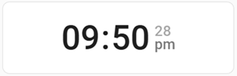
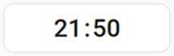
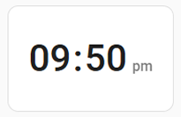
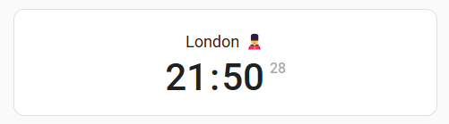
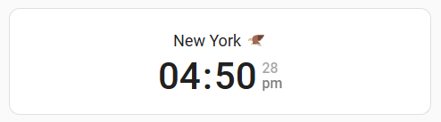

import { Pencil, EllipsisVertical } from 'lucide-react'
import { Separator } from "../../../src/components/ui/separator"

# Clock card

<p className="text-xl font-semibold">
The Clock card shows the current time in a variety of formats, sizes and time zones.
</p>


<p className="text-center font-extralight">Screenshot of the clock card</p>

To add the clock card to your user interface:

1. In the top right of the screen, select the edit <Pencil className='align-middle inline ' size={18}  />  button.
    - If this is your first time editing a dashboard, the **Edit dashboard** dialog appears.
        - By editing the dashboard, you are taking over control of this dashboard.
        - This means that it is no longer automatically updated when new dashboard elements become available.
        - Once you’ve taken control, you can’t get this specific dashboard back to update automatically. However, you can create a new default dashboard.
        - To continue, in the dialog, select the three dots <EllipsisVertical className='align-middle inline' size={18} />  menu, then select **Take control**.

2. [Add a card and customize actions and features](https://www.home-assistant.io/dashboards/cards/#adding-cards-to-your-dashboard) to your dashboard.

All options for this card can be configured via the user interface.

## Card settings 


<div className="bg-white p-6 rounded-2xl border border-[rgba(0,0,0,0.12)] mb-4"> 
    <div>
        <p className="m-0 pb-2" style={{margin:'0'}}> Title </p>
        <p className="text-sm text-gray-400 m-0" style={{margin:'0'}}>Adds a title to the top of the card</p>
        <Separator className="my-4" />
    </div>

    <div>
        <p className="m-0 pb-2" style={{margin:'0'}}> Clock Size </p>
        <p className="text-sm text-gray-400 m-0" style={{margin:'0'}}>Adjusts the size of the text allowing a wider range of use with different types of dashboards. Defaults to small.</p>
        <Separator className="my-4" />
    </div>

    <div>
        <p className="m-0 pb-2" style={{margin:'0'}}> Display Seconds </p>
        <p className="text-sm text-gray-400 m-0" style={{margin:'0'}}>Shows seconds alongside the clock, providing the time format is in a 12-hour format.</p>
        <Separator className="my-4" />
    </div>

    <div>
        <p className="m-0 pb-2" style={{margin:'0'}}> Time Format </p>
        <p className="text-sm text-gray-400 m-0" style={{margin:'0'}}>Allows the time format to be changed on a per-card level. Defaults to the user profile setting.</p>
        <Separator className="my-4" />
    </div>

    <div>
        <p className="m-0 pb-2" style={{margin:'0'}}> Time Zone </p>
        <p className="text-sm text-gray-400 m-0" style={{margin:'0'}}>Change the timezone used for the time on a per-card level. Defaults to the user profile setting.</p>
        {/* <Separator className="my-4" /> */}
    </div>

</div>

### Examples

Basic example:

```yaml
type: clock
```


<p className="text-center font-extralight">Screenshot of the basic clock card</p>

Example of a larger clock card for tablet dashboards:

```yaml
type: clock
clock_size: large
time_format: "12"
show_seconds: true
```


<p className='text-center font-extralight'>Screenshot of a large sized, 12 hour clock card showing am/pm and seconds</p>

A medium-sized clock card better suited for desktop dashboards:

```yaml
type: clock
clock_size: medium
time_format: "12"
show_seconds: false
```


<p className='text-center font-extralight'>Screenshot of a medium sized, 12 hour clock showing am/pm</p>

A medium-sized, 24 hour clock using the London timezone with a title

```yaml
type: clock
clock_size: medium
time_zone: Europe/London
title: London 💂
```


<p className='text-center font-extralight'>Screenshot of a medium sized, 24 hour clock showing seconds based in London along with a title</p>

A medium-sized, 12 hour clock using the New York timezone with a title

```yaml
type: clock
clock_size: medium
time_format: "12"
time_zone: America/New_York
title: New York 🦅
```


<p className='text-center font-extralight'>Screenshot of a medium sized, 12 hour clock showing am/pm and seconds based in New York along with a title</p>

## Related topics
- [Setup your time format and timezone](https://www.home-assistant.io/docs/frontend/#user--or-browser-dependent-settings)

