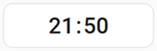
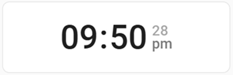
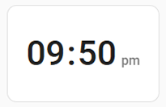
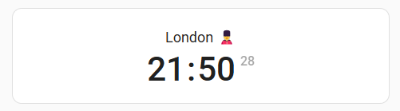
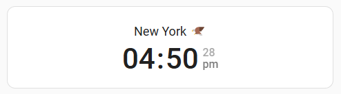

import { Pencil, EllipsisVertical } from 'lucide-react'
import { Separator } from "../../../src/components/ui/separator"

# 时钟卡片

<p className="text-xl font-semibold">
时钟卡片以各种格式、大小和时区显示当前时间。
</p>


<p className="text-center font-extralight">时钟卡片的截图</p>

要将时钟卡片添加到你的用户界面：

1. 在屏幕右上角，选择编辑 <Pencil className='align-middle inline ' size={18}  /> 按钮。
    - 如果这是你第一次编辑仪表板，会出现**编辑仪表板**对话框。
        - 通过编辑仪表板，你将接管这个仪表板的控制权。
        - 这意味着当新的仪表板元素可用时，它将不再自动更新。
        - 一旦你接管控制权，你将无法使这个特定的仪表板恢复为自动更新。但是，你可以创建一个新的默认仪表板。
        - 要继续，在对话框中，选择三点菜单 <EllipsisVertical className='align-middle inline' size={18} />，然后选择**接管控制**。

2. [添加卡片并自定义操作和功能](https://www.home-assistant.io/dashboards/cards/#adding-cards-to-your-dashboard) 到你的仪表板。

这个卡片的所有选项都可以通过用户界面进行配置。

## 卡片设置 


<div className="bg-white p-6 rounded-2xl border border-[rgba(0,0,0,0.12)] mb-4"> 
    <div>
        <p className="m-0 pb-2" style={{margin:'0'}}> 标题 </p>
        <p className="text-sm text-gray-400 m-0" style={{margin:'0'}}>在卡片顶部添加标题</p>
        <Separator className="my-4" />
    </div>

    <div>
        <p className="m-0 pb-2" style={{margin:'0'}}> 时钟大小 </p>
        <p className="text-sm text-gray-400 m-0" style={{margin:'0'}}>调整文本大小，允许在不同类型的仪表板中有更广泛的使用范围。默认为小尺寸。</p>
        <Separator className="my-4" />
    </div>

    <div>
        <p className="m-0 pb-2" style={{margin:'0'}}> 显示秒数 </p>
        <p className="text-sm text-gray-400 m-0" style={{margin:'0'}}>在时钟旁边显示秒数，前提是时间格式为12小时制。</p>
        <Separator className="my-4" />
    </div>

    <div>
        <p className="m-0 pb-2" style={{margin:'0'}}> 时间格式 </p>
        <p className="text-sm text-gray-400 m-0" style={{margin:'0'}}>允许在每个卡片级别更改时间格式。默认使用用户配置文件设置。</p>
        <Separator className="my-4" />
    </div>

    <div>
        <p className="m-0 pb-2" style={{margin:'0'}}> 时区 </p>
        <p className="text-sm text-gray-400 m-0" style={{margin:'0'}}>在每个卡片级别更改用于时间的时区。默认使用用户配置文件设置。</p>
        {/* <Separator className="my-4" /> */}
    </div>

</div>

### 示例

基本示例：

```yaml
type: clock
```


<p className="text-center font-extralight">基本时钟卡片的截图</p>

适用于平板仪表板的较大时钟卡片示例：

```yaml
type: clock
clock_size: large
time_format: "12"
show_seconds: true
```


<p className='text-center font-extralight'>显示上午/下午和秒数的大尺寸12小时制时钟卡片的截图</p>

更适合桌面仪表板的中等大小时钟卡片：

```yaml
type: clock
clock_size: medium
time_format: "12"
show_seconds: false
```


<p className='text-center font-extralight'>显示上午/下午的中等大小12小时制时钟的截图</p>

带有标题的中等大小、使用伦敦时区的24小时制时钟

```yaml
type: clock
clock_size: medium
time_zone: Europe/London
title: London 💂
```


<p className='text-center font-extralight'>带有标题的中等大小、基于伦敦时区的显示秒数的24小时制时钟的截图</p>

带有标题的中等大小、使用纽约时区的12小时制时钟

```yaml
type: clock
clock_size: medium
time_format: "12"
time_zone: America/New_York
title: New York 🦅
```


<p className='text-center font-extralight'>带有标题的中等大小、基于纽约时区的显示上午/下午和秒数的12小时制时钟的截图</p>

## 相关主题
- [设置你的时间格式和时区](https://www.home-assistant.io/docs/frontend/#user--or-browser-dependent-settings)

