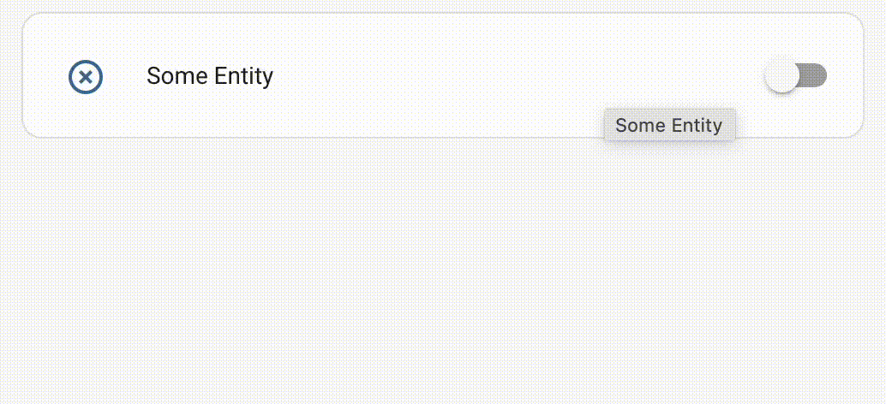

import { Pencil, EllipsisVertical } from 'lucide-react'
import { Separator } from "../../../src/components/ui/separator"

# Conditional card

<p className="text-xl font-semibold">
The conditional card displays another card based on conditions.
</p>


To add the conditional card to your user interface:

1. In the top right of the screen, select the edit <Pencil className='align-middle inline ' size={18}  />  button.
    - If this is your first time editing a dashboard, the **Edit dashboard** dialog appears.
        - By editing the dashboard, you are taking over control of this dashboard.
        - This means that it is no longer automatically updated when new dashboard elements become available.
        - Once you’ve taken control, you can’t get this specific dashboard back to update automatically. However, you can create a new default dashboard.
        - To continue, in the dialog, select the three dots <EllipsisVertical className='align-middle inline' size={18} />  menu, then select **Take control**.

2. [Add a card and customize actions and features](https://www.home-assistant.io/dashboards/cards/#adding-cards-to-your-dashboard) to your dashboard.

Note that while editing the dashboard, the card will always be shown, so be sure to exit editing mode to test the conditions.

The conditional card can still be used. However, it is now possible to define a setting to show or hide a card conditionally directly on each card type, on its [Visibility](https://www.home-assistant.io/dashboards/cards/#showing-or-hiding-a-card-or-badge-conditionally) tab.

Most options for this card can be configured via the user interface.

## YAML configuration 

The following YAML options are available when you use YAML mode or just prefer to use YAML in the code editor in the UI.


<div className="bg-white p-6 rounded-2xl border border-[rgba(0,0,0,0.12)] mb-4">
#### Configuration Variables  
    <div>
        <p className="m-0 pb-2" style={{margin:'0'}}> type <span className="text-xs text-red-400">string Required</span></p>
        <p className="text-sm text-gray-400 m-0" style={{margin:'0'}}>`conditional`</p>
        <Separator className="my-4" />
    </div>

    <div>
        <p className="m-0 pb-2" style={{margin:'0'}}> conditions <span className="text-xs text-red-400">list Required</span></p>
        <p className="text-sm text-gray-400 m-0" style={{margin:'0'}}>List of conditions to check. See [available conditions](https://www.home-assistant.io/dashboards/conditional/#conditions-options).</p>
        <Separator className="my-4" />
    </div>

    <div>
        <p className="m-0 pb-2" style={{margin:'0'}}> card <span className="text-xs text-red-400">map Required</span></p>
        <p className="text-sm text-gray-400 m-0" style={{margin:'0'}}>Card to display if all conditions match.</p>
    </div>
</div>

## Examples

Only show when all the conditions are met:

```yaml
type: conditional
conditions:
  - condition: state
    entity: light.bed_light
    state: "on"
  - condition: state
    entity: light.bed_light
    state_not: "off"
  - condition: user
    users:
      - 581fca7fdc014b8b894519cc531f9a04
card:
  type: entities
  entities:
    - device_tracker.demo_paulus
    - cover.kitchen_window
    - group.kitchen
    - lock.kitchen_door
    - light.bed_light
```

Example condition where only one of the conditions needs to be met:

```yaml
type: conditional
conditions:
  - condition: or
    conditions:
      - condition: state
        entity: binary_sensor.co_alert
        state: 'on'
      - condition: state
        entity: binary_sensor.rookmelder
        state: 'on'
card:
  type: entities
  entities:
    - binary_sensor.co_alert
    - binary_sensor.rookmelder
```

## Conditions options 

### State

Tests if an entity has a specified state.

```yaml
condition: state
entity: climate.thermostat
state: heat
```
```yaml
condition: state
entity: climate.thermostat
state_not: "off"
```

<div className="bg-white p-6 rounded-2xl border border-[rgba(0,0,0,0.12)] mb-4">
#### Configuration Variables  
    <div>
        <p className="m-0 pb-2" style={{margin:'0'}}> condition <span className="text-xs text-red-400">string Required</span></p>
        <p className="text-sm text-gray-400 m-0" style={{margin:'0'}}>`state`</p>
        <Separator className="my-4" />
    </div>

    <div>
        <p className="m-0 pb-2" style={{margin:'0'}}> entity <span className="text-xs text-red-400">string Required</span></p>
        <p className="text-sm text-gray-400 m-0" style={{margin:'0'}}>Entity ID.</p>
        <Separator className="my-4" />
    </div>

    <div>
        <p className="m-0 pb-2" style={{margin:'0'}}> state <span className="text-xs text-gray-400">list | string (Optional)</span></p>
        <p className="text-sm text-gray-400 m-0" style={{margin:'0'}}>Entity state or ID to be equal to this value. Can contain an array of states.*</p>
         <Separator className="my-4" />
    </div>

    <div>
        <p className="m-0 pb-2" style={{margin:'0'}}> state_not <span className="text-xs text-gray-400">list | string (Optional)</span></p>
        <p className="text-sm text-gray-400 m-0" style={{margin:'0'}}>Entity state or ID to not be equal to this value. Can contain an array of states.*</p>
    </div>
</div>

*one is required (`state` or `state_not`)

### Numeric state 
Tests if an entity state matches the thresholds.

```yaml
condition: numeric_state
entity: sensor.outside_temperature
above: 10
below: 20
```

<div className="bg-white p-6 rounded-2xl border border-[rgba(0,0,0,0.12)] mb-4">
#### Configuration Variables  
    <div>
        <p className="m-0 pb-2" style={{margin:'0'}}> condition <span className="text-xs text-red-400">string Required</span></p>
        <p className="text-sm text-gray-400 m-0" style={{margin:'0'}}>`numeric_state`</p>
        <Separator className="my-4" />
    </div>

    <div>
        <p className="m-0 pb-2" style={{margin:'0'}}> entity <span className="text-xs text-red-400">string Required</span></p>
        <p className="text-sm text-gray-400 m-0" style={{margin:'0'}}>Entity ID.</p>
        <Separator className="my-4" />
    </div>

    <div>
        <p className="m-0 pb-2" style={{margin:'0'}}> above <span className="text-xs text-gray-400">string (Optional)</span></p>
        <p className="text-sm text-gray-400 m-0" style={{margin:'0'}}>Entity state or ID to be above this value.*</p>
         <Separator className="my-4" />
    </div>

    <div>
        <p className="m-0 pb-2" style={{margin:'0'}}> below <span className="text-xs text-gray-400">string (Optional)</span></p>
        <p className="text-sm text-gray-400 m-0" style={{margin:'0'}}>Entity state or ID to be below this value.*</p>
    </div>
</div>

*at least one is required (above or below), both are also possible for values between.

### Screen

Specify the visibility of the card per screen size. Some screen size presets are available in the UI but you can use any CSS media query you want in YAML.

```yaml
condition: screen
media_query: "(min-width: 1280px)"
```

<div className="bg-white p-6 rounded-2xl border border-[rgba(0,0,0,0.12)] mb-4">
#### Configuration Variables  
    <div>
        <p className="m-0 pb-2" style={{margin:'0'}}> condition <span className="text-xs text-red-400">string Required</span></p>
        <p className="text-sm text-gray-400 m-0" style={{margin:'0'}}>`screen`</p>
        <Separator className="my-4" />
    </div>

    <div>
        <p className="m-0 pb-2" style={{margin:'0'}}> media_query <span className="text-xs text-red-400">string Required</span></p>
        <p className="text-sm text-gray-400 m-0" style={{margin:'0'}}>Media query to check which screen size are allowed to display the card.</p>
        {/* <Separator className="my-4" /> */}
    </div>
</div>


### User

Specify the visibility of the card per user.

```yaml
condition: user
users:
  - 581fca7fdc014b8b894519cc531f9a04
```

<div className="bg-white p-6 rounded-2xl border border-[rgba(0,0,0,0.12)] mb-4">
#### Configuration Variables  
    <div>
        <p className="m-0 pb-2" style={{margin:'0'}}> condition <span className="text-xs text-red-400">string Required</span></p>
        <p className="text-sm text-gray-400 m-0" style={{margin:'0'}}>`user`</p>
        <Separator className="my-4" />
    </div>

    <div>
        <p className="m-0 pb-2" style={{margin:'0'}}> users <span className="text-xs text-red-400">list Required</span></p>
        <p className="text-sm text-gray-400 m-0" style={{margin:'0'}}>User ID that can see the card (unique hex value found on the Users configuration page).</p>
        {/* <Separator className="my-4" /> */}
    </div>
</div>

### AND

Specify that both conditions must be met.

```yaml
condition: and
conditions:
  - condition: numeric_state
    above: 0
  - condition: user
    users:
      - 581fca7fdc014b8b894519cc531f9a04
```

<div className="bg-white p-6 rounded-2xl border border-[rgba(0,0,0,0.12)] mb-4">
#### Configuration Variables  
    <div>
        <p className="m-0 pb-2" style={{margin:'0'}}> condition <span className="text-xs text-red-400">string Required</span></p>
        <p className="text-sm text-gray-400 m-0" style={{margin:'0'}}>`and`</p>
        <Separator className="my-4" />
    </div>

    <div>
        <p className="m-0 pb-2" style={{margin:'0'}}> conditions <span className="text-xs text-gray-400">list (Optional)</span></p>
        <p className="text-sm text-gray-400 m-0" style={{margin:'0'}}>List of conditions to check. See [available conditions](https://www.home-assistant.io/dashboards/conditional/#conditions-options).</p>
        {/* <Separator className="my-4" /> */}
    </div>
</div>

### OR

Specify that at least one of the conditions must be met.


```yaml
condition: or
conditions:
  - condition: numeric_state
    above: 0
  - condition: user
    users:
      - 581fca7fdc014b8b894519cc531f9a04
```

<div className="bg-white p-6 rounded-2xl border border-[rgba(0,0,0,0.12)] mb-4">
#### Configuration Variables  
    <div>
        <p className="m-0 pb-2" style={{margin:'0'}}> condition <span className="text-xs text-red-400">string Required</span></p>
        <p className="text-sm text-gray-400 m-0" style={{margin:'0'}}>`or`</p>
        <Separator className="my-4" />
    </div>

    <div>
        <p className="m-0 pb-2" style={{margin:'0'}}> conditions <span className="text-xs text-gray-400">list (Optional)</span></p>
        <p className="text-sm text-gray-400 m-0" style={{margin:'0'}}>List of conditions to check. See [available conditions](https://www.home-assistant.io/dashboards/conditional/#conditions-options).</p>
        {/* <Separator className="my-4" /> */}
    </div>
</div>

## Related topics
- [Dashboard cards](https://www.home-assistant.io/dashboards/cards/)
- [Conditional settings on the card's visibility tab](https://www.home-assistant.io/dashboards/cards/#showing-or-hiding-a-card-or-badge-conditionally)

