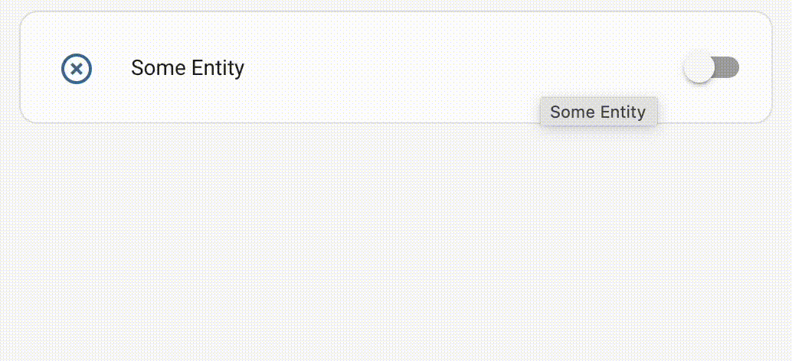

import { Pencil, EllipsisVertical } from 'lucide-react'
import { Separator } from "../../../src/components/ui/separator"

# 条件卡片

<p className="text-xl font-semibold">
条件卡片根据条件显示另一个卡片。
</p>


要将条件卡片添加到你的用户界面：

1. 在屏幕右上角，选择编辑 <Pencil className='align-middle inline ' size={18}  /> 按钮。
    - 如果这是你第一次编辑仪表板，会出现**编辑仪表板**对话框。
        - 通过编辑仪表板，你将接管这个仪表板的控制权。
        - 这意味着当新的仪表板元素可用时，它将不再自动更新。
        - 一旦你接管控制权，你将无法使这个特定的仪表板恢复为自动更新。但是，你可以创建一个新的默认仪表板。
        - 要继续，在对话框中，选择三点菜单 <EllipsisVertical className='align-middle inline' size={18} />，然后选择**接管控制**。

2. [添加卡片并自定义操作和功能](https://www.home-assistant.io/dashboards/cards/#adding-cards-to-your-dashboard) 到你的仪表板。

请注意，在编辑仪表板时，卡片将始终显示，因此请确保退出编辑模式以测试条件。

条件卡片仍然可以使用。但是，现在可以直接在每个卡片类型的[可见性](/docs/documentation/dashboards/cards#有条件地显示或隐藏卡片或徽章)选项卡上定义有条件地显示或隐藏卡片的设置。

这个卡片的大多数选项都可以通过用户界面进行配置。

## YAML 配置 

当你使用 YAML 模式或只是更喜欢在 UI 中的代码编辑器中使用 YAML 时，以下 YAML 选项可用。


<div className="bg-white p-6 rounded-2xl border border-[rgba(0,0,0,0.12)] mb-4">
#### 配置变量  
    <div>
        <p className="m-0 pb-2" style={{margin:'0'}}> type <span className="text-xs text-red-400">字符串 必填</span></p>
        <p className="text-sm text-gray-400 m-0" style={{margin:'0'}}>`conditional`</p>
        <Separator className="my-4" />
    </div>

    <div>
        <p className="m-0 pb-2" style={{margin:'0'}}> conditions <span className="text-xs text-red-400">列表 必填</span></p>
        <p className="text-sm text-gray-400 m-0" style={{margin:'0'}}>要检查的条件列表。查看[可用条件](/docs/documentation/dashboards/conditional#条件选项)。</p>
        <Separator className="my-4" />
    </div>

    <div>
        <p className="m-0 pb-2" style={{margin:'0'}}> card <span className="text-xs text-red-400">映射 必填</span></p>
        <p className="text-sm text-gray-400 m-0" style={{margin:'0'}}>如果所有条件都匹配，则显示的卡片。</p>
    </div>
</div>

## 示例

仅在满足所有条件时显示：

```yaml
type: conditional
conditions:
  - condition: state
    entity: light.bed_light
    state: "on"
  - condition: state
    entity: light.bed_light
    state_not: "off"
  - condition: user
    users:
      - 581fca7fdc014b8b894519cc531f9a04
card:
  type: entities
  entities:
    - device_tracker.demo_paulus
    - cover.kitchen_window
    - group.kitchen
    - lock.kitchen_door
    - light.bed_light
```

只需满足其中一个条件的示例：

```yaml
type: conditional
conditions:
  - condition: or
    conditions:
      - condition: state
        entity: binary_sensor.co_alert
        state: 'on'
      - condition: state
        entity: binary_sensor.rookmelder
        state: 'on'
card:
  type: entities
  entities:
    - binary_sensor.co_alert
    - binary_sensor.rookmelder
```

## 条件选项 

### 状态

测试实体是否具有指定状态。

```yaml
condition: state
entity: climate.thermostat
state: heat
```
```yaml
condition: state
entity: climate.thermostat
state_not: "off"
```

<div className="bg-white p-6 rounded-2xl border border-[rgba(0,0,0,0.12)] mb-4">
#### 配置变量  
    <div>
        <p className="m-0 pb-2" style={{margin:'0'}}> condition <span className="text-xs text-red-400">字符串 必填</span></p>
        <p className="text-sm text-gray-400 m-0" style={{margin:'0'}}>`state`</p>
        <Separator className="my-4" />
    </div>

    <div>
        <p className="m-0 pb-2" style={{margin:'0'}}> entity <span className="text-xs text-red-400">字符串 必填</span></p>
        <p className="text-sm text-gray-400 m-0" style={{margin:'0'}}>实体 ID。</p>
        <Separator className="my-4" />
    </div>

    <div>
        <p className="m-0 pb-2" style={{margin:'0'}}> state <span className="text-xs text-gray-400">列表 | 字符串 (可选)</span></p>
        <p className="text-sm text-gray-400 m-0" style={{margin:'0'}}>实体状态或 ID 等于此值。可以包含状态数组。*</p>
         <Separator className="my-4" />
    </div>

    <div>
        <p className="m-0 pb-2" style={{margin:'0'}}> state_not <span className="text-xs text-gray-400">列表 | 字符串 (可选)</span></p>
        <p className="text-sm text-gray-400 m-0" style={{margin:'0'}}>实体状态或 ID 不等于此值。可以包含状态数组。*</p>
    </div>
</div>

*必须选择一个（`state` 或 `state_not`）

### 数值状态 
测试实体状态是否符合阈值。

```yaml
condition: numeric_state
entity: sensor.outside_temperature
above: 10
below: 20
```

<div className="bg-white p-6 rounded-2xl border border-[rgba(0,0,0,0.12)] mb-4">
#### 配置变量  
    <div>
        <p className="m-0 pb-2" style={{margin:'0'}}> condition <span className="text-xs text-red-400">字符串 必填</span></p>
        <p className="text-sm text-gray-400 m-0" style={{margin:'0'}}>`numeric_state`</p>
        <Separator className="my-4" />
    </div>

    <div>
        <p className="m-0 pb-2" style={{margin:'0'}}> entity <span className="text-xs text-red-400">字符串 必填</span></p>
        <p className="text-sm text-gray-400 m-0" style={{margin:'0'}}>实体 ID。</p>
        <Separator className="my-4" />
    </div>

    <div>
        <p className="m-0 pb-2" style={{margin:'0'}}> above <span className="text-xs text-gray-400">字符串 (可选)</span></p>
        <p className="text-sm text-gray-400 m-0" style={{margin:'0'}}>实体状态或 ID 高于此值。*</p>
         <Separator className="my-4" />
    </div>

    <div>
        <p className="m-0 pb-2" style={{margin:'0'}}> below <span className="text-xs text-gray-400">字符串 (可选)</span></p>
        <p className="text-sm text-gray-400 m-0" style={{margin:'0'}}>实体状态或 ID 低于此值。*</p>
    </div>
</div>

*至少需要一个（`above` 或 `below`），两者也可用于表示介于两个值之间。

### 屏幕

指定每个屏幕尺寸的卡片可见性。UI 中提供了一些屏幕尺寸预设，但你可以在 YAML 中使用任何 CSS 媒体查询。

```yaml
condition: screen
media_query: "(min-width: 1280px)"
```

<div className="bg-white p-6 rounded-2xl border border-[rgba(0,0,0,0.12)] mb-4">
#### 配置变量  
    <div>
        <p className="m-0 pb-2" style={{margin:'0'}}> condition <span className="text-xs text-red-400">字符串 必填</span></p>
        <p className="text-sm text-gray-400 m-0" style={{margin:'0'}}>`screen`</p>
        <Separator className="my-4" />
    </div>

    <div>
        <p className="m-0 pb-2" style={{margin:'0'}}> media_query <span className="text-xs text-red-400">字符串 必填</span></p>
        <p className="text-sm text-gray-400 m-0" style={{margin:'0'}}>媒体查询，用于检查允许显示卡片的屏幕尺寸。</p>
        {/* <Separator className="my-4" /> */}
    </div>
</div>


### 用户

指定每个用户的卡片可见性。

```yaml
condition: user
users:
  - 581fca7fdc014b8b894519cc531f9a04
```

<div className="bg-white p-6 rounded-2xl border border-[rgba(0,0,0,0.12)] mb-4">
#### 配置变量  
    <div>
        <p className="m-0 pb-2" style={{margin:'0'}}> condition <span className="text-xs text-red-400">字符串 必填</span></p>
        <p className="text-sm text-gray-400 m-0" style={{margin:'0'}}>`user`</p>
        <Separator className="my-4" />
    </div>

    <div>
        <p className="m-0 pb-2" style={{margin:'0'}}> users <span className="text-xs text-red-400">列表 必填</span></p>
        <p className="text-sm text-gray-400 m-0" style={{margin:'0'}}>可以看到卡片的用户 ID（在用户配置页面上找到的唯一十六进制值）。</p>
        {/* <Separator className="my-4" /> */}
    </div>
</div>

### AND

指定必须满足两个条件。

```yaml
condition: and
conditions:
  - condition: numeric_state
    above: 0
  - condition: user
    users:
      - 581fca7fdc014b8b894519cc531f9a04
```

<div className="bg-white p-6 rounded-2xl border border-[rgba(0,0,0,0.12)] mb-4">
#### 配置变量  
    <div>
        <p className="m-0 pb-2" style={{margin:'0'}}> condition <span className="text-xs text-red-400">字符串 必填</span></p>
        <p className="text-sm text-gray-400 m-0" style={{margin:'0'}}>`and`</p>
        <Separator className="my-4" />
    </div>

    <div>
        <p className="m-0 pb-2" style={{margin:'0'}}> conditions <span className="text-xs text-gray-400">列表 (可选)</span></p>
        <p className="text-sm text-gray-400 m-0" style={{margin:'0'}}>要检查的条件列表。查看[可用条件](/docs/documentation/dashboards/conditional#条件选项)。</p>
        {/* <Separator className="my-4" /> */}
    </div>
</div>

### OR

指定必须满足至少一个条件。


```yaml
condition: or
conditions:
  - condition: numeric_state
    above: 0
  - condition: user
    users:
      - 581fca7fdc014b8b894519cc531f9a04
```

<div className="bg-white p-6 rounded-2xl border border-[rgba(0,0,0,0.12)] mb-4">
#### 配置变量  
    <div>
        <p className="m-0 pb-2" style={{margin:'0'}}> condition <span className="text-xs text-red-400">字符串 必填</span></p>
        <p className="text-sm text-gray-400 m-0" style={{margin:'0'}}>`or`</p>
        <Separator className="my-4" />
    </div>

    <div>
        <p className="m-0 pb-2" style={{margin:'0'}}> conditions <span className="text-xs text-gray-400">列表 (可选)</span></p>
        <p className="text-sm text-gray-400 m-0" style={{margin:'0'}}>要检查的条件列表。查看[可用条件](/docs/documentation/dashboards/conditional#条件选项)。</p>
        {/* <Separator className="my-4" /> */}
    </div>
</div>

## 相关主题
- [仪表板卡片](https://www.home-assistant.io/dashboards/cards/)
- [卡片可见性选项卡上的条件设置](/docs/documentation/dashboards/cards#有条件地显示或隐藏卡片或徽章)

