import { Pencil, EllipsisVertical } from 'lucide-react'
import { Separator } from "../../../src/components/ui/separator"

# 能源卡片


<p className="text-xl font-semibold">
这是能源仪表板中使用的所有卡片列表。你也可以将它们放置在仪表板的任何位置。
</p>

目前，这些卡片没有可用的配置选项。你可以在[能源配置页面](https://my.home-assistant.io/redirect/config_energy)上配置它们。

## 能源日期选择器

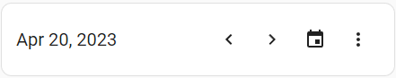
<p className='text-center font-extralight'>能源日期选择卡片的截图。</p>

此卡片允许你选择要显示的数据。在此卡片中更改它将影响所有其他卡片中的数据。可以通过打开日期范围选择器来选择特定日期和范围。可以使用菜单中的比较数据选项将当前周期与前一个周期进行比较。

### 示例

```yaml
type: energy-date-selection
```

## 能源使用图表

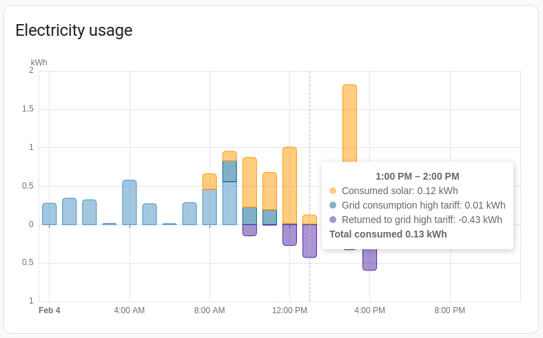
<p className='text-center font-extralight'>能源使用图表卡片的截图。</p>

能源使用图表卡片显示你的房屋消耗的能源量，以及这些能源来自何处。它还将显示你返回电网的能源量。

### 示例

```yaml
type: energy-usage-graph
```

## 太阳能生产图表

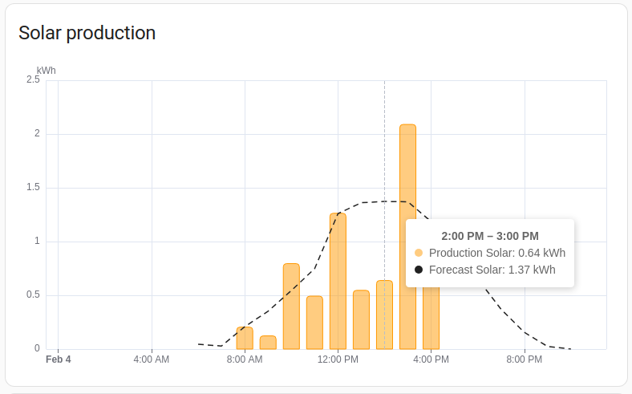
<p className='text-center font-extralight'>太阳能生产图表卡片的截图。</p>

太阳能生产图表卡片显示你的太阳能电池板按来源生产的能源量，如果设置并可用，还会显示太阳能生产的预测。

### 示例

```yaml
type: energy-solar-graph
```

## 燃气消耗图表

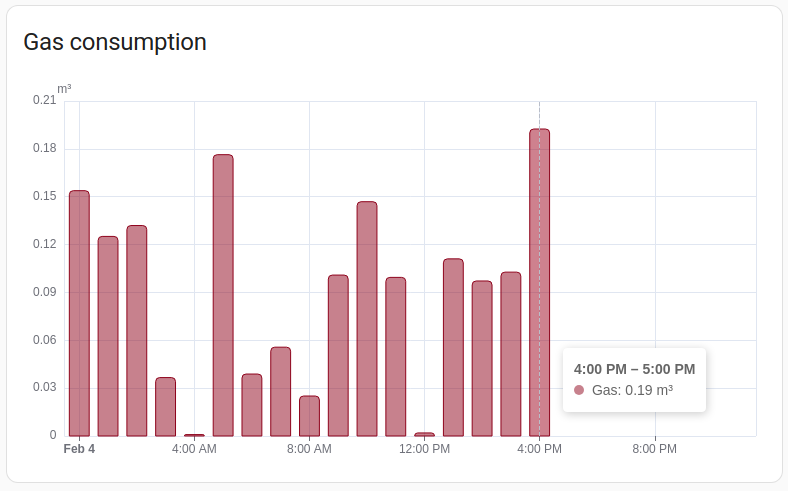
<p className='text-center font-extralight'>燃气消耗图表卡片的截图。</p>

燃气消耗图表卡片显示每个来源消耗的燃气量。

### 示例

```yaml
type: energy-gas-graph
```

## 水消耗图表

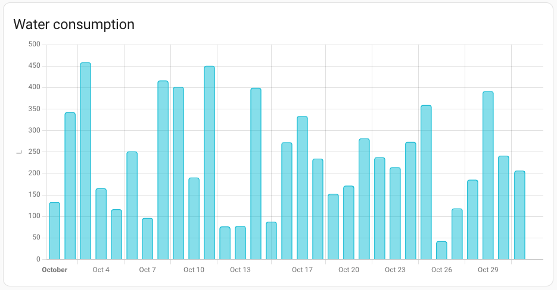
<p className='text-center font-extralight'>水消耗图表卡片的截图。</p>

水消耗图表卡片显示每个来源消耗的水量。

### 示例

```yaml
type: energy-water-graph
```

## 能源分布

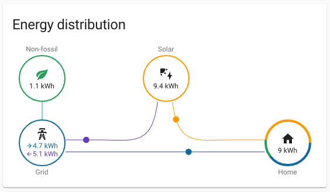
<p className='text-center font-extralight'>能源分布卡片的截图。</p>

能源分布卡片显示能源的流动方式，从电网到你的房屋，从你的太阳能电池板到你的房屋和/或返回电网。

如果设置了，它还会告诉你从电网获得的多少千瓦时的能源是在不使用化石燃料的情况下生产的。

如果你将 `link_dashboard` 设置为 `true`，卡片将包含指向能源仪表板的链接。

### 示例

```yaml
type: energy-distribution
link_dashboard: true
```

## 能源来源表格

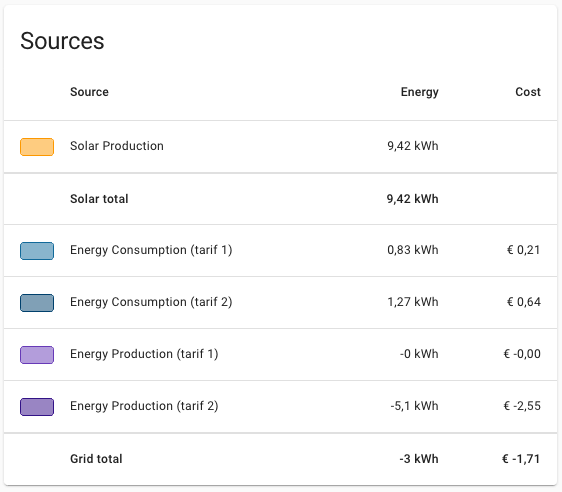
<p className='text-center font-extralight'>能源来源表格卡片的截图。</p>

能源来源表格卡片显示所有能源来源及其对应的能源量。如果设置了，它还将显示每个来源的成本和补偿以及总计。

### 示例

```yaml
type: energy-sources-table
```

## 太阳能消耗仪表

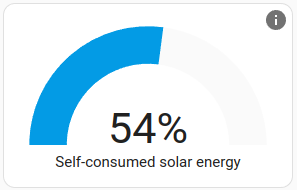
<p className='text-center font-extralight'>太阳能消耗仪表卡片的截图。</p>

太阳能消耗仪表代表你的家庭使用了多少太阳能，而不是返回电网。如果你经常返回大量能源，可以尝试通过安装电池或购买电动汽车充电来保存这些能源。


### 示例

```yaml
type: energy-solar-consumed-gauge
```

## 碳消耗仪表

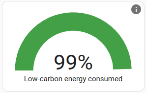
<p className='text-center font-extralight'>碳消耗仪表卡片的截图。</p>

碳消耗仪表卡片代表你的家庭消耗的能源中有多少是使用非化石燃料（如太阳能、风能和核能）生成的。它包括你自己生成的太阳能。

### 示例

```yaml
type: energy-carbon-consumed-gauge
```

## 自给自足仪表

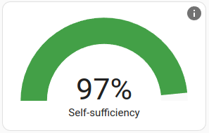
<p className='text-center font-extralight'>自给自足仪表卡片的截图。</p>

自给自足仪表代表你的家庭自给自足的程度。如果你依赖电网进口，这个值会降低。你可以通过增加更多的太阳能容量或电池存储来增加这个值。

### 示例

```yaml
type: energy-self-sufficiency-gauge
```

## 设备能源图表

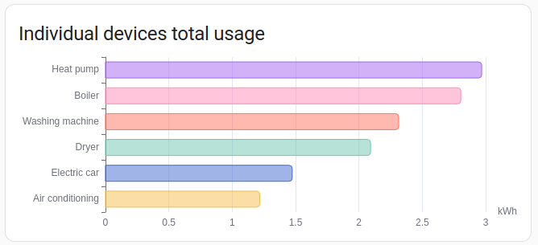
<p className='text-center font-extralight'>设备能源图表卡片的截图。</p>

设备能源图表显示每个设备的能源使用情况，按使用量排序。

默认情况下，此卡片将显示所有设备。可选地，可以通过添加 `max_devices` 选项并指定要显示的最大设备数量来限制设备数量。如果可用的设备比显示的多，将显示能源使用量最高的设备。
### 示例

```yaml
type: energy-devices-graph
```

以下示例将显示的设备数量限制为5个：

```yaml
type: energy-devices-graph
max_devices: 5
```

## 详细设备能源图表

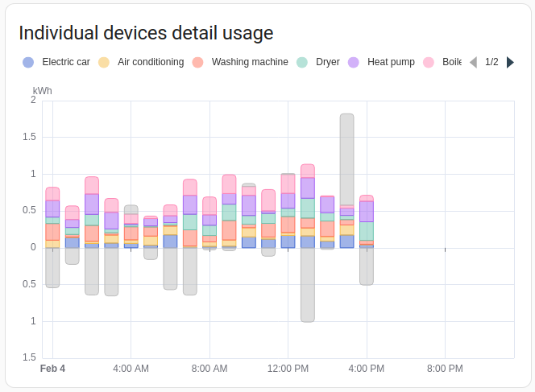
<p className='text-center font-extralight'>详细设备能源图表卡片的截图。</p>

**详细设备能源图表**卡片类似于**设备能源图表**卡片，但在时间尺度上显示个别使用情况。

默认情况下，此卡片将显示所有设备。可选地，可以通过添加 `max_devices` 选项并指定要显示的最大设备数量来限制设备数量。如果可用的设备比显示的多，将显示能源使用量最高的设备。


### 示例

```yaml
type: energy-devices-detail-graph
```

以下示例将显示的设备数量限制为5个：

```yaml
type: energy-devices-detail-graph
max_devices: 5
```

## 桑基能源图表

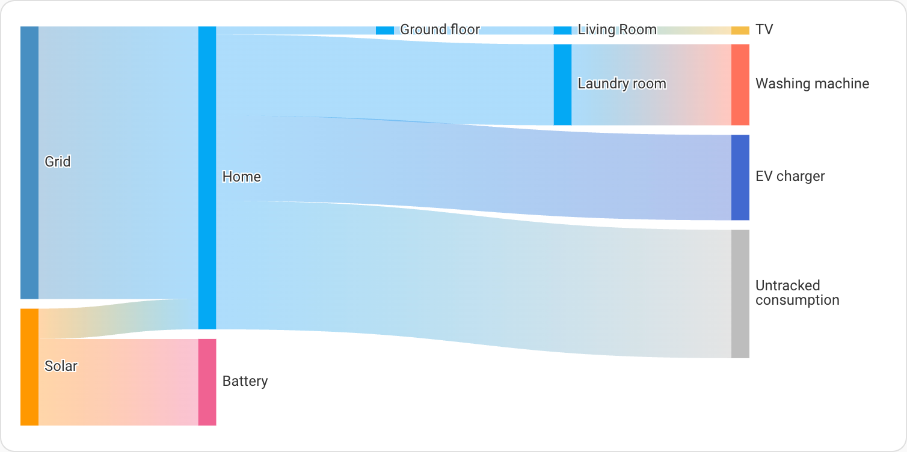
<p className='text-center font-extralight'>桑基能源图表卡片的截图。</p>

桑基能源图表显示你家中能源的流动。它从能源来源开始，流向各种消费者。如果配置了楼层和区域，设备将按楼层和区域分组。

### 示例

```yaml
type: energy-sankey
```

以下示例将流动方向从上到下排列：

```yaml
type: energy-sankey
layout: vertical
```

## 使用多个集合

默认情况下，所有能源卡片都链接到视图上的任何 `energy-date-selection` 卡片，并且所有 `energy-date-selection` 卡片都链接到同一时期。要在同一视图上启用多个不同的日期选择，需要将它们链接到不同的集合。这通过在卡片 YAML 中添加变量 `collection_key` 并给它一个以 `energy_` 开头的任何自定义字符串的值来完成（不以 `energy_` 开头的字符串将生成错误）。

所有能源卡片都支持使用 `collection_key` 选项。

### 示例
具有多个集合的视图示例：

```yaml
type: masonry
path: example
cards:
  - type: energy-date-selection
  - type: energy-date-selection
    collection_key: energy_2

  # 此卡片链接到第一个（默认）日期选择
  - type: energy-usage-graph

  # 此卡片链接到第二个日期选择
  - type: energy-usage-graph
    collection_key: energy_2
```

## 相关主题
- [主题](https://www.home-assistant.io/integrations/frontend/)
- [仪表板卡片](https://www.home-assistant.io/dashboards/cards/)