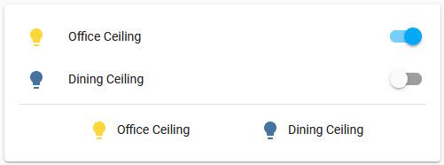
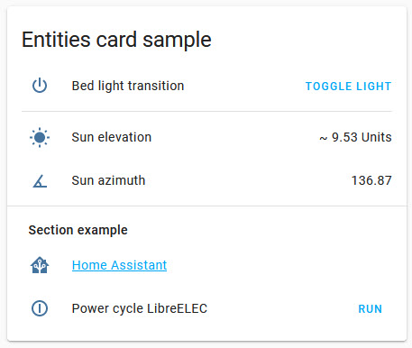

import { Pencil, EllipsisVertical } from 'lucide-react'
import { Separator } from "../../../src/components/ui/separator"

# Entities card


<p className="text-xl font-semibold">
The entities card is the most common type of card. It groups items together into lists. It can be used to display an entity’s state or attribute, but also contain buttons, web links, etc.
</p>

To add the entities card to your user interface:

1. In the top right of the screen, select the edit <Pencil className='align-middle inline ' size={18}  />  button.
    - If this is your first time editing a dashboard, the **Edit dashboard** dialog appears.
        - By editing the dashboard, you are taking over control of this dashboard.
        - This means that it is no longer automatically updated when new dashboard elements become available.
        - Once you’ve taken control, you can’t get this specific dashboard back to update automatically. However, you can create a new default dashboard.
        - To continue, in the dialog, select the three dots <EllipsisVertical className='align-middle inline' size={18} />  menu, then select **Take control**.

2. [Add a card and customize actions and features](https://www.home-assistant.io/dashboards/cards/#adding-cards-to-your-dashboard) to your dashboard.


## YAML configuration 

The following YAML options are available when you use YAML mode or just prefer to use YAML in the code editor in the UI.

<div className="bg-white p-6 rounded-2xl border border-[rgba(0,0,0,0.12)] mb-4">
#### Configuration Variables  
    <div>
        <p className="m-0 pb-2" style={{margin:'0'}}> type <span className="text-xs text-red-400">string Required</span></p>
        <p className="text-sm text-gray-400 m-0" style={{margin:'0'}}>`entities`</p>
        <Separator className="my-4" />
    </div>

    <div>
        <p className="m-0 pb-2" style={{margin:'0'}}> entities <span className="text-xs text-red-400">list Required</span></p>
        <p className="text-sm text-gray-400 m-0" style={{margin:'0'}}>A list of entity IDs or `entity` objects or special row objects (see below).</p>
        <Separator className="my-4" />
    </div>

    <div>
        <p className="m-0 pb-2" style={{margin:'0'}}> title <span className="text-xs text-gray-400">string (Optional)</span></p>
        <p className="text-sm text-gray-400 m-0" style={{margin:'0'}}>Card title.</p>
        <Separator className="my-4" />
    </div>

    <div>
        <p className="m-0 pb-2" style={{margin:'0'}}> icon <span className="text-xs text-gray-400">string (Optional)</span></p>
        <p className="text-sm text-gray-400 m-0" style={{margin:'0'}}>An icon to display to the left of the title.</p>
        <Separator className="my-4" />
    </div>

    <div>
        <p className="m-0 pb-2" style={{margin:'0'}}> show_header_toggle <span className="text-xs text-gray-400">boolean (Optional, default: true)</span></p>
        <p className="text-sm text-gray-400 m-0" style={{margin:'0'}}>Button to turn on/off all entities.</p>
        <Separator className="my-4" />
    </div>

    <div>
        <p className="m-0 pb-2" style={{margin:'0'}}> theme <span className="text-xs text-gray-400">string (Optional)</span></p>
        <p className="text-sm text-gray-400 m-0" style={{margin:'0'}}>Override the used theme for this card with any loaded theme. For more information about themes, see the [frontend documentation](https://www.home-assistant.io/integrations/frontend/).</p>
        <Separator className="my-4" />
    </div>

    <div>
        <p className="m-0 pb-2" style={{margin:'0'}}> state_color <span className="text-xs text-gray-400">boolean (Optional, default: false)</span></p>
        <p className="text-sm text-gray-400 m-0" style={{margin:'0'}}>Set to `true` to have icons colored when entity is active.</p>
        <Separator className="my-4" />
    </div>

    <div>
        <p className="m-0 pb-2" style={{margin:'0'}}> header <span className="text-xs text-gray-400">map (Optional)</span></p>
        <p className="text-sm text-gray-400 m-0" style={{margin:'0'}}>Header widget to render. See [header documentation](https://www.home-assistant.io/dashboards/header-footer/).</p>
        <Separator className="my-4" />
    </div>

    <div>
        <p className="m-0 pb-2" style={{margin:'0'}}> footer <span className="text-xs text-gray-400">map (Optional)</span></p>
        <p className="text-sm text-gray-400 m-0" style={{margin:'0'}}>Footer widget to render. See [footer documentation](https://www.home-assistant.io/dashboards/header-footer/).</p>
    </div>
</div>

## Options for entities 

If you define entities as objects instead of strings (by adding `entity:` before entity ID), you can add more customization and configuration.

<div className="bg-white p-6 rounded-2xl border border-[rgba(0,0,0,0.12)] mb-4">
#### Configuration Variables  
    <div>
        <p className="m-0 pb-2" style={{margin:'0'}}> entity <span className="text-xs text-red-400">string Required</span></p>
        <p className="text-sm text-gray-400 m-0" style={{margin:'0'}}>Entity ID.</p>
        <Separator className="my-4" />
    </div>

    <div>
        <p className="m-0 pb-2" style={{margin:'0'}}> type <span className="text-xs text-gray-400">string (Optional)</span></p>
        <p className="text-sm text-gray-400 m-0" style={{margin:'0'}}>Sets a custom card type: `custom:my-custom-card`. It also can be used to force entities with a default special row format to render as a simple state. You can do this by setting the type: `simple-entity`. This can be used, for example, to replace a helper with an editable control with a read-only value.</p>
        <Separator className="my-4" />
    </div>

    <div>
        <p className="m-0 pb-2" style={{margin:'0'}}> name <span className="text-xs text-gray-400">string (Optional)</span></p>
        <p className="text-sm text-gray-400 m-0" style={{margin:'0'}}>Overwrites friendly name.</p>
        <Separator className="my-4" />
    </div>

    <div>
        <p className="m-0 pb-2" style={{margin:'0'}}> icon <span className="text-xs text-gray-400">string (Optional)</span></p>
        <p className="text-sm text-gray-400 m-0" style={{margin:'0'}}>Overwrites entity picture.</p>
        <Separator className="my-4" />
    </div>

    <div>
        <p className="m-0 pb-2" style={{margin:'0'}}> secondary_info <span className="text-xs text-gray-400">string (Optional)</span></p>
        <p className="text-sm text-gray-400 m-0" style={{margin:'0'}}>Show additional info. Values: `entity-id`, `last-changed`, `last-updated`, `last-triggered` (only for automations and scripts), `position` or` tilt-position` (only for supported covers), `brightness` (only for lights).</p>
        <Separator className="my-4" />
    </div>

    <div>
        <p className="m-0 pb-2" style={{margin:'0'}}> format <span className="text-xs text-gray-400">string (Optional)</span></p>
        <p className="text-sm text-gray-400 m-0" style={{margin:'0'}}>How the state should be formatted. Currently only used for timestamp sensors. Valid values are: `relative`, `total`, `date`, `time` and `datetime`.</p>
        <Separator className="my-4" />
    </div>

    <div>
        <p className="m-0 pb-2" style={{margin:'0'}}> action_name <span className="text-xs text-gray-400">string (Optional)</span></p>
        <p className="text-sm text-gray-400 m-0" style={{margin:'0'}}>Button label (only applies to `script` and `scene` rows).</p>
        <Separator className="my-4" />
    </div>

    <div>
        <p className="m-0 pb-2" style={{margin:'0'}}> state_color <span className="text-xs text-gray-400">boolean (Optional, default: false)</span></p>
        <p className="text-sm text-gray-400 m-0" style={{margin:'0'}}>Set to `true` to have icons colored when entity is active.</p>
        <Separator className="my-4" />
    </div>

    <div>
        <p className="m-0 pb-2" style={{margin:'0'}}> tap_action <span className="text-xs text-gray-400">map (Optional)</span></p>
        <p className="text-sm text-gray-400 m-0" style={{margin:'0'}}>Action taken on row tap. See [action documentation](https://www.home-assistant.io/dashboards/actions/#tap-action).</p>
        <Separator className="my-4" />
    </div>

    <div>
        <p className="m-0 pb-2" style={{margin:'0'}}> double_tap_action <span className="text-xs text-gray-400">map (Optional)</span></p>
        <p className="text-sm text-gray-400 m-0" style={{margin:'0'}}>Action taken on row double tap.  See [action documentation](https://www.home-assistant.io/dashboards/actions/#tap-action).</p>
        <Separator className="my-4" />
    </div>

    <div>
        <p className="m-0 pb-2" style={{margin:'0'}}> confirmation <span className="text-xs text-gray-400">map (Optional)</span></p>
        <p className="text-sm text-gray-400 m-0" style={{margin:'0'}}>For entities that display a button element in the row (for example, button, lock, script), this option adds a confirmation dialog to the press of the button. See [options for confirmation](https://www.home-assistant.io/dashboards/actions/#options-for-confirmation) for configuration options.</p>
        {/* <Separator className="my-4" /> */}
    </div>
    
</div>


## Special row elements 

Rather than only displaying an entity’s state as a text output, the entities card supports multiple special rows for buttons, attributes, web links, dividers and sections, etc.

### Attribute

<div className="bg-white p-6 rounded-2xl border border-[rgba(0,0,0,0.12)] mb-4">
#### Configuration Variables  
    <div>
        <p className="m-0 pb-2" style={{margin:'0'}}> type <span className="text-xs text-red-400">string Required</span></p>
        <p className="text-sm text-gray-400 m-0" style={{margin:'0'}}>`attribute`</p>
        <Separator className="my-4" />
    </div>

    <div>
        <p className="m-0 pb-2" style={{margin:'0'}}> entity <span className="text-xs text-red-400">string Required</span></p>
        <p className="text-sm text-gray-400 m-0" style={{margin:'0'}}>Entity ID.</p>
        <Separator className="my-4" />
    </div>

    <div>
        <p className="m-0 pb-2" style={{margin:'0'}}> attribute <span className="text-xs text-red-400">string Required</span></p>
        <p className="text-sm text-gray-400 m-0" style={{margin:'0'}}>Attribute to display from the entity.</p>
        <Separator className="my-4" />
    </div>

    <div>
        <p className="m-0 pb-2" style={{margin:'0'}}> prefix <span className="text-xs text-gray-400">string (Optional)</span></p>
        <p className="text-sm text-gray-400 m-0" style={{margin:'0'}}>Text before entity state.</p>
        <Separator className="my-4" />
    </div>

    <div>
        <p className="m-0 pb-2" style={{margin:'0'}}> suffix <span className="text-xs text-gray-400">string (Optional)</span></p>
        <p className="text-sm text-gray-400 m-0" style={{margin:'0'}}>Text after entity state.</p>
        <Separator className="my-4" />
    </div>

    <div>
        <p className="m-0 pb-2" style={{margin:'0'}}> name <span className="text-xs text-gray-400">string (Optional)</span></p>
        <p className="text-sm text-gray-400 m-0" style={{margin:'0'}}>Overwrites friendly entity name.</p>
        <Separator className="my-4" />
    </div>

    <div>
        <p className="m-0 pb-2" style={{margin:'0'}}> icon <span className="text-xs text-gray-400">string (Optional)</span></p>
        <p className="text-sm text-gray-400 m-0" style={{margin:'0'}}>Icon to use. Defaults to icon of entity.</p>
        <Separator className="my-4" />
    </div>

    <div>
        <p className="m-0 pb-2" style={{margin:'0'}}> format <span className="text-xs text-gray-400">string (Optional)</span></p>
        <p className="text-sm text-gray-400 m-0" style={{margin:'0'}}>How the attribute value should be formatted. Currently only supported for timestamp attributes. Valid values are: `relative`, `total`, `date`, `time` and `datetime`.</p>
        {/* <Separator className="my-4" /> */}
    </div>
</div>

### Button 

Row with an (optional) icon, label and a single text button at the end of the row that can trigger a defined action.


<div className="bg-white p-6 rounded-2xl border border-[rgba(0,0,0,0.12)] mb-4">
#### Configuration Variables  
    <div>
        <p className="m-0 pb-2" style={{margin:'0'}}> type <span className="text-xs text-red-400">string Required</span></p>
        <p className="text-sm text-gray-400 m-0" style={{margin:'0'}}>`buttons`</p>
        <Separator className="my-4" />
    </div>

    <div>
        <p className="m-0 pb-2" style={{margin:'0'}}> entity <span className="text-xs text-red-400">string (Optional)</span></p>
        <p className="text-sm text-gray-400 m-0" style={{margin:'0'}}>Entity ID. Either `entity` or `name` (or both) needs to be provided.</p>
        <Separator className="my-4" />
    </div>

    <div>
        <p className="m-0 pb-2" style={{margin:'0'}}> name <span className="text-xs text-gray-400">string (Optional)</span></p>
        <p className="text-sm text-gray-400 m-0" style={{margin:'0'}}>Row label. Either `entity` or `name` (or both) needs to be provided.</p>
        <p className="text-sm text-gray-400 m-0" style={{margin:'0'}}>Default: Friendly name of `entity` if specified.</p>
        <Separator className="my-4" />
    </div>

    <div>
        <p className="m-0 pb-2" style={{margin:'0'}}> icon <span className="text-xs text-gray-400">string (Optional)</span></p>
        <p className="text-sm text-gray-400 m-0" style={{margin:'0'}}>An icon to display to the left of the main label.</p>
        <Separator className="my-4" />
    </div>

    <div>
        <p className="m-0 pb-2" style={{margin:'0'}}> action_name <span className="text-xs text-gray-400">string (Optional, default: `Run`)</span></p>
        <p className="text-sm text-gray-400 m-0" style={{margin:'0'}}>Button label.</p>
        <Separator className="my-4" />
    </div>

    <div>
        <p className="m-0 pb-2" style={{margin:'0'}}> tap_action <span className="text-xs text-red-400">map Required</span></p>
        <p className="text-sm text-gray-400 m-0" style={{margin:'0'}}>Action taken on button tap. See [action documentation](https://www.home-assistant.io/dashboards/actions/#tap-action).</p>
        <Separator className="my-4" />
    </div>

    <div>
        <p className="m-0 pb-2" style={{margin:'0'}}> hold_action <span className="text-xs text-gray-400">map (Optional)</span></p>
        <p className="text-sm text-gray-400 m-0" style={{margin:'0'}}>Action taken on button tap and hold. See [action documentation](https://www.home-assistant.io/dashboards/actions/#hold-action).</p>
        <Separator className="my-4" />
    </div>

    <div>
        <p className="m-0 pb-2" style={{margin:'0'}}> double_tap_action <span className="text-xs text-gray-400">map (Optional)</span></p>
        <p className="text-sm text-gray-400 m-0" style={{margin:'0'}}>Action taken on button double tap. See [action documentation](https://www.home-assistant.io/dashboards/actions/#double-tap-action).</p>
    </div>
</div>


### Buttons

Multiple buttons displayed in a single row next to each other. See examples further below.


<div className="bg-white p-6 rounded-2xl border border-[rgba(0,0,0,0.12)] mb-4">
#### Configuration Variables  
    <div>
        <p className="m-0 pb-2" style={{margin:'0'}}> type <span className="text-xs text-red-400">string Required</span></p>
        <p className="text-sm text-gray-400 m-0" style={{margin:'0'}}>`button`</p>
        <Separator className="my-4" />
    </div>

    <div>
        <p className="m-0 pb-2" style={{margin:'0'}}> entities <span className="text-xs text-red-400">list Required</span></p>
        <p className="text-sm text-gray-400 m-0" style={{margin:'0'}}>A list of entities to show. Each entry is either an entity ID or a map.</p>
    </div>
    <div className='pl-10'>
        <div>
            <p className="m-0 pb-2" style={{margin:'0'}}> entity <span className="text-xs text-red-400">string Required</span></p>
            <p className="text-sm text-gray-400 m-0" style={{margin:'0'}}>Entity ID.</p>
            <Separator className="my-4" />
        </div>

        <div>
            <p className="m-0 pb-2" style={{margin:'0'}}> icon <span className="text-xs text-gray-400">string (Optional)</span></p>
            <p className="text-sm text-gray-400 m-0" style={{margin:'0'}}>Override the entity icon.</p>
            <Separator className="my-4" />
        </div>

        <div>
            <p className="m-0 pb-2" style={{margin:'0'}}> image <span className="text-xs text-gray-400">string (Optional)</span></p>
            <p className="text-sm text-gray-400 m-0" style={{margin:'0'}}>Override the entity image.</p>
            <Separator className="my-4" />
        </div>

        <div>
            <p className="m-0 pb-2" style={{margin:'0'}}> name <span className="text-xs text-gray-400">string (Optional, default: Entity name)</span></p>
            <p className="text-sm text-gray-400 m-0" style={{margin:'0'}}>Override the friendly entity name.</p>
            <Separator className="my-4" />
        </div>

        <div>
            <p className="m-0 pb-2" style={{margin:'0'}}> show_name <span className="text-xs text-gray-400">boolean (Optional, default: false)</span></p>
            <p className="text-sm text-gray-400 m-0" style={{margin:'0'}}>If false, the button name is not shown.</p>
            <Separator className="my-4" />
        </div>

        <div>
            <p className="m-0 pb-2" style={{margin:'0'}}> show_icon <span className="text-xs text-gray-400">boolean (Optional, default: true)</span></p>
            <p className="text-sm text-gray-400 m-0" style={{margin:'0'}}>If false, the icon is not shown.</p>
            <Separator className="my-4" />
        </div>

        <div>
            <p className="m-0 pb-2" style={{margin:'0'}}> tap_action <span className="text-xs text-gray-400">map Required</span></p>
            <p className="text-sm text-gray-400 m-0" style={{margin:'0'}}>Action taken on button tap. See [action documentation](https://www.home-assistant.io/dashboards/actions/#tap-action).</p>
            <Separator className="my-4" />
        </div>

        <div>
            <p className="m-0 pb-2" style={{margin:'0'}}> hold_action <span className="text-xs text-gray-400">map (Optional)</span></p>
            <p className="text-sm text-gray-400 m-0" style={{margin:'0'}}>Action taken on button tap and hold. See [action documentation](https://www.home-assistant.io/dashboards/actions/#hold-action).</p>
            <Separator className="my-4" />
        </div>

        <div>
            <p className="m-0 pb-2" style={{margin:'0'}}> double_tap_action <span className="text-xs text-gray-400">map (Optional)</span></p>
            <p className="text-sm text-gray-400 m-0" style={{margin:'0'}}>Action taken on button double tap. See [action documentation](https://www.home-assistant.io/dashboards/actions/#double-tap-action).</p>
        </div>
    </div>
</div>

### Cast

Special row to start Home Assistant Cast.

<div className="bg-white p-6 rounded-2xl border border-[rgba(0,0,0,0.12)] mb-4">
#### Configuration Variables  
    <div>
        <p className="m-0 pb-2" style={{margin:'0'}}> type <span className="text-xs text-red-400">string Required</span></p>
        <p className="text-sm text-gray-400 m-0" style={{margin:'0'}}>`cast`</p>
        <Separator className="my-4" />
    </div>

    <div>
        <p className="m-0 pb-2" style={{margin:'0'}}> dashboard <span className="text-xs text-gray-400">string (Optional)</span></p>
        <p className="text-sm text-gray-400 m-0" style={{margin:'0'}}>Path to the dashboard of the view that needs to be shown.</p>
        <Separator className="my-4" />
    </div>

    <div>
        <p className="m-0 pb-2" style={{margin:'0'}}> view <span className="text-xs text-red-400">string Required</span></p>
        <p className="text-sm text-gray-400 m-0" style={{margin:'0'}}>Path to the view that needs to be shown.</p>
        <Separator className="my-4" />
    </div>

    <div>
        <p className="m-0 pb-2" style={{margin:'0'}}> name <span className="text-xs text-gray-400">string (Optional, default: Home Assistant Cast)</span></p>
        <p className="text-sm text-gray-400 m-0" style={{margin:'0'}}>Name to show in the row.</p>
        <Separator className="my-4" />
    </div>

    <div>
        <p className="m-0 pb-2" style={{margin:'0'}}> icon <span className="text-xs text-gray-400">string (Optional)</span></p>
        <p className="text-sm text-gray-400 m-0" style={{margin:'0'}}>Icon to use.</p>
        <p className="text-sm text-gray-400 m-0" style={{margin:'0'}}>Default: `hass:televisio`.</p>
        <Separator className="my-4" />
    </div>

    <div>
        <p className="m-0 pb-2" style={{margin:'0'}}> hide_if_unavailable <span className="text-xs text-gray-400">boolean (Optional, default: false)</span></p>
        <p className="text-sm text-gray-400 m-0" style={{margin:'0'}}>Hide this row if casting is not available in the browser.</p>
        {/* <Separator className="my-4" /> */}
    </div>
</div>

### Conditional 
Special row that displays based on entity states.


<div className="bg-white p-6 rounded-2xl border border-[rgba(0,0,0,0.12)] mb-4">
#### Configuration Variables  
    <div>
        <p className="m-0 pb-2" style={{margin:'0'}}> type <span className="text-xs text-red-400">string Required</span></p>
        <p className="text-sm text-gray-400 m-0" style={{margin:'0'}}>`conditional`</p>
        <Separator className="my-4" />
    </div>

    <div>
        <p className="m-0 pb-2" style={{margin:'0'}}> conditions <span className="text-xs text-red-400">list Required</span></p>
        <p className="text-sm text-gray-400 m-0" style={{margin:'0'}}>List of conditions to check. See [available conditions](https://www.home-assistant.io/dashboards/conditional/#card-conditions).</p>
        <Separator className="my-4" />
    </div>

    <div>
        <p className="m-0 pb-2" style={{margin:'0'}}> row <span className="text-xs text-red-400">map Required</span></p>
        <p className="text-sm text-gray-400 m-0" style={{margin:'0'}}>Row to display if all conditions match. Can be any of the various supported rows described on this page.</p>
        {/* <Separator className="my-4" /> */}
    </div>
</div>


### Divider 

<div className="bg-white p-6 rounded-2xl border border-[rgba(0,0,0,0.12)] mb-4">
#### Configuration Variables  
    <div>
        <p className="m-0 pb-2" style={{margin:'0'}}> type <span className="text-xs text-red-400">string Required</span></p>
        <p className="text-sm text-gray-400 m-0" style={{margin:'0'}}>`divider`</p>
        <Separator className="my-4" />
    </div>

    <div>
        <p className="m-0 pb-2" style={{margin:'0'}}> style <span className="text-xs text-gray-400">map (Optional)</span></p>
        <p className="text-sm text-gray-400 m-0" style={{margin:'0'}}>Style the element using CSS.</p>
        <p className="text-sm text-gray-400 m-0" style={{margin:'0'}}>Default: height: 1px, background-color: var(–divider-color)</p>
    </div>

</div>

### Section 

<div className="bg-white p-6 rounded-2xl border border-[rgba(0,0,0,0.12)] mb-4">
#### Configuration Variables  
    <div>
        <p className="m-0 pb-2" style={{margin:'0'}}> type <span className="text-xs text-red-400">string Required</span></p>
        <p className="text-sm text-gray-400 m-0" style={{margin:'0'}}>`section`</p>
        <Separator className="my-4" />
    </div>

    <div>
        <p className="m-0 pb-2" style={{margin:'0'}}> label <span className="text-xs text-gray-400">string (Optional)</span></p>
        <p className="text-sm text-gray-400 m-0" style={{margin:'0'}}>Section label.</p>
    </div>

</div>

### Weblink 

<div className="bg-white p-6 rounded-2xl border border-[rgba(0,0,0,0.12)] mb-4">
#### Configuration Variables  
    <div>
        <p className="m-0 pb-2" style={{margin:'0'}}> type <span className="text-xs text-red-400">string Required</span></p>
        <p className="text-sm text-gray-400 m-0" style={{margin:'0'}}>`weblink`</p>
        <Separator className="my-4" />
    </div>

    <div>
        <p className="m-0 pb-2" style={{margin:'0'}}> url <span className="text-xs text-red-400">string Required</span></p>
        <p className="text-sm text-gray-400 m-0" style={{margin:'0'}}>Website URL (or internal URL e.g., `/hassio/dashboard` or `/panel_custom_name`).</p>
        <Separator className="my-4" />
    </div>

    <div>
        <p className="m-0 pb-2" style={{margin:'0'}}> name <span className="text-xs text-gray-400">string (Optional, default: URL path)</span></p>
        <p className="text-sm text-gray-400 m-0" style={{margin:'0'}}>Link label.</p>
        <Separator className="my-4" />
    </div>

    <div>
        <p className="m-0 pb-2" style={{margin:'0'}}> icon <span className="text-xs text-gray-400">string (Optional, default: `mdi:link`)</span></p>
        <p className="text-sm text-gray-400 m-0" style={{margin:'0'}}>Icon to display (e.g., `mdi:home`).</p>
        <Separator className="my-4" />
    </div>

    <div>
        <p className="m-0 pb-2" style={{margin:'0'}}> new_tab <span className="text-xs text-gray-400">boolean (Optional, default: false)</span></p>
        <p className="text-sm text-gray-400 m-0" style={{margin:'0'}}>Open link in new tab. If link is external URL or a download link, this will automatically be true. Use if internal URL should be opened in new tab.</p>
        <Separator className="my-4" />
    </div>

    <div>
        <p className="m-0 pb-2" style={{margin:'0'}}> download <span className="text-xs text-gray-400">boolean (Optional, default: false)</span></p>
        <p className="text-sm text-gray-400 m-0" style={{margin:'0'}}>Is link a download?</p>
    </div>
</div>

### Examples

#### Entity rows 

```yaml
type: entities
title: Entities card sample
show_header_toggle: true
header:
  image: "https://www.home-assistant.io/images/dashboards/header-footer/balloons-header.png"
  type: picture
entities:
  - entity: alarm_control_panel.alarm
    name: Alarm Panel
  - device_tracker.demo_paulus
  - switch.decorative_lights
  - group.all_lights
  - group.all_locks
```

#### Buttons row 

Above the divider are regular entity rows, below one of type `buttons`. Note that regular entity rows automatically show the entity name, whereas for buttons you have to explicitly specify a label / name.


<p className='text-center font-extralight'>Screenshot of buttons row.</p>

```yaml
type: entities
entities:
  - entity: light.office_ceiling
  - entity: light.dining_ceiling
  - type: divider
  - type: buttons
    entities:
      - entity: light.office_ceiling
        name: Office Ceiling
      - entity: light.dining_ceiling
        name: Dining Ceiling
```

#### Other special rows 


<p className='text-center font-extralight'>Screenshot of other special rows.</p>

```yaml
type: entities
title: Entities card sample
entities:
  - type: button
    icon: mdi:power
    name: Bed light transition
    action_name: Toggle light
    tap_action:
      action: perform-action
      perform_action: light.toggle
      data:
        entity_id: light.bed_light
        transition: 10
  - type: divider
  - type: attribute
    entity: sun.sun
    attribute: elevation
    name: Sun elevation
    prefix: "~"
    suffix: Units
  - type: conditional
    conditions:
      - entity: sun.sun
        state: above_horizon
    row:
      entity: sun.sun
      type: attribute
      attribute: azimuth
      icon: mdi:angle-acute
      name: Sun azimuth
  - type: section
    label: Section example
  - type: weblink
    name: Home Assistant
    url: https://www.home-assistant.io/
    icon: mdi:home-assistant
  - type: button
    name: Power cycle LibreELEC
    icon: mdi:power-cycle
    tap_action:
      action: perform-action
      confirmation:
        text: Are you sure you want to restart?
      perform_action: script.libreelec_power_cycle
```

## Related topics
- [Card actions](https://www.home-assistant.io/dashboards/actions/)
- [Card header and footer](https://www.home-assistant.io/dashboards/header-footer/)
- [Dashboard cards](https://www.home-assistant.io/dashboards/cards/)

