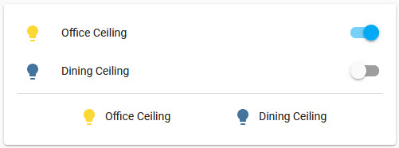
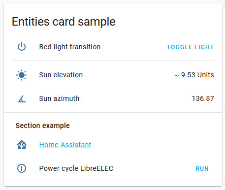

import { Pencil, EllipsisVertical } from 'lucide-react'
import { Separator } from "../../../src/components/ui/separator"

# 实体卡片


<p className="text-xl font-semibold">
实体卡片是最常见的卡片类型。它将项目分组到列表中。它可以用于显示实体的状态或属性，也可以包含按钮、网页链接等。
</p>

要将实体卡片添加到你的用户界面：

1. 在屏幕右上角，选择编辑 <Pencil className='align-middle inline ' size={18}  />  按钮。
    - 如果这是你第一次编辑仪表板，**编辑仪表板**对话框会出现。
        - 通过编辑仪表板，你将接管这个仪表板的控制权。
        - 这意味着当新的仪表板元素可用时，它将不再自动更新。
        - 一旦你接管控制权，你将无法让这个特定的仪表板恢复自动更新。但是，你可以创建一个新的默认仪表板。
        - 要继续，在对话框中，选择三点 <EllipsisVertical className='align-middle inline' size={18} /> 菜单，然后选择**接管控制**。

2. [添加卡片并自定义操作和功能](https://www.home-assistant.io/dashboards/cards/#adding-cards-to-your-dashboard) 到你的仪表板。


## YAML 配置 

当你使用 YAML 模式或只是在 UI 中的代码编辑器中更喜欢使用 YAML 时，以下 YAML 选项可用。

<div className="bg-white p-6 rounded-2xl border border-[rgba(0,0,0,0.12)] mb-4">
#### 配置变量  
    <div>
        <p className="m-0 pb-2" style={{margin:'0'}}> type <span className="text-xs text-red-400">字符串 必填</span></p>
        <p className="text-sm text-gray-400 m-0" style={{margin:'0'}}>`entities`</p>
        <Separator className="my-4" />
    </div>

    <div>
        <p className="m-0 pb-2" style={{margin:'0'}}> entities <span className="text-xs text-red-400">列表 必填</span></p>
        <p className="text-sm text-gray-400 m-0" style={{margin:'0'}}>实体 ID 列表或 `entity` 对象或特殊行对象（见下文）。</p>
        <Separator className="my-4" />
    </div>

    <div>
        <p className="m-0 pb-2" style={{margin:'0'}}> title <span className="text-xs text-gray-400">字符串 (可选)</span></p>
        <p className="text-sm text-gray-400 m-0" style={{margin:'0'}}>卡片标题。</p>
        <Separator className="my-4" />
    </div>

    <div>
        <p className="m-0 pb-2" style={{margin:'0'}}> icon <span className="text-xs text-gray-400">字符串 (可选)</span></p>
        <p className="text-sm text-gray-400 m-0" style={{margin:'0'}}>显示在标题左侧的图标。</p>
        <Separator className="my-4" />
    </div>

    <div>
        <p className="m-0 pb-2" style={{margin:'0'}}> show_header_toggle <span className="text-xs text-gray-400">布尔值 (可选，默认值: true)</span></p>
        <p className="text-sm text-gray-400 m-0" style={{margin:'0'}}>用于开启/关闭所有实体的按钮。</p>
        <Separator className="my-4" />
    </div>

    <div>
        <p className="m-0 pb-2" style={{margin:'0'}}> theme <span className="text-xs text-gray-400">字符串 (可选)</span></p>
        <p className="text-sm text-gray-400 m-0" style={{margin:'0'}}>使用任何已加载的主题覆盖此卡片的主题。有关主题的更多信息，请参阅 [前端文档](https://www.home-assistant.io/integrations/frontend/)。</p>
        <Separator className="my-4" />
    </div>

    <div>
        <p className="m-0 pb-2" style={{margin:'0'}}> state_color <span className="text-xs text-gray-400">布尔值 (可选，默认值: false)</span></p>
        <p className="text-sm text-gray-400 m-0" style={{margin:'0'}}>设置为 `true` 以在实体激活时使图标着色。</p>
        <Separator className="my-4" />
    </div>

    <div>
        <p className="m-0 pb-2" style={{margin:'0'}}> header <span className="text-xs text-gray-400">映射 (可选)</span></p>
        <p className="text-sm text-gray-400 m-0" style={{margin:'0'}}>要渲染的头部小部件。请参阅 [头部文档](/docs/documentation/dashboards/header-footer)。</p>
        <Separator className="my-4" />
    </div>

    <div>
        <p className="m-0 pb-2" style={{margin:'0'}}> footer <span className="text-xs text-gray-400">映射 (可选)</span></p>
        <p className="text-sm text-gray-400 m-0" style={{margin:'0'}}>要渲染的底部小部件。请参阅 [底部文档](/docs/documentation/dashboards/header-footer)。</p>
    </div>
</div>

## 实体选项 

如果你将实体定义为对象而不是字符串（通过在实体 ID 前添加 `entity:`），你可以添加更多自定义和配置。

<div className="bg-white p-6 rounded-2xl border border-[rgba(0,0,0,0.12)] mb-4">
#### 配置变量  
    <div>
        <p className="m-0 pb-2" style={{margin:'0'}}> entity <span className="text-xs text-red-400">字符串 必填</span></p>
        <p className="text-sm text-gray-400 m-0" style={{margin:'0'}}>实体 ID。</p>
        <Separator className="my-4" />
    </div>

    <div>
        <p className="m-0 pb-2" style={{margin:'0'}}> type <span className="text-xs text-gray-400">字符串 (可选)</span></p>
        <p className="text-sm text-gray-400 m-0" style={{margin:'0'}}>设置自定义卡片类型：`custom:my-custom-card`。它也可以用于强制具有默认特殊行格式的实体渲染为简单状态。你可以通过设置 type: `simple-entity` 来实现。例如，这可以用于将带有可编辑控件的助手替换为只读值。</p>
        <Separator className="my-4" />
    </div>

    <div>
        <p className="m-0 pb-2" style={{margin:'0'}}> name <span className="text-xs text-gray-400">字符串 (可选)</span></p>
        <p className="text-sm text-gray-400 m-0" style={{margin:'0'}}>重写友好名称。</p>
        <Separator className="my-4" />
    </div>

    <div>
        <p className="m-0 pb-2" style={{margin:'0'}}> icon <span className="text-xs text-gray-400">字符串 (可选)</span></p>
        <p className="text-sm text-gray-400 m-0" style={{margin:'0'}}>重写实体图片。</p>
        <Separator className="my-4" />
    </div>

    <div>
        <p className="m-0 pb-2" style={{margin:'0'}}> secondary_info <span className="text-xs text-gray-400">字符串 (可选)</span></p>
        <p className="text-sm text-gray-400 m-0" style={{margin:'0'}}>显示额外信息。值：`entity-id`、`last-changed`、`last-updated`、`last-triggered`（仅适用于自动化和脚本）、`position` 或 `tilt-position`（仅适用于支持的遮挡物）、`brightness`（仅适用于灯光）。</p>
        <Separator className="my-4" />
    </div>

    <div>
        <p className="m-0 pb-2" style={{margin:'0'}}> format <span className="text-xs text-gray-400">字符串 (可选)</span></p>
        <p className="text-sm text-gray-400 m-0" style={{margin:'0'}}>状态应如何格式化。目前仅用于时间戳传感器。有效值为：`relative`、`total`、`date`、`time` 和 `datetime`。</p>
        <Separator className="my-4" />
    </div>

    <div>
        <p className="m-0 pb-2" style={{margin:'0'}}> action_name <span className="text-xs text-gray-400">字符串 (可选)</span></p>
        <p className="text-sm text-gray-400 m-0" style={{margin:'0'}}>按钮标签（仅适用于 `script` 和 `scene` 行）。</p>
        <Separator className="my-4" />
    </div>

    <div>
        <p className="m-0 pb-2" style={{margin:'0'}}> state_color <span className="text-xs text-gray-400">布尔值 (可选，默认值: false)</span></p>
        <p className="text-sm text-gray-400 m-0" style={{margin:'0'}}>设置为 `true` 以在实体激活时使图标着色。</p>
        <Separator className="my-4" />
    </div>

    <div>
        <p className="m-0 pb-2" style={{margin:'0'}}> tap_action <span className="text-xs text-gray-400">映射 (可选)</span></p>
        <p className="text-sm text-gray-400 m-0" style={{margin:'0'}}>行点击时执行的操作。请参阅 [操作文档](https://www.home-assistant.io/dashboards/actions/#tap-action)。</p>
        <Separator className="my-4" />
    </div>

    <div>
        <p className="m-0 pb-2" style={{margin:'0'}}> double_tap_action <span className="text-xs text-gray-400">映射 (可选)</span></p>
        <p className="text-sm text-gray-400 m-0" style={{margin:'0'}}>行双击时执行的操作。请参阅 [操作文档](https://www.home-assistant.io/dashboards/actions/#tap-action)。</p>
        <Separator className="my-4" />
    </div>

    <div>
        <p className="m-0 pb-2" style={{margin:'0'}}> confirmation <span className="text-xs text-gray-400">映射 (可选)</span></p>
        <p className="text-sm text-gray-400 m-0" style={{margin:'0'}}>对于在行中显示按钮元素的实体（例如按钮、锁、脚本），此选项将向按钮按下添加确认对话框。有关配置选项，请参阅 [确认选项](https://www.home-assistant.io/dashboards/actions/#options-for-confirmation)。</p>
        {/* <Separator className="my-4" /> */}
    </div>
    
</div>


## Special row elements 

Rather than only displaying an entity's state as a text output, the entities card supports multiple special rows for buttons, attributes, web links, dividers and sections, etc.

### Attribute

<div className="bg-white p-6 rounded-2xl border border-[rgba(0,0,0,0.12)] mb-4">
#### Configuration Variables  
    <div>
        <p className="m-0 pb-2" style={{margin:'0'}}> type <span className="text-xs text-red-400">字符串 必填</span></p>
        <p className="text-sm text-gray-400 m-0" style={{margin:'0'}}>`attribute`</p>
        <Separator className="my-4" />
    </div>

    <div>
        <p className="m-0 pb-2" style={{margin:'0'}}> entity <span className="text-xs text-red-400">字符串 必填</span></p>
        <p className="text-sm text-gray-400 m-0" style={{margin:'0'}}>实体 ID。</p>
        <Separator className="my-4" />
    </div>

    <div>
        <p className="m-0 pb-2" style={{margin:'0'}}> attribute <span className="text-xs text-red-400">字符串 必填</span></p>
        <p className="text-sm text-gray-400 m-0" style={{margin:'0'}}>要从实体显示的属性。</p>
        <Separator className="my-4" />
    </div>

    <div>
        <p className="m-0 pb-2" style={{margin:'0'}}> prefix <span className="text-xs text-gray-400">字符串 (可选)</span></p>
        <p className="text-sm text-gray-400 m-0" style={{margin:'0'}}>实体状态前的文本。</p>
        <Separator className="my-4" />
    </div>

    <div>
        <p className="m-0 pb-2" style={{margin:'0'}}> suffix <span className="text-xs text-gray-400">字符串 (可选)</span></p>
        <p className="text-sm text-gray-400 m-0" style={{margin:'0'}}>实体状态后的文本。</p>
        <Separator className="my-4" />
    </div>

    <div>
        <p className="m-0 pb-2" style={{margin:'0'}}> name <span className="text-xs text-gray-400">字符串 (可选)</span></p>
        <p className="text-sm text-gray-400 m-0" style={{margin:'0'}}>重写友好实体名称。</p>
        <Separator className="my-4" />
    </div>

    <div>
        <p className="m-0 pb-2" style={{margin:'0'}}> icon <span className="text-xs text-gray-400">字符串 (可选)</span></p>
        <p className="text-sm text-gray-400 m-0" style={{margin:'0'}}>要使用的图标。默认为实体的图标。</p>
        <Separator className="my-4" />
    </div>

    <div>
        <p className="m-0 pb-2" style={{margin:'0'}}> format <span className="text-xs text-gray-400">字符串 (可选)</span></p>
        <p className="text-sm text-gray-400 m-0" style={{margin:'0'}}>属性值应如何格式化。目前仅支持时间戳属性。有效值为：`relative`、`total`、`date`、`time` 和 `datetime`。</p>
        {/* <Separator className="my-4" /> */}
    </div>
</div>

### Button 

带有（可选）图标、标签和行末单个文本按钮的行，可以触发定义的操作。


<div className="bg-white p-6 rounded-2xl border border-[rgba(0,0,0,0.12)] mb-4">
#### Configuration Variables  
    <div>
        <p className="m-0 pb-2" style={{margin:'0'}}> type <span className="text-xs text-red-400">字符串 必填</span></p>
        <p className="text-sm text-gray-400 m-0" style={{margin:'0'}}>`buttons`</p>
        <Separator className="my-4" />
    </div>

    <div>
        <p className="m-0 pb-2" style={{margin:'0'}}> entity <span className="text-xs text-red-400">字符串 (可选)</span></p>
        <p className="text-sm text-gray-400 m-0" style={{margin:'0'}}>实体 ID。需要提供 `entity` 或 `name`（或两者）。</p>
        <Separator className="my-4" />
    </div>

    <div>
        <p className="m-0 pb-2" style={{margin:'0'}}> name <span className="text-xs text-gray-400">字符串 (可选)</span></p>
        <p className="text-sm text-gray-400 m-0" style={{margin:'0'}}>行标签。需要提供 `entity` 或 `name`（或两者）。</p>
        <p className="text-sm text-gray-400 m-0" style={{margin:'0'}}>默认值：如果指定了 `entity`，则为其友好名称。</p>
        <Separator className="my-4" />
    </div>

    <div>
        <p className="m-0 pb-2" style={{margin:'0'}}> icon <span className="text-xs text-gray-400">字符串 (可选)</span></p>
        <p className="text-sm text-gray-400 m-0" style={{margin:'0'}}>显示在主标签左侧的图标。</p>
        <Separator className="my-4" />
    </div>

    <div>
        <p className="m-0 pb-2" style={{margin:'0'}}> action_name <span className="text-xs text-gray-400">字符串 (可选，默认值: `Run`)</span></p>
        <p className="text-sm text-gray-400 m-0" style={{margin:'0'}}>按钮标签。</p>
        <Separator className="my-4" />
    </div>

    <div>
        <p className="m-0 pb-2" style={{margin:'0'}}> tap_action <span className="text-xs text-red-400">映射 必填</span></p>
        <p className="text-sm text-gray-400 m-0" style={{margin:'0'}}>按钮点击时执行的操作。请参阅 [操作文档](https://www.home-assistant.io/dashboards/actions/#tap-action)。</p>
        <Separator className="my-4" />
    </div>

    <div>
        <p className="m-0 pb-2" style={{margin:'0'}}> hold_action <span className="text-xs text-gray-400">映射 (可选)</span></p>
        <p className="text-sm text-gray-400 m-0" style={{margin:'0'}}>按钮点击并按住时执行的操作。请参阅 [操作文档](https://www.home-assistant.io/dashboards/actions/#hold-action)。</p>
        <Separator className="my-4" />
    </div>

    <div>
        <p className="m-0 pb-2" style={{margin:'0'}}> double_tap_action <span className="text-xs text-gray-400">映射 (可选)</span></p>
        <p className="text-sm text-gray-400 m-0" style={{margin:'0'}}>按钮双击时执行的操作。请参阅 [操作文档](https://www.home-assistant.io/dashboards/actions/#double-tap-action)。</p>
    </div>
</div>


### Buttons

在单行中并排显示的多个按钮。请参阅下面的示例。


<div className="bg-white p-6 rounded-2xl border border-[rgba(0,0,0,0.12)] mb-4">
#### Configuration Variables  
    <div>
        <p className="m-0 pb-2" style={{margin:'0'}}> type <span className="text-xs text-red-400">字符串 必填</span></p>
        <p className="text-sm text-gray-400 m-0" style={{margin:'0'}}>`button`</p>
        <Separator className="my-4" />
    </div>

    <div>
        <p className="m-0 pb-2" style={{margin:'0'}}> entities <span className="text-xs text-red-400">列表 必填</span></p>
        <p className="text-sm text-gray-400 m-0" style={{margin:'0'}}>要显示的实体列表。每个条目可以是实体 ID 或映射。</p>
    </div>
    <div className='pl-10'>
        <div>
            <p className="m-0 pb-2" style={{margin:'0'}}> entity <span className="text-xs text-red-400">字符串 必填</span></p>
            <p className="text-sm text-gray-400 m-0" style={{margin:'0'}}>实体 ID。</p>
            <Separator className="my-4" />
        </div>

        <div>
            <p className="m-0 pb-2" style={{margin:'0'}}> icon <span className="text-xs text-gray-400">字符串 (可选)</span></p>
            <p className="text-sm text-gray-400 m-0" style={{margin:'0'}}>覆盖实体图标。</p>
            <Separator className="my-4" />
        </div>

        <div>
            <p className="m-0 pb-2" style={{margin:'0'}}> image <span className="text-xs text-gray-400">字符串 (可选)</span></p>
            <p className="text-sm text-gray-400 m-0" style={{margin:'0'}}>覆盖实体图像。</p>
            <Separator className="my-4" />
        </div>

        <div>
            <p className="m-0 pb-2" style={{margin:'0'}}> name <span className="text-xs text-gray-400">字符串 (可选，默认值: 实体名称)</span></p>
            <p className="text-sm text-gray-400 m-0" style={{margin:'0'}}>覆盖友好实体名称。</p>
            <Separator className="my-4" />
        </div>

        <div>
            <p className="m-0 pb-2" style={{margin:'0'}}> show_name <span className="text-xs text-gray-400">布尔值 (可选，默认值: false)</span></p>
            <p className="text-sm text-gray-400 m-0" style={{margin:'0'}}>如果为 false，则不显示按钮名称。</p>
            <Separator className="my-4" />
        </div>

        <div>
            <p className="m-0 pb-2" style={{margin:'0'}}> show_icon <span className="text-xs text-gray-400">布尔值 (可选，默认值: true)</span></p>
            <p className="text-sm text-gray-400 m-0" style={{margin:'0'}}>如果为 false，则不显示图标。</p>
            <Separator className="my-4" />
        </div>

        <div>
            <p className="m-0 pb-2" style={{margin:'0'}}> tap_action <span className="text-xs text-gray-400">映射 必填</span></p>
            <p className="text-sm text-gray-400 m-0" style={{margin:'0'}}>按钮点击时执行的操作。请参阅 [操作文档](https://www.home-assistant.io/dashboards/actions/#tap-action)。</p>
            <Separator className="my-4" />
        </div>

        <div>
            <p className="m-0 pb-2" style={{margin:'0'}}> hold_action <span className="text-xs text-gray-400">映射 (可选)</span></p>
            <p className="text-sm text-gray-400 m-0" style={{margin:'0'}}>按钮点击并按住时执行的操作。请参阅 [操作文档](https://www.home-assistant.io/dashboards/actions/#hold-action)。</p>
            <Separator className="my-4" />
        </div>

        <div>
            <p className="m-0 pb-2" style={{margin:'0'}}> double_tap_action <span className="text-xs text-gray-400">映射 (可选)</span></p>
            <p className="text-sm text-gray-400 m-0" style={{margin:'0'}}>按钮双击时执行的操作。请参阅 [操作文档](https://www.home-assistant.io/dashboards/actions/#double-tap-action)。</p>
        </div>
    </div>
</div>

### Cast

用于启动 Home Assistant Cast 的特殊行。

<div className="bg-white p-6 rounded-2xl border border-[rgba(0,0,0,0.12)] mb-4">
#### Configuration Variables  
    <div>
        <p className="m-0 pb-2" style={{margin:'0'}}> type <span className="text-xs text-red-400">字符串 必填</span></p>
        <p className="text-sm text-gray-400 m-0" style={{margin:'0'}}>`cast`</p>
        <Separator className="my-4" />
    </div>

    <div>
        <p className="m-0 pb-2" style={{margin:'0'}}> dashboard <span className="text-xs text-gray-400">字符串 (可选)</span></p>
        <p className="text-sm text-gray-400 m-0" style={{margin:'0'}}>需要显示的视图所在仪表板的路径。</p>
        <Separator className="my-4" />
    </div>

    <div>
        <p className="m-0 pb-2" style={{margin:'0'}}> view <span className="text-xs text-red-400">字符串 必填</span></p>
        <p className="text-sm text-gray-400 m-0" style={{margin:'0'}}>需要显示的视图的路径。</p>
        <Separator className="my-4" />
    </div>

    <div>
        <p className="m-0 pb-2" style={{margin:'0'}}> name <span className="text-xs text-gray-400">字符串 (可选，默认值: Home Assistant Cast)</span></p>
        <p className="text-sm text-gray-400 m-0" style={{margin:'0'}}>在行中显示的名称。</p>
        <Separator className="my-4" />
    </div>

    <div>
        <p className="m-0 pb-2" style={{margin:'0'}}> icon <span className="text-xs text-gray-400">字符串 (可选)</span></p>
        <p className="text-sm text-gray-400 m-0" style={{margin:'0'}}>要使用的图标。</p>
        <p className="text-sm text-gray-400 m-0" style={{margin:'0'}}>默认值：`hass:televisio`。</p>
        <Separator className="my-4" />
    </div>

    <div>
        <p className="m-0 pb-2" style={{margin:'0'}}> hide_if_unavailable <span className="text-xs text-gray-400">布尔值 (可选，默认值: false)</span></p>
        <p className="text-sm text-gray-400 m-0" style={{margin:'0'}}>如果浏览器中不可用投射功能，则隐藏此行。</p>
        {/* <Separator className="my-4" /> */}
    </div>
</div>

### Conditional 
基于实体状态显示的特殊行。


<div className="bg-white p-6 rounded-2xl border border-[rgba(0,0,0,0.12)] mb-4">
#### Configuration Variables  
    <div>
        <p className="m-0 pb-2" style={{margin:'0'}}> type <span className="text-xs text-red-400">字符串 必填</span></p>
        <p className="text-sm text-gray-400 m-0" style={{margin:'0'}}>`conditional`</p>
        <Separator className="my-4" />
    </div>

    <div>
        <p className="m-0 pb-2" style={{margin:'0'}}> conditions <span className="text-xs text-red-400">列表 必填</span></p>
        <p className="text-sm text-gray-400 m-0" style={{margin:'0'}}>要检查的条件列表。请参阅 [可用条件](https://www.home-assistant.io/dashboards/conditional/#card-conditions)。</p>
        <Separator className="my-4" />
    </div>

    <div>
        <p className="m-0 pb-2" style={{margin:'0'}}> row <span className="text-xs text-red-400">映射 必填</span></p>
        <p className="text-sm text-gray-400 m-0" style={{margin:'0'}}>如果所有条件都匹配，则显示的行。可以是本页面描述的各种支持的行。</p>
        {/* <Separator className="my-4" /> */}
    </div>
</div>


### Divider 

<div className="bg-white p-6 rounded-2xl border border-[rgba(0,0,0,0.12)] mb-4">
#### Configuration Variables  
    <div>
        <p className="m-0 pb-2" style={{margin:'0'}}> type <span className="text-xs text-red-400">字符串 必填</span></p>
        <p className="text-sm text-gray-400 m-0" style={{margin:'0'}}>`divider`</p>
        <Separator className="my-4" />
    </div>

    <div>
        <p className="m-0 pb-2" style={{margin:'0'}}> style <span className="text-xs text-gray-400">映射 (可选)</span></p>
        <p className="text-sm text-gray-400 m-0" style={{margin:'0'}}>使用 CSS 设置元素样式。</p>
        <p className="text-sm text-gray-400 m-0" style={{margin:'0'}}>默认值：height: 1px, background-color: var(–divider-color)</p>
    </div>

</div>

### Section 

<div className="bg-white p-6 rounded-2xl border border-[rgba(0,0,0,0.12)] mb-4">
#### Configuration Variables  
    <div>
        <p className="m-0 pb-2" style={{margin:'0'}}> type <span className="text-xs text-red-400">字符串 必填</span></p>
        <p className="text-sm text-gray-400 m-0" style={{margin:'0'}}>`section`</p>
        <Separator className="my-4" />
    </div>

    <div>
        <p className="m-0 pb-2" style={{margin:'0'}}> label <span className="text-xs text-gray-400">字符串 (可选)</span></p>
        <p className="text-sm text-gray-400 m-0" style={{margin:'0'}}>分区标签。</p>
    </div>

</div>

### Weblink 

<div className="bg-white p-6 rounded-2xl border border-[rgba(0,0,0,0.12)] mb-4">
#### Configuration Variables  
    <div>
        <p className="m-0 pb-2" style={{margin:'0'}}> type <span className="text-xs text-red-400">字符串 必填</span></p>
        <p className="text-sm text-gray-400 m-0" style={{margin:'0'}}>`weblink`</p>
        <Separator className="my-4" />
    </div>

    <div>
        <p className="m-0 pb-2" style={{margin:'0'}}> url <span className="text-xs text-red-400">字符串 必填</span></p>
        <p className="text-sm text-gray-400 m-0" style={{margin:'0'}}>网站 URL（或内部 URL，例如 `/hassio/dashboard` 或 `/panel_custom_name`）。</p>
        <Separator className="my-4" />
    </div>

    <div>
        <p className="m-0 pb-2" style={{margin:'0'}}> name <span className="text-xs text-gray-400">字符串 (可选，默认值: URL 路径)</span></p>
        <p className="text-sm text-gray-400 m-0" style={{margin:'0'}}>链接标签。</p>
        <Separator className="my-4" />
    </div>

    <div>
        <p className="m-0 pb-2" style={{margin:'0'}}> icon <span className="text-xs text-gray-400">字符串 (可选，默认值: `mdi:link`)</span></p>
        <p className="text-sm text-gray-400 m-0" style={{margin:'0'}}>要显示的图标（例如 `mdi:home`）。</p>
        <Separator className="my-4" />
    </div>

    <div>
        <p className="m-0 pb-2" style={{margin:'0'}}> new_tab <span className="text-xs text-gray-400">布尔值 (可选，默认值: false)</span></p>
        <p className="text-sm text-gray-400 m-0" style={{margin:'0'}}>在新标签页中打开链接。如果链接是外部 URL 或下载链接，这将自动为 true。如果内部 URL 应该在新标签页中打开，请使用此项。</p>
        <Separator className="my-4" />
    </div>

    <div>
        <p className="m-0 pb-2" style={{margin:'0'}}> download <span className="text-xs text-gray-400">布尔值 (可选，默认值: false)</span></p>
        <p className="text-sm text-gray-400 m-0" style={{margin:'0'}}>链接是否为下载？</p>
    </div>
</div>

### Examples

#### Entity rows 

```yaml
type: entities
title: Entities card sample
show_header_toggle: true
header:
  image: "https://www.home-assistant.io/images/dashboards/header-footer/balloons-header.png"
  type: picture
entities:
  - entity: alarm_control_panel.alarm
    name: Alarm Panel
  - device_tracker.demo_paulus
  - switch.decorative_lights
  - group.all_lights
  - group.all_locks
```

#### Buttons row 

分隔线上方是常规实体行，下方是 `buttons` 类型的行。请注意，常规实体行会自动显示实体名称，而对于按钮，你必须明确指定标签/名称。


<p className='text-center font-extralight'>按钮行的截图。</p>

```yaml
type: entities
entities:
  - entity: light.office_ceiling
  - entity: light.dining_ceiling
  - type: divider
  - type: buttons
    entities:
      - entity: light.office_ceiling
        name: Office Ceiling
      - entity: light.dining_ceiling
        name: Dining Ceiling
```

#### Other special rows 


<p className='text-center font-extralight'>其他特殊行的截图。</p>

```yaml
type: entities
title: Entities card sample
entities:
  - type: button
    icon: mdi:power
    name: Bed light transition
    action_name: Toggle light
    tap_action:
      action: perform-action
      perform_action: light.toggle
      data:
        entity_id: light.bed_light
        transition: 10
  - type: divider
  - type: attribute
    entity: sun.sun
    attribute: elevation
    name: Sun elevation
    prefix: "~"
    suffix: Units
  - type: conditional
    conditions:
      - entity: sun.sun
        state: above_horizon
    row:
      entity: sun.sun
      type: attribute
      attribute: azimuth
      icon: mdi:angle-acute
      name: Sun azimuth
  - type: section
    label: Section example
  - type: weblink
    name: Home Assistant
    url: https://www.home-assistant.io/
    icon: mdi:home-assistant
  - type: button
    name: Power cycle LibreELEC
    icon: mdi:power-cycle
    tap_action:
      action: perform-action
      confirmation:
        text: Are you sure you want to restart?
      perform_action: script.libreelec_power_cycle
```

## Related topics
- [卡片操作](/docs/documentation/dashboards/actions)
- [卡片头部和底部](/docs/documentation/dashboards/header-footer)
- [仪表板卡片](https://www.home-assistant.io/dashboards/cards/)

