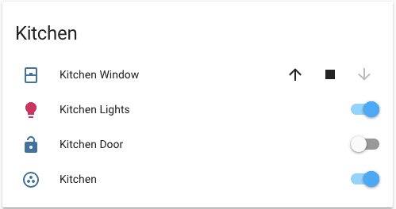

import { Pencil, EllipsisVertical } from 'lucide-react'
import { Separator } from "../../../src/components/ui/separator"

# 实体过滤卡片

<p className="text-xl font-semibold">
实体过滤卡片允许你定义一个实体列表，只在这些实体处于特定状态时才进行跟踪。非常适合用于显示你忘记关闭的灯光或者仅当人在家时显示人员列表。
</p>


<p className='text-center font-extralight'>实体过滤卡片的截图。</p>

这种类型的卡片也可以与其他允许多个实体的卡片一起使用，使你能够使用[一览](https://www.home-assistant.io/dashboards/glance/)或[图片一览](https://www.home-assistant.io/dashboards/picture-glance/)。默认情况下，它使用[实体](https://www.home-assistant.io/dashboards/entities/)卡片模型。

要将实体过滤卡片添加到你的用户界面：

1. 在屏幕右上角，选择编辑 <Pencil className='align-middle inline ' size={18}  />  按钮。
    - 如果这是你第一次编辑仪表板，**编辑仪表板**对话框会出现。
        - 通过编辑仪表板，你将接管这个仪表板的控制权。
        - 这意味着当新的仪表板元素可用时，它将不再自动更新。
        - 一旦你接管控制权，你将无法让这个特定的仪表板恢复自动更新。但是，你可以创建一个新的默认仪表板。
        - 要继续，在对话框中，选择三点 <EllipsisVertical className='align-middle inline' size={18} /> 菜单，然后选择**接管控制**。

2. [添加卡片并自定义操作和功能](https://www.home-assistant.io/dashboards/cards/#adding-cards-to-your-dashboard) 到你的仪表板。

## YAML 配置 

这个卡片只能在 YAML 中配置。


<div className="bg-white p-6 rounded-2xl border border-[rgba(0,0,0,0.12)] mb-4">
#### 配置变量  
    <div>
        <p className="m-0 pb-2" style={{margin:'0'}}> type <span className="text-xs text-red-400">字符串 必填</span></p>
        <p className="text-sm text-gray-400 m-0" style={{margin:'0'}}>`entity-filter`</p>
        <Separator className="my-4" />
    </div>

    <div>
        <p className="m-0 pb-2" style={{margin:'0'}}> entities <span className="text-xs text-red-400">列表 必填</span></p>
        <p className="text-sm text-gray-400 m-0" style={{margin:'0'}}>实体 ID 列表或 `entity` 对象列表，见下文。</p>
        <Separator className="my-4" />
    </div>

    <div>
        <p className="m-0 pb-2" style={{margin:'0'}}> conditions <span className="text-xs text-gray-400">列表 (可选)</span></p>
        <p className="text-sm text-gray-400 m-0" style={{margin:'0'}}>要检查的条件列表。请参阅[可用条件](https://www.home-assistant.io/dashboards/entity-filter/#conditions-options)。*</p>
        <Separator className="my-4" />
    </div>

    <div>
        <p className="m-0 pb-2" style={{margin:'0'}}> state_filter <span className="text-xs text-gray-400">列表 (可选)</span></p>
        <p className="text-sm text-gray-400 m-0" style={{margin:'0'}}>(遗留)表示状态或过滤器的字符串列表。请参阅[可用的遗留过滤器](https://www.home-assistant.io/dashboards/entity-filter/#legacy-state-filters)。*</p>
        <Separator className="my-4" />
    </div>

    <div>
        <p className="m-0 pb-2" style={{margin:'0'}}> card <span className="text-xs text-gray-400">映射 (可选，默认值：实体卡片)</span></p>
        <p className="text-sm text-gray-400 m-0" style={{margin:'0'}}>传递给渲染结果的卡片的额外选项。</p>
        <Separator className="my-4" />
    </div>

    <div>
        <p className="m-0 pb-2" style={{margin:'0'}}> show_empty <span className="text-xs text-gray-400">布尔值 (可选，默认值：true)</span></p>
        <p className="text-sm text-gray-400 m-0" style={{margin:'0'}}>允许在过滤器没有返回实体时隐藏卡片。</p>
        {/* <Separator className="my-4" /> */}
    </div>
</div>

*必须提供一个（`conditions` 或 `state_filter`）

### 实体选项 

如果你将实体定义为对象而不是字符串（通过在实体 ID 前添加 `entity:`），你可以添加更多自定义和配置：


<div className="bg-white p-6 rounded-2xl border border-[rgba(0,0,0,0.12)] mb-4">
#### 配置变量  
    <div>
        <p className="m-0 pb-2" style={{margin:'0'}}> entity <span className="text-xs text-red-400">字符串 必填</span></p>
        <p className="text-sm text-gray-400 m-0" style={{margin:'0'}}>实体 ID。</p>
        <Separator className="my-4" />
    </div>

    <div>
        <p className="m-0 pb-2" style={{margin:'0'}}> type <span className="text-xs text-gray-400">字符串 (可选)</span></p>
        <p className="text-sm text-gray-400 m-0" style={{margin:'0'}}>设置自定义卡片类型：`custom:my-custom-card`。</p>
        <Separator className="my-4" />
    </div>

    <div>
        <p className="m-0 pb-2" style={{margin:'0'}}> name <span className="text-xs text-gray-400">字符串 (可选)</span></p>
        <p className="text-sm text-gray-400 m-0" style={{margin:'0'}}>重写友好名称。</p>
        <Separator className="my-4" />
    </div>

    <div>
        <p className="m-0 pb-2" style={{margin:'0'}}> icon <span className="text-xs text-gray-400">字符串 (可选，默认值：实体域图标)</span></p>
        <p className="text-sm text-gray-400 m-0" style={{margin:'0'}}>重写图标或实体图片。你可以使用 Material Design Icons 中的任何图标。在图标名称前加上 `mdi:`，例如 `mdi:home`。</p>
        <Separator className="my-4" />
    </div>

    <div>
        <p className="m-0 pb-2" style={{margin:'0'}}> secondary_info <span className="text-xs text-gray-400">字符串 (可选)</span></p>
        <p className="text-sm text-gray-400 m-0" style={{margin:'0'}}>显示额外信息。值：`entity-id`、`last-changed`。</p>
        <Separator className="my-4" />
    </div>

    <div>
        <p className="m-0 pb-2" style={{margin:'0'}}> format <span className="text-xs text-gray-400">字符串 (可选)</span></p>
        <p className="text-sm text-gray-400 m-0" style={{margin:'0'}}>状态应如何格式化。目前仅用于时间戳传感器。有效值为：`relative`、`total`、`date`、`time` 和 `datetime`。</p>
        <Separator className="my-4" />
    </div>

    <div>
        <p className="m-0 pb-2" style={{margin:'0'}}> conditions <span className="text-xs text-gray-400">列表 (可选)</span></p>
        <p className="text-sm text-gray-400 m-0" style={{margin:'0'}}>要检查的条件列表。请参阅[可用条件](https://www.home-assistant.io/dashboards/entity-filter/#conditions-options)。*</p>
        <Separator className="my-4" />
    </div>

    <div>
        <p className="m-0 pb-2" style={{margin:'0'}}> state_filter <span className="text-xs text-gray-400">列表 (可选)</span></p>
        <p className="text-sm text-gray-400 m-0" style={{margin:'0'}}>(遗留)表示状态或过滤器的字符串列表。请参阅[可用的遗留过滤器](https://www.home-assistant.io/dashboards/entity-filter/#legacy-state-filters)。*</p>
        {/* <Separator className="my-4" /> */}
    </div>
</div>

*只会应用一个过滤器：如果 `conditions` 存在则应用 `conditions`，否则应用 `state_filter`

## 条件选项 

你可以指定多个 `conditions`，在这种情况下，如果实体匹配每个条件，则会显示该实体。

### 状态

测试实体是否具有指定状态。

```yaml
type: entity-filter
entities:
  - climate.thermostat_living_room
  - climate.thermostat_bed_room
conditions:
  - condition: state
    state: heat
```

```yaml
type: entity-filter
entities:
  - climate.thermostat_living_room
  - climate.thermostat_bed_room
conditions:
  - condition: state
    state_not: "off"
```

```yaml
type: entity-filter
entities:
  - sensor.gas_station_1
  - sensor.gas_station_2
  - sensor.gas_station_3
conditions:
  - condition: state
    state: sensor.gas_station_lowest_price
```


<div className="bg-white p-6 rounded-2xl border border-[rgba(0,0,0,0.12)] mb-4">
#### 配置变量  
    <div>
        <p className="m-0 pb-2" style={{margin:'0'}}> condition <span className="text-xs text-red-400">字符串 必填</span></p>
        <p className="text-sm text-gray-400 m-0" style={{margin:'0'}}>`state`</p>
        <Separator className="my-4" />
    </div>

    <div>
        <p className="m-0 pb-2" style={{margin:'0'}}> state <span className="text-xs text-gray-400">列表 | 字符串 (可选)</span></p>
        <p className="text-sm text-gray-400 m-0" style={{margin:'0'}}>实体状态或 ID 等于此值。可以包含状态数组。*</p>
        <Separator className="my-4" />
    </div>

    <div>
        <p className="m-0 pb-2" style={{margin:'0'}}> state_not <span className="text-xs text-gray-400">列表 | 字符串 (可选)</span></p>
        <p className="text-sm text-gray-400 m-0" style={{margin:'0'}}>实体状态或 ID 不等于此值。可以包含状态数组。*</p>
        <Separator className="my-4" />
    </div>

    <div>
        <p className="m-0 pb-2" style={{margin:'0'}}> entity <span className="text-xs text-gray-400">字符串 (可选)</span></p>
        <p className="text-sm text-gray-400 m-0" style={{margin:'0'}}>用于测试状态条件的可选实体 ID。如果未提供，则测试正在显示的实体的状态。</p>
        {/* <Separator className="my-4" /> */}
    </div>
</div>

*必须提供一个（state 或 state_not）


### 数值状态 

测试实体状态是否符合阈值。

```yaml
type: entity-filter
entities:
  - sensor.outside_temperature
  - sensor.living_room_temperature
  - sensor.bed_room_temperature
conditions:
  - condition: numeric_state
    above: 10
    below: 20
```

<div className="bg-white p-6 rounded-2xl border border-[rgba(0,0,0,0.12)] mb-4">
#### 配置变量  
    <div>
        <p className="m-0 pb-2" style={{margin:'0'}}> condition <span className="text-xs text-red-400">字符串 必填</span></p>
        <p className="text-sm text-gray-400 m-0" style={{margin:'0'}}>`numeric_state`</p>
        <Separator className="my-4" />
    </div>

    <div>
        <p className="m-0 pb-2" style={{margin:'0'}}> above <span className="text-xs text-gray-400">字符串 (可选)</span></p>
        <p className="text-sm text-gray-400 m-0" style={{margin:'0'}}>实体状态或 ID 高于此值。*</p>
        <Separator className="my-4" />
    </div>

    <div>
        <p className="m-0 pb-2" style={{margin:'0'}}> below <span className="text-xs text-gray-400">字符串 (可选)</span></p>
        <p className="text-sm text-gray-400 m-0" style={{margin:'0'}}>实体状态或 ID 低于此值。*</p>
        <Separator className="my-4" />
    </div>

    <div>
        <p className="m-0 pb-2" style={{margin:'0'}}> entity <span className="text-xs text-gray-400">字符串 (可选)</span></p>
        <p className="text-sm text-gray-400 m-0" style={{margin:'0'}}>用于测试状态条件的可选实体 ID。如果未提供，则测试正在显示的实体的状态。</p>
        {/* <Separator className="my-4" /> */}
    </div>
</div>
*至少需要一个（`above` 或 `below`），两者也可用于表示介于两个值之间。

### 屏幕

指定每个屏幕尺寸的实体可见性。UI 中提供了一些屏幕尺寸预设，但你可以在 YAML 中使用任何 CSS 媒体查询。

```yaml
type: entity-filter
entities:
  - sensor.outside_temperature
  - sensor.living_room_temperature
  - sensor.bed_room_temperature
conditions:
  - condition: screen
    media_query: "(min-width: 1280px)"
```

<div className="bg-white p-6 rounded-2xl border border-[rgba(0,0,0,0.12)] mb-4">
#### 配置变量  
    <div>
        <p className="m-0 pb-2" style={{margin:'0'}}> condition <span className="text-xs text-red-400">字符串 必填</span></p>
        <p className="text-sm text-gray-400 m-0" style={{margin:'0'}}>`screen`</p>
        <Separator className="my-4" />
    </div>

    <div>
        <p className="m-0 pb-2" style={{margin:'0'}}> media_query <span className="text-xs text-red-400">字符串 必填</span></p>
        <p className="text-sm text-gray-400 m-0" style={{margin:'0'}}>媒体查询，用于检查允许显示实体的屏幕尺寸。</p>
        {/* <Separator className="my-4" /> */}
    </div>
</div>

### 用户

指定每个用户的实体可见性。

```yaml
type: entity-filter
entities:
  - sensor.outside_temperature
  - sensor.living_room_temperature
  - sensor.bed_room_temperature
conditions:
  - condition: user
    users:
      - 581fca7fdc014b8b894519cc531f9a04
```

<div className="bg-white p-6 rounded-2xl border border-[rgba(0,0,0,0.12)] mb-4">
#### 配置变量  
    <div>
        <p className="m-0 pb-2" style={{margin:'0'}}> condition <span className="text-xs text-red-400">字符串 必填</span></p>
        <p className="text-sm text-gray-400 m-0" style={{margin:'0'}}>`user`</p>
        <Separator className="my-4" />
    </div>

    <div>
        <p className="m-0 pb-2" style={{margin:'0'}}> users <span className="text-xs text-red-400">列表 必填</span></p>
        <p className="text-sm text-gray-400 m-0" style={{margin:'0'}}>可以看到实体的用户 ID（在用户配置页面上找到的唯一十六进制值）。</p>
        {/* <Separator className="my-4" /> */}
    </div>
</div>

### And

指定必须满足两个条件。

```yaml
type: entity-filter
entities:
  - sensor.outside_temperature
  - sensor.living_room_temperature
  - sensor.bed_room_temperature
conditions:
  - condition: and
    conditions:
      - condition: numeric_state
        above: 0
      - condition: user
        users:
          - 581fca7fdc014b8b894519cc531f9a04
```

<div className="bg-white p-6 rounded-2xl border border-[rgba(0,0,0,0.12)] mb-4">
#### 配置变量  
    <div>
        <p className="m-0 pb-2" style={{margin:'0'}}> condition <span className="text-xs text-red-400">字符串 必填</span></p>
        <p className="text-sm text-gray-400 m-0" style={{margin:'0'}}>`and`</p>
        <Separator className="my-4" />
    </div>

    <div>
        <p className="m-0 pb-2" style={{margin:'0'}}> conditions <span className="text-xs text-gray-400">列表 (可选)</span></p>
        <p className="text-sm text-gray-400 m-0" style={{margin:'0'}}>要检查的条件列表。请参阅[可用条件](https://www.home-assistant.io/dashboards/entity-filter/#conditions-options)。</p>
        {/* <Separator className="my-4" /> */}
    </div>
</div>


### OR

指定必须满足至少一个条件。


```yaml
type: entity-filter
entities:
  - sensor.outside_temperature
  - sensor.living_room_temperature
  - sensor.bed_room_temperature
conditions:
  - condition: or
    conditions:
      - condition: numeric_state
        above: 0
      - condition: user
        users:
          - 581fca7fdc014b8b894519cc531f9a04
```

<div className="bg-white p-6 rounded-2xl border border-[rgba(0,0,0,0.12)] mb-4">
#### 配置变量  
    <div>
        <p className="m-0 pb-2" style={{margin:'0'}}> condition <span className="text-xs text-red-400">字符串 必填</span></p>
        <p className="text-sm text-gray-400 m-0" style={{margin:'0'}}>`or`</p>
        <Separator className="my-4" />
    </div>

    <div>
        <p className="m-0 pb-2" style={{margin:'0'}}> conditions <span className="text-xs text-gray-400">列表 (可选)</span></p>
        <p className="text-sm text-gray-400 m-0" style={{margin:'0'}}>要检查的条件列表。请参阅[可用条件](https://www.home-assistant.io/dashboards/entity-filter/#conditions-options)。</p>
        {/* <Separator className="my-4" /> */}
    </div>
</div>

## 遗留状态过滤器 

### 字符串过滤器 

只显示房子里处于活动状态的开关或灯光。

```yaml
type: entity-filter
entities:
  - entity: light.bed_light
    name: Bed
  - light.kitchen_lights
  - light.ceiling_lights
state_filter:
  - "on"
```

使用[一览](https://www.home-assistant.io/dashboards/glance/)只显示在家的人：

```yaml
type: entity-filter
entities:
  - device_tracker.demo_paulus
  - device_tracker.demo_anne_therese
  - device_tracker.demo_home_boy
state_filter:
  - home
card:
  type: glance
  title: People at home
```


<p className='text-center font-extralight'>实体过滤器与一览卡片结合使用。</p>

你还可以指定多个 `state_filter` 条件，在这种情况下，如果实体匹配任何条件，则会显示该实体。

如果你将 `state_filter` 定义为对象而不是字符串，你可以向过滤器添加更多自定义，如下所述。

### 运算符过滤器 

测试实体状态是否符合应用的 `operator`。

<div className="bg-white p-6 rounded-2xl border border-[rgba(0,0,0,0.12)] mb-4">
#### 配置变量  
    <div>
        <p className="m-0 pb-2" style={{margin:'0'}}> value <span className="text-xs text-red-400">字符串 必填</span></p>
        <p className="text-sm text-gray-400 m-0" style={{margin:'0'}}>表示状态的字符串。</p>
        <Separator className="my-4" />
    </div>

    <div>
        <p className="m-0 pb-2" style={{margin:'0'}}> operator <span className="text-xs text-red-400">字符串 必填</span></p>
        <p className="text-sm text-gray-400 m-0" style={{margin:'0'}}>用于比较的运算符。可以是 `==`、`<=`、`<`、`>=`、`>`、`!=`、`in`、`not in` 或 `regex`。</p>
        <Separator className="my-4" />
    </div>

    <div>
        <p className="m-0 pb-2" style={{margin:'0'}}> attribute <span className="text-xs text-gray-400">字符串 (可选)</span></p>
        <p className="text-sm text-gray-400 m-0" style={{margin:'0'}}>用于替代状态的实体属性。</p>
        {/* <Separator className="my-4" /> */}
    </div>
</div>


### 示例 

显示所有在家或在工作的人。

```yaml
type: entity-filter
entities:
  - device_tracker.demo_paulus
  - device_tracker.demo_anne_therese
  - device_tracker.demo_home_boy
state_filter:
  - operator: "=="
    value: home
  - operator: "=="
    value: work
card:
  type: glance
  title: Who's at work or home
```

为单个实体指定过滤器。

```yaml
type: entity-filter
state_filter:
  - "on"
  - operator: ">"
    value: 90
entities:
  - sensor.water_leak
  - sensor.outside_temp
  - entity: sensor.humidity_and_temp
    state_filter:
      - operator: ">"
        value: 50
        attribute: humidity
```

对实体属性使用正则表达式过滤器。下面的正则表达式过滤器寻找长度为1位的表达式，数字在0-7之间（以显示今天或未来7天的假期），并将这些假期作为实体显示在实体过滤卡片中。

```yaml
type: entity-filter
card:
  title: "Upcoming Holidays In Next 7 Days"
  show_header_toggle: false
state_filter:
  - operator: regex
    value: "^([0-7]{1})$"
    attribute: eta
entities:
  - entity: sensor.upcoming_ical_holidays_0
  - entity: sensor.upcoming_ical_holidays_1
  - entity: sensor.upcoming_ical_holidays_2
  - entity: sensor.upcoming_ical_holidays_3
  - entity: sensor.upcoming_ical_holidays_4
show_empty: false
```

