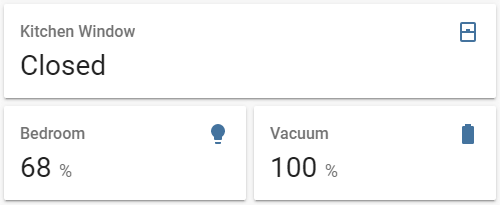

import { Pencil, EllipsisVertical } from 'lucide-react'
import { Separator } from "../../../src/components/ui/separator"

# 实体卡片

<p className="text-xl font-semibold">
实体卡片为你提供实体状态的快速概览。
</p>



<p className='text-center font-extralight'>实体卡片的截图。</p>

要将实体卡片添加到你的用户界面：

1. 在屏幕右上角，选择编辑 <Pencil className='align-middle inline ' size={18}  />  按钮。
    - 如果这是你第一次编辑仪表板，**编辑仪表板**对话框会出现。
        - 通过编辑仪表板，你将接管这个仪表板的控制权。
        - 这意味着当新的仪表板元素可用时，它将不再自动更新。
        - 一旦你接管控制权，你将无法让这个特定的仪表板恢复自动更新。但是，你可以创建一个新的默认仪表板。
        - 要继续，在对话框中，选择三点 <EllipsisVertical className='align-middle inline' size={18} /> 菜单，然后选择**接管控制**。

2. [添加卡片并自定义操作和功能](https://www.home-assistant.io/dashboards/cards/#adding-cards-to-your-dashboard) 到你的仪表板。

这个卡片的所有选项都可以通过用户界面进行配置。

## YAML 配置 

当你使用 YAML 模式或只是更喜欢在 UI 中的代码编辑器中使用 YAML 时，以下 YAML 选项可用。

<div className="bg-white p-6 rounded-2xl border border-[rgba(0,0,0,0.12)] mb-4">
#### 配置变量  
    <div>
        <p className="m-0 pb-2" style={{margin:'0'}}> type <span className="text-xs text-red-400">字符串 必填</span></p>
        <p className="text-sm text-gray-400 m-0" style={{margin:'0'}}>`entity`</p>
        <Separator className="my-4" />
    </div>

    <div>
        <p className="m-0 pb-2" style={{margin:'0'}}> entity <span className="text-xs text-red-400">字符串 必填</span></p>
        <p className="text-sm text-gray-400 m-0" style={{margin:'0'}}>实体 ID。</p>
        <Separator className="my-4" />
    </div>

    <div>
        <p className="m-0 pb-2" style={{margin:'0'}}> name <span className="text-xs text-gray-400">字符串 (可选，默认值：实体名称。)</span></p>
        <p className="text-sm text-gray-400 m-0" style={{margin:'0'}}>实体名称。</p>
        <Separator className="my-4" />
    </div>

    <div>
        <p className="m-0 pb-2" style={{margin:'0'}}> icon <span className="text-xs text-gray-400">字符串 (可选)</span></p>
        <p className="text-sm text-gray-400 m-0" style={{margin:'0'}}>重写图标。</p>
        <Separator className="my-4" />
    </div>

    <div>
        <p className="m-0 pb-2" style={{margin:'0'}}> state_color <span className="text-xs text-gray-400">布尔值 (可选，默认值：false)</span></p>
        <p className="text-sm text-gray-400 m-0" style={{margin:'0'}}>设置为 `true` 以在实体激活时使图标着色。</p>
        <Separator className="my-4" />
    </div>

    <div>
        <p className="m-0 pb-2" style={{margin:'0'}}> attribute <span className="text-xs text-gray-400">字符串 (可选)</span></p>
        <p className="text-sm text-gray-400 m-0" style={{margin:'0'}}>与 `entity` 关联的属性。</p>
        <Separator className="my-4" />
    </div>

    <div>
        <p className="m-0 pb-2" style={{margin:'0'}}> unit <span className="text-xs text-gray-400">字符串 (可选)</span></p>
        <p className="text-sm text-gray-400 m-0" style={{margin:'0'}}>给数据的测量单位。</p>
        <p className="text-sm text-gray-400 m-0" style={{margin:'0'}}>默认值：实体提供的测量单位。</p>
        <Separator className="my-4" />
    </div>

    <div>
        <p className="m-0 pb-2" style={{margin:'0'}}> theme <span className="text-xs text-gray-400">字符串 (可选)</span></p>
        <p className="text-sm text-gray-400 m-0" style={{margin:'0'}}>使用任何已加载的主题覆盖此卡片的主题。有关主题的更多信息，请参阅 [前端文档](https://www.home-assistant.io/integrations/frontend/)。</p>
        <Separator className="my-4" />
    </div>

    <div>
        <p className="m-0 pb-2" style={{margin:'0'}}> footer <span className="text-xs text-gray-400">映射 (可选)</span></p>
        <p className="text-sm text-gray-400 m-0" style={{margin:'0'}}>要渲染的底部小部件。请参阅 [底部文档](/docs/documentation/dashboards/header-footer)。</p>
    </div>
</div>

### 示例

```yaml
- type: entity
  entity: cover.kitchen_window
- type: entity
  entity: light.bedroom
  attribute: brightness
  unit: "%"
- type: entity
  entity: vacuum.downstairs
  name: Vacuum
  icon: "mdi:battery"
  attribute: battery_level
  unit: "%"
```

## 相关主题
- [主题](https://www.home-assistant.io/integrations/frontend/)
- [卡片头部和底部](/docs/documentation/dashboards/header-footer)
- [仪表板卡片](https://www.home-assistant.io/dashboards/cards/)