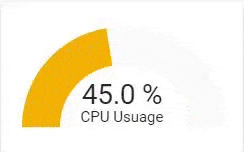
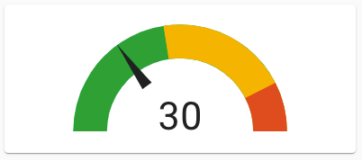
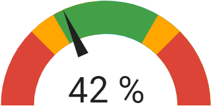

import { Pencil, EllipsisVertical } from 'lucide-react'
import { Separator } from "../../../src/components/ui/separator"

# 仪表卡片

<p className="text-xl font-semibold">
仪表卡片是一种基本卡片，允许以视觉方式查看传感器数据。
</p>


<p className='text-center font-extralight'>仪表卡片的截图。</p>


<p className='text-center font-extralight'>指针模式下的仪表卡片截图。</p>

要将仪表卡片添加到你的用户界面：

1. 在屏幕右上角，选择编辑 <Pencil className='align-middle inline ' size={18}  />  按钮。
    - 如果这是你第一次编辑仪表板，**编辑仪表板**对话框会出现。
        - 通过编辑仪表板，你将接管这个仪表板的控制权。
        - 这意味着当新的仪表板元素可用时，它将不再自动更新。
        - 一旦你接管控制权，你将无法让这个特定的仪表板恢复自动更新。但是，你可以创建一个新的默认仪表板。
        - 要继续，在对话框中，选择三点 <EllipsisVertical className='align-middle inline' size={18} /> 菜单，然后选择**接管控制**。

2. [添加卡片并自定义操作和功能](https://www.home-assistant.io/dashboards/cards/#adding-cards-to-your-dashboard) 到你的仪表板。

这个卡片的所有选项都可以通过用户界面进行配置。

## YAML 配置

当你使用 YAML 模式或只是更喜欢在 UI 中的代码编辑器中使用 YAML 时，以下 YAML 选项可用。

<div className="bg-white p-6 rounded-2xl border border-[rgba(0,0,0,0.12)] mb-4">
#### 配置变量  
    <div>
        <p className="m-0 pb-2" style={{margin:'0'}}> type <span className="text-xs text-red-400">字符串 必填</span></p>
        <p className="text-sm text-gray-400 m-0" style={{margin:'0'}}>`gauge`</p>
        <Separator className="my-4" />
    </div>

    <div>
        <p className="m-0 pb-2" style={{margin:'0'}}> entity <span className="text-xs text-red-400">字符串 必填</span></p>
        <p className="text-sm text-gray-400 m-0" style={{margin:'0'}}>要显示的实体 ID。</p>
        <Separator className="my-4" />
    </div>

    <div>
        <p className="m-0 pb-2" style={{margin:'0'}}> name <span className="text-xs text-gray-400">字符串 (可选，默认值：实体名称)</span></p>
        <p className="text-sm text-gray-400 m-0" style={{margin:'0'}}>仪表实体的名称。</p>
        <Separator className="my-4" />
    </div>

    <div>
        <p className="m-0 pb-2" style={{margin:'0'}}> unit <span className="text-xs text-gray-400">字符串 (可选)</span></p>
        <p className="text-sm text-gray-400 m-0" style={{margin:'0'}}>给数据的测量单位。</p>
        <p className="text-sm text-gray-400 m-0" style={{margin:'0'}}>默认值：实体提供的测量单位。</p>
        <Separator className="my-4" />
    </div>

    <div>
        <p className="m-0 pb-2" style={{margin:'0'}}> theme <span className="text-xs text-gray-400">字符串 (可选，默认值：实体名称)</span></p>
        <p className="text-sm text-gray-400 m-0" style={{margin:'0'}}>使用任何已加载的主题覆盖此卡片的主题。有关主题的更多信息，请参阅 [前端文档](https://www.home-assistant.io/integrations/frontend/)。</p>
        <Separator className="my-4" />
    </div>

    <div>
        <p className="m-0 pb-2" style={{margin:'0'}}> min <span className="text-xs text-gray-400">整数 (可选，默认值：0)</span></p>
        <p className="text-sm text-gray-400 m-0" style={{margin:'0'}}>图表的最小值。</p>
        <Separator className="my-4" />
    </div>

    <div>
        <p className="m-0 pb-2" style={{margin:'0'}}> max <span className="text-xs text-gray-400">整数 (可选，默认值：100)</span></p>
        <p className="text-sm text-gray-400 m-0" style={{margin:'0'}}>图表的最大值。</p>
        <Separator className="my-4" />
    </div>

    <div>
        <p className="m-0 pb-2" style={{margin:'0'}}> needle <span className="text-xs text-gray-400">布尔值 (可选，默认值：false)</span></p>
        <p className="text-sm text-gray-400 m-0" style={{margin:'0'}}>将仪表显示为指针仪表。如果使用分段，需要设置为 true。</p>
        <Separator className="my-4" />
    </div>

    <div>
        <p className="m-0 pb-2" style={{margin:'0'}}> severity <span className="text-xs text-gray-400">映射 (可选)</span></p>
        <p className="text-sm text-gray-400 m-0" style={{margin:'0'}}>允许为不同数字设置颜色。</p>
        {/* <Separator className="my-4" /> */}

        <div className='pl-10'>
            <div>
                <p className="m-0 pb-2" style={{margin:'0'}}> green <span className="text-xs text-red-400">整数 必填</span></p>
                <p className="text-sm text-gray-400 m-0" style={{margin:'0'}}>开始绿色的值。</p>
                <Separator className="my-4" />
            </div>

            <div>
                <p className="m-0 pb-2" style={{margin:'0'}}> yellow <span className="text-xs text-red-400">整数 必填</span></p>
                <p className="text-sm text-gray-400 m-0" style={{margin:'0'}}>开始黄色的值。</p>
                <Separator className="my-4" />
            </div>

            <div>
                <p className="m-0 pb-2" style={{margin:'0'}}> red <span className="text-xs text-red-400">整数 必填</span></p>
                <p className="text-sm text-gray-400 m-0" style={{margin:'0'}}>开始红色的值。</p>
                
            </div>
        </div>
        <Separator className="my-4" />
    </div>

    <div>
        <p className="m-0 pb-2" style={{margin:'0'}}> segments <span className="text-xs text-gray-400">列表 (可选)</span></p>
        <p className="text-sm text-gray-400 m-0" style={{margin:'0'}}>颜色及其对应起始值的列表。分段将覆盖严重性设置。needle 需要设置为 true。</p>
        {/* <Separator className="my-4" /> */}

        <div className='pl-10'>
            <div>
                <p className="m-0 pb-2" style={{margin:'0'}}> from <span className="text-xs text-red-400">整数 必填</span></p>
                <p className="text-sm text-gray-400 m-0" style={{margin:'0'}}>开始颜色的值。</p>
                <Separator className="my-4" />
            </div>

            <div>
                <p className="m-0 pb-2" style={{margin:'0'}}> color <span className="text-xs text-red-400">字符串 必填</span></p>
                <p className="text-sm text-gray-400 m-0" style={{margin:'0'}}>分段的颜色，可以是任何 CSS 颜色声明，如 "red"、"#0000FF" 或 "rgb(255, 120, 0)"。</p>
                <Separator className="my-4" />
            </div>

            <div>
                <p className="m-0 pb-2" style={{margin:'0'}}> label <span className="text-xs text-gray-400">字符串 (可选)</span></p>
                <p className="text-sm text-gray-400 m-0" style={{margin:'0'}}>分段的标签。这将显示而不是值。</p>
                
            </div>
        </div>
        <Separator className="my-4" />
    </div>

    <div>
        <p className="m-0 pb-2" style={{margin:'0'}}> tap_action <span className="text-xs text-gray-400">映射 (可选)</span></p>
        <p className="text-sm text-gray-400 m-0" style={{margin:'0'}}>卡片点击时执行的操作。请参阅 [操作文档](https://www.home-assistant.io/dashboards/actions/#tap-action)。</p>
        <Separator className="my-4" />
    </div>

    <div>
        <p className="m-0 pb-2" style={{margin:'0'}}> hold_action <span className="text-xs text-gray-400">映射 (可选)</span></p>
        <p className="text-sm text-gray-400 m-0" style={{margin:'0'}}>卡片点击并按住时执行的操作。请参阅 [操作文档](https://www.home-assistant.io/dashboards/actions/#tap-action)。</p>
        <Separator className="my-4" />
    </div>

    <div>
        <p className="m-0 pb-2" style={{margin:'0'}}> double_tap_action <span className="text-xs text-gray-400">映射 (可选)</span></p>
        <p className="text-sm text-gray-400 m-0" style={{margin:'0'}}>卡片双击时执行的操作。请参阅 [操作文档](https://www.home-assistant.io/dashboards/actions/#tap-action)。</p>
        {/* <Separator className="my-4" /> */}
    </div>
</div>

### 示例

标题和测量单位：

```yaml
type: gauge
name: CPU Usage
unit: '%'
entity: sensor.cpu_usage
```


<p className='text-center font-extralight'>自定义标题和测量单位的仪表卡片截图。</p>

定义严重性映射：

```yaml
type: gauge
name: With Severity
unit: '%'
entity: sensor.cpu_usage
severity:
  green: 0
  yellow: 45
  red: 85
```


<p className='text-center font-extralight'>多彩分段的仪表卡片截图。</p>

```yaml
type: gauge
entity: sensor.kitchen_humidity
needle: true
min: 20
max: 80
segments:
  - from: 0
    color: '#db4437'
  - from: 35
    color: '#ffa600'
  - from: 40
    color: '#43a047'
  - from: 60
    color: '#ffa600'
  - from: 65
    color: '#db4437'
```

可以使用 CSS 变量（而不是 CSS '#rrggbb'）作为默认仪表分段颜色：

- var(--success-color) 用于绿色
- var(--warning-color) 用于黄色
- var(--error-color) 用于红色
- var(--info-color) 用于蓝色

因此，前面的示例也可以定义为：

```yaml
type: gauge
entity: sensor.kitchen_humidity
needle: true
min: 20
max: 80
segments:
  - from: 0
    color: var(--error-color)
  - from: 35
    color: var(--warning-color)
  - from: 40
    color: var(--success-color)
  - from: 60
    color: var(--warning-color)
  - from: 65
    color: var(--error-color)
```

## 相关主题
- [主题](https://www.home-assistant.io/integrations/frontend/)
- [仪表板卡片](https://www.home-assistant.io/dashboards/cards/)

