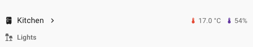

import { Pencil, EllipsisVertical } from 'lucide-react'
import { Separator } from "../../../src/components/ui/separator"

# 标题卡片

<p className="text-xl font-semibold">
标题卡片通过提供标题、图标和导航来组织你的仪表板。此卡片支持[操作](/docs/documentation/dashboards/actions)。
</p>


<p className='text-center font-extralight'>带有标题、徽章和副标题的标题卡片截图。</p>

```yaml
type: heading
heading: Living room
icon: mdi:sofa
badges:
  - type: entity
    entity: sensor.living_room_sensor_temperature
    color: red
  - type: entity
    entity: sensor.living_room_sensor_humidity
    color: deep-purple
```


<div className="bg-white p-6 rounded-2xl border border-[rgba(0,0,0,0.12)] mb-4">
#### 配置变量  
    <div>
        <p className="m-0 pb-2" style={{margin:'0'}}> type <span className="text-xs text-red-400">字符串 必填</span></p>
        <p className="text-sm text-gray-400 m-0" style={{margin:'0'}}>`heading`</p>
        <Separator className="my-4" />
    </div>

    <div>
        <p className="m-0 pb-2" style={{margin:'0'}}> heading <span className="text-xs text-gray-400">字符串 (可选)</span></p>
        <p className="text-sm text-gray-400 m-0" style={{margin:'0'}}>标题文本</p>
        <Separator className="my-4" />
    </div>

    <div>
        <p className="m-0 pb-2" style={{margin:'0'}}> heading_style <span className="text-xs text-gray-400">字符串 (可选，默认值：title)</span></p>
        <p className="text-sm text-gray-400 m-0" style={{margin:'0'}}>标题样式。可以是 `title` 或 `subtitle`。</p>
        <Separator className="my-4" />
    </div>

    <div>
        <p className="m-0 pb-2" style={{margin:'0'}}> icon <span className="text-xs text-gray-400">字符串 (可选)</span></p>
        <p className="text-sm text-gray-400 m-0" style={{margin:'0'}}>标题文本前显示的图标。</p>
        <Separator className="my-4" />
    </div>

    <div>
        <p className="m-0 pb-2" style={{margin:'0'}}> tap_action <span className="text-xs text-gray-400">映射 (可选)</span></p>
        <p className="text-sm text-gray-400 m-0" style={{margin:'0'}}>卡片点击时执行的操作。请参阅[操作文档](https://www.home-assistant.io/dashboards/actions/#tap-action)。默认情况下，它不会执行任何操作。如果配置了操作，标题文本旁边会出现一个箭头图标。</p>
        <Separator className="my-4" />
    </div>

    <div>
        <p className="m-0 pb-2" style={{margin:'0'}}> badges <span className="text-xs text-gray-400">列表 (可选)</span></p>
        <p className="text-sm text-gray-400 m-0" style={{margin:'0'}}>用于显示实体信息的额外小徽章。请参阅[标题徽章](https://www.home-assistant.io/dashboards/heading/#heading-badges)。</p>
        {/* <Separator className="my-4" /> */}
    </div>
</div>

## 标题徽章 

除了标题文本外，每个标题卡片还可以显示小徽章。它们比常规[徽章](https://www.home-assistant.io/dashboards/badges/)更小，且没有背景。标题徽章可以以紧凑和简约的风格显示传感器信息。标题徽章也支持[操作](/docs/documentation/dashboards/actions)。

```yaml
type: entity
entity: light.living_room
```


<div className="bg-white p-6 rounded-2xl border border-[rgba(0,0,0,0.12)] mb-4">
#### 配置变量  
    <div>
        <p className="m-0 pb-2" style={{margin:'0'}}> type <span className="text-xs text-red-400">字符串 必填</span></p>
        <p className="text-sm text-gray-400 m-0" style={{margin:'0'}}>`entity`</p>
        <Separator className="my-4" />
    </div>

    <div>
        <p className="m-0 pb-2" style={{margin:'0'}}> entity <span className="text-xs text-red-400">字符串 必填</span></p>
        <p className="text-sm text-gray-400 m-0" style={{margin:'0'}}>实体 ID。</p>
        <Separator className="my-4" />
    </div>

    <div>
        <p className="m-0 pb-2" style={{margin:'0'}}> name <span className="text-xs text-gray-400">字符串 (可选)</span></p>
        <p className="text-sm text-gray-400 m-0" style={{margin:'0'}}>覆盖实体名称。只有当 `state_content` 包含 `name` 标记时，才会显示名称。</p>
        <Separator className="my-4" />
    </div>

    <div>
        <p className="m-0 pb-2" style={{margin:'0'}}> icon <span className="text-xs text-gray-400">字符串 (可选)</span></p>
        <p className="text-sm text-gray-400 m-0" style={{margin:'0'}}>覆盖实体图标。</p>
        <Separator className="my-4" />
    </div>

    <div>
        <p className="m-0 pb-2" style={{margin:'0'}}> color <span className="text-xs text-gray-400">字符串 (可选，默认值：none)</span></p>
        <p className="text-sm text-gray-400 m-0" style={{margin:'0'}}>设置实体处于活动状态时的颜色。默认情况下，它不会被着色。可以设置为特殊标记 `state`，根据实体的 `state`、`domain` 和 `device_class` 动态着色图标。它还接受[颜色标记](https://www.home-assistant.io/dashboards/tile/#available-colors)或十六进制颜色代码。</p>
        <Separator className="my-4" />
    </div>

    <div>
        <p className="m-0 pb-2" style={{margin:'0'}}> show_icon <span className="text-xs text-gray-400">布尔值 (可选，默认值：true)</span></p>
        <p className="text-sm text-gray-400 m-0" style={{margin:'0'}}>显示图标。</p>
        <Separator className="my-4" />
    </div>

    <div>
        <p className="m-0 pb-2" style={{margin:'0'}}> show_state <span className="text-xs text-gray-400">布尔值 (可选，默认值：true)</span></p>
        <p className="text-sm text-gray-400 m-0" style={{margin:'0'}}>显示状态。</p>
        <Separator className="my-4" />
    </div>

    <div>
        <p className="m-0 pb-2" style={{margin:'0'}}> state_content <span className="text-xs text-gray-400">字符串 | 列表 (可选)</span></p>
        <p className="text-sm text-gray-400 m-0" style={{margin:'0'}}>要显示的状态内容。可以是 `state`、`name`、`last_changed`、`last_updated` 或实体的任何属性。可以是包含单个项目的字符串，也可以是字符串项目列表。默认值取决于实体域。</p>
        <Separator className="my-4" />
    </div>

    <div>
        <p className="m-0 pb-2" style={{margin:'0'}}>tap_action <span className="text-xs text-gray-400">映射 (可选)</span></p>
        <p className="text-sm text-gray-400 m-0" style={{margin:'0'}}>卡片点击时执行的操作。请参阅[操作文档](https://www.home-assistant.io/dashboards/actions/#tap-action)。默认情况下，它不会执行任何操作。</p>
        <Separator className="my-4" />
    </div>

    <div>
        <p className="m-0 pb-2" style={{margin:'0'}}>hold_action <span className="text-xs text-gray-400">映射 (可选)</span></p>
        <p className="text-sm text-gray-400 m-0" style={{margin:'0'}}>点击并按住时执行的操作。请参阅[操作文档](https://www.home-assistant.io/dashboards/actions/#hold-action)。默认情况下，它不会执行任何操作。</p>
        <Separator className="my-4" />
    </div>

    <div>
        <p className="m-0 pb-2" style={{margin:'0'}}>double_tap_action <span className="text-xs text-gray-400">映射 (可选)</span></p>
        <p className="text-sm text-gray-400 m-0" style={{margin:'0'}}>双击时执行的操作。请参阅[操作文档](https://www.home-assistant.io/dashboards/actions/#hold-action)。默认情况下，它不会执行任何操作。</p>
    </div>
</div>

## 相关主题

- [卡片操作](/docs/documentation/dashboards/actions)
- [仪表板卡片](https://www.home-assistant.io/dashboards/cards/)