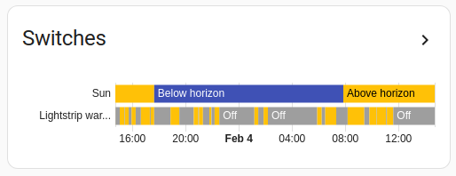
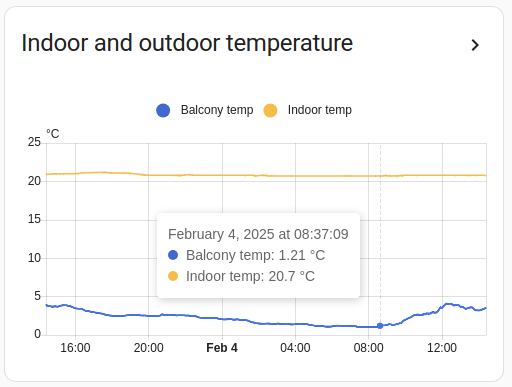

import { Pencil, EllipsisVertical } from 'lucide-react'
import { Separator } from "../../../src/components/ui/separator"

# 历史图表卡片

<p className="text-xl font-semibold">
概览卡片对于在紧凑的概览中组织多个传感器很有用。请记住，这可以与 [entity-filter](https://www.home-assistant.io/dashboards/entity-filter/) 卡片一起使用来创建动态卡片。
</p>


<p className='text-center font-extralight'>当传感器没有定义 `unit_of_measurement` 时的历史图表卡片截图。</p>


<p className='text-center font-extralight'>当传感器定义了 `unit_of_measurement` 时的历史图表卡片截图。</p>

要将历史图表卡片添加到你的用户界面：

1. 在屏幕右上角，选择编辑 <Pencil className='align-middle inline ' size={18}  />  按钮。
    - 如果这是你第一次编辑仪表板，**编辑仪表板**对话框会出现。
        - 通过编辑仪表板，你将接管这个仪表板的控制权。
        - 这意味着当新的仪表板元素可用时，它将不再自动更新。
        - 一旦你接管控制权，你将无法让这个特定的仪表板恢复自动更新。但是，你可以创建一个新的默认仪表板。
        - 要继续，在对话框中，选择三点 <EllipsisVertical className='align-middle inline' size={18} />  菜单，然后选择**接管控制**。

2. [添加卡片并自定义操作和功能](https://www.home-assistant.io/dashboards/cards/#adding-cards-to-your-dashboard) 到你的仪表板。

只有 y 轴和对数刻度设置可以通过用户界面进行配置。要配置此卡片的其他选项，你需要编辑 YAML 配置。

## YAML 配置 

当你使用 YAML 模式或只是更喜欢在 UI 中的代码编辑器中使用 YAML 时，以下 YAML 选项可用。


<div className="bg-white p-6 rounded-2xl border border-[rgba(0,0,0,0.12)] mb-4">
#### 配置变量  
    <div>
        <p className="m-0 pb-2" style={{margin:'0'}}> entity <span className="text-xs text-red-400">字符串 必填</span></p>
        <p className="text-sm text-gray-400 m-0" style={{margin:'0'}}>实体 ID。</p>
        <Separator className="my-4" />
    </div>

    <div>
        <p className="m-0 pb-2" style={{margin:'0'}}> name <span className="text-xs text-gray-400">布尔值 (可选，默认值：false)</span></p>
        <p className="text-sm text-gray-400 m-0" style={{margin:'0'}}>覆盖友好名称。</p>
        {/* <Separator className="my-4" /> */}
    </div>

</div>

### 示例

```yaml
type: history-graph
title: 'My Graph'
entities:
  - sensor.outside_temperature
  - entity: media_player.lounge_room
    name: Main player
```

或者使用更长的时间范围，在一个图表中显示多个实体（只要它们共享相同的 unit_of_measurement）：

```yaml
type: history-graph
title: "Temperatures in the last 48 hours"
hours_to_show: 48
entities:
  - sensor.outside_temperature
  - entity: sensor.lounge_temperature
    name: "Lounge"
  - entity: sensor.attic_temperature
    name: "Attic"
```

## 相关主题
- [主题](https://www.home-assistant.io/integrations/frontend/)
- [仪表板卡片](https://www.home-assistant.io/dashboards/cards/)


