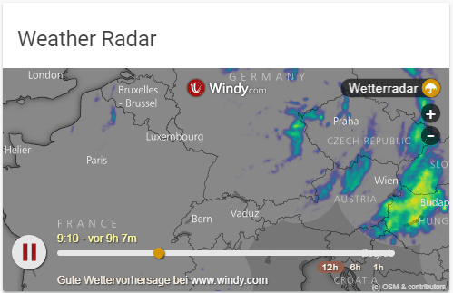

import { Pencil, EllipsisVertical } from 'lucide-react'
import { Separator } from "../../../src/components/ui/separator"

# 网页卡片

<p className="text-xl font-semibold">
网页卡片允许你将你喜欢的网页直接嵌入到Home Assistant中。你也可以嵌入存储在`<config-directory>/www`文件夹中的文件，并使用`/local/<file>`引用它们。
</p>

网页卡片用于[网页仪表板](https://www.home-assistant.io/dashboards/dashboards/#webpage-dashboard)。



<p className='text-center font-extralight'>作为网页的Windy天气雷达。</p>

要将网页卡片添加到你的用户界面：

1. 在屏幕的右上角，选择编辑 <Pencil className='align-middle inline ' size={18}  /> 按钮。
    - 如果这是你第一次编辑仪表板，将出现**编辑仪表板**对话框。
        - 通过编辑仪表板，你将接管此仪表板的控制权。
        - 这意味着当新的仪表板元素可用时，它不再自动更新。
        - 一旦你接管控制权，你就无法让这个特定的仪表板恢复自动更新。但是，你可以创建一个新的默认仪表板。
        - 要继续，在对话框中，选择三点菜单 <EllipsisVertical className='align-middle inline' size={18} />，然后选择**接管控制**。

2. [添加卡片并自定义动作和功能](https://www.home-assistant.io/dashboards/cards/#adding-cards-to-your-dashboard)到你的仪表板。

此卡片的所有选项都可以通过用户界面进行配置。

注意，由于某些网站设置的安全限制，并非每个网页都可以被嵌入。这些限制由你的浏览器强制执行，防止它们被嵌入到Home Assistant仪表板中。

:::tip important
如果你的Home Assistant使用HTTPS，则不能嵌入使用HTTP的网站。
:::

## YAML配置

当你使用YAML模式或只是更喜欢在UI的代码编辑器中使用YAML时，以下YAML选项可用。


<div className="bg-white p-6 rounded-2xl border border-[rgba(0,0,0,0.12)] mb-4">
#### 配置变量  
    <div>
        <p className="m-0 pb-2" style={{margin:'0'}}> type <span className="text-xs text-red-400">字符串 必需</span></p>
        <p className="text-sm text-gray-400 m-0" style={{margin:'0'}}>`iframe`</p>
        <Separator className="my-4" />
    </div>

    <div>
        <p className="m-0 pb-2" style={{margin:'0'}}> url <span className="text-xs text-red-400">字符串 必需</span></p>
        <p className="text-sm text-gray-400 m-0" style={{margin:'0'}}>网站URL。</p>
        <Separator className="my-4" />
    </div>

    <div>
        <p className="m-0 pb-2" style={{margin:'0'}}> aspect_ratio <span className="text-xs text-gray-400">字符串 (可选，默认: 50%)</span></p>
        <p className="text-sm text-gray-400 m-0" style={{margin:'0'}}>强制图像的高度为宽度的比例。有效格式：高度百分比值(`23%`)或用冒号或"x"分隔符表示的比例(`16:9`或`16x9`)。对于比例，第二个元素可以省略，默认为"1"(`1.78`等同于`1.78:1`)。</p>
        <Separator className="my-4" />
    </div>

    <div>
        <p className="m-0 pb-2" style={{margin:'0'}}> allow_open_top_navigation <span className="text-xs text-gray-400">布尔值 (可选，默认: false)</span></p>
        <p className="text-sm text-gray-400 m-0" style={{margin:'0'}}>允许用户通过在Home Assistant移动应用中打开默认浏览器来打开iframe内容链接。默认为false，因为它在iframe沙盒属性上添加了allow-top-navigation-by-user-activation，这不太安全。所以如果你需要它并且对iframe内容有信心，请将其设置为true。</p>
        <Separator className="my-4" />
    </div>

    <div>
        <p className="m-0 pb-2" style={{margin:'0'}}> title <span className="text-xs text-gray-400">字符串 (可选)</span></p>
        <p className="text-sm text-gray-400 m-0" style={{margin:'0'}}>卡片标题。</p>
        <Separator className="my-4" />
    </div>

    <div>
        <p className="m-0 pb-2" style={{margin:'0'}}> allow <span className="text-xs text-gray-400">字符串 (可选，默认: fullscreen)</span></p>
        <p className="text-sm text-gray-400 m-0" style={{margin:'0'}}>iframe的[权限策略](https://developer.mozilla.org/en-US/docs/Web/HTTP/Headers/Permissions-Policy#iframes)，即[`allow`](https://developer.mozilla.org/en-US/docs/Web/HTML/Element/iframe#allow)属性的值。</p>
        <Separator className="my-4" />
    </div>

    <div>
        <p className="m-0 pb-2" style={{margin:'0'}}> disable_sandbox <span className="text-xs text-gray-400">布尔值 (可选，默认: false)</span></p>
        <p className="text-sm text-gray-400 m-0" style={{margin:'0'}}>禁用iframe的[sandbox](https://developer.mozilla.org/en-US/docs/Web/HTML/Element/iframe#attr-sandbox)属性，例如，在Chrome中查看PDF时需要。这不太安全，只有在你信任iframe内容时才应使用。</p>
        <Separator className="my-4" />
    </div>


</div>


### 示例
```yaml
type: iframe
url: https://www.home-assistant.io
aspect_ratio: 75%
```

## 相关主题

- [网页仪表板](https://www.home-assistant.io/dashboards/dashboards/#webpage-dashboard)

- [仪表板卡片](https://www.home-assistant.io/dashboards/cards/)