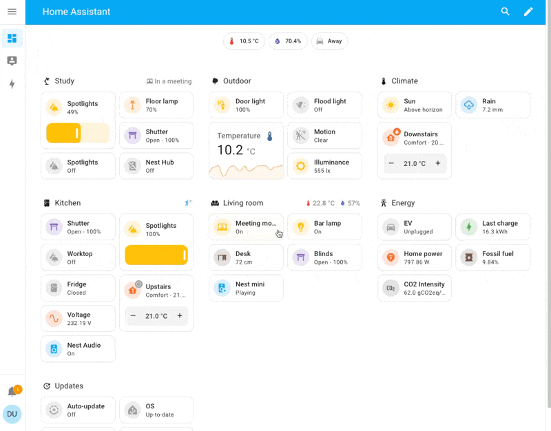

# 仪表板主界面

Home Assistant仪表板允许你显示关于智能家居的信息。仪表板可以自定义，并提供了强大的方式来通过移动设备或桌面管理你的家。

你可以使用各种选项自定义你的仪表板：

- 不同的卡片类型来可视化你的数据并控制你的智能家居设备。
- [主题](https://www.home-assistant.io/integrations/frontend/#defining-themes)（甚至可以按卡片单独设置）。
- 覆盖实体的名称和图标。
- 使用来自我们出色社区的自定义卡片。

## 探索交互式演示仪表板

通过[交互式演示](https://demo.home-assistant.io/)亲自尝试。

## 开始创建你自己的仪表板

要创建你自己的仪表板，请按照[创建新仪表板](/docs/documentation/dashboards/multiple-dashboard#创建新仪表板)中的步骤操作。

## 讨论仪表板
    - 欢迎在[前端仓库](https://github.com/home-assistant/frontend/)中提出建议
    - 如需仪表板帮助，请加入[我们的聊天](https://www.home-assistant.io/join-chat/)中的 `#frontend` 频道或[我们的论坛](https://community.home-assistant.io/c/projects/frontend)

## 相关主题
    - [创建新仪表板](/docs/documentation/dashboards/multiple-dashboard#创建新仪表板)
    - [关于卡片](/docs/documentation/dashboards/cards)

## 相关链接

- [交互式仪表板演示](https://demo.home-assistant.io/)
- [Home Assistant卡片](https://home-assistant-cards.bessarabov.com/)
- [社区自定义卡片](https://github.com/custom-cards)