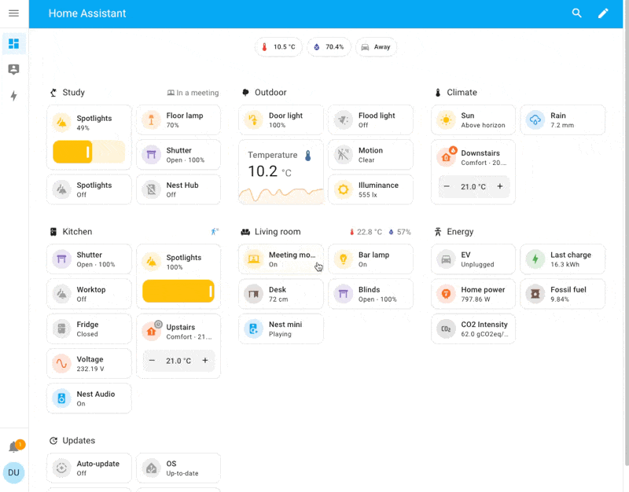

# dashboard 主界面

Home Assistant dashboards allow you to display information about your smart home. Dashboards are customizable and provide a powerful way to manage your home from your mobile or desktop.

You can customize your dashboard using various options:

- Different card types to visualize your data and control your smart home devices.
- [Themes](https://www.home-assistant.io/integrations/frontend/#defining-themes) (even at a per card basis).
- Override names and icons of entities.
- Use custom cards from our amazing community.

## Explore the interactive demo dashboard 

Try it yourself with [the interactive demo](https://demo.home-assistant.io/).

## Get started with your own dashboard

To create your own dashboard, follow the steps on [creating a new dashboard](https://www.home-assistant.io/dashboards/dashboards/#creating-a-new-dashboard).

## Discuss dashboard 
    - Suggestions are welcome in the [frontend repository](https://github.com/home-assistant/frontend/)
    - For help with dashboards, join the `#frontend` channel on [our chat](https://www.home-assistant.io/join-chat/) or [our forums](https://community.home-assistant.io/c/projects/frontend)

## Related topics
    - [Creating a new dashboard](https://www.home-assistant.io/dashboards/dashboards/#creating-a-new-dashboard)
    - [About cards](https://www.home-assistant.io/dashboards/cards/)

## Related links

- [Interactive dashboard demo](https://demo.home-assistant.io/)
- [Home Assistant cards](https://home-assistant-cards.bessarabov.com/)
- [Community custom cards](https://github.com/custom-cards)