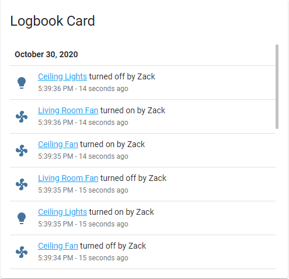

import { Pencil, EllipsisVertical } from 'lucide-react'
import { Separator } from "../../../src/components/ui/separator"

# 日志卡片

<p className="text-xl font-semibold">
日志卡片显示特定实体、设备、区域和/或标签的日志条目。
</p>


<p className='text-center font-extralight'>日志卡片的截图。</p>

要将日志卡片添加到你的用户界面：

1. 在屏幕右上角，选择编辑 <Pencil className='align-middle inline ' size={18}  />  按钮。
    - 如果这是你第一次编辑仪表板，**编辑仪表板**对话框会出现。
        - 通过编辑仪表板，你将接管这个仪表板的控制权。
        - 这意味着当新的仪表板元素可用时，它将不再自动更新。
        - 一旦你接管控制权，你将无法让这个特定的仪表板恢复自动更新。但是，你可以创建一个新的默认仪表板。
        - 要继续，在对话框中，选择三点 <EllipsisVertical className='align-middle inline' size={18} />  菜单，然后选择**接管控制**。

2. [添加卡片并自定义操作和功能](https://www.home-assistant.io/dashboards/cards/#adding-cards-to-your-dashboard) 到你的仪表板。

## 卡片设置 


<div className="bg-white p-6 rounded-2xl border border-[rgba(0,0,0,0.12)] mb-4">
    <div>
        <p className="m-0 pb-2" style={{margin:'0'}}> 目标 </p>
        <p className="text-sm text-gray-400 m-0" style={{margin:'0'}}>卡片中将显示其日志条目的实体、设备、区域和标签。有关更多信息，请参阅 [目标选择器](https://www.home-assistant.io/docs/blueprint/selectors/#target-selector)。</p>
        <Separator className="my-4" />
    </div>

    <div>
        <p className="m-0 pb-2" style={{margin:'0'}}> 标题 </p>
        <p className="text-sm text-gray-400 m-0" style={{margin:'0'}}>显示在卡片顶部的标题。</p>
        <Separator className="my-4" />
    </div>

    <div>
        <p className="m-0 pb-2" style={{margin:'0'}}> 显示小时数 </p>
        <p className="text-sm text-gray-400 m-0" style={{margin:'0'}}>卡片中将跟踪的过去小时数。</p>
        <Separator className="my-4" />
    </div>

    <div>
        <p className="m-0 pb-2" style={{margin:'0'}}> 主题 </p>
        <p className="text-sm text-gray-400 m-0" style={{margin:'0'}}>用于此卡片的任何已加载主题的名称。有关主题的更多信息，请参阅 [前端文档](https://www.home-assistant.io/integrations/frontend/)。</p>
        {/* <Separator className="my-4" /> */}
    </div>

</div>

## YAML 配置 

当你使用 YAML 模式或只是更喜欢在 UI 中的代码编辑器中使用 YAML 时，以下 YAML 选项可用。

<div className="bg-white p-6 rounded-2xl border border-[rgba(0,0,0,0.12)] mb-4">
#### 配置变量  
    <div>
        <p className="m-0 pb-2" style={{margin:'0'}}> type <span className="text-xs text-red-400">字符串 必填</span></p>
        <p className="text-sm text-gray-400 m-0" style={{margin:'0'}}>`logbook`</p>
        <Separator className="my-4" />
    </div>

    <div>
        <p className="m-0 pb-2" style={{margin:'0'}}> target <span className="text-xs text-red-400">列表 必填</span></p>
        <p className="text-sm text-gray-400 m-0" style={{margin:'0'}}>卡片使用的目标。</p>
        <Separator className="my-4" />
    </div>

    <div>
        <p className="m-0 pb-2" style={{margin:'0'}}> title <span className="text-xs text-gray-400">字符串 (可选)</span></p>
        <p className="text-sm text-gray-400 m-0" style={{margin:'0'}}>卡片标题。</p>
        <Separator className="my-4" />
    </div>

    <div>
        <p className="m-0 pb-2" style={{margin:'0'}}> hours_to_show <span className="text-xs text-gray-400">整数 (可选，默认值：24)</span></p>
        <p className="text-sm text-gray-400 m-0" style={{margin:'0'}}>要跟踪的过去小时数。最小值为 1 小时。大值可能导致渲染延迟，特别是当选定的实体有很多状态变化时。</p>
        <Separator className="my-4" />
    </div>

    <div>
        <p className="m-0 pb-2" style={{margin:'0'}}> theme <span className="text-xs text-gray-400">字符串 (可选)</span></p>
        <p className="text-sm text-gray-400 m-0" style={{margin:'0'}}>使用任何已加载的主题覆盖此卡片的主题。有关主题的更多信息，请参阅 [前端文档](https://www.home-assistant.io/integrations/frontend/)。</p>
        <Separator className="my-4" />
    </div>

    <div>
        <p className="m-0 pb-2" style={{margin:'0'}}> double_tap_action <span className="text-xs text-gray-400">映射 (可选)</span></p>
        <p className="text-sm text-gray-400 m-0" style={{margin:'0'}}>卡片双击时执行的操作。请参阅 [操作文档](https://www.home-assistant.io/dashboards/actions/#hold-action)。</p>
        {/* <Separator className="my-4" /> */}
    </div>

</div>

### 示例 

```yaml
type: logbook
target:
  entity_id:
    - fan.ceiling_fan
    - fan.living_room_fan
    - light.ceiling_lights
hours_to_show: 24
```

覆盖名称示例：

```yaml
type: logbook
target:
  area_id: living_room
  device_id:
    - ff22a1889a6149c5ab6327a8236ae704
    - 52c050ca1a744e238ad94d170651f96b
  entity_id:
    - light.hallway
    - light.landing
  label_id:
    - lights
```

## 相关主题

- [主题](https://www.home-assistant.io/integrations/frontend/)
- [仪表板卡片](https://www.home-assistant.io/dashboards/cards/)