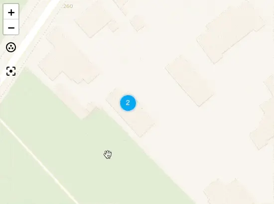
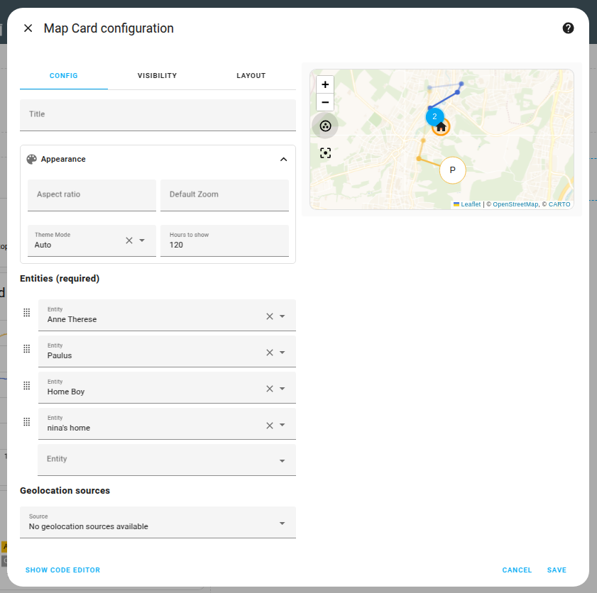

import { Pencil, EllipsisVertical, House } from 'lucide-react'
import { Separator } from "../../../src/components/ui/separator"

# 地图卡片

<p className="text-xl font-semibold">
地图卡片允许你在地图上显示你的家庭区域、实体和其他预定义区域。这个卡片用于[地图仪表板](https://www.home-assistant.io/dashboards/dashboards/#map-dashboard)，它是默认仪表板之一。
</p>


<p className='text-center font-extralight'>地图卡片的截图。</p>

## 将地图卡片添加到你的仪表板 

1. 在屏幕右上角，选择编辑 <Pencil className='align-middle inline ' size={18}  />  按钮。
    - 如果这是你第一次编辑仪表板，**编辑仪表板**对话框会出现。
        - 通过编辑仪表板，你将接管这个仪表板的控制权。
        - 这意味着当新的仪表板元素可用时，它将不再自动更新。
        - 一旦你接管控制权，你将无法让这个特定的仪表板恢复自动更新。但是，你可以创建一个新的默认仪表板。
        - 要继续，在对话框中，选择三点 <EllipsisVertical className='align-middle inline' size={18} />  菜单，然后选择**接管控制**。

2. [添加地图卡片](https://www.home-assistant.io/dashboards/cards/#adding-cards-to-your-dashboard) 到你的仪表板。

3. 默认情况下，你会在地图上看到房屋 <House className='align-middle inline ' size={18}  /> 图标。它代表你的[家庭区域](https://www.home-assistant.io/integrations/zone/#about-the-home-zone)。
    - 要更改你家的位置，你需要[在常规设置中编辑你家的位置](https://www.home-assistant.io/docs/configuration/basic/#editing-the-general-settings)。
        
4. 要了解如何在地图上显示额外的区域，请按照[添加新区域](https://www.home-assistant.io/integrations/zone/#adding-a-new-zone-or-editing-zones)的步骤进行操作。
5. 要在地图上显示其他元素，可以在**实体**下添加它们，或使用**地理位置源**。
    - 有关选项的描述，请参阅 [YAML 配置](https://www.home-assistant.io/dashboards/map/#yaml-configuration)部分。它也适用于 UI 中显示的选项。
    - **信息**：实体列表显示你家中可用的设备跟踪器，例如安装了配套应用的手机。
        - 如果你想查看实体过去位置的轨迹，你需要在**显示小时数**下定义时间范围。
    - 有关存在检测的更多信息，请参阅[存在检测入门教程](https://www.home-assistant.io/getting-started/presence-detection/)。


## 配置选项 

此卡片的所有选项都可以通过用户界面进行配置。有关选项的详细描述，请参阅 [YAML 配置](https://www.home-assistant.io/dashboards/map/#yaml-configuration)部分。它也适用于 UI 中显示的选项。


## YAML 配置 

当你使用 YAML 模式或只是更喜欢在 UI 中的代码编辑器中使用 YAML 时，以下 YAML 选项可用。

<div className="bg-white p-6 rounded-2xl border border-[rgba(0,0,0,0.12)] mb-4">
#### 配置变量  
    <div>
        <p className="m-0 pb-2" style={{margin:'0'}}> type <span className="text-xs text-red-400">字符串 必填</span></p>
        <p className="text-sm text-gray-400 m-0" style={{margin:'0'}}>`map`</p>
        <Separator className="my-4" />
    </div>

    <div>
        <p className="m-0 pb-2" style={{margin:'0'}}> entities <span className="text-xs text-red-400">列表 (可选)</span></p>
        <p className="text-sm text-gray-400 m-0" style={{margin:'0'}}>实体 ID 列表或 `entity` 对象列表（参见[下文](https://www.home-assistant.io/dashboards/map/#options-for-entities)）。此项、`show_all` 或 `geo_location_sources` 配置选项之一是必需的。</p>
        <Separator className="my-4" />
    </div>

    <div>
        <p className="m-0 pb-2" style={{margin:'0'}}> geo_location_sources <span className="text-xs text-gray-400">列表 (可选)</span></p>
        <p className="text-sm text-gray-400 m-0" style={{margin:'0'}}>地理位置源列表或 `source` 对象列表（参见[下文](https://www.home-assistant.io/dashboards/map/#options-for-geolocation-sources)）。具有该源的所有当前实体将显示在地图上。有效源请参见[地理位置](https://www.home-assistant.io/integrations/geo_location/)平台。设置为 `all` 以使用所有可用源。此项、`show_all` 或 `entities` 配置选项之一是必需的。</p>
        <Separator className="my-4" />
    </div>

    <div>
        <p className="m-0 pb-2" style={{margin:'0'}}> show_all <span className="text-xs text-gray-400">布尔值 (可选，默认值：false)</span></p>
        <p className="text-sm text-gray-400 m-0" style={{margin:'0'}}>自动将所有具有坐标的实体添加到地图卡片。（地图面板的默认行为）</p>
        <Separator className="my-4" />
    </div>

    <div>
        <p className="m-0 pb-2" style={{margin:'0'}}> auto_fit <span className="text-xs text-gray-400">布尔值 (可选，默认值：false)</span></p>
        <p className="text-sm text-gray-400 m-0" style={{margin:'0'}}>地图将通过在每次实体更新时调整地图视口来跟踪移动的 `entities`。</p>
        <Separator className="my-4" />
    </div>


    <div>
        <p className="m-0 pb-2" style={{margin:'0'}}> fit_zones <span className="text-xs text-gray-400">布尔值 (可选，默认值：false)</span></p>
        <p className="text-sm text-gray-400 m-0" style={{margin:'0'}}>地图在调整其视口时是否应考虑指定实体列表中的区域。</p>
        <Separator className="my-4" />
    </div>

    <div>
        <p className="m-0 pb-2" style={{margin:'0'}}> title <span className="text-xs text-gray-400">字符串 (可选)</span></p>
        <p className="text-sm text-gray-400 m-0" style={{margin:'0'}}>卡片标题。</p>
        <Separator className="my-4" />
    </div>

    <div>
        <p className="m-0 pb-2" style={{margin:'0'}}> aspect_ratio <span className="text-xs text-gray-400">字符串 (可选)</span></p>
        <p className="text-sm text-gray-400 m-0" style={{margin:'0'}}>强制图像的高度为宽度的比例。有效格式：高度百分比值（`23%`）或用冒号或"x"分隔符表示的比例（`16:9` 或 `16x9`）。对于比例，第二个元素可以省略，默认为"1"（`1.78` 等同于 `1.78:1`）。</p>
        <Separator className="my-4" />
    </div>

    <div>
        <p className="m-0 pb-2" style={{margin:'0'}}> default_zoom <span className="text-xs text-gray-400">整数 (可选)</span></p>
        <p className="text-sm text-gray-400 m-0" style={{margin:'0'}}>地图的默认缩放级别。使用较小的数字进行缩小，使用较大的数字进行放大。</p>
        <p className="text-sm text-gray-400 m-0" style={{margin:'0'}}>默认值：14（或适合显示所有可见标记所需的任何缩放级别）。</p>

        <Separator className="my-4" />
    </div>

    <div>
        <p className="m-0 pb-2" style={{margin:'0'}}> theme_mode <span className="text-xs text-gray-400">字符串 (可选，默认值：auto)</span></p>
        <p className="text-sm text-gray-400 m-0" style={{margin:'0'}}>覆盖主题，强制地图以浅色模式（`theme_mode: light`）或深色模式（`theme_mode: dark`）显示。默认（`theme_mode: auto`）将遵循主题设置。</p>
        <Separator className="my-4" />
    </div>

    <div>
        <p className="m-0 pb-2" style={{margin:'0'}}> hours_to_show <span className="text-xs text-gray-400">整数 (可选，默认值：0)</span></p>
        <p className="text-sm text-gray-400 m-0" style={{margin:'0'}}>显示以前位置的路径。在地图上显示为路径的小时数。</p>
        {/* <Separator className="my-4" /> */}
    </div>

</div>

:::warning 重要
只有具有纬度和经度属性的实体才会显示在地图上。
:::

:::note 
如果在地图窗口中适合所有可见实体标记后，`default_zoom` 值设置为高于当前缩放级别，则该值将被忽略。换句话说，这只能用于默认情况下缩小地图。
:::

## 实体选项 

如果你将实体定义为对象而不是字符串（通过在实体 ID 前添加 `entity:`），你可以添加更多自定义和配置。


<div className="bg-white p-6 rounded-2xl border border-[rgba(0,0,0,0.12)] mb-4">
#### 配置变量  
    <div>
        <p className="m-0 pb-2" style={{margin:'0'}}> entity <span className="text-xs text-red-400">字符串 必填</span></p>
        <p className="text-sm text-gray-400 m-0" style={{margin:'0'}}>实体 ID。</p>
        <Separator className="my-4" />
    </div>

    <div>
        <p className="m-0 pb-2" style={{margin:'0'}}> name <span className="text-xs text-gray-400">字符串 (可选)</span></p>
        <p className="text-sm text-gray-400 m-0" style={{margin:'0'}}>替换标记的默认标签。</p>
        <Separator className="my-4" />
    </div>

    <div>
        <p className="m-0 pb-2" style={{margin:'0'}}> label_mode <span className="text-xs text-gray-400">字符串 (可选，默认值：name)</span></p>
        <p className="text-sm text-gray-400 m-0" style={{margin:'0'}}>设置为 `icon` 时，在标记中渲染实体的图标而不是文本。设置为 `state` 或 `attribute` 时，将实体的状态或属性渲染为地图标记的标签，而不是实体的名称。此选项不适用于 [zone](https://www.home-assistant.io/integrations/zone/) 实体，因为它们不使用标签而是图标。</p>
        <Separator className="my-4" />
    </div>

    <div>
        <p className="m-0 pb-2" style={{margin:'0'}}> attribute <span className="text-xs text-gray-400">字符串 (可选)</span></p>
        <p className="text-sm text-gray-400 m-0" style={{margin:'0'}}>当 `label_mode` 设置为 `attribute` 时的实体属性。</p>
        <Separator className="my-4" />
    </div>

    <div>
        <p className="m-0 pb-2" style={{margin:'0'}}> focus <span className="text-xs text-gray-400">布尔值 (可选，默认值：true)</span></p>
        <p className="text-sm text-gray-400 m-0" style={{margin:'0'}}>设置为 `false` 时，在确定地图的默认缩放或适配时不会考虑此实体。</p>
        {/* <Separator className="my-4" /> */}
    </div>

</div>

## 地理位置源选项: 

如果你将地理位置源定义为对象而不是字符串（通过在 ID 前添加 `source:`），你可以添加更多自定义和配置。


<div className="bg-white p-6 rounded-2xl border border-[rgba(0,0,0,0.12)] mb-4">
#### 配置变量  
    <div>
        <p className="m-0 pb-2" style={{margin:'0'}}> source <span className="text-xs text-red-400">字符串 必填</span></p>
        <p className="text-sm text-gray-400 m-0" style={{margin:'0'}}>地理位置源的名称，或 `all`。</p>
        <Separator className="my-4" />
    </div>

    <div>
        <p className="m-0 pb-2" style={{margin:'0'}}> label_mode <span className="text-xs text-gray-400">字符串 (可选，默认值：name)</span></p>
        <p className="text-sm text-gray-400 m-0" style={{margin:'0'}}>设置为 `icon` 时，在标记中渲染实体的图标而不是文本。设置为 `state` 或 `attribute` 时，将实体的状态或属性渲染为地图标记的标签，而不是实体的名称。此选项不适用于区域实体，因为它们不使用标签而是图标。</p>
        <Separator className="my-4" />
    </div>

     <div>
        <p className="m-0 pb-2" style={{margin:'0'}}> attribute <span className="text-xs text-gray-400">字符串 (可选)</span></p>
        <p className="text-sm text-gray-400 m-0" style={{margin:'0'}}>当 `label_mode` 设置为 `attribute` 时的实体属性。</p>
        <Separator className="my-4" />
    </div>

    <div>
        <p className="m-0 pb-2" style={{margin:'0'}}> focus <span className="text-xs text-gray-400">布尔值 (可选，默认值：true)</span></p>
        <p className="text-sm text-gray-400 m-0" style={{margin:'0'}}>设置为 `false` 时，在确定地图的默认缩放或适配时不会考虑此实体。</p>
        {/* <Separator className="my-4" /> */}
    </div>

</div>

## 示例

```yaml
type: map
aspect_ratio: 16:9
default_zoom: 8
auto_fit: true
entities:
  - device_tracker.demo_paulus
  - zone.home
```

```yaml
type: map
geo_location_sources:
  - nsw_rural_fire_service_feed
  - source: gdacs
    focus: false
entities:
  - zone.home
```

```yaml
type: map
entities:
  - device_tracker.demo_paulus
  - entity: sensor.gas_station_gas_price
    label_mode: state
    focus: false
hours_to_show: 48
```

## 相关主题
- [地图仪表板](https://www.home-assistant.io/dashboards/dashboards/#map-dashboard)
- [主题](https://www.home-assistant.io/integrations/frontend/)
- [仪表板卡片](https://www.home-assistant.io/dashboards/cards/)
- [编辑你的家庭位置](https://www.home-assistant.io/docs/configuration/basic/#editing-the-general-settings)
- [存在检测入门教程](https://www.home-assistant.io/getting-started/presence-detection/)