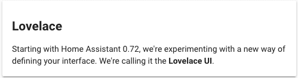
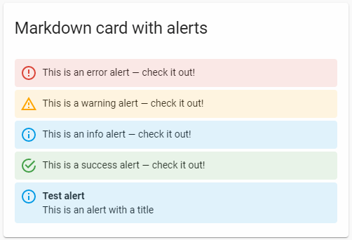
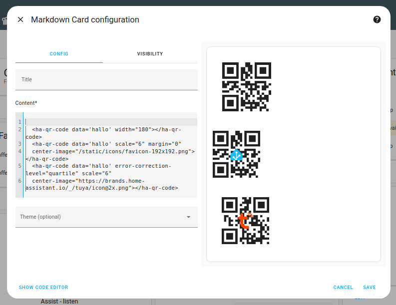

import { Pencil, EllipsisVertical, House } from 'lucide-react'
import { Separator } from "../../../src/components/ui/separator"

# Markdown卡片

<p className="text-xl font-semibold">
Markdown卡片用于渲染[Markdown](https://commonmark.org/help/)。
</p>


<p className='text-center font-extralight'>Markdown卡片的截图。</p>

渲染器使用[Marked.js](https://marked.js.org/)，它支持[几种Markdown规范](https://marked.js.org/#specifications)，包括CommonMark、GitHub风格的Markdown(GFM)和`markdown.pl`。

要将Markdown卡片添加到你的用户界面：

1. 在屏幕右上角，选择编辑 <Pencil className='align-middle inline ' size={18}  />  按钮。
    - 如果这是你第一次编辑仪表板，**编辑仪表板**对话框会出现。
        - 通过编辑仪表板，你将接管这个仪表板的控制权。
        - 这意味着当新的仪表板元素可用时，它将不再自动更新。
        - 一旦你接管控制权，你将无法让这个特定的仪表板恢复自动更新。但是，你可以创建一个新的默认仪表板。
        - 要继续，在对话框中，选择三点 <EllipsisVertical className='align-middle inline' size={18} />  菜单，然后选择**接管控制**。

2. [添加卡片并自定义操作和功能](https://www.home-assistant.io/dashboards/cards/#adding-cards-to-your-dashboard) 到你的仪表板。


## YAML 配置 

当你使用 YAML 模式或只是更喜欢在 UI 中的代码编辑器中使用 YAML 时，以下 YAML 选项可用。

<div className="bg-white p-6 rounded-2xl border border-[rgba(0,0,0,0.12)] mb-4">
#### 配置变量  
    <div>
        <p className="m-0 pb-2" style={{margin:'0'}}> type <span className="text-xs text-red-400">字符串 必填</span></p>
        <p className="text-sm text-gray-400 m-0" style={{margin:'0'}}>`markdown`</p>
        <Separator className="my-4" />
    </div>

    <div>
        <p className="m-0 pb-2" style={{margin:'0'}}> content <span className="text-xs text-red-400">字符串 必填</span></p>
        <p className="text-sm text-gray-400 m-0" style={{margin:'0'}}>要作为[Markdown](https://commonmark.org/help/)渲染的内容。可能包含[模板](https://www.home-assistant.io/docs/configuration/templating/)。</p>
        <Separator className="my-4" />
    </div>

    <div>
        <p className="m-0 pb-2" style={{margin:'0'}}> title <span className="text-xs text-gray-400">字符串 (可选，默认值：无)</span></p>
        <p className="text-sm text-gray-400 m-0" style={{margin:'0'}}>卡片标题。</p>
        <Separator className="my-4" />
    </div>

    <div>
        <p className="m-0 pb-2" style={{margin:'0'}}> card_size <span className="text-xs text-gray-400">整数 (可选，默认值：无)</span></p>
        <p className="text-sm text-gray-400 m-0" style={{margin:'0'}}>如果Markdown卡片包含模板，美观放置卡片的算法可能会有问题。你可以使用这个值来帮助它估计卡片的高度，单位为50像素（大约是默认大小的3行文本）。(例如，`4`)</p>
        <Separator className="my-4" />
    </div>

    <div>
        <p className="m-0 pb-2" style={{margin:'0'}}> entity_id <span className="text-xs text-gray-400">字符串 | 列表 (可选，默认值：无)</span></p>
        <p className="text-sm text-gray-400 m-0" style={{margin:'0'}}>实体ID列表，使`content:`中的模板只对这些实体的状态变化做出反应。如果自动分析未能找到所有相关实体，可以使用此项。</p>
        <Separator className="my-4" />
    </div>

    <div>
        <p className="m-0 pb-2" style={{margin:'0'}}> theme <span className="text-xs text-gray-400">字符串 (可选)</span></p>
        <p className="text-sm text-gray-400 m-0" style={{margin:'0'}}>使用任何已加载的主题覆盖此卡片的主题。有关主题的更多信息，请参阅[前端文档](https://www.home-assistant.io/integrations/frontend/)。</p>
        <Separator className="my-4" />
    </div>

     <div>
        <p className="m-0 pb-2" style={{margin:'0'}}> show_empty <span className="text-xs text-gray-400">布尔值 (可选，默认值：true)</span></p>
        <p className="text-sm text-gray-400 m-0" style={{margin:'0'}}>默认情况下，空卡片仍会显示（导致一个小的空盒子）。将此设置为false则会隐藏该空卡片。</p>
        <Separator className="my-4" />
    </div>

    <div>
        <p className="m-0 pb-2" style={{margin:'0'}}> text_only <span className="text-xs text-gray-400">布尔值 (可选，默认值：false)</span></p>
        <p className="text-sm text-gray-400 m-0" style={{margin:'0'}}>显示没有边框、背景、内边距和标题的卡片。</p>
        {/* <Separator className="my-4" /> */}
    </div>

</div>

### 示例

```yaml
type: markdown
content: >
  ## Dashboards

  Starting with Home Assistant 0.72, we're experimenting with a new way of defining your interface.
```

### 模板变量 

为卡片的`content`设置了一个特殊的模板变量 - `config`。它包含卡片的配置。

例如：

```yaml
type: entity-filter
entities:
  - light.bed_light
  - light.ceiling_lights
  - light.kitchen_lights
state_filter:
  - 'on'
card:
  type: markdown
  content: |
    The lights that are on are:
    
      - {{ l.entity }}
    

    And the door is  open  closed .
```

为卡片的`content`设置了一个特殊的模板变量 - `user`。它包含当前登录的用户。

例如：

```yaml
type: markdown
content: |
  Hello, {{user}}
```

### 图标 
你可以在卡片的`content`中使用Material Design Icons图标。

例如：

```yaml
type: markdown
content: |
  <ha-icon icon="mdi:home-assistant"></ha-icon>
```

### ha-alert 
你也可以在Markdown卡片中使用我们的[`ha-alert`](https://design.home-assistant.io/#components/ha-alert)组件。

示例：


<p className='text-center font-extralight'>Markdown卡片中ha-alert元素的截图。</p>

```yaml
type: markdown
content: |
  <ha-alert alert-type="error">This is an error alert — check it out!</ha-alert>
  <ha-alert alert-type="warning">This is a warning alert — check it out!</ha-alert>
  <ha-alert alert-type="info">This is an info alert — check it out!</ha-alert>
  <ha-alert alert-type="success">This is a success alert — check it out!</ha-alert>
  <ha-alert title="Test alert">This is an alert with a title</ha-alert>
```

### ha-qr-code 
你也可以在Markdown卡片中创建QR码。


<p className='text-center font-extralight'>带有QR码的Markdown卡片截图。</p>

可用参数：

- data: 要在QR码中编码的实际数据
- scale: QR码的缩放因子，默认为4
- width: QR码的像素宽度
- margin: QR码周围的边距
- error-correction-level: low; medium; quartile; high
- center-image: 放置在QR码顶部的图像（可能需要更高的error-correction-level）

```yaml
type: markdown
content: >-
  <ha-qr-code data='hallo' width="180"></ha-qr-code>

  <ha-qr-code data='hallo' scale="6" margin="0"
  center-image="/static/icons/favicon-192x192.png"></ha-qr-code>

  <ha-qr-code data='hallo' error-correction-level="quartile" scale="6"
  center-image="https://brands.home-assistant.io/_/tuya/icon@2x.png"></ha-qr-code>
```

相关主题
- [主题](https://www.home-assistant.io/integrations/frontend/)
- [仪表板卡片](https://www.home-assistant.io/dashboards/cards/)

