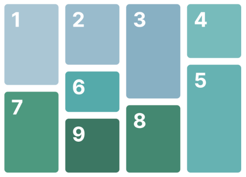

# Masonry视图
import { Separator } from "../../../src/components/ui/separator"

Masonry视图根据卡片大小将卡片排列在列中。

Masonry视图的截图。

Masonry根据大小将卡片排列在列中，并将下一张卡片放置在仪表板上最小卡片的下方。

Masonry根据大小排列卡片。

要对卡片进行分组，你必须使用[水平堆叠](https://www.home-assistant.io/dashboards/horizontal-stack/)、[垂直堆叠](https://www.home-assistant.io/dashboards/vertical-stack/)或[网格](https://www.home-assistant.io/dashboards/grid/)卡片。

#### 配置变量  
    

        
type 字符串 (可选)

        
`masonry`

        {/* <Separator className="my-4" /> */}
    

## 相关主题
- [面板视图](https://www.home-assistant.io/dashboards/panel/)
- [侧边栏视图](https://www.home-assistant.io/dashboards/sidebar/)