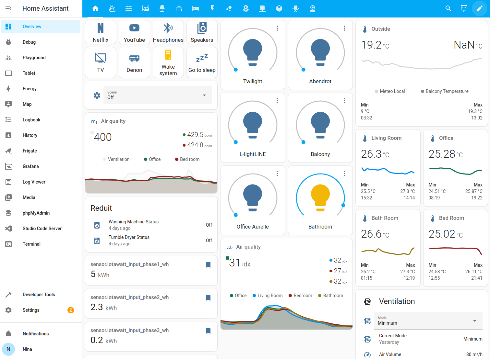

# Masonry view
import { Separator } from "../../../src/components/ui/separator"

The masonry view sorts cards in columns based on their card size.

Screenshot of the masonry view.

Masonry sorts cards in columns based on size and places the next card below the smallest card on the dashboard.

Masonry arranges cards based on size.

To group cards, you have to use [horizontal stack](https://www.home-assistant.io/dashboards/horizontal-stack/), [vertical stack](https://www.home-assistant.io/dashboards/vertical-stack/), or [grid](https://www.home-assistant.io/dashboards/grid/) cards.

#### Configuration Variables  
    

        
type string (Optional)

        
`masonry`

        {/* <Separator className="my-4" /> */}
    

## Related topics
- [Panel view](https://www.home-assistant.io/dashboards/panel/)
- [Sidebar view](https://www.home-assistant.io/dashboards/sidebar/)