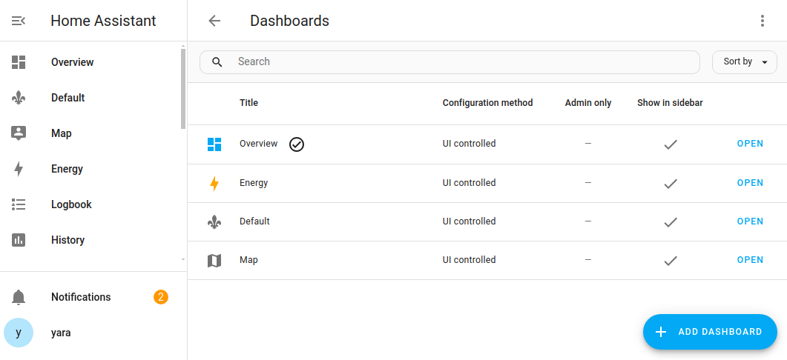
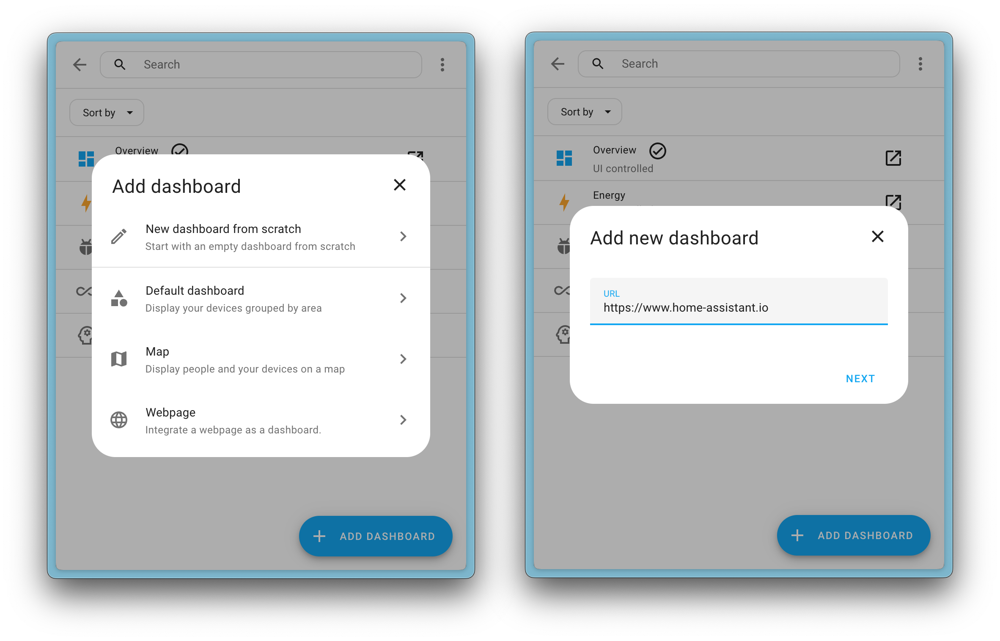
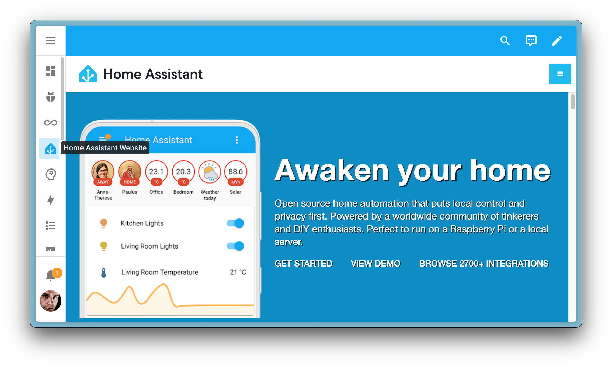
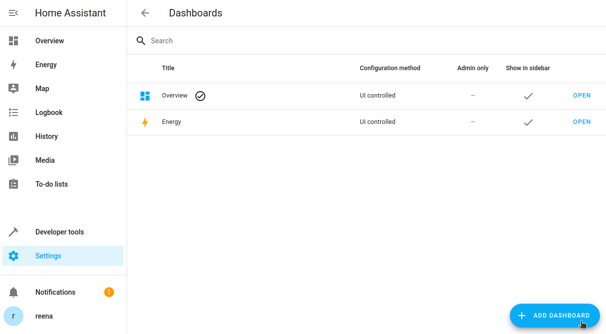
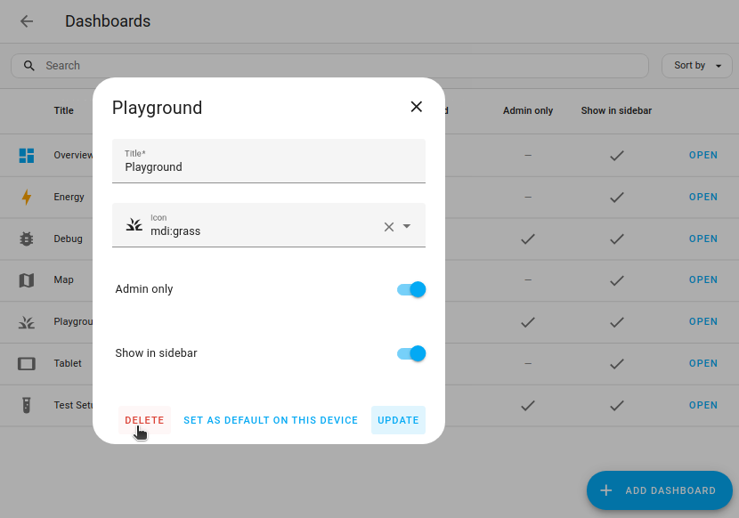

import { Pencil, EllipsisVertical } from 'lucide-react'
import { Separator } from "../../../src/components/ui/separator"

# Multiple dashboards

<p className="text-xl font-semibold">
You can define multiple dashboards in Home Assistant. Each dashboard can be added to the sidebar. This makes it possible to create separate control dashboards for each individual part of your house.
</p>

Under [Settings > Dashboards](https://my.home-assistant.io/redirect/lovelace_dashboards), you can see your own dashboards and some of the predefined ones.



## Home Assistant default dashboards 

Home Assistant ships with some dashboards out of the box:

- 概览
- Energy
- [地图](https://www.home-assistant.io/dashboards/dashboards/#map-dashboard)
- 日志
- 历史
- 待办事项清单

Not all of the predefined dashboards are listed under [Settings > Dashboards](https://my.home-assistant.io/redirect/lovelace_dashboards). The **Logbook** and **History** dashboards are powered by their respective integrations.

### Map dashboard 

The predefined **Map** dashboard is populated by the [Map card](https://www.home-assistant.io/dashboards/map/). You can edit this dashboard like any other dashboard. For example, you can edit the [view](https://www.home-assistant.io/dashboards/views/) to use the **Sidebar** instead of the default **Panel** view type if you like.

#### Maps and presence detection 

If you see a [person](https://www.home-assistant.io/integrations/person/) on the map, it means you have connected a device that allows [presence detection](https://www.home-assistant.io/integrations/#presence-detection). This is the case for example if you have the [Home Assistant Companion App](https://companion.home-assistant.io/) on your phone and allowed location tracking.


### Logbook dashboard 

The predefined **Logbook** dashboard is powered by the [Logbook integration](https://www.home-assistant.io/integrations/logbook/). To control which events to show or filter out, refer to the documentation of the Logbook integration.

### History dashboard 

The predefined **History** dashboard is powered by the [History integration](https://www.home-assistant.io/integrations/history/). To learn about the data sources used and how to export data, refer to the documentation of the History integration.

### To-do lists dashboard 

The predefined To-do lists dashboard is powered by the [To-do integration](https://www.home-assistant.io/integrations/todo/). To learn how to use to-do and shopping lists, refer to the documentation of the to-do list integration.

## Webpage dashboard 
Another available (but not default) dashboard is the webpage dashboard. The webpage dashboard allows you to add and embed a webpage to your dashboard. This could be a web page from the internet or a local web page from a local machine or device like your router or NAS. The webpage dashboard uses the [webpage card](https://www.home-assistant.io/dashboards/iframe/).



This dashboard replaces the old iFrame panel (`iframe_panel`). If you have existing panels configured in your YAML configuration, Home Assistant will automatically migrate them to the new webpage dashboard on upgrade.



Note that not every webpage can be embedded due to security restrictions that some sites have in place. These restrictions are enforced by your browser and prevent embedding them into a Home Assistant dashboard.

## Creating a new dashboard 

The default **Overview** dashboard updates itself when you add new devices, as long as you do not edit the default dashboard. If you want a customized dashboard, it is recommended not to change the **Overview** dashboard, but to create a new dashboard instead.

This will leave the default dashboard intact.

1. Go to [Settings > Dashboards](https://my.home-assistant.io/redirect/lovelace_dashboards).

2. Select **Add dashboard**. 



3. In the dialog, choose one of the options:
    - If you want to start with a pre-populated dashboard, choose **Default dashboard**.
    - If you want to start with a completely empty dashboard, choose **New dashboard from scratch**.

4. In the **Add new dashboard** dialog, enter a name and select an icon.
    - Define if this dashboard should be visible only to the admin user.
    - Define if you want the dashboard to be listed in the sidebar.
    - Select **Create**.
    - **Result**: The dashboard is added.

5. Open your new dashboard and in the top right of the screen, select the Edit <Pencil className='align-middle inline ' size={18}  /> icon button.

6. If you chose **Default dashboard**, you need to take control before you can edit it:
    - The **Edit dashboard** dialog appears.
    - By editing the dashboard, you are taking over control of this dashboard.
    - This means that it is no longer automatically updated when new dashboard elements become available.
    - Once you’ve taken control, you can’t get this specific dashboard back to update automatically. However, you can create a new default dashboard.
    - To continue, in the dialog, select the three dots  menu, then select **Take control**.

7. You can now [add a card](https://www.home-assistant.io/dashboards/cards/#adding-cards-to-your-dashboard) or [add a view](https://www.home-assistant.io/dashboards/views/#adding-a-view-to-a-dashboard).

## Deleting a dashboard 

If you do not use one of the predefined dashboards, or created a dashboard you no longer need, you can delete that dashboard. It will then no longer show in the sidebar.

1. Go to [Settings > Dashboards](https://my.home-assistant.io/redirect/lovelace_dashboards).
2. From the list of dashboards, select the dashboard you want to delete.
3. In the dialog, select **Delete**



## Using YAML for the Overview dashboard 

To change the **Overview** dashboard, create a new file **ui-lovelace.yaml** in your configuration directory and add the following section to your **configuration.yaml** and restart Home Assistant:

```yaml
lovelace:
  mode: yaml
```

A good way to start this file is to copy and paste the “Raw configuration” from the UI so your manual configuration starts the same as your existing UI.

- In your sidebar, select **Overview**.
- In the top-right corner, select the pencil icon.
- Select the three dots  menu and select **Raw configuration editor**.
- There you see the configuration for your current dashboard. Copy that into the `<config>/ui-lovelace.yaml` file.

Once you take control of your UI via YAML, the Home Assistant interface for modifying it won’t be available anymore, and new entities will not automatically be added to your UI.

When you make changes to **ui-lovelace.yaml**, you don’t have to restart Home Assistant or refresh the page. Just hit the refresh button in the menu at the top of the UI.

To revert back to using the UI to edit your dashboard, remove the **lovelace** section from your `configuration.yaml` and copy the contents of your `ui-lovelace.yaml` into the raw configuration section of Home Assistant and restart.

## Adding more dashboards with YAML 

It is also possible to use YAML to define multiple dashboards. Each dashboard will be loaded from its own YAML file.

```yaml
lovelace:
  mode: yaml
  # Include external resources only add when mode is yaml, otherwise manage in the resources in the dashboard configuration panel.
  resources:
    - url: /local/my-custom-card.js
      type: module
    - url: /local/my-webfont.css
      type: css
  # Add more dashboards
  dashboards:
    lovelace-generated: # Needs to contain a hyphen (-)
      mode: yaml
      filename: notexist.yaml
      title: Generated
      icon: mdi:tools
      show_in_sidebar: true
      require_admin: true
    lovelace-hidden:
      mode: yaml
      title: hidden
      show_in_sidebar: false
      filename: hidden.yaml
```

You can also add YAML dashboards when your main dashboard is UI configured:


```yaml
lovelace:
  mode: storage
  # Add yaml dashboards
  dashboards:
    lovelace-yaml:
      mode: yaml
      title: YAML
      icon: mdi:script
      show_in_sidebar: true
      filename: dashboards.yaml
```


<div className="bg-white p-6 rounded-2xl border border-[rgba(0,0,0,0.12)] mb-4">

#### Configuration Variables  
    <div>
        <p className="m-0 pb-2" style={{margin:'0'}}>mode <span className="text-xs text-red-400">string Required</span></p>
        <p className="text-sm text-gray-400 m-0" style={{margin:'0'}}>In what mode should the main dashboard be, `yaml` or `storage` (UI managed).</p>
        <Separator className="my-4" />
    </div>

    <div>
        <p className="m-0 pb-2" style={{margin:'0'}}>resources <span className="text-xs text-gray-400">list (Optional)</span></p>
        <p className="text-sm text-gray-400 m-0" style={{margin:'0'}}>List of resources that should be loaded. Only use this when mode is `yaml`. If you change anything here, click the three dots <EllipsisVertical className='align-middle' size={18} />  menu (top-right) and click on `Reload resources` to pick up changes without restarting Home Assistant. You can also call `lovelace.reload_resources` action directly.</p>
        
         <div className='pl-10'>
            <p className="m-0 pb-2" style={{margin:'0'}}>url <span className="text-xs text-red-400">string Required</span></p>
            <p className="text-sm text-gray-400 m-0" style={{margin:'0'}}>The URL of the resource to load.</p>
            <Separator className="my-4" />
        </div>

        <div className='pl-10'>
            <p className="m-0 pb-2" style={{margin:'0'}}>type <span className="text-xs text-red-400">string Required</span></p>
            <p className="text-sm text-gray-400 m-0" style={{margin:'0'}}>The type of resource, this should be either module for a JavaScript `module` or `css` for a StyleSheet.</p>
        </div>
        <Separator className="my-4" />
    </div>

    <div>
        <p className="m-0 pb-2" style={{margin:'0'}}>dashboards <span className="text-xs text-gray-400">map (Optional)</span></p>
        <p className="text-sm text-gray-400 m-0" style={{margin:'0'}}>Additional YAML dashboards. The key is used for the URL and should contain a hyphen (`-`) </p>
        
        <div className='pl-10'>
            <p className="m-0 pb-2" style={{margin:'0'}}>mode <span className="text-xs text-red-400">string Required</span></p>
            <p className="text-sm text-gray-400 m-0" style={{margin:'0'}}>The mode of the dashboard, this should always be `yaml`. Dashboards in `storage` mode can be created in the configuration panel.</p>
            <Separator className="my-4" />
        </div>

        <div className='pl-10'>
            <p className="m-0 pb-2" style={{margin:'0'}}>filename <span className="text-xs text-red-400">string Required</span></p>
            <p className="text-sm text-gray-400 m-0" style={{margin:'0'}}>The file in your `config` directory where the configuration for this panel is.</p>
            <Separator className="my-4" />
        </div>

        <div className='pl-10'>
            <p className="m-0 pb-2" style={{margin:'0'}}>title <span className="text-xs text-red-400">string Required</span></p>
            <p className="text-sm text-gray-400 m-0" style={{margin:'0'}}>The title of the dashboard, will be used in the sidebar.</p>
            <Separator className="my-4" />
        </div>
        
        <div className='pl-10'>
            <p className="m-0 pb-2" style={{margin:'0'}}>icon <span className="text-xs text-gray-400">string (Optional)</span></p>
            <p className="text-sm text-gray-400 m-0" style={{margin:'0'}}>The icon to show in the sidebar. You can use any icon from [Material Design Icons](https://pictogrammers.com/library/mdi/).Prefix the icon name with `mdi:`, ie `mdi:home`.</p>
            <Separator className="my-4" />
        </div>

        <div className='pl-10'>
            <p className="m-0 pb-2" style={{margin:'0'}}>show_in_sidebar <span className="text-xs text-gray-400">boolean (Optional, default: true)</span></p>
            <p className="text-sm text-gray-400 m-0" style={{margin:'0'}}>Should this dashboard be shown in the sidebar.</p>
            <Separator className="my-4" />
        </div>

        <div className='pl-10'>
            <p className="m-0 pb-2" style={{margin:'0'}}>require_admin <span className="text-xs text-gray-400">boolean (Optional, default: false)</span></p>
            <p className="text-sm text-gray-400 m-0" style={{margin:'0'}}>Should this dashboard be only accessible for admin users.</p>
        </div>
    </div>
</div>

As a super minimal example of a dashboard config, here’s the bare minimum you will need for it to work:

```yaml
views:
    # View tab title.
  - title: Example
    cards:
        # The markdown card will render markdown text.
      - type: markdown
        title: Dashboard
        content: >
          Welcome to your **dashboard**.
```

A slightly more advanced example:

```yaml
views:
    # View tab title.
  - title: Example
    # Unique path for direct access /lovelace/${path}
    path: example
    # Each view can have a different theme applied. Theme should be defined in the frontend.
    theme: dark-mode
    # The cards to show on this view.
    cards:
        # The filter card will filter entities for their state
      - type: entity-filter
        entities:
          - device_tracker.paulus
          - device_tracker.anne_there
        state_filter:
          - 'home'
        card:
          type: glance
          title: People that are home

        # The picture entity card will represent an entity with a picture
      - type: picture-entity
        image: https://www.home-assistant.io/images/default-social.png
        entity: light.bed_light

    # Specify a tab icon if you want the view tab to be an icon.
  - icon: mdi:home-assistant
    # Title of the view. Will be used as the tooltip for tab icon
    title: Second view
    cards:
        # Entities card will take a list of entities and show their state.
      - type: entities
        # Title of the entities card
        title: Example
        # The entities here will be shown in the same order as specified.
        # Each entry is an entity ID or a map with extra options.
        entities:
          - light.kitchen
          - switch.ac
          - entity: light.living_room
            # Override the name to use
            name: LR Lights

        # The markdown card will render markdown text.
      - type: markdown
        title: Dashboard
        content: >
          Welcome to your **dashboard**.
```

## Related topics
- [Logbook integration](https://www.home-assistant.io/integrations/logbook/)
- [History integration](https://www.home-assistant.io/integrations/history/)
- [To do list integration](https://www.home-assistant.io/integrations/todo/)
- [Views](/docs/documentation/dashboards/views)
- [Webpage card](https://www.home-assistant.io/dashboards/iframe/)

