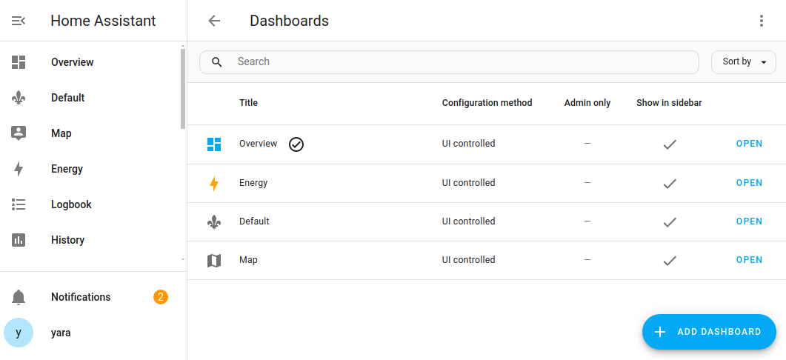
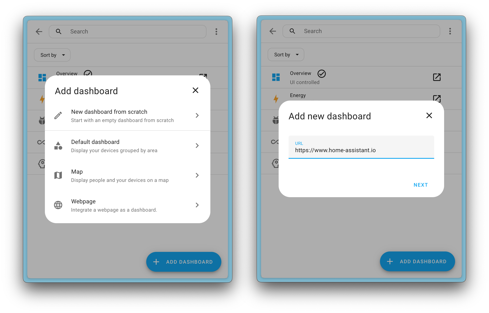
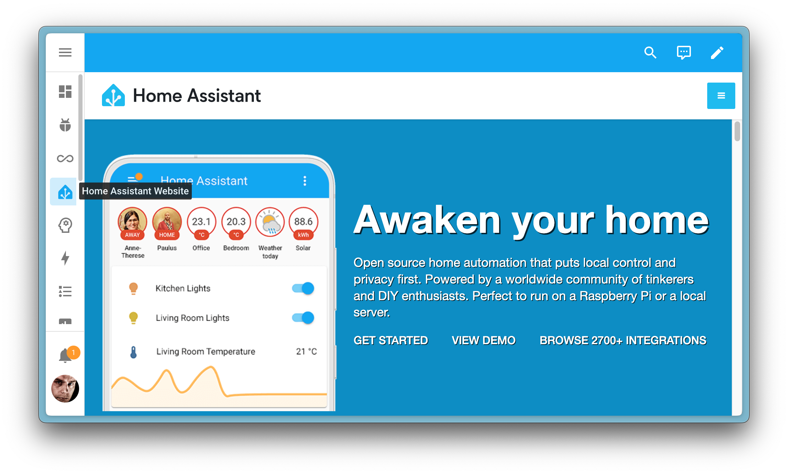
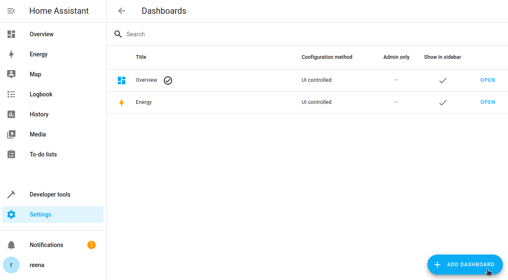
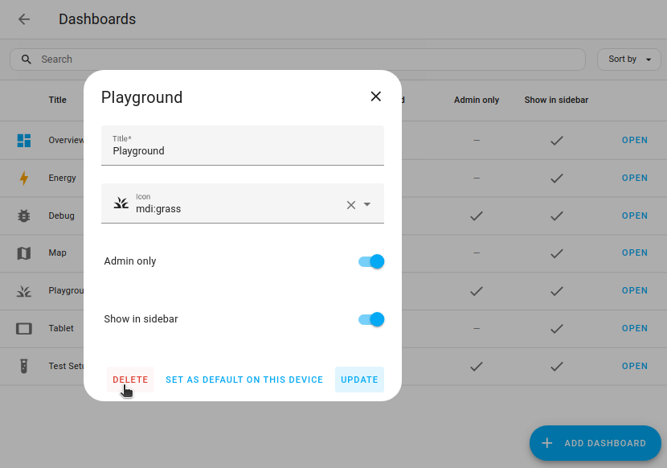

import { Pencil, EllipsisVertical } from 'lucide-react'
import { Separator } from "../../../src/components/ui/separator"

# 多仪表板

<p className="text-xl font-semibold">
你可以在Home Assistant中定义多个仪表板。每个仪表板可以添加到侧边栏。这使得为你房子的每个独立部分创建单独的控制仪表板成为可能。
</p>

在[设置 > 仪表板](https://my.home-assistant.io/redirect/lovelace_dashboards)下，你可以看到你自己的仪表板和一些预定义的仪表板。



## Home Assistant默认仪表板 

Home Assistant自带一些开箱即用的仪表板：

- 概览(Overview)
- 能源(Energy)
- [地图(Map)](https://www.home-assistant.io/dashboards/dashboards/#map-dashboard)
- 日志(Logbook)
- 历史(History)
- 待办事项清单(To-do lists)

并非所有预定义的仪表板都列在[设置 > 仪表板](https://my.home-assistant.io/redirect/lovelace_dashboards)下。**日志**和**历史**仪表板由各自的集成提供支持。

### 地图仪表板 

预定义的**地图**仪表板由[地图卡片](https://www.home-assistant.io/dashboards/map/)填充。你可以像编辑任何其他仪表板一样编辑这个仪表板。例如，如果你愿意，你可以编辑[视图](/docs/documentation/dashboards/views)以使用**侧边栏**代替默认的**面板**视图类型。

#### 地图和存在检测 

如果你在地图上看到一个[人](https://www.home-assistant.io/integrations/person/)，这意味着你已连接了允许[存在检测](https://www.home-assistant.io/integrations/#presence-detection)的设备。例如，如果你在手机上安装了[Home Assistant伴侣应用](https://companion.home-assistant.io/)并允许位置跟踪，就会出现这种情况。

### 日志仪表板 

预定义的**日志**仪表板由[日志集成](https://www.home-assistant.io/integrations/logbook/)提供支持。要控制显示或过滤哪些事件，请参阅日志集成的文档。

### 历史仪表板 

预定义的**历史**仪表板由[历史集成](https://www.home-assistant.io/integrations/history/)提供支持。要了解使用的数据源以及如何导出数据，请参阅历史集成的文档。

### 待办事项清单仪表板 

预定义的待办事项清单仪表板由[待办事项集成](https://www.home-assistant.io/integrations/todo/)提供支持。要了解如何使用待办事项和购物清单，请参阅待办事项清单集成的文档。

## 网页仪表板 
另一个可用（但非默认）的仪表板是网页仪表板。网页仪表板允许你将网页添加并嵌入到你的仪表板中。这可以是来自互联网的网页，也可以是来自本地机器或设备（如路由器或NAS）的本地网页。网页仪表板使用[网页卡片](https://www.home-assistant.io/dashboards/iframe/)。



这个仪表板取代了旧的iFrame面板（`iframe_panel`）。如果你在YAML配置中有现有的面板配置，Home Assistant将在升级时自动将它们迁移到新的网页仪表板。



请注意，由于一些网站设置的安全限制，并非每个网页都可以被嵌入。这些限制由你的浏览器强制执行，防止将它们嵌入到Home Assistant仪表板中。

## 创建新仪表板 

当你添加新设备时，默认的**概览**仪表板会自动更新，只要你不编辑默认仪表板。如果你想要一个自定义的仪表板，建议不要更改**概览**仪表板，而是创建一个新的仪表板。

这将保持默认仪表板不变。

1. 转到[设置 > 仪表板](https://my.home-assistant.io/redirect/lovelace_dashboards)。

2. 选择**添加仪表板**。 



3. 在对话框中，选择以下选项之一：
    - 如果你想从预填充的仪表板开始，选择**默认仪表板**。
    - 如果你想从一个完全空白的仪表板开始，选择**从头开始创建新仪表板**。

4. 在**添加新仪表板**对话框中，输入名称并选择图标。
    - 定义此仪表板是否应仅对管理员用户可见。
    - 定义你是否希望仪表板在侧边栏中列出。
    - 选择**创建**。
    - **结果**：仪表板已添加。

5. 打开你的新仪表板，在屏幕右上角，选择编辑 <Pencil className='align-middle inline ' size={18}  /> 图标按钮。

6. 如果你选择了**默认仪表板**，你需要接管控制权才能编辑它：
    - **编辑仪表板**对话框出现。
    - 通过编辑仪表板，你接管了这个仪表板的控制权。
    - 这意味着当新的仪表板元素可用时，它将不再自动更新。
    - 一旦你接管了控制权，你就无法让这个特定的仪表板恢复自动更新。但是，你可以创建一个新的默认仪表板。
    - 要继续，在对话框中，选择三点菜单，然后选择**接管控制**。

7. 现在你可以[添加卡片](https://www.home-assistant.io/dashboards/cards/#adding-cards-to-your-dashboard)或[添加视图](https://www.home-assistant.io/dashboards/views/#adding-a-view-to-a-dashboard)。

## 删除仪表板 

如果你不使用某个预定义的仪表板，或者创建了一个你不再需要的仪表板，你可以删除该仪表板。它将不再显示在侧边栏中。

1. 转到[设置 > 仪表板](https://my.home-assistant.io/redirect/lovelace_dashboards)。
2. 从仪表板列表中，选择你要删除的仪表板。
3. 在对话框中，选择**删除**



## 为概览仪表板使用YAML 

要更改**概览**仪表板，在你的配置目录中创建一个新文件**ui-lovelace.yaml**，在你的**configuration.yaml**中添加以下部分，然后重启Home Assistant：

```yaml
lovelace:
  mode: yaml
```

开始这个文件的一个好方法是从UI复制和粘贴"原始配置"，这样你的手动配置就与现有的UI相同。

- 在你的侧边栏中，选择**概览**。
- 在右上角，选择铅笔图标。
- 选择三点菜单，然后选择**原始配置编辑器**。
- 在那里你可以看到当前仪表板的配置。将其复制到`<config>/ui-lovelace.yaml`文件中。

一旦你通过YAML接管UI的控制权，Home Assistant界面将不再可用于修改它，新实体也不会自动添加到你的UI中。

当你对**ui-lovelace.yaml**进行更改时，你不必重启Home Assistant或刷新页面。只需点击UI顶部菜单中的刷新按钮即可。

要恢复使用UI编辑仪表板，从你的`configuration.yaml`中删除**lovelace**部分，并将`ui-lovelace.yaml`的内容复制到Home Assistant的原始配置部分，然后重启。

## 使用YAML添加更多仪表板 

也可以使用YAML定义多个仪表板。每个仪表板将从其自己的YAML文件加载。

```yaml
lovelace:
  mode: yaml
  # 仅在模式为yaml时包括外部资源，否则在仪表板配置面板中管理资源。
  resources:
    - url: /local/my-custom-card.js
      type: module
    - url: /local/my-webfont.css
      type: css
  # 添加更多仪表板
  dashboards:
    lovelace-generated: # 需要包含连字符(-)
      mode: yaml
      filename: notexist.yaml
      title: Generated
      icon: mdi:tools
      show_in_sidebar: true
      require_admin: true
    lovelace-hidden:
      mode: yaml
      title: hidden
      show_in_sidebar: false
      filename: hidden.yaml
```

当你的主仪表板是UI配置时，你也可以添加YAML仪表板：


```yaml
lovelace:
  mode: storage
  # 添加yaml仪表板
  dashboards:
    lovelace-yaml:
      mode: yaml
      title: YAML
      icon: mdi:script
      show_in_sidebar: true
      filename: dashboards.yaml
```


<div className="bg-white p-6 rounded-2xl border border-[rgba(0,0,0,0.12)] mb-4">

#### 配置变量  
    <div>
        <p className="m-0 pb-2" style={{margin:'0'}}>mode <span className="text-xs text-red-400">字符串 必填</span></p>
        <p className="text-sm text-gray-400 m-0" style={{margin:'0'}}>主仪表板应该处于什么模式，`yaml` 或 `storage`（UI管理）。</p>
        <Separator className="my-4" />
    </div>

    <div>
        <p className="m-0 pb-2" style={{margin:'0'}}>resources <span className="text-xs text-gray-400">列表 (可选)</span></p>
        <p className="text-sm text-gray-400 m-0" style={{margin:'0'}}>应该加载的资源列表。仅在模式为 `yaml` 时使用。如果你在这里更改任何内容，点击三点 <EllipsisVertical className='align-middle inline' size={18} /> 菜单（右上角）并点击`重新加载资源`以在不重启Home Assistant的情况下应用更改。你也可以直接调用 `lovelace.reload_resources` 操作。</p>
        
         <div className='pl-10'>
            <p className="m-0 pb-2" style={{margin:'0'}}>url <span className="text-xs text-red-400">字符串 必填</span></p>
            <p className="text-sm text-gray-400 m-0" style={{margin:'0'}}>要加载的资源的URL。</p>
            <Separator className="my-4" />
        </div>

        <div className='pl-10'>
            <p className="m-0 pb-2" style={{margin:'0'}}>type <span className="text-xs text-red-400">字符串 必填</span></p>
            <p className="text-sm text-gray-400 m-0" style={{margin:'0'}}>资源的类型，这应该是JavaScript `module` 的 module 或StyleSheet的`css`。</p>
        </div>
        <Separator className="my-4" />
    </div>

    <div>
        <p className="m-0 pb-2" style={{margin:'0'}}>dashboards <span className="text-xs text-gray-400">映射 (可选)</span></p>
        <p className="text-sm text-gray-400 m-0" style={{margin:'0'}}>额外的YAML仪表板。键用于URL并且应该包含连字符（`-`）</p>
        
        <div className='pl-10'>
            <p className="m-0 pb-2" style={{margin:'0'}}>mode <span className="text-xs text-red-400">字符串 必填</span></p>
            <p className="text-sm text-gray-400 m-0" style={{margin:'0'}}>仪表板的模式，这应该始终是 `yaml`。`storage` 模式的仪表板可以在配置面板中创建。</p>
            <Separator className="my-4" />
        </div>

        <div className='pl-10'>
            <p className="m-0 pb-2" style={{margin:'0'}}>filename <span className="text-xs text-red-400">字符串 必填</span></p>
            <p className="text-sm text-gray-400 m-0" style={{margin:'0'}}>你的 `config` 目录中该面板配置所在的文件。</p>
            <Separator className="my-4" />
        </div>

        <div className='pl-10'>
            <p className="m-0 pb-2" style={{margin:'0'}}>title <span className="text-xs text-red-400">字符串 必填</span></p>
            <p className="text-sm text-gray-400 m-0" style={{margin:'0'}}>仪表板的标题，将在侧边栏中使用。</p>
            <Separator className="my-4" />
        </div>
        
        <div className='pl-10'>
            <p className="m-0 pb-2" style={{margin:'0'}}>icon <span className="text-xs text-gray-400">字符串 (可选)</span></p>
            <p className="text-sm text-gray-400 m-0" style={{margin:'0'}}>在侧边栏中显示的图标。你可以使用[Material Design Icons](https://pictogrammers.com/library/mdi/)中的任何图标。图标名称前加上 `mdi:`，例如 `mdi:home`。</p>
            <Separator className="my-4" />
        </div>

        <div className='pl-10'>
            <p className="m-0 pb-2" style={{margin:'0'}}>show_in_sidebar <span className="text-xs text-gray-400">布尔值 (可选，默认值：true)</span></p>
            <p className="text-sm text-gray-400 m-0" style={{margin:'0'}}>这个仪表板是否应该在侧边栏中显示。</p>
            <Separator className="my-4" />
        </div>

        <div className='pl-10'>
            <p className="m-0 pb-2" style={{margin:'0'}}>require_admin <span className="text-xs text-gray-400">布尔值 (可选，默认值：false)</span></p>
            <p className="text-sm text-gray-400 m-0" style={{margin:'0'}}>这个仪表板是否应该只对管理员用户可访问。</p>
        </div>
    </div>
</div>

作为仪表板配置的超级简约示例，以下是使其工作所需的最低要求：

```yaml
views:
    # 视图标签标题。
  - title: Example
    cards:
        # markdown卡片将渲染markdown文本。
      - type: markdown
        title: Dashboard
        content: >
          Welcome to your **dashboard**.
```

一个稍微高级一点的示例：

```yaml
views:
    # 视图标签标题。
  - title: Example
    # 直接访问的唯一路径 /lovelace/${path}
    path: example
    # 每个视图可以应用不同的主题。主题应该在前端中定义。
    theme: dark-mode
    # 在此视图上显示的卡片。
    cards:
        # 过滤卡片将根据实体的状态进行过滤
      - type: entity-filter
        entities:
          - device_tracker.paulus
          - device_tracker.anne_there
        state_filter:
          - 'home'
        card:
          type: glance
          title: People that are home

        # 图片实体卡片将用图片表示一个实体
      - type: picture-entity
        image: https://www.home-assistant.io/images/default-social.png
        entity: light.bed_light

    # 如果你希望视图标签为图标，请指定一个标签图标。
  - icon: mdi:home-assistant
    # 视图的标题。将用作标签图标的工具提示
    title: Second view
    cards:
        # 实体卡片将获取实体列表并显示它们的状态。
      - type: entities
        # 实体卡片的标题
        title: Example
        # 这里的实体将按照指定的顺序显示。
        # 每个条目都是一个实体ID或带有额外选项的映射。
        entities:
          - light.kitchen
          - switch.ac
          - entity: light.living_room
            # 覆盖要使用的名称
            name: LR Lights

        # markdown卡片将渲染markdown文本。
      - type: markdown
        title: Dashboard
        content: >
          Welcome to your **dashboard**.
```

## 相关主题
- [日志集成](https://www.home-assistant.io/integrations/logbook/)
- [历史集成](https://www.home-assistant.io/integrations/history/)
- [待办事项清单集成](https://www.home-assistant.io/integrations/todo/)
- [视图](/docs/documentation/dashboards/views)
- [网页卡片](/docs/documentation/dashboards/iframe)

