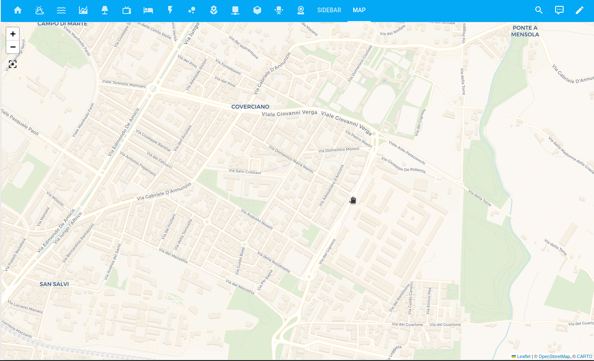

import { Separator } from "../../../src/components/ui/separator"

# Panel View

The panel view must have exactly one card. This card is rendered full-width.

Screenshot of the panel view.

This view doesn’t have support for badges.

This view is good when using cards like [map](https://www.home-assistant.io/dashboards/map/), [horizontal stack](https://www.home-assistant.io/dashboards/horizontal-stack/), [vertical stack](https://www.home-assistant.io/dashboards/vertical-stack/), [picture elements](https://www.home-assistant.io/dashboards/picture-elements/), or [picture glance](https://www.home-assistant.io/dashboards/picture-glance/).

#### Configuration Variables  
    

        
type string Required

        
`panel`

        {/* <Separator className="my-4" /> */}
    

## Related topics
- [Masonry view](https://www.home-assistant.io/dashboards/masonry/)
- [Sidebar view](https://www.home-assistant.io/dashboards/sidebar/)