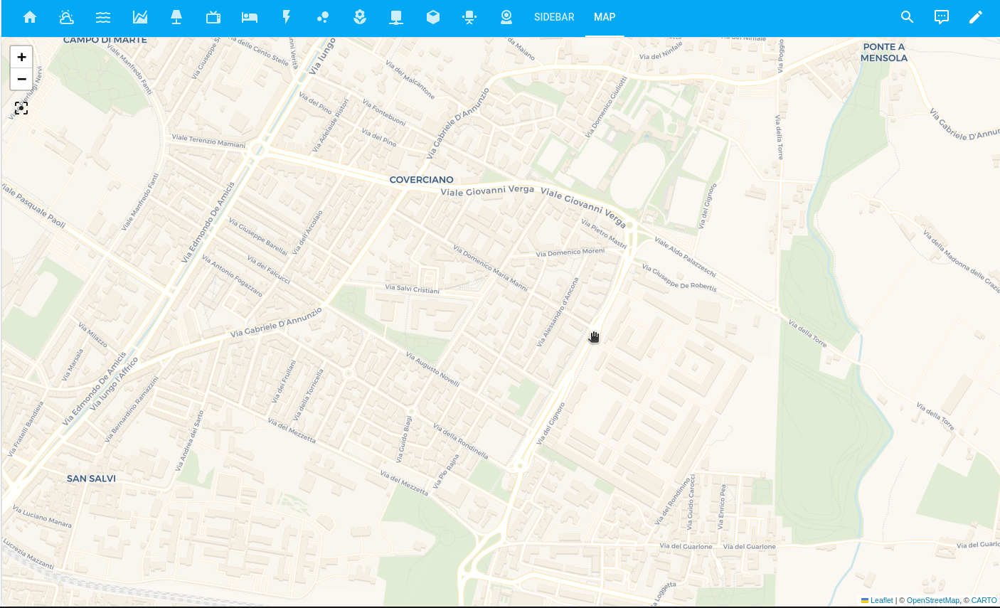

import { Separator } from "../../../src/components/ui/separator"

# 面板视图

面板视图必须只有一个卡片。这个卡片会以全宽渲染。

面板视图的截图。

此视图不支持徽章。

此视图适用于使用如下卡片：[地图](https://www.home-assistant.io/dashboards/map/)、[水平堆叠](https://www.home-assistant.io/dashboards/horizontal-stack/)、[垂直堆叠](https://www.home-assistant.io/dashboards/vertical-stack/)、[图片元素](https://www.home-assistant.io/dashboards/picture-elements/)或[图片概览](https://www.home-assistant.io/dashboards/picture-glance/)。

#### 配置变量  
    

        
type 字符串 必填

        
`panel`

        {/* <Separator className="my-4" /> */}
    

## 相关主题
- [Masonry视图](https://www.home-assistant.io/dashboards/masonry/)
- [侧边栏视图](https://www.home-assistant.io/dashboards/sidebar/)