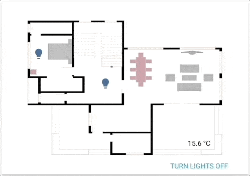

import { Pencil, EllipsisVertical, House } from 'lucide-react'
import { Separator } from "../../../src/components/ui/separator"

# 图片元素卡片

<p className="text-xl font-semibold">
图片元素卡片是最多功能的卡片类型之一。
</p>


<p className='text-center font-extralight'>由图片元素驱动的功能性平面图。</p>

该卡片允许你基于坐标在图像上放置图标、文本甚至按钮。想象一下平面图，想象一下没有限制的[图片概览](https://www.home-assistant.io/dashboards/picture-glance/)！

要将图片元素卡片添加到你的用户界面：

1. 在屏幕右上角，选择编辑 <Pencil className='align-middle inline ' size={18}  />  按钮。
    - 如果这是你第一次编辑仪表板，**编辑仪表板**对话框会出现。
        - 通过编辑仪表板，你将接管这个仪表板的控制权。
        - 这意味着当新的仪表板元素可用时，它将不再自动更新。
        - 一旦你接管控制权，你将无法让这个特定的仪表板恢复自动更新。但是，你可以创建一个新的默认仪表板。
        - 要继续，在对话框中，选择三点 <EllipsisVertical className='align-middle inline' size={18} />  菜单，然后选择**接管控制**。

2. [添加卡片并自定义操作和功能](https://www.home-assistant.io/dashboards/cards/#adding-cards-to-your-dashboard) 到你的仪表板。

## YAML 配置 

当你使用 YAML 模式或只是更喜欢在 UI 中的代码编辑器中使用 YAML 时，以下 YAML 选项可用。

<div className="bg-white p-6 rounded-2xl border border-[rgba(0,0,0,0.12)] mb-4">
#### 配置变量  
    <div>
        <p className="m-0 pb-2" style={{margin:'0'}}> type <span className="text-xs text-red-400">字符串 必填</span></p>
        <p className="text-sm text-gray-400 m-0" style={{margin:'0'}}>`picture-elements`</p>
        <Separator className="my-4" />
    </div>

    <div>
        <p className="m-0 pb-2" style={{margin:'0'}}> image <span className="text-xs text-red-400">字符串 必填</span></p>
        <p className="text-sm text-gray-400 m-0" style={{margin:'0'}}>图像的URL。</p>
        <p className="text-sm text-gray-400 m-0" style={{margin:'0'}}>要使用本地托管的图像，请参阅[托管](https://www.home-assistant.io/integrations/http#hosting-files)。</p>
        <Separator className="my-4" />
    </div>

    <div>
        <p className="m-0 pb-2" style={{margin:'0'}}> image_entity <span className="text-xs text-gray-400">字符串 (可选)</span></p>
        <p className="text-sm text-gray-400 m-0" style={{margin:'0'}}>要显示的图像或人员实体。</p>
        <Separator className="my-4" />
    </div>

    <div>
        <p className="m-0 pb-2" style={{margin:'0'}}> camera_image <span className="text-xs text-gray-400">字符串 (可选)</span></p>
        <p className="text-sm text-gray-400 m-0" style={{margin:'0'}}>摄像头实体。</p>
        <Separator className="my-4" />
    </div>

    <div>
        <p className="m-0 pb-2" style={{margin:'0'}}> camera_view <span className="text-xs text-gray-400">字符串 (可选，默认：auto)</span></p>
        <p className="text-sm text-gray-400 m-0" style={{margin:'0'}}>"live"将在启用`stream`时显示实时视图。</p>
        <Separator className="my-4" />
    </div>

    <div>
        <p className="m-0 pb-2" style={{margin:'0'}}> elements <span className="text-xs text-red-400">列表 必填</span></p>
        <p className="text-sm text-gray-400 m-0" style={{margin:'0'}}>元素列表。</p>
        <Separator className="my-4" />
    </div>

    <div>
        <p className="m-0 pb-2" style={{margin:'0'}}> title <span className="text-xs text-gray-400">字符串 (可选)</span></p>
        <p className="text-sm text-gray-400 m-0" style={{margin:'0'}}>卡片标题。</p>
        <Separator className="my-4" />
    </div>

    <div>
        <p className="m-0 pb-2" style={{margin:'0'}}> state_filter <span className="text-xs text-gray-400">映射 (可选)</span></p>
        <p className="text-sm text-gray-400 m-0" style={{margin:'0'}}>[基于状态的CSS过滤器](https://www.home-assistant.io/dashboards/picture-elements/#how-to-use-state_filter)</p>
        <Separator className="my-4" />
    </div>

    <div>
        <p className="m-0 pb-2" style={{margin:'0'}}> theme <span className="text-xs text-gray-400">字符串 (可选)</span></p>
        <p className="text-sm text-gray-400 m-0" style={{margin:'0'}}>使用任何已加载的主题覆盖此卡片的主题。有关主题的更多信息，请参阅[前端文档](https://www.home-assistant.io/integrations/frontend/)。</p>
        <Separator className="my-4" />
    </div>

    <div>
        <p className="m-0 pb-2" style={{margin:'0'}}> dark_mode_image <span className="text-xs text-gray-400">字符串 (可选)</span></p>
        <p className="text-sm text-gray-400 m-0" style={{margin:'0'}}>当启用暗模式且未设置状态图像时使用此图像。</p>
        <Separator className="my-4" />
    </div>

    <div>
        <p className="m-0 pb-2" style={{margin:'0'}}> dark_mode_filter <span className="text-xs text-gray-400">字符串 (可选)</span></p>
        <p className="text-sm text-gray-400 m-0" style={{margin:'0'}}>当启用暗模式时使用此CSS过滤器。</p>
        {/* <Separator className="my-4" /> */}
    </div>
</div>


## 元素

元素是覆盖图像的活动组件（图标、徽章、按钮、文本等）。

可以添加到图片元素卡片的几种不同元素类型：

- 状态徽章
- 状态图标
- 状态标签
- 执行操作按钮
- 图标
- 图像
- 条件
- 自定义

### 状态徽章 

此元素创建表示实体状态的徽章。


<div className="bg-white p-6 rounded-2xl border border-[rgba(0,0,0,0.12)] mb-4">
#### 配置变量  
    <div>
        <p className="m-0 pb-2" style={{margin:'0'}}> type <span className="text-xs text-red-400">字符串 必填</span></p>
        <p className="text-sm text-gray-400 m-0" style={{margin:'0'}}>`state-badge`</p>
        <Separator className="my-4" />
    </div>

    <div>
        <p className="m-0 pb-2" style={{margin:'0'}}> entity <span className="text-xs text-red-400">字符串 必填</span></p>
        <p className="text-sm text-gray-400 m-0" style={{margin:'0'}}>实体ID。</p>
        <Separator className="my-4" />
    </div>

    <div>
        <p className="m-0 pb-2" style={{margin:'0'}}> style <span className="text-xs text-red-400">映射 必填</span></p>
        <p className="text-sm text-gray-400 m-0" style={{margin:'0'}}>[使用CSS定位和样式元素](https://www.home-assistant.io/dashboards/picture-elements/#how-to-use-the-style-object)。</p>
        <p className="text-sm text-gray-400 m-0" style={{margin:'0'}}>默认值：position: absolute, transform: translate(-50%, -50%)</p>
        <Separator className="my-4" />
    </div>

    <div>
        <p className="m-0 pb-2" style={{margin:'0'}}> title <span className="text-xs text-gray-400">字符串 (可选)</span></p>
        <p className="text-sm text-gray-400 m-0" style={{margin:'0'}}>状态徽章工具提示。设置为null以隐藏。</p>
        <Separator className="my-4" />
    </div>
    <div>
        <p className="m-0 pb-2" style={{margin:'0'}}>tap_action <span className="text-xs text-gray-400">映射 (可选)</span></p>
        <p className="text-sm text-gray-400 m-0" style={{margin:'0'}}>点击卡片时执行的操作。参见[操作文档](https://www.home-assistant.io/dashboards/actions/#tap-action)。</p>
        <Separator className="my-4" />
    </div>

    <div>
        <p className="m-0 pb-2" style={{margin:'0'}}>hold_action <span className="text-xs text-gray-400">映射  (可选)</span></p>
        <p className="text-sm text-gray-400 m-0" style={{margin:'0'}}>点击并按住时执行的操作。参见[操作文档](https://www.home-assistant.io/dashboards/actions/#hold-action)。</p>
        <Separator className="my-4" />
    </div>

    <div>
        <p className="m-0 pb-2" style={{margin:'0'}}>double_tap_action <span className="text-xs text-gray-400">映射  (可选)</span></p>
        <p className="text-sm text-gray-400 m-0" style={{margin:'0'}}>双击时执行的操作。参见[操作文档](https://www.home-assistant.io/dashboards/actions/#hold-action)。</p>
    </div>

</div>

### 状态图标 
此元素使用图标表示实体状态。


<div className="bg-white p-6 rounded-2xl border border-[rgba(0,0,0,0.12)] mb-4">
#### 配置变量  
    <div>
        <p className="m-0 pb-2" style={{margin:'0'}}> type <span className="text-xs text-red-400">字符串 必填</span></p>
        <p className="text-sm text-gray-400 m-0" style={{margin:'0'}}>`state-icon`</p>
        <Separator className="my-4" />
    </div>

    <div>
        <p className="m-0 pb-2" style={{margin:'0'}}> entity <span className="text-xs text-red-400">字符串 必填</span></p>
        <p className="text-sm text-gray-400 m-0" style={{margin:'0'}}>要使用的实体ID。</p>
        <Separator className="my-4" />
    </div>

    <div>
        <p className="m-0 pb-2" style={{margin:'0'}}> icon <span className="text-xs text-gray-400">字符串 (可选)</span></p>
        <p className="text-sm text-gray-400 m-0" style={{margin:'0'}}>覆盖图标。</p>
        <Separator className="my-4" />
    </div>

    <div>
        <p className="m-0 pb-2" style={{margin:'0'}}> title <span className="text-xs text-gray-400">字符串 (可选)</span></p>
        <p className="text-sm text-gray-400 m-0" style={{margin:'0'}}>状态徽章工具提示。设置为null以隐藏。</p>
        <Separator className="my-4" />
    </div>

    <div>
        <p className="m-0 pb-2" style={{margin:'0'}}> state_color <span className="text-xs text-gray-400">布尔值 (可选，默认值：true)</span></p>
        <p className="text-sm text-gray-400 m-0" style={{margin:'0'}}>设置为`true`使实体激活时图标着色。</p>
        <Separator className="my-4" />
    </div>

    <div>
        <p className="m-0 pb-2" style={{margin:'0'}}>tap_action <span className="text-xs text-gray-400">映射 (可选)</span></p>
        <p className="text-sm text-gray-400 m-0" style={{margin:'0'}}>点击卡片时执行的操作。参见[操作文档](https://www.home-assistant.io/dashboards/actions/#tap-action)。</p>
        <Separator className="my-4" />
    </div>

    <div>
        <p className="m-0 pb-2" style={{margin:'0'}}>hold_action <span className="text-xs text-gray-400">映射  (可选)</span></p>
        <p className="text-sm text-gray-400 m-0" style={{margin:'0'}}>点击并按住时执行的操作。参见[操作文档](https://www.home-assistant.io/dashboards/actions/#hold-action)。</p>
        <Separator className="my-4" />
    </div>

    <div>
        <p className="m-0 pb-2" style={{margin:'0'}}>double_tap_action <span className="text-xs text-gray-400">映射  (可选)</span></p>
        <p className="text-sm text-gray-400 m-0" style={{margin:'0'}}>双击时执行的操作。参见[操作文档](https://www.home-assistant.io/dashboards/actions/#hold-action)。</p>
        <Separator className="my-4" />
    </div>

    <div>
        <p className="m-0 pb-2" style={{margin:'0'}}> style <span className="text-xs text-red-400">字符串 必填</span></p>
        <p className="text-sm text-gray-400 m-0" style={{margin:'0'}}>[使用CSS定位和样式元素](https://www.home-assistant.io/dashboards/picture-elements/#how-to-use-the-style-object)。</p>
        <p className="text-sm text-gray-400 m-0" style={{margin:'0'}}>默认值：position: absolute, transform: translate(-50%, -50%)</p>
        {/* <Separator className="my-4" /> */}
    </div>

</div>

### 状态标签 
此元素通过文本表示实体的状态。


<div className="bg-white p-6 rounded-2xl border border-[rgba(0,0,0,0.12)] mb-4">
#### 配置变量  
    <div>
        <p className="m-0 pb-2" style={{margin:'0'}}> type <span className="text-xs text-red-400">字符串 必填</span></p>
        <p className="text-sm text-gray-400 m-0" style={{margin:'0'}}>`state-label`</p>
        <Separator className="my-4" />
    </div>

    <div>
        <p className="m-0 pb-2" style={{margin:'0'}}> entity <span className="text-xs text-red-400">字符串 必填</span></p>
        <p className="text-sm text-gray-400 m-0" style={{margin:'0'}}>实体ID。</p>
        <Separator className="my-4" />
    </div>

    <div>
        <p className="m-0 pb-2" style={{margin:'0'}}> attribute <span className="text-xs text-gray-400">字符串 (可选)</span></p>
        <p className="text-sm text-gray-400 m-0" style={{margin:'0'}}>如果存在，将显示相应的属性，而不是实体的状态。</p>
        <Separator className="my-4" />
    </div>

    <div>
        <p className="m-0 pb-2" style={{margin:'0'}}> prefix <span className="text-xs text-gray-400">字符串 (可选)</span></p>
        <p className="text-sm text-gray-400 m-0" style={{margin:'0'}}>实体状态前的文本。</p>
        <Separator className="my-4" />
    </div>

    <div>
        <p className="m-0 pb-2" style={{margin:'0'}}> suffix <span className="text-xs text-gray-400">字符串 (可选)</span></p>
        <p className="text-sm text-gray-400 m-0" style={{margin:'0'}}>实体状态后的文本。</p>
        <Separator className="my-4" />
    </div>

    <div>
        <p className="m-0 pb-2" style={{margin:'0'}}> title <span className="text-xs text-gray-400">字符串 (可选)</span></p>
        <p className="text-sm text-gray-400 m-0" style={{margin:'0'}}>状态徽章工具提示。设置为null以隐藏。</p>
        <Separator className="my-4" />
    </div>

    <div>
        <p className="m-0 pb-2" style={{margin:'0'}}>tap_action <span className="text-xs text-gray-400">映射 (可选)</span></p>
        <p className="text-sm text-gray-400 m-0" style={{margin:'0'}}>点击卡片时执行的操作。参见[操作文档](https://www.home-assistant.io/dashboards/actions/#tap-action)。</p>
        <Separator className="my-4" />
    </div>

    <div>
        <p className="m-0 pb-2" style={{margin:'0'}}>hold_action <span className="text-xs text-gray-400">映射  (可选)</span></p>
        <p className="text-sm text-gray-400 m-0" style={{margin:'0'}}>点击并按住时执行的操作。参见[操作文档](https://www.home-assistant.io/dashboards/actions/#hold-action)。</p>
        <Separator className="my-4" />
    </div>

    <div>
        <p className="m-0 pb-2" style={{margin:'0'}}>double_tap_action <span className="text-xs text-gray-400">映射  (可选)</span></p>
        <p className="text-sm text-gray-400 m-0" style={{margin:'0'}}>双击时执行的操作。参见[操作文档](https://www.home-assistant.io/dashboards/actions/#hold-action)。</p>
        <Separator className="my-4" />
    </div>

    <div>
        <p className="m-0 pb-2" style={{margin:'0'}}> style <span className="text-xs text-red-400">字符串 必填</span></p>
        <p className="text-sm text-gray-400 m-0" style={{margin:'0'}}>[使用CSS定位和样式元素](https://www.home-assistant.io/dashboards/picture-elements/#how-to-use-the-style-object)。</p>
        <p className="text-sm text-gray-400 m-0" style={{margin:'0'}}>默认值：position: absolute, transform: translate(-50%, -50%)</p>
        {/* <Separator className="my-4" /> */}
    </div>
</div>

### 执行操作按钮 
此实体创建一个按钮（带有任意文本），可用于执行操作。


<div className="bg-white p-6 rounded-2xl border border-[rgba(0,0,0,0.12)] mb-4">
#### 配置变量  
    <div>
        <p className="m-0 pb-2" style={{margin:'0'}}> type <span className="text-xs text-red-400">字符串 必填</span></p>
        <p className="text-sm text-gray-400 m-0" style={{margin:'0'}}>`state-button`</p>
        <Separator className="my-4" />
    </div>

    <div>
        <p className="m-0 pb-2" style={{margin:'0'}}> title <span className="text-xs text-red-400">字符串 必填</span></p>
        <p className="text-sm text-gray-400 m-0" style={{margin:'0'}}>按钮标签。</p>
        <Separator className="my-4" />
    </div>

    <div>
        <p className="m-0 pb-2" style={{margin:'0'}}> action <span className="text-xs text-red-400">字符串 必填</span></p>
        <p className="text-sm text-gray-400 m-0" style={{margin:'0'}}>`light.turn_on`</p>
        <Separator className="my-4" />
    </div>

    <div>
        <p className="m-0 pb-2" style={{margin:'0'}}> target <span className="text-xs text-gray-400">映射 (可选)</span></p>
        <p className="text-sm text-gray-400 m-0" style={{margin:'0'}}>用于操作的目标。</p>
        <Separator className="my-4" />
    </div>

    <div>
        <p className="m-0 pb-2" style={{margin:'0'}}> data <span className="text-xs text-gray-400">映射 (可选)</span></p>
        <p className="text-sm text-gray-400 m-0" style={{margin:'0'}}>用于操作的数据。</p>
        <Separator className="my-4" />
    </div>

    <div>
        <p className="m-0 pb-2" style={{margin:'0'}}> style <span className="text-xs text-red-400">字符串 必填</span></p>
        <p className="text-sm text-gray-400 m-0" style={{margin:'0'}}>[使用CSS定位和样式元素](https://www.home-assistant.io/dashboards/picture-elements/#how-to-use-the-style-object)。</p>
        <p className="text-sm text-gray-400 m-0" style={{margin:'0'}}>默认值：position: absolute, transform: translate(-50%, -50%)</p>
        {/* <Separator className="my-4" /> */}
    </div>

</div>

### 图标元素 
此元素创建一个不链接到实体状态的静态图标。

<div className="bg-white p-6 rounded-2xl border border-[rgba(0,0,0,0.12)] mb-4">
#### 配置变量  
    <div>
        <p className="m-0 pb-2" style={{margin:'0'}}> type <span className="text-xs text-red-400">字符串 必填</span></p>
        <p className="text-sm text-gray-400 m-0" style={{margin:'0'}}>`icon`</p>
        <Separator className="my-4" />
    </div>

    <div>
        <p className="m-0 pb-2" style={{margin:'0'}}> icon <span className="text-xs text-red-400">字符串 必填</span></p>
        <p className="text-sm text-gray-400 m-0" style={{margin:'0'}}>要显示的图标（例如，`mdi:home`）。</p>
        <Separator className="my-4" />
    </div>

    <div>
        <p className="m-0 pb-2" style={{margin:'0'}}> title <span className="text-xs text-gray-400">字符串 (可选)</span></p>
        <p className="text-sm text-gray-400 m-0" style={{margin:'0'}}>图标工具提示。设置为null以隐藏。</p>
        <Separator className="my-4" />
    </div>

    <div>
        <p className="m-0 pb-2" style={{margin:'0'}}> entity <span className="text-xs text-gray-400">字符串 (可选)</span></p>
        <p className="text-sm text-gray-400 m-0" style={{margin:'0'}}>用于更多信息/切换的实体。</p>
        <Separator className="my-4" />
    </div>

    <div>
        <p className="m-0 pb-2" style={{margin:'0'}}>tap_action <span className="text-xs text-gray-400">映射 (可选)</span></p>
        <p className="text-sm text-gray-400 m-0" style={{margin:'0'}}>点击卡片时执行的操作。参见[操作文档](https://www.home-assistant.io/dashboards/actions/#tap-action)。</p>
        <Separator className="my-4" />
    </div>

    <div>
        <p className="m-0 pb-2" style={{margin:'0'}}>hold_action <span className="text-xs text-gray-400">映射  (可选)</span></p>
        <p className="text-sm text-gray-400 m-0" style={{margin:'0'}}>点击并按住时执行的操作。参见[操作文档](https://www.home-assistant.io/dashboards/actions/#hold-action)。</p>
        <Separator className="my-4" />
    </div>

    <div>
        <p className="m-0 pb-2" style={{margin:'0'}}>double_tap_action <span className="text-xs text-gray-400">映射  (可选)</span></p>
        <p className="text-sm text-gray-400 m-0" style={{margin:'0'}}>双击时执行的操作。参见[操作文档](https://www.home-assistant.io/dashboards/actions/#hold-action)。</p>
        <Separator className="my-4" />
    </div>

    <div>
        <p className="m-0 pb-2" style={{margin:'0'}}> style <span className="text-xs text-red-400">字符串 必填</span></p>
        <p className="text-sm text-gray-400 m-0" style={{margin:'0'}}>[使用CSS定位和样式元素](https://www.home-assistant.io/dashboards/picture-elements/#how-to-use-the-style-object)。</p>
        <p className="text-sm text-gray-400 m-0" style={{margin:'0'}}>默认值：position: absolute, transform: translate(-50%, -50%)</p>
        {/* <Separator className="my-4" /> */}
    </div>
</div>

### 图像元素 
这会创建一个覆盖背景图像的图像元素。


<div className="bg-white p-6 rounded-2xl border border-[rgba(0,0,0,0.12)] mb-4">
#### 配置变量  
    <div>
        <p className="m-0 pb-2" style={{margin:'0'}}> type <span className="text-xs text-red-400">字符串 必填</span></p>
        <p className="text-sm text-gray-400 m-0" style={{margin:'0'}}>`image`</p>
        <Separator className="my-4" />
    </div>

    <div>
        <p className="m-0 pb-2" style={{margin:'0'}}> entity <span className="text-xs text-gray-400">字符串 (可选)</span></p>
        <p className="text-sm text-gray-400 m-0" style={{margin:'0'}}>用于`state_image`和`state_filter`以及操作目标的实体。</p>
        <Separator className="my-4" />
    </div>

    <div>
        <p className="m-0 pb-2" style={{margin:'0'}}> title <span className="text-xs text-gray-400">字符串 (可选)</span></p>
        <p className="text-sm text-gray-400 m-0" style={{margin:'0'}}>图像工具提示。设置为null以隐藏。</p>
        <Separator className="my-4" />
    </div>

    <div>
        <p className="m-0 pb-2" style={{margin:'0'}}>tap_action <span className="text-xs text-gray-400">映射 (可选)</span></p>
        <p className="text-sm text-gray-400 m-0" style={{margin:'0'}}>点击卡片时执行的操作。参见[操作文档](https://www.home-assistant.io/dashboards/actions/#tap-action)。</p>
        <Separator className="my-4" />
    </div>

    <div>
        <p className="m-0 pb-2" style={{margin:'0'}}>hold_action <span className="text-xs text-gray-400">映射  (可选)</span></p>
        <p className="text-sm text-gray-400 m-0" style={{margin:'0'}}>点击并按住时执行的操作。参见[操作文档](https://www.home-assistant.io/dashboards/actions/#hold-action)。</p>
        <Separator className="my-4" />
    </div>

    <div>
        <p className="m-0 pb-2" style={{margin:'0'}}>double_tap_action <span className="text-xs text-gray-400">映射  (可选)</span></p>
        <p className="text-sm text-gray-400 m-0" style={{margin:'0'}}>双击时执行的操作。参见[操作文档](https://www.home-assistant.io/dashboards/actions/#hold-action)。</p>
        <Separator className="my-4" />
    </div>

    <div>
        <p className="m-0 pb-2" style={{margin:'0'}}> image <span className="text-xs text-gray-400">字符串 (可选)</span></p>
        <p className="text-sm text-gray-400 m-0" style={{margin:'0'}}>要显示的图像。</p>
        <Separator className="my-4" />
    </div>

    <div>
        <p className="m-0 pb-2" style={{margin:'0'}}> camera_image <span className="text-xs text-gray-400">字符串 (可选)</span></p>
        <p className="text-sm text-gray-400 m-0" style={{margin:'0'}}>摄像头实体。</p>
        <Separator className="my-4" />
    </div>

    <div>
        <p className="m-0 pb-2" style={{margin:'0'}}> camera_view <span className="text-xs text-gray-400">字符串 (可选，默认：auto)</span></p>
        <p className="text-sm text-gray-400 m-0" style={{margin:'0'}}>"live"将在启用`stream`时显示实时视图。</p>
        <Separator className="my-4" />
    </div>

    <div>
        <p className="m-0 pb-2" style={{margin:'0'}}> state_image <span className="text-xs text-gray-400">映射 (可选)</span></p>
        <p className="text-sm text-gray-400 m-0" style={{margin:'0'}}>[基于状态的图像](https://www.home-assistant.io/dashboards/picture-elements/#how-to-use-state_image)</p>
        <Separator className="my-4" />
    </div>

    <div>
        <p className="m-0 pb-2" style={{margin:'0'}}> filter <span className="text-xs text-gray-400">字符串 (可选)</span></p>
        <p className="text-sm text-gray-400 m-0" style={{margin:'0'}}>默认值：当实体状态为`off`时为`grayscale(100%)`。设置为`none`以移除此项。</p>
        <Separator className="my-4" />
    </div>

    <div>
        <p className="m-0 pb-2" style={{margin:'0'}}> state_filter <span className="text-xs text-gray-400">映射 (可选)</span></p>
        <p className="text-sm text-gray-400 m-0" style={{margin:'0'}}>[基于状态的CSS过滤器](https://www.home-assistant.io/dashboards/picture-elements/#how-to-use-state_filter)</p>
        <Separator className="my-4" />
    </div>

    <div>
        <p className="m-0 pb-2" style={{margin:'0'}}> aspect_ratio <span className="text-xs text-gray-400">字符串 (可选，默认值：50%)</span></p>
        <p className="text-sm text-gray-400 m-0" style={{margin:'0'}}>强制图像的高度为宽度的比例。有效格式：高度百分比值（`23%`）或以冒号或"x"分隔符表示的比例（`16:9`或`16x9`）。对于比例，可以省略第二个元素，默认为"1"（`1.78`等于`1.78:1`）。</p>
        <Separator className="my-4" />
    </div>

    <div>
        <p className="m-0 pb-2" style={{margin:'0'}}> style <span className="text-xs text-red-400">字符串 必填</span></p>
        <p className="text-sm text-gray-400 m-0" style={{margin:'0'}}>[使用CSS定位和样式元素](https://www.home-assistant.io/dashboards/picture-elements/#how-to-use-the-style-object)。</p>
        <p className="text-sm text-gray-400 m-0" style={{margin:'0'}}>默认值：position: absolute, transform: translate(-50%, -50%)</p>
        {/* <Separator className="my-4" /> */}
    </div>
</div>

### 条件元素 
与条件卡片类似，此元素将让你根据实体状态显示其子元素。


<div className="bg-white p-6 rounded-2xl border border-[rgba(0,0,0,0.12)] mb-4">
#### 配置变量  
    <div>
        <p className="m-0 pb-2" style={{margin:'0'}}> type <span className="text-xs text-red-400">字符串 必填</span></p>
        <p className="text-sm text-gray-400 m-0" style={{margin:'0'}}>`conditional`</p>
        <Separator className="my-4" />
    </div>

    <div>
        <p className="m-0 pb-2" style={{margin:'0'}}> conditions <span className="text-xs text-gray-400">列表 必填</span></p>
        <p className="text-sm text-gray-400 m-0" style={{margin:'0'}}>实体ID和匹配状态列表。</p>
        {/* <Separator className="my-4" /> */}
        <div className='pl-10'>
            <div>
                <p className="m-0 pb-2" style={{margin:'0'}}> entity <span className="text-xs text-red-400">字符串 必填</span></p>
                <p className="text-sm text-gray-400 m-0" style={{margin:'0'}}>实体ID。</p>
                <Separator className="my-4" />
            </div>

            <div>
                <p className="m-0 pb-2" style={{margin:'0'}}> state <span className="text-xs text-gray-400">字符串 (可选)</span></p>
                <p className="text-sm text-gray-400 m-0" style={{margin:'0'}}>实体状态等于此值。*</p>
                <Separator className="my-4" />
            </div>

            <div>
                <p className="m-0 pb-2" style={{margin:'0'}}> state_not <span className="text-xs text-gray-400">字符串 (可选)</span></p>
                <p className="text-sm text-gray-400 m-0" style={{margin:'0'}}>实体状态不等于此值。*</p>
                
            </div>
        </div>

        <Separator className="my-4" />
    </div>
    <div>
        <p className="m-0 pb-2" style={{margin:'0'}}> elements <span className="text-xs text-red-400">列表 必填</span></p>
        <p className="text-sm text-gray-400 m-0" style={{margin:'0'}}>在满足条件时显示的[列出类型](https://www.home-assistant.io/dashboards/picture-elements/#elements)中的一个或多个元素。请参见下面的示例。</p>
        {/* <Separator className="my-4" /> */}
    </div>
</div>

### 自定义元素 
创建和引用自定义元素的过程与自定义卡片相同。请参阅[开发者文档](https://developers.home-assistant.io/docs/frontend/custom-ui/custom-card)获取更多信息。


<div className="bg-white p-6 rounded-2xl border border-[rgba(0,0,0,0.12)] mb-4">
#### 配置变量  
    <div>
        <p className="m-0 pb-2" style={{margin:'0'}}> type <span className="text-xs text-red-400">字符串 必填</span></p>
        <p className="text-sm text-gray-400 m-0" style={{margin:'0'}}>带有`custom:`前缀的卡片名称（例如，`custom:my-custom-card`）。</p>
        <Separator className="my-4" />
    </div>

    <div>
        <p className="m-0 pb-2" style={{margin:'0'}}> style <span className="text-xs text-red-400">字符串 必填</span></p>
        <p className="text-sm text-gray-400 m-0" style={{margin:'0'}}>[使用CSS定位和样式元素](https://www.home-assistant.io/dashboards/picture-elements/#how-to-use-the-style-object)。</p>
        <p className="text-sm text-gray-400 m-0" style={{margin:'0'}}>默认值：position: absolute, transform: translate(-50%, -50%)</p>
        {/* <Separator className="my-4" /> */}
    </div>
</div>

## 元素属性注意事项 

### 如何使用style对象 

使用[CSS](https://developer.mozilla.org/en-US/docs/Web/CSS)定位和样式化你的元素。可能有更多/其他键。注意，大多数元素的默认样式包括[translate(-50%, -50%)](https://developer.mozilla.org/en-US/docs/Web/CSS/transform-function/translate)，这意味着你提供的坐标将设置元素中心的位置。使用`transform: none`禁用此行为。

```yaml
style:
  # 元素的定位
  left: 50%
  top: 50%
```

### 如何使用state_image 

基于实体的状态指定显示不同的图像。

```yaml
state_image:
  "on": /local/living_room_on.jpg
  "off": /local/living_room_off.jpg
```

### 如何使用state_filter 

指定不同的[CSS过滤器](https://developer.mozilla.org/en-US/docs/Web/CSS/filter)

```yaml
state_filter:
  "on": brightness(110%) saturate(1.2)
  "off": brightness(50%) hue-rotate(45deg)
```

### 如何使用点击并按住 

如果指定了`hold_action`选项，当实体被点击并按住半秒或更长时间时，将执行该操作。

```yaml
tap_action:
  action: toggle
hold_action:
  action: perform-action
  perform_action: light.turn_on
  data:
    entity_id: light.bed_light
    brightness_pct: 100
```

## 示例

### 图标、标签和按钮示例 

```yaml
type: picture-elements
image: /local/floorplan.png
elements:
  - type: state-icon
    tap_action:
      action: toggle
    entity: light.ceiling_lights
    style:
      top: 47%
      left: 42%
  - type: state-icon
    tap_action:
      action: toggle
    entity: light.kitchen_lights
    style:
      top: 30%
      left: 15%
  - type: state-label
    entity: sensor.outside_temperature
    style:
      top: 82%
      left: 79%
  - type: state-label
    entity: climate.kitchen
    attribute: current_temperature
    suffix: "°C"
    style:
      top: 33%
      left: 15%
  - type: action-button
    title: Turn lights off
    style:
      top: 95%
      left: 60%
    action: homeassistant.turn_off
    target:
      entity_id: group.all_lights
  - type: icon
    icon: mdi:home
    tap_action:
      action: navigate
      navigation_path: /lovelace/0
    style:
      top: 10%
      left: 10%
```

### 图像示例 

```yaml
type: picture-elements
image: /local/floorplan.png
elements:
  # state_image 和 state_filter - 点击切换
  - type: image
    entity: light.living_room
    tap_action:
      action: toggle
    image: /local/living_room.png
    state_image:
      "off": /local/living_room_off.png
    filter: saturate(.8)
    state_filter:
      "on": brightness(120%) saturate(1.2)
    style:
      top: 25%
      left: 75%
      width: 15%
  # 摄像头，红色边框，圆角矩形 - 点击显示更多信息
  - type: image
    entity: camera.driveway_camera
    camera_image: camera.driveway_camera
    style:
      top: 5%
      left: 10%
      width: 10%
      border: 2px solid red
      border-radius: 10%
  # 单个图像，state_filter - 点击执行操作
  - type: image
    entity: media_player.living_room
    tap_action:
      action: perform-action
      perform_action: media_player.media_play_pause
      target:
        entity_id: media_player.living_room
    image: /local/television.jpg
    filter: brightness(5%)
    state_filter:
      playing: brightness(100%)
    style:
      top: 40%
      left: 75%
      width: 5%
```

### 条件示例 

```yaml
type: picture-elements
image: /local/House.png
elements:
  # 当爸爸不在家而女儿在家时有条件地显示电视关闭按钮快捷方式
  - type: conditional
    conditions:
      - entity: sensor.presence_daughter
        state: "home"
      - entity: sensor.presence_dad
        state: "not_home"
    elements:
      - type: state-icon
        entity: switch.tv
        tap_action:
          action: toggle
        style:
          top: 47%
          left: 42%
```

## 相关主题
- [卡片操作](/docs/documentation/dashboards/actions)
- [主题](https://www.home-assistant.io/integrations/frontend/)
- [仪表板卡片](https://www.home-assistant.io/dashboards/cards/)


