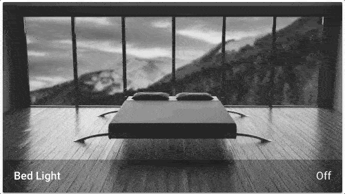

# 图片实体卡片

import { Pencil, EllipsisVertical, House } from 'lucide-react'
import { Separator } from "../../../src/components/ui/separator"

<p className="text-xl font-semibold">
图片实体卡片以图像的形式显示实体。除了来自URL的图像外，它还可以显示摄像头实体的图像。
</p>


<p className='text-center font-extralight'>背景会根据实体状态变化。</p>


## 将图片实体卡片添加到你的仪表板 

1. 要添加卡片，请按照[从视图添加卡片](https://www.home-assistant.io/dashboards/cards/#to-add-a-card-from-a-view)中的步骤1-4操作。
    - 在步骤2中，在**按卡片**选项卡上，选择图片实体卡片。

2. 添加图片：

    - **上传图片**让你从用于显示Home Assistant UI的系统中选择图像。
    - **本地路径**让你选择存储在Home Assistant上的图像。例如：`/homeassistant/images/lights_view_background_image.jpg`。
        - 要在Home Assistant上存储图像，你需要[配置文件访问](https://www.home-assistant.io/common-tasks/os/#configuring-access-to-files)，例如通过[Samba](https://www.home-assistant.io/common-tasks/os/#installing-and-using-the-samba-add-on)或[Studio Code Server](https://www.home-assistant.io/common-tasks/os/#installing-and-using-the-visual-studio-code-vsc-add-on)附加组件。
    - **网络URL**让你使用来自网络的图像。例如`https://www.home-assistant.io/images/frontpage/assist_wake_word.png`。

3. 定义特定于图片实体卡片的参数。

    - 有关特定设置的描述，请参阅YAML配置下的描述。
    - 这些设置也适用于UI。

4. 保存你的更改。

## YAML配置 

当你使用YAML模式或只是更喜欢在UI中的代码编辑器中使用YAML时，以下YAML选项可用。


<div className="bg-white p-6 rounded-2xl border border-[rgba(0,0,0,0.12)] mb-4">
#### 配置变量  
    <div>
        <p className="m-0 pb-2" style={{margin:'0'}}> type <span className="text-xs text-red-400">string 必填</span></p>
        <p className="text-sm text-gray-400 m-0" style={{margin:'0'}}>`picture-entity`</p>
        <Separator className="my-4" />
    </div>

    <div>
        <p className="m-0 pb-2" style={{margin:'0'}}> entity <span className="text-xs text-red-400">string 必填</span></p>
        <p className="text-sm text-gray-400 m-0" style={{margin:'0'}}>用于图片的摄像头、图像或人员`entity_id`。</p>
        <Separator className="my-4" />
    </div>

    <div>
        <p className="m-0 pb-2" style={{margin:'0'}}> camera_image <span className="text-xs text-gray-400">string (可选)</span></p>
        <p className="text-sm text-gray-400 m-0" style={{margin:'0'}}>要使用的摄像头`entity_id`。（如果`entity`已经是摄像头实体，则不需要）。</p>
        <Separator className="my-4" />
    </div>

    <div>
        <p className="m-0 pb-2" style={{margin:'0'}}> camera_view <span className="text-xs text-gray-400">string (可选，默认：auto)</span></p>
        <p className="text-sm text-gray-400 m-0" style={{margin:'0'}}>"live"将在启用`stream`时显示实时视图。</p>
        <Separator className="my-4" />
    </div>

    <div>
        <p className="m-0 pb-2" style={{margin:'0'}}> image <span className="text-xs text-gray-400">string (可选)</span></p>
        <p className="text-sm text-gray-400 m-0" style={{margin:'0'}}>图像的URL。要使用本地托管的图像，请参阅[托管](https://www.home-assistant.io/integrations/http#hosting-files)。</p>
        <Separator className="my-4" />
    </div>

    <div>
        <p className="m-0 pb-2" style={{margin:'0'}}> state_image <span className="text-xs text-gray-400">map (可选)</span></p>
        <p className="text-sm text-gray-400 m-0" style={{margin:'0'}}>将实体状态映射到图像（`state: image URL`，查看下面的示例）。</p>
        <Separator className="my-4" />
    </div>

    <div>
        <p className="m-0 pb-2" style={{margin:'0'}}> state_filter <span className="text-xs text-gray-400">map (可选)</span></p>
        <p className="text-sm text-gray-400 m-0" style={{margin:'0'}}>[基于状态的CSS过滤器](https://www.home-assistant.io/dashboards/picture-elements/#how-to-use-state_filter)</p>
        <Separator className="my-4" />
    </div>

    <div>
        <p className="m-0 pb-2" style={{margin:'0'}}> aspect_ratio <span className="text-xs text-gray-400">string (可选)</span></p>
        <p className="text-sm text-gray-400 m-0" style={{margin:'0'}}>强制图像的高度为宽度的比例。有效格式：高度百分比值（`23%`）或使用冒号或"x"分隔符表示的比例（`16:9`或`16x9`）。对于比例，第二个元素可以省略，将默认为"1"（`1.78`等于`1.78:1`）。</p>
        <Separator className="my-4" />
    </div>

    <div>
        <p className="m-0 pb-2" style={{margin:'0'}}> fit_mode <span className="text-xs text-gray-400">string (可选，默认：cover)</span></p>
        <p className="text-sm text-gray-400 m-0" style={{margin:'0'}}>定义图像拉伸/裁剪以适应卡片区域的方式。`cover:`图像保持其宽高比并填充给定尺寸。图像将被裁剪以适应。`contain:`图像保持其宽高比，但会调整大小以适应给定尺寸内。`fill:`图像会调整大小以填充给定尺寸。如果需要，图像将被拉伸或压缩以适应。</p>
        <Separator className="my-4" />
    </div>

    <div>
        <p className="m-0 pb-2" style={{margin:'0'}}> name <span className="text-xs text-gray-400">string (可选)</span></p>
        <p className="text-sm text-gray-400 m-0" style={{margin:'0'}}>覆盖实体名称。</p>
        <Separator className="my-4" />
    </div>

    <div>
        <p className="m-0 pb-2" style={{margin:'0'}}> show_name <span className="text-xs text-gray-400">boolean (可选，默认：true)</span></p>
        <p className="text-sm text-gray-400 m-0" style={{margin:'0'}}>在页脚显示名称。</p>
        <Separator className="my-4" />
    </div>

    <div>
        <p className="m-0 pb-2" style={{margin:'0'}}> show_state <span className="text-xs text-gray-400">boolean (可选，默认：true)</span></p>
        <p className="text-sm text-gray-400 m-0" style={{margin:'0'}}>在页脚显示状态。</p>
        <Separator className="my-4" />
    </div>

    <div>
        <p className="m-0 pb-2" style={{margin:'0'}}> theme <span className="text-xs text-gray-400">string (可选)</span></p>
        <p className="text-sm text-gray-400 m-0" style={{margin:'0'}}>使用任何已加载的主题覆盖此卡片使用的主题。有关主题的更多信息，请参阅[前端文档](https://www.home-assistant.io/integrations/frontend/)。</p>
        <Separator className="my-4" />
    </div>

    <div>
        <p className="m-0 pb-2" style={{margin:'0'}}>tap_action <span className="text-xs text-gray-400">map (可选)</span></p>
        <p className="text-sm text-gray-400 m-0" style={{margin:'0'}}>卡片点击时执行的操作。请参阅[操作文档](https://www.home-assistant.io/dashboards/actions/#tap-action)。</p>
        <Separator className="my-4" />
    </div>

    <div>
        <p className="m-0 pb-2" style={{margin:'0'}}>hold_action <span className="text-xs text-gray-400">map  (可选)</span></p>
        <p className="text-sm text-gray-400 m-0" style={{margin:'0'}}>点击并按住时执行的操作。请参阅[操作文档](https://www.home-assistant.io/dashboards/actions/#hold-action)。</p>
        <Separator className="my-4" />
    </div>

    <div>
        <p className="m-0 pb-2" style={{margin:'0'}}>double_tap_action <span className="text-xs text-gray-400">map  (可选)</span></p>
        <p className="text-sm text-gray-400 m-0" style={{margin:'0'}}>双击时执行的操作。请参阅[操作文档](https://www.home-assistant.io/dashboards/actions/#hold-action)。</p>
        {/* <Separator className="my-4" /> */}
    </div>
</div>

### 如何使用state_filter 
指定不同的[CSS过滤器](https://developer.mozilla.org/en-US/docs/Web/CSS/filter)

```yaml
state_filter:
  "on": brightness(110%) saturate(1.2)
  "off": brightness(50%) hue-rotate(45deg)
```

### 示例 
基本示例：

```yaml
type: picture-entity
entity: light.bed_light
image: /local/bed_light.png
```

每个状态使用不同的图像：

```yaml
type: picture-entity
entity: light.bed_light
state_image:
  "on": /local/bed_light_on.png
  "off": /local/bed_light_off.png
```

显示来自FFmpeg摄像头的实时视频流：

```yaml
type: picture-entity
entity: camera.backdoor
camera_view: live
tap_action:
  action: perform-action
  perform_action: camera.snapshot
  data:
    entity_id: camera.backdoor
    filename: '/shared/backdoor-{{ now().strftime("%Y-%m-%d-%H%M%S") }}.jpg'
```

文件名需要是Home Assistant在你的系统中可写的路径。你可能需要配置`allowlist_external_dirs`（[文档](https://www.home-assistant.io/integrations/homeassistant/#allowlist_external_dirs)）。

## 相关主题
- [卡片操作](/docs/documentation/dashboards/actions)
- [主题](https://www.home-assistant.io/integrations/frontend/)
- [仪表板卡片](https://www.home-assistant.io/dashboards/cards/)