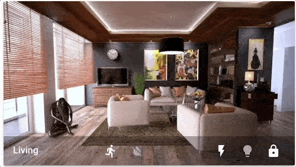
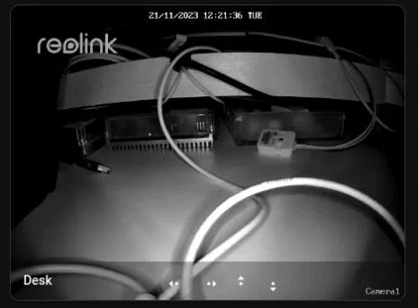
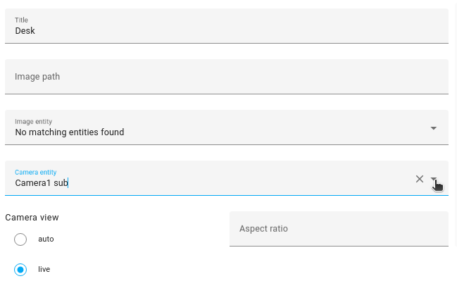
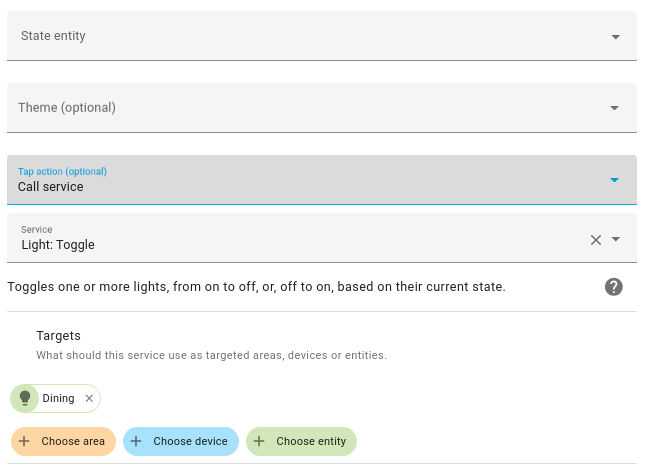
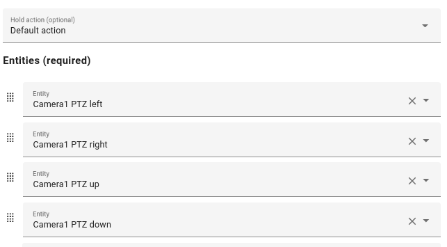

import { Pencil, EllipsisVertical, House } from 'lucide-react'
import { Separator } from "../../../src/components/ui/separator"

# 图片预览卡片

<p className="text-xl font-semibold">
图片预览卡片显示一张图像，并允许你在卡片上放置小图标来显示实体状态，从而可以从那里控制这些实体。在下图中：右侧的实体允许切换操作，其他实体则显示更多信息对话框。
</p>


<p className='text-center font-extralight'>客厅的图片预览卡片。</p>

## 将图片预览卡片添加到你的仪表板 

1. 要添加卡片，请按照[从视图添加卡片](https://www.home-assistant.io/dashboards/cards/#to-add-a-card-from-a-view)中的步骤1-4进行操作。
    - 在步骤2中，在**按卡片**标签上，选择图片实体卡片。

2. 添加图片：

    - **上传图片**让你从显示Home Assistant界面的系统中选择图像。
    - **本地路径**让你选择存储在Home Assistant上的图像。例如：`/homeassistant/images/lights_view_background_image.jpg`。
        - 要在Home Assistant上存储图像，你需要[配置对文件的访问](https://www.home-assistant.io/common-tasks/os/#configuring-access-to-files)，例如通过[Samba](https://www.home-assistant.io/common-tasks/os/#installing-and-using-the-samba-add-on)或[Studio Code Server](https://www.home-assistant.io/common-tasks/os/#installing-and-using-the-visual-studio-code-vsc-add-on)附加组件。
    - **网络URL**让你使用来自网络的图像。例如`https://www.home-assistant.io/images/frontpage/assist_wake_word.png`。

3. 定义特定于图片实体卡片的参数。

    - 有关特定设置的描述，请参阅YAML配置下的描述。
    - 这些设置也适用于UI。

4. 保存你的更改。

## YAML 配置 
当你使用YAML模式或只是更喜欢在UI中的代码编辑器中使用YAML时，以下YAML选项可用。


<div className="bg-white p-6 rounded-2xl border border-[rgba(0,0,0,0.12)] mb-4">
#### 配置变量  
    <div>
        <p className="m-0 pb-2" style={{margin:'0'}}> type <span className="text-xs text-red-400">字符串 必填</span></p>
        <p className="text-sm text-gray-400 m-0" style={{margin:'0'}}>`picture-glance`</p>
        <Separator className="my-4" />
    </div>

    <div>
        <p className="m-0 pb-2" style={{margin:'0'}}> entities <span className="text-xs text-red-400">列表 必填</span></p>
        <p className="text-sm text-gray-400 m-0" style={{margin:'0'}}>实体或实体对象的列表。</p>
        <Separator className="my-4" />
    </div>

    <div>
        <p className="m-0 pb-2" style={{margin:'0'}}> title <span className="text-xs text-gray-400">字符串 (可选)</span></p>
        <p className="text-sm text-gray-400 m-0" style={{margin:'0'}}>卡片标题。</p>
        <Separator className="my-4" />
    </div>

    <div>
        <p className="m-0 pb-2" style={{margin:'0'}}> image <span className="text-xs text-gray-400">字符串 (可选)</span></p>
        <p className="text-sm text-gray-400 m-0" style={{margin:'0'}}>背景图像URL。</p>
        <Separator className="my-4" />
    </div>

    <div>
        <p className="m-0 pb-2" style={{margin:'0'}}> image_entity <span className="text-xs text-gray-400">字符串 (可选)</span></p>
        <p className="text-sm text-gray-400 m-0" style={{margin:'0'}}>要显示的图像或人员实体。</p>
        <Separator className="my-4" />
    </div>

    <div>
        <p className="m-0 pb-2" style={{margin:'0'}}> camera_image <span className="text-xs text-gray-400">字符串 (可选)</span></p>
        <p className="text-sm text-gray-400 m-0" style={{margin:'0'}}>作为背景图像的摄像头实体。</p>
        <Separator className="my-4" />
    </div>

    <div>
        <p className="m-0 pb-2" style={{margin:'0'}}> camera_view <span className="text-xs text-gray-400">字符串 (可选，默认：auto)</span></p>
        <p className="text-sm text-gray-400 m-0" style={{margin:'0'}}>"live"将在启用`stream`时显示实时视图。</p>
        <Separator className="my-4" />
    </div>

    <div>
        <p className="m-0 pb-2" style={{margin:'0'}}> state_image <span className="text-xs text-gray-400">映射 (可选)</span></p>
        <p className="text-sm text-gray-400 m-0" style={{margin:'0'}}>基于实体状态的背景图像。</p>

        <div className='pl-10'>
            <p className="m-0 pb-2" style={{margin:'0'}}> state <span className="text-xs text-gray-400">字符串 (可选)</span></p>
            <p className="text-sm text-gray-400 m-0" style={{margin:'0'}}>`state: image-url`，查看下面的示例。</p>
        </div>
        <Separator className="my-4" />
    </div>

    <div>
        <p className="m-0 pb-2" style={{margin:'0'}}> state_filter <span className="text-xs text-gray-400">映射 (可选)</span></p>
        <p className="text-sm text-gray-400 m-0" style={{margin:'0'}}>[基于状态的CSS过滤器](https://www.home-assistant.io/dashboards/picture-elements/#how-to-use-state_filter)</p>
        <Separator className="my-4" />
    </div>

    <div>
        <p className="m-0 pb-2" style={{margin:'0'}}> aspect_ratio <span className="text-xs text-gray-400">字符串 (可选)</span></p>
        <p className="text-sm text-gray-400 m-0" style={{margin:'0'}}>强制图像的高度为宽度的比例。有效格式：高度百分比值（`23%`）或用冒号或"x"分隔符表示的比例（`16:9`或`16x9`）。对于比例，第二个元素可以省略，默认为"1"（`1.78`等于`1.78:1`）。</p>
        <Separator className="my-4" />
    </div>

    <div>
        <p className="m-0 pb-2" style={{margin:'0'}}> entity <span className="text-xs text-gray-400">字符串 (可选)</span></p>
        <p className="text-sm text-gray-400 m-0" style={{margin:'0'}}>用于`state_image`和`state_filter`的实体。</p>
        <Separator className="my-4" />
    </div>

    <div>
        <p className="m-0 pb-2" style={{margin:'0'}}> show_state <span className="text-xs text-gray-400">布尔值 (可选，默认：false)</span></p>
        <p className="text-sm text-gray-400 m-0" style={{margin:'0'}}>显示实体状态文本。</p>
        <Separator className="my-4" />
    </div>

    <div>
        <p className="m-0 pb-2" style={{margin:'0'}}> theme <span className="text-xs text-gray-400">字符串 (可选)</span></p>
        <p className="text-sm text-gray-400 m-0" style={{margin:'0'}}>使用任何已加载的主题覆盖此卡片的主题。有关主题的更多信息，请参阅[前端文档](https://www.home-assistant.io/integrations/frontend/)。</p>
        <Separator className="my-4" />
    </div>

    <div>
        <p className="m-0 pb-2" style={{margin:'0'}}>tap_action <span className="text-xs text-gray-400">映射 (可选)</span></p>
        <p className="text-sm text-gray-400 m-0" style={{margin:'0'}}>点击卡片时执行的操作。参见[操作文档](https://www.home-assistant.io/dashboards/actions/#tap-action)。</p>
        <Separator className="my-4" />
    </div>

    <div>
        <p className="m-0 pb-2" style={{margin:'0'}}>hold_action <span className="text-xs text-gray-400">映射  (可选)</span></p>
        <p className="text-sm text-gray-400 m-0" style={{margin:'0'}}>点击并按住时执行的操作。参见[操作文档](https://www.home-assistant.io/dashboards/actions/#hold-action)。</p>
        <Separator className="my-4" />
    </div>

    <div>
        <p className="m-0 pb-2" style={{margin:'0'}}>double_tap_action <span className="text-xs text-gray-400">映射  (可选)</span></p>
        <p className="text-sm text-gray-400 m-0" style={{margin:'0'}}>双击时执行的操作。参见[操作文档](https://www.home-assistant.io/dashboards/actions/#hold-action)。</p>
        {/* <Separator className="my-4" /> */}
    </div>
</div>

### 实体的选项 
如果你将实体定义为对象而不是字符串，你可以添加更多自定义和配置：


<div className="bg-white p-6 rounded-2xl border border-[rgba(0,0,0,0.12)] mb-4">
#### 配置变量  
    <div>
        <p className="m-0 pb-2" style={{margin:'0'}}> entity <span className="text-xs text-red-400">字符串 必填</span></p>
        <p className="text-sm text-gray-400 m-0" style={{margin:'0'}}>实体ID。</p>
        <Separator className="my-4" />
    </div>

    <div>
        <p className="m-0 pb-2" style={{margin:'0'}}> attribute <span className="text-xs text-gray-400">字符串 (可选)</span></p>
        <p className="text-sm text-gray-400 m-0" style={{margin:'0'}}>要显示的实体属性，而不是状态。</p>
        <Separator className="my-4" />
    </div>

    <div>
        <p className="m-0 pb-2" style={{margin:'0'}}> prefix <span className="text-xs text-gray-400">字符串 (可选)</span></p>
        <p className="text-sm text-gray-400 m-0" style={{margin:'0'}}>在属性值之前显示的前缀。</p>
        <Separator className="my-4" />
    </div>

    <div>
        <p className="m-0 pb-2" style={{margin:'0'}}> suffix <span className="text-xs text-gray-400">字符串 (可选)</span></p>
        <p className="text-sm text-gray-400 m-0" style={{margin:'0'}}>在属性值之后显示的后缀。</p>
        <Separator className="my-4" />
    </div>

    <div>
        <p className="m-0 pb-2" style={{margin:'0'}}> icon <span className="text-xs text-gray-400">字符串 (可选)</span></p>
        <p className="text-sm text-gray-400 m-0" style={{margin:'0'}}>覆盖默认图标。</p>
        <Separator className="my-4" />
    </div>

    <div>
        <p className="m-0 pb-2" style={{margin:'0'}}> show_state <span className="text-xs text-gray-400">布尔值 (可选，默认：true)</span></p>
        <p className="text-sm text-gray-400 m-0" style={{margin:'0'}}>显示实体状态文本。</p>
        <Separator className="my-4" />
    </div>

    <div>
        <p className="m-0 pb-2" style={{margin:'0'}}>tap_action <span className="text-xs text-gray-400">映射 (可选)</span></p>
        <p className="text-sm text-gray-400 m-0" style={{margin:'0'}}>点击卡片时执行的操作。参见[操作文档](https://www.home-assistant.io/dashboards/actions/#tap-action)。</p>
        <Separator className="my-4" />
    </div>

    <div>
        <p className="m-0 pb-2" style={{margin:'0'}}>hold_action <span className="text-xs text-gray-400">映射  (可选)</span></p>
        <p className="text-sm text-gray-400 m-0" style={{margin:'0'}}>点击并按住时执行的操作。参见[操作文档](https://www.home-assistant.io/dashboards/actions/#hold-action)。</p>
        <Separator className="my-4" />
    </div>

    <div>
        <p className="m-0 pb-2" style={{margin:'0'}}>double_tap_action <span className="text-xs text-gray-400">映射  (可选)</span></p>
        <p className="text-sm text-gray-400 m-0" style={{margin:'0'}}>双击时执行的操作。参见[操作文档](https://www.home-assistant.io/dashboards/actions/#hold-action)。</p>
        {/* <Separator className="my-4" /> */}
    </div>
</div>

### 如何使用state_filter 
指定不同的[CSS过滤器](https://developer.mozilla.org/en-US/docs/Web/CSS/filter)

```yaml
state_filter:
  "on": brightness(110%) saturate(1.2)
  "off": brightness(50%) hue-rotate(45deg)
entity: switch.decorative_lights
```

### 示例 
本节列出了一些关于如何使用图片预览卡片的示例。

### 创建卡片来控制摄像头 

如果你的摄像头支持PTZ（可以向不同方向移动），你可以使用图片预览卡片来控制摄像头。



<p className='text-center font-extralight'>控制摄像头的图片预览卡片。</p>

1. 选择你的摄像头实体。
    - 不需要图像路径和图像实体。 
    

2. 如果你想在点击卡片本身时发生某些事情，定义一个点击操作。
    - 这里，我们切换一个灯。
    

3. 选择用于向左、向右、向上或向下移动摄像头的实体。 
    

4. 选择**显示代码编辑器**。

5. 为每个实体指定一个图标，如YAML示例中所示。

6. 要让按钮在按下时反应（而不是弹出对话框）：
    - 对于每个实体，在`tap_action`下，使用`button.press`操作。
```yaml
camera_view: live
type: picture-glance
title: Desk
entities:
  - entity: button.camera1_ptz_left
    icon: mdi:pan-left
    tap_action:
      action: perform-action
      perform_action: button.press
      data:
        entity_id: button.camera1_ptz_left
  - entity: button.camera1_ptz_right
    icon: mdi:pan-right
    tap_action:
      action: perform-action
      perform_action: button.press
      data:
        entity_id: button.camera1_ptz_right
  - entity: button.camera1_ptz_up
    icon: mdi:pan-up
    tap_action:
      action: perform-action
      perform_action: button.press
      data:
        entity_id: button.camera1_ptz_up
  - entity: button.camera1_ptz_down
    icon: mdi:pan-down
    tap_action:
      action: perform-action
      perform_action: button.press
      data:
        entity_id: button.camera1_ptz_down
camera_image: camera.camera1_sub
tap_action:
  action: perform-action
  perform_action: light.toggle
  target:
    entity_id: light.philips_929003052501_01_huelight
```

7. 就是这样。你现在可以从仪表板上的图片预览卡片控制你的摄像头了。


### 更多示例 

```yaml
type: picture-glance
title: Living room
entities:
  - switch.decorative_lights
  - light.ceiling_lights
  - lock.front_door
  - binary_sensor.movement_backyard
  - binary_sensor.basement_floor_wet
image: /local/living_room.png
```

将摄像头图像显示为背景：

```yaml
type: picture-glance
title: Living room
entities:
  - switch.decorative_lights
  - light.ceiling_lights
camera_image: camera.demo_camera
```

显示摄像头图像而不添加额外实体：

```yaml
type: picture-glance
title: Front garden
entities: []
camera_image: camera.front_garden_camera
```

根据实体状态使用不同的图像：

```yaml
type: picture-glance
title: Living room
entities:
  - switch.decorative_lights
  - light.ceiling_lights
state_image:
  "on": /local/living_room_on.png
  "off": /local/living_room_off.png
entity: group.living.room
```

## 相关主题
- [卡片操作](/docs/documentation/dashboards/actions)
- [主题](https://www.home-assistant.io/integrations/frontend/)
- [仪表板卡片](https://www.home-assistant.io/dashboards/cards/)


