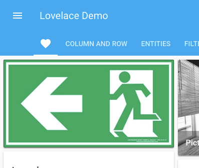

import { Pencil, EllipsisVertical, House } from 'lucide-react'
import { Separator } from "../../../src/components/ui/separator"

# 图片卡片

<p className="text-xl font-semibold">
图片卡片允许你设置一个图像用于导航到界面中的各种路径或执行操作。
</p>


<p className='text-center font-extralight'>图片卡片的截图。</p>

## 将图片卡片添加到你的仪表板 

1. 要添加卡片，请按照[从视图添加卡片](https://www.home-assistant.io/dashboards/cards/#to-add-a-card-from-a-view)中的步骤1-4进行操作。
    - 在步骤2中，在**按卡片**标签上，选择图片卡片。

2. 添加图片：

    - **上传图片**让你从显示Home Assistant界面的系统中选择图像。
    - **本地路径**让你选择存储在Home Assistant上的图像。例如：`/homeassistant/images/lights_view_background_image.jpg`。
        - 要在Home Assistant上存储图像，你需要[配置对文件的访问](https://www.home-assistant.io/common-tasks/os/#configuring-access-to-files)，例如通过[Samba](https://www.home-assistant.io/common-tasks/os/#installing-and-using-the-samba-add-on)或[Studio Code Server](https://www.home-assistant.io/common-tasks/os/#installing-and-using-the-visual-studio-code-vsc-add-on)附加组件。
    - **网络URL**让你使用来自网络的图像。例如`https://www.home-assistant.io/images/frontpage/assist_wake_word.png`。

3. 定义特定于图片卡片的参数。

    - 有关特定设置的描述，请参阅YAML配置下的描述。
    - 这些设置也适用于UI。

4. 保存你的更改。


## YAML 配置 

当你使用YAML模式或只是更喜欢在UI中的代码编辑器中使用YAML时，以下YAML选项可用。

<div className="bg-white p-6 rounded-2xl border border-[rgba(0,0,0,0.12)] mb-4">
#### 配置变量  
    <div>
        <p className="m-0 pb-2" style={{margin:'0'}}> type <span className="text-xs text-red-400">字符串 必填</span></p>
        <p className="text-sm text-gray-400 m-0" style={{margin:'0'}}>`picture`</p>
        <Separator className="my-4" />
    </div>

    <div>
        <p className="m-0 pb-2" style={{margin:'0'}}> image <span className="text-xs text-red-400">字符串 必填</span></p>
        <p className="text-sm text-gray-400 m-0" style={{margin:'0'}}>图像的URL。当你想在Home Assistant安装中存储图像时，使用[托管文件文档](https://www.home-assistant.io/integrations/http/#hosting-files)。存储文件后，使用`/local`路径，例如，`/local/filename.jpg`。</p>
        <Separator className="my-4" />
    </div>

    <div>
        <p className="m-0 pb-2" style={{margin:'0'}}> image_entity <span className="text-xs text-gray-400">字符串 (可选)</span></p>
        <p className="text-sm text-gray-400 m-0" style={{margin:'0'}}>要显示的图像或人员实体。</p>
        <Separator className="my-4" />
    </div>

    <div>
        <p className="m-0 pb-2" style={{margin:'0'}}> alt_text <span className="text-xs text-gray-400">字符串 (可选)</span></p>
        <p className="text-sm text-gray-400 m-0" style={{margin:'0'}}>图像的替代文本。这对于使用辅助技术的用户是必要的。[W3C图像教程](https://www.w3.org/WAI/tutorials/images/)提供了编写替代文本的简单指导。</p>
        <Separator className="my-4" />
    </div>

    <div>
        <p className="m-0 pb-2" style={{margin:'0'}}> theme <span className="text-xs text-gray-400">字符串 (可选)</span></p>
        <p className="text-sm text-gray-400 m-0" style={{margin:'0'}}>使用任何已加载的主题覆盖此卡片的主题。有关主题的更多信息，请参阅[前端文档](https://www.home-assistant.io/integrations/frontend/)。</p>
        <Separator className="my-4" />
    </div>

    <div>
        <p className="m-0 pb-2" style={{margin:'0'}}>tap_action <span className="text-xs text-gray-400">映射 (可选)</span></p>
        <p className="text-sm text-gray-400 m-0" style={{margin:'0'}}>点击卡片时执行的操作。参见[操作文档](https://www.home-assistant.io/dashboards/actions/#tap-action)。</p>
        <Separator className="my-4" />
    </div>

    <div>
        <p className="m-0 pb-2" style={{margin:'0'}}>hold_action <span className="text-xs text-gray-400">映射  (可选)</span></p>
        <p className="text-sm text-gray-400 m-0" style={{margin:'0'}}>点击并按住时执行的操作。参见[操作文档](https://www.home-assistant.io/dashboards/actions/#hold-action)。</p>
        <Separator className="my-4" />
    </div>

    <div>
        <p className="m-0 pb-2" style={{margin:'0'}}>double_tap_action <span className="text-xs text-gray-400">映射  (可选)</span></p>
        <p className="text-sm text-gray-400 m-0" style={{margin:'0'}}>双击时执行的操作。参见[操作文档](https://www.home-assistant.io/dashboards/actions/#hold-action)。</p>
    </div>

</div>

### 示例

导航到另一个视图：

```yaml
type: picture
image: /local/home.jpg
tap_action:
  action: navigate
  navigation_path: /lovelace/home
```

查看[视图](/docs/documentation/dashboards/views)设置，了解如何设置自定义ID。

使用操作切换实体：

```yaml
type: picture
image: /local/light.png
tap_action:
  action: perform-action
  perform_action: light.toggle
  data:
    entity_id: light.ceiling_lights
```

## 相关主题
- [卡片操作](/docs/documentation/dashboards/actions)
- [主题](https://www.home-assistant.io/integrations/frontend/)
- [仪表板卡片](https://www.home-assistant.io/dashboards/cards/)


