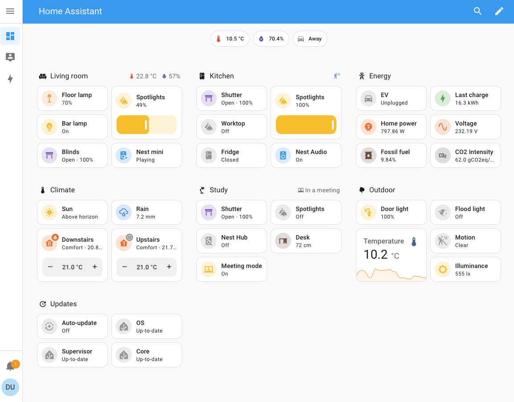
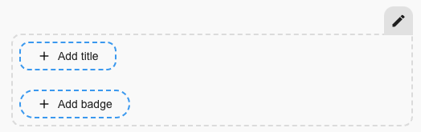
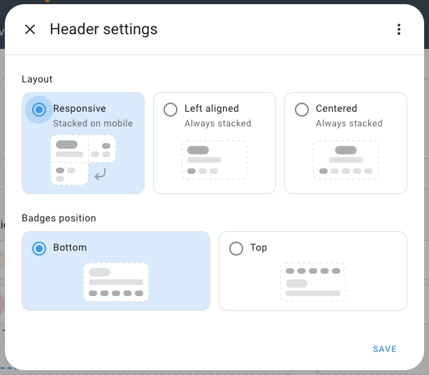
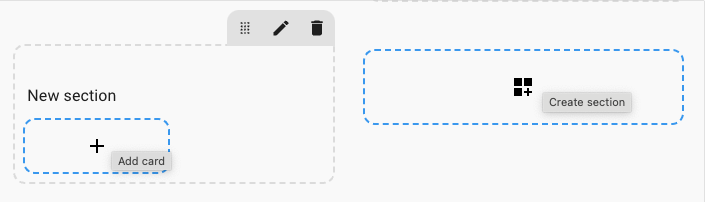
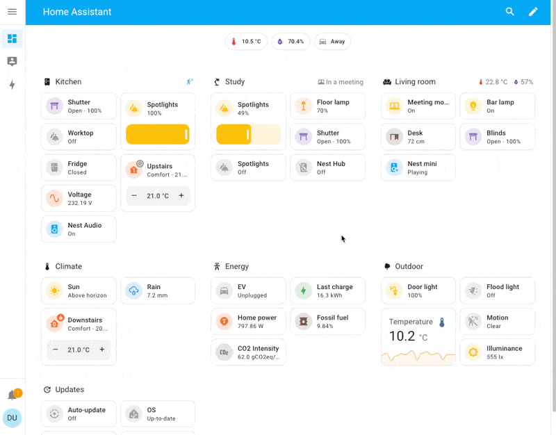
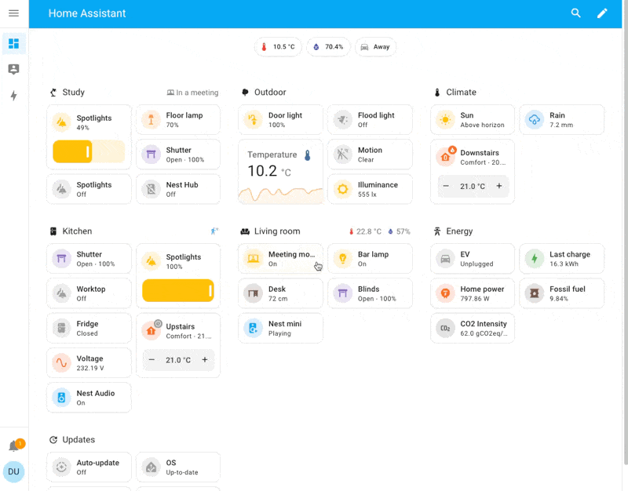

import { Pencil, Trash2, Move } from 'lucide-react'
import { Separator } from "../../../src/components/ui/separator"

# Sections

The sections view lets you organize your cards in sections on a grid. You can group cards without using horizontal or vertical stack cards.

A fully populated dashboard in Sections view layout

## Creating a sections view 

1. If you have multiple dashboards, in the left sidebar, select the dashboard to which you want to add the sections view.
2. Follow the steps on [adding a new view](https://www.home-assistant.io/dashboards/views/#adding-a-view-to-a-dashboard).
    - Under **View type**, select **Sections**.
3. Under **Max number of sections wide**, select the maximum number of columns you want to see in the new sections view.
4. Under **Dense section placement**, select if you want to allow the cards to be arranged automatically in order to fill gaps between cards.
    - This will remove some gaps, but it also means you have less control over the order of the cards.
    - Note that this only applies to horizontal gaps if you used sections more than one column wide.
5. When you are done, select **Save**.
    - You are now presented with a new, empty view.
    - If you chose a background image, the page is filled with that image.
6. Once you have created a sections view, you can start curating it:

    - [Add sections and cards](https://www.home-assistant.io/dashboards/sections/#adding-sections-and-cards-to-a-sections-view).
    - [Rearrange](https://www.home-assistant.io/dashboards/sections/#rearranging-sections-and-cards) and [show or hide sections conditionally](https://www.home-assistant.io/dashboards/sections/#show-or-hide-section-conditionally).
    - [Add a dashboard header with a title and badges](https://www.home-assistant.io/dashboards/sections/#editing-the-header).

## Editing the header 

1. To add a title, select the **Add title** button. The title supports [Markdown](https://commonmark.org/help/) and [templating](https://www.home-assistant.io/docs/configuration/templating/).
2. To add badges, elect the **Add badge** button. Follow [steps on adding badges](https://www.home-assistant.io/dashboards/badges) to see the different possible options.
3. To change the title and badges disposition, select the edit <Pencil className='align-middle inline ' size={18}  />  button to access header settings.

## Adding sections and cards to a sections view 

The view comes with one section to which you can directly add a card.

1. To add a card, select the **Add card** button.
    - Follow the [steps on adding cards](https://www.home-assistant.io/dashboards/cards/#adding-cards-to-your-dashboard).
        

2. To add a new section, select the **Create section** button.

3. A [heading card](https://www.home-assistant.io/dashboards/heading) will be automatically added to the top of the section.

    - To edit it, select the card.
    - If you don’t want a heading title at the top of the section, delete this card.
    - The title can be added again later, like any other card.

4. If you want this section to be visible only to specific users or under a certain condition, you can define those conditions:

    - On the **Visibility** tab, select **Add condition**.
    - Select the type of condition, and enter the parameters.
    - If you define multiple conditions, the section is only shown when all conditions are met.
    - If you did not define any conditions, the section is always shown, to all users.

## Deleting a section 

1. To delete a section, go to the dashboard and in the top right corner, select the edit <Pencil className='align-middle inline ' size={18}  />  button.
2. Open the view with the section you want to delete.
3. Select the delete <Trash2 className='align-middle inline ' size={18} />  button.

## Rearranging sections and cards 

In the sections view, you can rearrange sections and cards by dragging them to a new location. This is not yet possible in other views.

1. To edit your dashboard, in the top right corner, select the edit <Pencil className='align-middle inline ' size={18}  />  button.

2. To rearrange sections, hold the move <Move className='align-middle inline ' size={18}  />  button and move the card.

Rearranging sections by dragging

3. To rearrange cards, tap and hold the card and move it to your desired location.

Rearranging cards by dragging

## Show or hide section conditionally 

ou can choose to show or hide certain sections based on different conditions. The [available conditions](https://www.home-assistant.io/dashboards/conditional/#card-conditions) are the same as that for the conditional card.

To edit the section visibility conditions, select the edit <Pencil className='align-middle inline ' size={18}  />  button and then click on the visibility tab.

## Check out the demo 

Check out the demo from the March live stream on dashboards.

// 视频

## About the sections view layout 

To learn all about the design decisions and the grid layout used for the sections view, refer to the [Dashboard chapter 1 blog post](https://www.home-assistant.io/blog/2024/03/04/dashboard-chapter-1/).

## YAML configuration 

#### Configuration Variables  
    

        
type string (Optional)

        
`sections`

        {/* <Separator className="my-4" /> */}
    

## Header YAML configuration 

#### Configuration Variables  
    

        
layout string (Optional, default: center)

        
Layout of the different elements. Can be `start`, `center`, or `responsive`. `responsive` is the same as `start` on mobile devices. It places badges and title side by side on desktop.

        <Separator className="my-4" />
    

    

        
badges_position string (Optional, default: bottom)

        
Badges position. Can be `bottom` or `top`.

        <Separator className="my-4" />
    

    

        
card map Required

        
Card to be used as title. If you are configuring the view using the visual editor, the configuration of the [Markdown card](https://www.home-assistant.io/dashboards/markdown) is used.

        {/* <Separator className="my-4" /> */}
    

## Related topics
- [Masonry view](https://www.home-assistant.io/dashboards/masonry/)
- [Sidebar view](https://www.home-assistant.io/dashboards/sidebar/)
- [Panel view](https://www.home-assistant.io/dashboards/panel/)
- [Dashboard chapter 1 blog post](https://www.home-assistant.io/blog/2024/03/04/dashboard-chapter-1/)
- [Adding cards to a view](https://www.home-assistant.io/dashboards/cards/#adding-cards-to-your-dashboard)
- [Adding a new view](https://www.home-assistant.io/dashboards/views/#adding-a-view-to-a-dashboard)