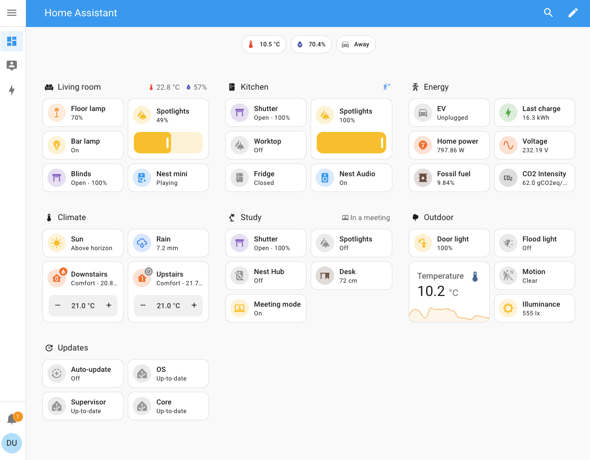
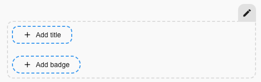
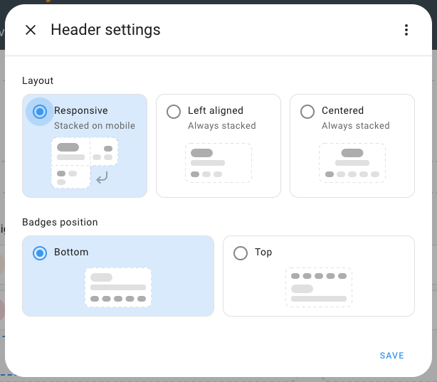
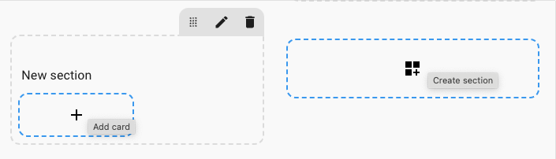
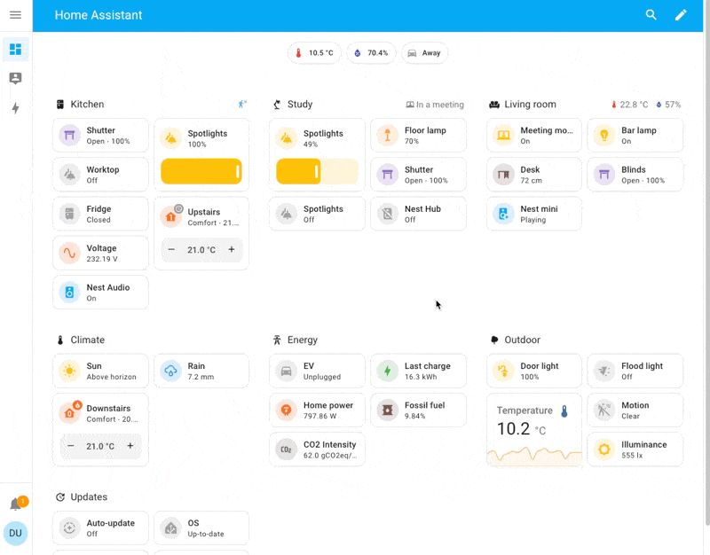

import { Pencil, Trash2, Move } from 'lucide-react'
import { Separator } from "../../../src/components/ui/separator"

# 分区视图

分区视图让你可以在网格上将卡片组织成不同的部分。你可以对卡片进行分组，而无需使用水平或垂直堆叠卡片。

分区视图布局中的完整仪表板

## 创建分区视图

1. 如果你有多个仪表板，在左侧边栏中，选择你想要添加分区视图的仪表板。
2. 按照[添加新视图](https://www.home-assistant.io/dashboards/views/#adding-a-view-to-a-dashboard)的步骤操作。
    - 在**视图类型**下，选择**部分**。
3. 在**最大部分宽度**下，选择你想在新分区视图中看到的最大列数。
4. 在**密集部分布局**下，选择是否允许卡片自动排列以填充卡片之间的空隙。
    - 这将减少一些空隙，但也意味着你对卡片的顺序控制较少。
    - 请注意，如果你使用了宽度超过一列的部分，这只适用于水平空隙。
5. 完成后，选择**保存**。
    - 现在你会看到一个新的、空白的视图。
    - 如果你选择了背景图像，页面将填充该图像。
6. 创建分区视图后，你可以开始对其进行整理：

    - [添加部分和卡片](https://www.home-assistant.io/dashboards/sections/#adding-sections-and-cards-to-a-sections-view)。
    - [重新排列](https://www.home-assistant.io/dashboards/sections/#rearranging-sections-and-cards)和[有条件地显示或隐藏部分](https://www.home-assistant.io/dashboards/sections/#show-or-hide-section-conditionally)。
    - [添加带有标题和徽章的仪表板头部](https://www.home-assistant.io/dashboards/sections/#editing-the-header)。

## 编辑头部

1. 要添加标题，选择**添加标题**按钮。标题支持[Markdown](https://commonmark.org/help/)和[模板](https://www.home-assistant.io/docs/configuration/templating/)。
2. 要添加徽章，选择**添加徽章**按钮。按照[添加徽章的步骤](https://www.home-assistant.io/dashboards/badges)查看不同的可能选项。
3. 要更改标题和徽章的布局，选择编辑<Pencil className='align-middle inline ' size={18}  />按钮访问头部设置。

## 向分区视图添加部分和卡片

视图自带一个部分，你可以直接向其添加卡片。

1. 要添加卡片，选择**添加卡片**按钮。
    - 按照[添加卡片的步骤](https://www.home-assistant.io/dashboards/cards/#adding-cards-to-your-dashboard)操作。
        

2. 要添加新部分，选择**创建部分**按钮。

3. [标题卡片](https://www.home-assistant.io/dashboards/heading)将自动添加到部分顶部。

    - 要编辑它，选择该卡片。
    - 如果你不想在部分顶部显示标题，删除这个卡片。
    - 标题可以稍后像任何其他卡片一样再次添加。

4. 如果你希望此部分仅对特定用户可见或在特定条件下可见，你可以定义这些条件：

    - 在**可见性**选项卡上，选择**添加条件**。
    - 选择条件类型，并输入参数。
    - 如果你定义了多个条件，只有当所有条件都满足时，该部分才会显示。
    - 如果你没有定义任何条件，该部分将始终显示给所有用户。

## 删除部分

1. 要删除部分，转到仪表板，在右上角，选择编辑<Pencil className='align-middle inline ' size={18}  />按钮。
2. 打开包含你想要删除的部分的视图。
3. 选择删除<Trash2 className='align-middle inline ' size={18} />按钮。

## 重新排列部分和卡片

在分区视图中，你可以通过拖动将部分和卡片重新排列到新位置。这在其他视图中尚不可行。

1. 要编辑你的仪表板，在右上角，选择编辑<Pencil className='align-middle inline ' size={18}  />按钮。

2. 要重新排列部分，按住移动<Move className='align-middle inline ' size={18}  />按钮并移动卡片。

通过拖动重新排列部分

3. 要重新排列卡片，点击并按住卡片，将其移动到你想要的位置。

通过拖动重新排列卡片

## 有条件地显示或隐藏部分

你可以选择基于不同条件显示或隐藏特定部分。[可用条件](https://www.home-assistant.io/dashboards/conditional/#card-conditions)与条件卡片的条件相同。

要编辑部分可见性条件，选择编辑<Pencil className='align-middle inline ' size={18}  />按钮，然后点击可见性选项卡。

## 查看演示

查看3月关于仪表板的直播演示。

// 视频

## 关于分区视图布局

要了解有关分区视图所使用的设计决策和网格布局的所有信息，请参阅[仪表板第1章博客文章](https://www.home-assistant.io/blog/2024/03/04/dashboard-chapter-1/)。

## YAML 配置

#### 配置变量  
    

        
type 字符串 (可选)

        
`sections`

        {/* <Separator className="my-4" /> */}
    

## 头部 YAML 配置

#### 配置变量  
    

        
layout 字符串 (可选，默认：center)

        
不同元素的布局。可以是`start`、`center`或`responsive`。`responsive`在移动设备上与`start`相同。在桌面上，它将徽章和标题并排放置。

        <Separator className="my-4" />
    

    

        
badges_position 字符串 (可选，默认：bottom)

        
徽章位置。可以是`bottom`或`top`。

        <Separator className="my-4" />
    

    

        
card 映射 必填

        
用作标题的卡片。如果你使用可视化编辑器配置视图，则使用[Markdown卡片](https://www.home-assistant.io/dashboards/markdown)的配置。

        {/* <Separator className="my-4" /> */}
    

## 相关主题
- [瀑布流视图](https://www.home-assistant.io/dashboards/masonry/)
- [侧边栏视图](https://www.home-assistant.io/dashboards/sidebar/)
- [面板视图](https://www.home-assistant.io/dashboards/panel/)
- [仪表板第1章博客文章](https://www.home-assistant.io/blog/2024/03/04/dashboard-chapter-1/)
- [向视图添加卡片](https://www.home-assistant.io/dashboards/cards/#adding-cards-to-your-dashboard)
- [添加新视图](https://www.home-assistant.io/dashboards/views/#adding-a-view-to-a-dashboard)