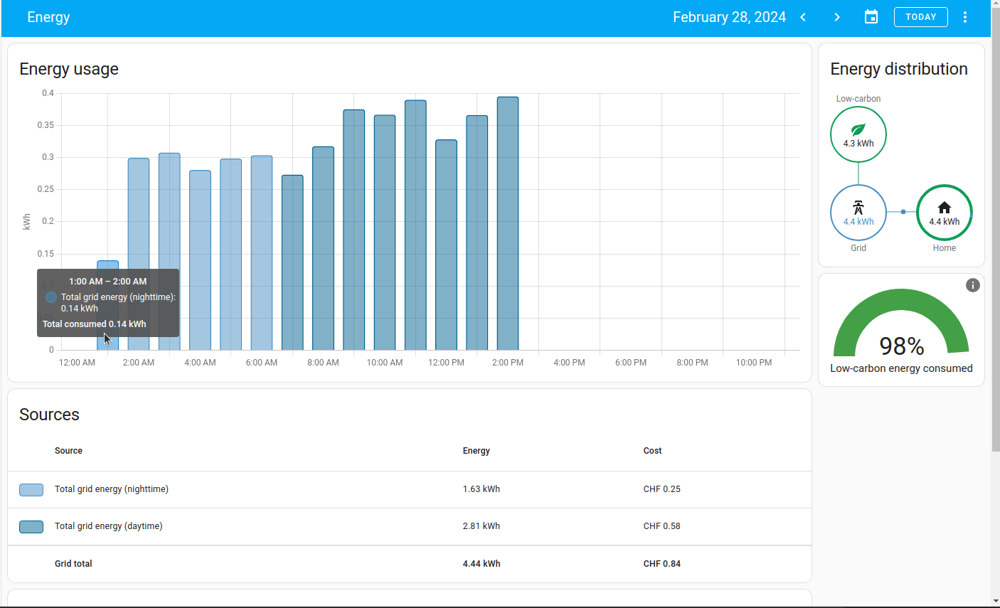
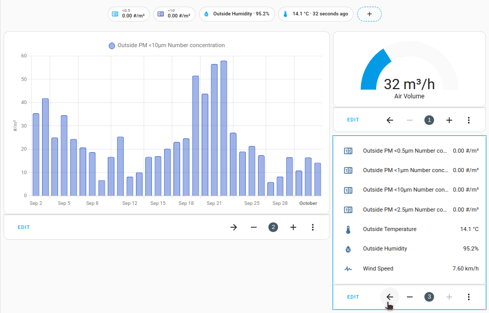
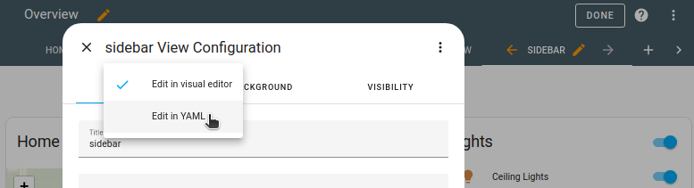

import { ArrowBigLeft, ArrowBigRight, Pencil } from 'lucide-react'
import { Separator } from "../../../src/components/ui/separator"

# Sidebar view

<p className="text-xl font-semibold">
The sidebar view has 2 columns, a wide one and a smaller one on the right.
</p>

<p className="text-center font-extralight">Screenshot of the sidebar view used for the energy dashboard.</p>

To move the card from the main column into the sidebar (right) (and vice versa), select the arrow <ArrowBigLeft className='align-middle inline ' size={18}  /> <ArrowBigRight className='align-middle inline ' size={18}  />   button on the card.



On mobile, all cards are rendered in 1 column and kept in the order indicated in the YAML configuration.

1. To view the YAML configuration, on the view tab, select the <Pencil className='align-middle inline ' size={18}  />  icon to open the edit view.
In the configuration dialog, select the three dots  menu, and **Edit in YAML**.



## View configuration 

<div className="bg-white p-6 rounded-2xl border border-[rgba(0,0,0,0.12)] mb-4">
#### Configuration Variables  
    <div>
        <p className="m-0 pb-2" style={{margin:'0'}}>type <span className="text-xs text-red-400">string Required</span></p>
        <p className="text-sm text-gray-400 m-0" style={{margin:'0'}}>`sidebar`</p>
        {/* <Separator className="my-4" /> */}
    </div>
</div>

## Cards configuration 

<div className="bg-white p-6 rounded-2xl border border-[rgba(0,0,0,0.12)] mb-4">
#### Configuration Variables  
    <div>
        <p className="m-0 pb-2" style={{margin:'0'}}>view_layout.position <span className="text-xs text-gray-400">string (Optional) </span></p>
        <p className="text-sm text-gray-400 m-0" style={{margin:'0'}}>The position of the card, `main` or `sidebar` </p>
        {/* <Separator className="my-4" /> */}
    </div>
</div>

### Example

The position of the card is configured using YAML with the `view_layout` option:

```yaml
type: sidebar
cards:
  - type: entities
    entities:
      - media_player.lounge_room
    view_layout:
      position: sidebar
```

## Related topics
- [Masonry view](https://www.home-assistant.io/dashboards/masonry/)
- [Panel view](https://www.home-assistant.io/dashboards/panel/)
- [Sections view (default)](https://www.home-assistant.io/dashboards/sections/)
- [About views](https://www.home-assistant.io/dashboards/views/)


