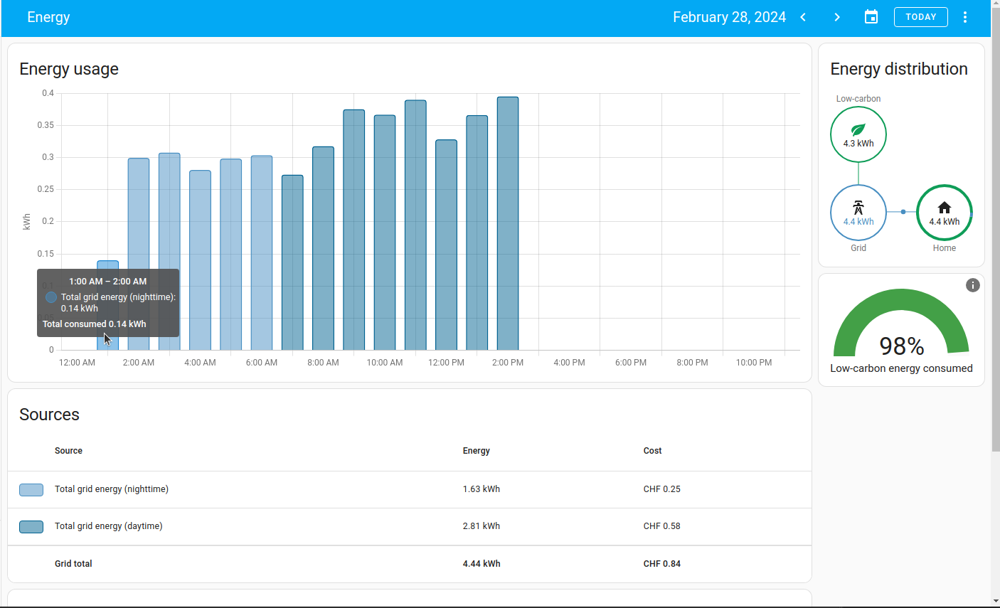
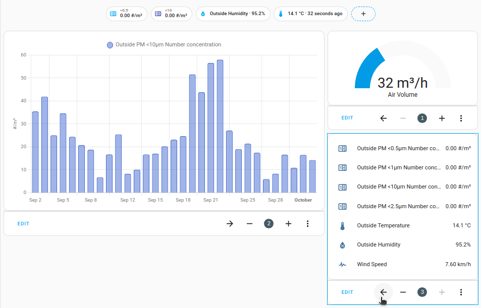
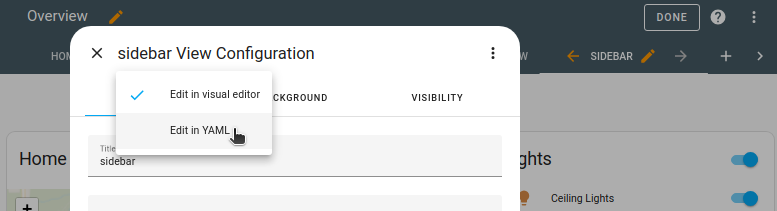

import { ArrowBigLeft, ArrowBigRight, Pencil } from 'lucide-react'
import { Separator } from "../../../src/components/ui/separator"

# 侧边栏视图

<p className="text-xl font-semibold">
侧边栏视图有2列，一个宽列和右侧的一个较小列。
</p>

<p className="text-center font-extralight">能源仪表板使用的侧边栏视图截图。</p>

要将卡片从主列移动到侧边栏（右侧）（反之亦然），选择卡片上的箭头 <ArrowBigLeft className='align-middle inline ' size={18}  /> <ArrowBigRight className='align-middle inline ' size={18}  /> 按钮。



在移动设备上，所有卡片都以1列渲染，并按照YAML配置中指示的顺序保持。

1. 要查看YAML配置，在视图选项卡上，选择 <Pencil className='align-middle inline ' size={18}  /> 图标打开编辑视图。
在配置对话框中，选择三点菜单，然后选择**在YAML中编辑**。



## 视图配置 

<div className="bg-white p-6 rounded-2xl border border-[rgba(0,0,0,0.12)] mb-4">
#### 配置变量  
    <div>
        <p className="m-0 pb-2" style={{margin:'0'}}>type <span className="text-xs text-red-400">string 必填</span></p>
        <p className="text-sm text-gray-400 m-0" style={{margin:'0'}}>`sidebar`</p>
        {/* <Separator className="my-4" /> */}
    </div>
</div>

## 卡片配置 

<div className="bg-white p-6 rounded-2xl border border-[rgba(0,0,0,0.12)] mb-4">
#### 配置变量  
    <div>
        <p className="m-0 pb-2" style={{margin:'0'}}>view_layout.position <span className="text-xs text-gray-400">string (可选) </span></p>
        <p className="text-sm text-gray-400 m-0" style={{margin:'0'}}>卡片的位置，`main`或`sidebar` </p>
        {/* <Separator className="my-4" /> */}
    </div>
</div>

### 示例

卡片的位置使用YAML中的`view_layout`选项进行配置：

```yaml
type: sidebar
cards:
  - type: entities
    entities:
      - media_player.lounge_room
    view_layout:
      position: sidebar
```

## 相关主题
- [瀑布流视图](https://www.home-assistant.io/dashboards/masonry/)
- [面板视图](https://www.home-assistant.io/dashboards/panel/)
- [分区视图（默认）](/docs/documentation/dashboards/sections)
- [关于视图](/docs/documentation/dashboards/views)


